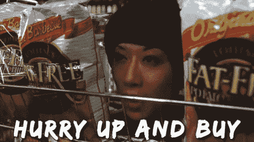
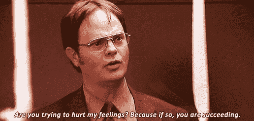
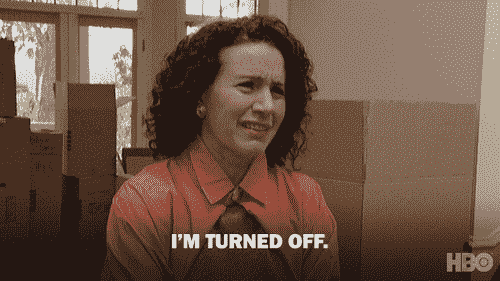
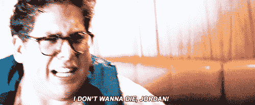

# 本周关闭技巧:硬关闭

> 原文：<https://medium.com/swlh/closing-technique-of-the-week-the-hard-close-28d0101b7465>

如果使用得当，硬成交将如何揭露你的销售。

硬成交是一种成交技巧，一些销售人员不喜欢把它放在自己的武器库中。发生这种情况是因为这更像是一种非黑即白的交易，如果没有经过适当的训练，可能会显得咄咄逼人。这并不适合所有人，但有时客户永远不会购买，除非他们很难成交。难成交是针对那些似乎无法下定决心，但希望“考虑一下”的客户

从本质上说，困难的结束是当你直截了当地提出黄铜税，并直接要求客户购买或试图找出真正的异议。我说真正的异议是因为“考虑一下”更多的时候是一种拖延或虚假的异议。你为什么要考虑一个确定的交易呢？所以基本上是客户很容易让你失望。

请记住，有多种方法可以使用硬关闭。当你以尽可能专业的方式直截了当地询问销售或反对理由时。我倾向于问的是“你想今天就去买吗？”或者“我们能做些什么让你今天就签下这笔交易？”现在，对于异议拉动，我说“是什么让你今天不买这个？”布朗特。切中要害。有效。就这么简单。

# 何时使用硬关闭

大多数销售人员不喜欢强行结束的原因是他们不知道什么时候使用它，或者在过去使用它时被烧伤了。重要的是要记住，不要因为某个特定客户对此反应不佳，就放弃这种结束技巧。我告诉你这一点是因为最常见的罪过是对需要软关闭或更多 [***假定关闭***](https://codycameron.com/closing-technique-of-the-week-the-assumptive-close/) 的客户使用这一方法。

这次交易是最后的努力。最好在互动接近尾声时使用。主要是你会想在用各种软关闭技术试水后使用它。这是了解你的客户是否需要努力达成交易的最好方法。

过早使用硬成交要么会彻底扼杀交易(即使是需要硬成交的人)，要么你会给自己挖一个很大的坑。两种结果都不理想。客户的反应会是完全被你拒之门外，或者建立障碍，自我封闭。

我建议在诉诸硬成交之前，在你的销售过程中使用 2 或 3 次软成交、*。当在正确的时间用在正确的人身上时，艰难的成交一定会达成交易。随着成交率的提高，你会变得更有效率，并且随着时间的推移，你越来越多地使用它。*

# *需要注意什么*

*请记住，硬关闭是最后的努力，因为它被认为是一个桥梁燃烧器。我认为，在艰难成交后，有 1-2%的客户会回来购买。通常情况下，如果你的客户不买，他们不会回来后，硬关闭。但事实是，那个客户从一开始就不会买。*

*某些*咳*表现不佳*咳*的销售人员会不同意，说硬成交从来没有效果，要完全避免。我有无数的数据证明那些使用硬成交的销售人员比那些不使用硬成交的销售人员表现得更好。对于那些犹豫不决的销售人员，我敦促你掌握这种结束技巧，因为它是一个杀手。另外，如果你不喜欢艰难地达成交易，销售可能不是最适合你的职业。*

*记住，这完全取决于你在最后关头的训练水平。我喜欢火器的例子。如果一个人是 25 岁的海豹突击队员或 25 岁以前从未使用过火器，他使用火器受伤的可能性会更小吗？你会选择海豹突击队，因为他们有广泛的枪械训练，知道如何使用它们。你对这种结束技巧的训练和练习越多，你被它扼杀的可能性就越小…或者说交易被它扼杀的可能性就越小…你明白了。*

**

*别担心有人会死。或者我想你可以在我们都快死的时候看待生活…*

# *最后的想法*

*说真的，销售大师们广泛使用硬成交。这种接近有能力把你从一般的制作人提升到顶级制作人。这完全取决于你的开放程度，你的时机，以及你在这方面的训练程度。*

*无论如何，你不能关闭你所有的客户，尽管我很乐意。这是不可能的。所以，如果这种结束对你来说并不奏效，不要气馁。重复使用会让你更好地使用它。让这些建议成为你开始在行业中占据主导地位的一种方式，并让你的表现达到顶级制作人的水平。*

*如果你喜欢这篇文章，击碎那个按钮，看看我的一些最好的作品，我从商业中得到的改变人生的 5 个教训*或者我最近的一篇文章 [***损失厌恶如何主宰你的生活***](https://codycameron.com/how-loss-aversion-dominates-your-life/) 或者 [***本富兰克林关门***](https://codycameron.com/closing-technique-of-the-week-the-ben-franklin-close/) ***。*****

**订阅我的博客，这样你就可以得到我所有的独家内容！你不会想错过任何东西的！:)**

**很棒，**

**[科迪·卡梅伦](https://twitter.com/realcodycameron)**

****

## **这篇文章发表在[《创业](https://medium.com/swlh)》上，这是 Medium 最大的创业刊物，有+ 373，446 人关注。**

## **订阅接收[我们的头条新闻](http://growthsupply.com/the-startup-newsletter/)。**

****