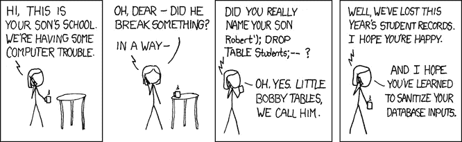

# 代码评审可以成就或者毁灭你的团队

> 原文：<https://medium.com/swlh/code-reviews-can-make-or-break-your-team-a3cfdcc15de1>

*本文是科技招聘&团队建设系列的第二篇。你可以在这里找到* [*第三期*](/@ayasin/writing-software-is-an-art-f3ab53853344) *。*

Alice 刚刚完成了一些代码，需要对其进行审查，以便提交。

> “啊，又一次代码审查”~爱丽丝

首先，她必须安排一次会面。在会议上，每个人都围坐在一张桌子旁。Bob 指出 Alice 的变量名对于命名约定来说太长了。杰克说爱丽丝需要使用两个空格而不是三个空格的制表位。Heather 指出代码注释中有 3 个拼写错误，她不应该用介词结束句子。没有人注意到 Alice 将未初始化的 SQL 直接传递给数据库。

## 许多人因此害怕评论

我最近写了一篇非常受欢迎的[文章，介绍了我用来淘汰糟糕的技术人员的方法](/swlh/the-one-method-to-eliminate-bad-tech-hires-630d539b2e1d)。【TL；博士付钱给候选人，让他们做一个简单的、独立的项目，然后像团队成员一样对项目进行审查]。关于它的大多数问题都围绕着两个中心主题:审查过程应该是什么，以及管理问题的机制。

在这篇文章中，我将通过讨论一个好的代码评审应该是什么样子来处理评审过程。我将主要讨论内部审核流程。因为您应该对编码挑战评审使用相同的过程，所以这些规则对两者都适用。

> 我在业余时间淹死小猫

让我们从一个有点明显的观察开始:100%的候选人会告诉你他们支持代码评审。说不喜欢评论，等于说“我业余时间淹死小猫”。他们中的许多人在对你撒谎。为什么？因为他们有过可怕的代码评审经历，并且因为那些经历发生在他们很小的时候，他们认为那就是代码评审。希望这篇文章能帮助解决这个问题。

## 回到爱丽丝身边

那么 Alice 在代码评审中的经历的最终结果是什么呢？

*   Alice 更关心变量名的长度，而不是它们在上下文中是否有意义。
*   Alice 停止在她的代码中添加注释，这样她就不必处理 Heather“拼写和语法纳粹”的态度。
*   比起可读性，Alice 更关心空格。

当然还有这个:

Image Credit: XKCD 327

## 好吧，但是代码审查有什么意义呢？

代码评审有 4 个目的:

1.  让团队中的每个人都变得更好
2.  让团队中的每个人都变得更好
3.  让团队中的每个人都变得更好
4.  在错误或代码气味变成 bug 或技术债务之前捕捉它们

这不是我忘记改变第二和第三个原因。前三个原因是一样的，因为它比你在代码评审中做的任何事情都重要。

> 让知识共享让每个人都变得更好

让团队中的每个人变得更好意味着每个人都理解代码库。每个人都理解数据流。每个人都理解背后的*推理，而不仅仅是*为什么事情是这样的*机制。至少有人在评论中学到了一些东西。这不一定是代码被评审的人。*

这可能不会总是发生，但它应该永远是目标。

## 我们应该复习什么？

一切。回顾不需要成为一个大的正式过程。找另外一两个人，检查一下你将要提交的内容，或者如果你遵循团队合并流程，检查一下你将要合并的内容。这可能发生在办公室、办公桌或视频通话中。

> 越小越好

小代码块比大代码块更容易审查。大量的代码吓跑了评审人员，原因有很多。除了更小的代码块更容易快速理解这一事实之外，你请来审查你的代码的人也需要完成他们自己的工作。小型代码评审尊重他们的时间。

## 好的评论是什么样的？

正确的代码审查应该遵循以下规则:

**1 -不要讨论任何可以通过自动化过程(如代码格式化程序)解决的问题**

只需运行格式化程序。不要浪费一口气谈论制表符间距或行长度。这种类型的讨论是没有成效的，会让人们对代码评审失去兴趣。

**2 -不要讨论那些仅仅是“奴役一个过程”的事情**

这些可以是“变量必须少于 8 个字符”之类的东西。真的吗？这比一个明确的变量名更重要？由此推论，不要把每一个名字都说死。如果有道理，继续前进。如果一个 4 深度嵌套循环中的循环变量是 counter_a、counter_b、counter_c 和 counter_d，那么这可能适合讨论。

**3 -尽量保持简短**

简短的评论，无论是行数(如果可能的话，最多 200-300 行)还是分钟数，都能让你充分利用时间。其代码被评审的人应该说得最多(带你浏览代码，以及他们做出的任何设计决策)。如果你发现一个严重的问题，停止审查。让此人解决问题，然后继续。这样做的原因是，一个严重的问题可能会导致代码发生足够多的变化，无论如何都需要重新审查。

**4 -讨论代码气味**

代码味道是类似于 JS 文件中的“你为什么把一个函数附加到窗口”或者一些 C++代码中的“你为什么使用 malloc 而不是 new”。有正确的方式和错误的方式来挑战别人解释这样的决定。

*错误方式*

叹气。你在这里想什么？这太可怕了。去解决这件事。

*正确的方式*

你在这里使用的是 malloc，通常我会使用 new，因为我们对所有其他动态内存分配都使用 new。如果有人稍后删除它而不是释放它，这将导致问题。你选择 malloc 而不是 new 有什么原因吗？

可能有一个完全有效的原因，通过将其作为一个讨论来对待，您可能会学到一些东西(即使是您需要解释 new 和 malloc 之间的区别)。

**5 -讨论架构**

确保以一致和正确的方式构建东西是非常重要的。这不仅有利于正在添加的代码，也有利于未来的雇佣。如果事情在架构方面是一致的，那么新人就更容易理解事情是如何组合在一起的。同样，以正确的方式做这件事也很重要(见上文)。

**6 -寻找测试中不容易发现的错误**

寻找错误，错误数据不仅会导致崩溃，还会导致存储损坏等。像传递给数据库的未初始化的 SQL 就是一个很好的例子。

## 摘要

代码评审应该像版本控制一样成为你的过程中不可或缺的一部分，但是你如何去做可以成就或者毁灭你的团队。它可以是分享和增加公共知识、创造坚实的产品并使彼此变得更好的奇妙手段，也可以是同行羞辱、殴打和欺凌的反乌托邦噩梦。上述规则有望让你更接近前者，而不是后者。

## 关于我

我是 Amir Yasin，是一名通晓多种语言的开发人员，对高性能、可伸缩性、软件架构和解决难题非常感兴趣。你可以[在 Medium](/@ayasin) 上关注我，在那里我写了关于软件工程的博客，[在 Twitter](https://twitter.com/ayasin) 上关注我，在那里我偶尔会说一些有趣的事情，或者在 GitHub 上查看[我对自由/开源软件社区的贡献。](https://github.com/ayasin)

**如果你喜欢这篇文章，我会非常感谢你的推荐(点击下面的心脏)**。

*发表于*[**# SWLH**](https://medium.com/swlh)**(**创业、流浪、生活黑客 **)**

-