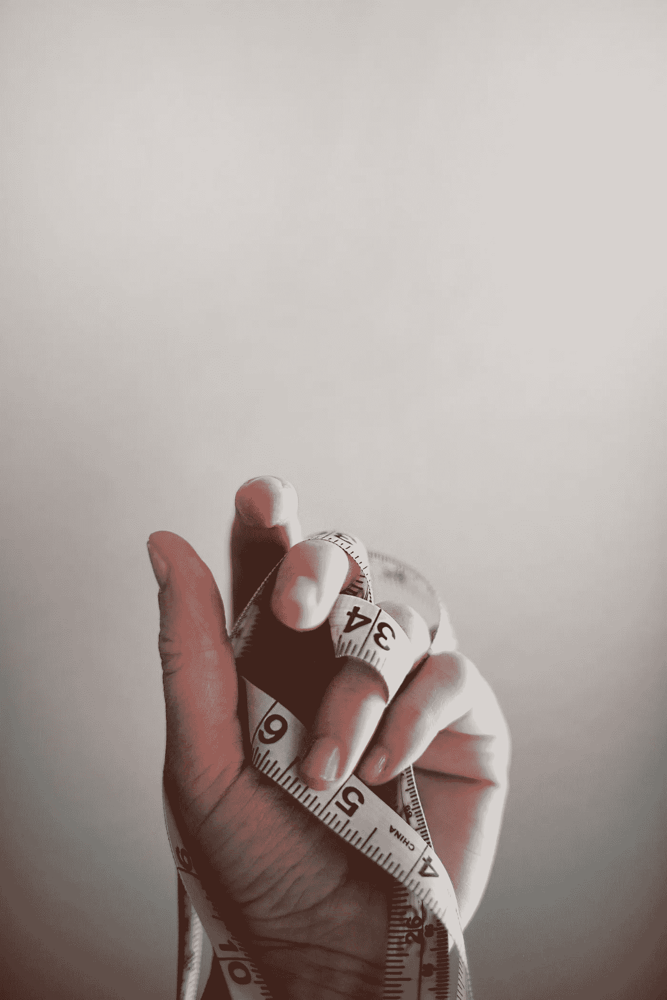

# 咖啡、哑铃和自拍。

> 原文：<https://medium.com/swlh/coffee-dumbbells-selfies-4e7614be9250>

关于文化、身份和我们如何衡量的观察。

The metrics by which we measure ourselves. Work, Hustle, Appearances.

詹妮弗·伯克在 [Unsplash](https://unsplash.com/search/photos/health?utm_source=unsplash&utm_medium=referral&utm_content=creditCopyText) 上的照片

今天，我们生活在一个快节奏的文化中，生产力被吹捧为成功的衡量标准。如果你不成长，不繁荣，不进步，你就是在衰退。进步或死亡似乎是这种文化认为的幸福标准。

工作，工作，工作，工作。磨磨磨，挤，挤，挤。

这三个词都是工作、进步和在生活中取得进展的同义词。

不是你想要的生活？

工作多了，生活中抑郁？工作。感情问题，工作。焦虑？工作。累了，喝点咖啡，红牛，吃点安眠药。

这就是我过去一年所面临的现实。作为埋葬我的焦虑、恐惧和不想处理问题的一种方式，我有两种方法来解决我的问题。

通过去健身房锻炼，或者通过写作和阅读来锻炼。这两种活动对平衡的生活都是有益和健康的，但如果过度，这些习惯会导致滑坡。

太多的时间在健身房已经导致我失去了友谊，关系，浪漫的兴趣，甚至家庭关系。

这不是一个有意的习惯，它只是发生了，你晚上 7 点在健身房开始感觉很好，然后你走了，在你知道这是晚上 10 点之前，你错过了你和你女朋友约好的 9:30 的约会。

随着它成为日常生活的一部分，成为你生活的一部分，成为我选择的药物，或者是恶习，如果你愿意去健身房，会改善我生活中的每一个其他部分，我从来没有像今天这样充满自信，感觉像今天这样充满阳刚之气，思维清晰，专注和坚定。但代价是亲密关系、作为知识分子成长的能力以及作为社区的一部分茁壮成长的能力。

剩下的就是情绪、时间、空洞表情的剩饭。总是在健身房，耗尽你的资源和能力，清晰专注地完成其他目标。

如果我没有屈服于铁的诱惑，那么我会发现自己被包围在空白的页面中。用笔来表达情感、能量和琐碎的想法。写作还提供了一种在事物或外界刺激中找不到的安慰或慰藉。纸和笔合二为一，因为我发现自己忘记了时间。

这是文化的副产品吗？我们的文化是以自我为中心，而不是以群体为导向，还是由个人问题引起的问题？

这是我们很难回答的问题。

以自拍为例。

自拍是一种相对较新的体验，也是一种描绘我们思想、感觉和情感的方式。男女每天都自拍。我们如此重视自己，并被驱使着制作基于自己的内容，我们被智能手机上的赞、关注、评论、DMs、快照、tweets、文本和提醒所驱动。

正如吸毒者受到下一次成功的刺激一样，我们也受到来自同伴和周围人的下一次认可的刺激。我们的感知价值是基于有多少人喜欢我们的内容或者我们在 Instagram 上有多少粉丝，而不是我们作为一个人持有的价值。

自拍根本不是一件坏事。我将是第一个承认我对自拍有点小问题的人，尤其是在健身和健康方面。自拍和进度图是一个衡量你已经走了多远的标准，也提醒你进步并不总是线性的。

图片是追踪你在健身目标和进展方面已经走了多远的一种简单方法。

但是，当你的身份和个人价值来自有多少人在社交媒体上关注或喜欢你的照片和个人资料时，你很可能会过着一种肤浅的生活。如果你所有的价值和自我形象都束缚在你的身体、体格或外表上，如果或当你的外表开始下滑时，你的自我和整体幸福也会下滑。

听听那些大器晚成的人的话吧，他们已经失去了健康。当你的身份被包裹在你的身体属性中，当它从你身上被拿走，你只剩下一个人的空壳。

要求看起来像某个样子或有某个尺寸或身体尺寸的社会压力会加剧女性和男性的身体变形形象问题。

女性和饮食失调的问题是众所周知的，但是很大一部分男性模式的饮食失调没有得到解决，多年来没有被发现或被忽视。

对于男性来说，这通常表现为基于肌肉的身体形象问题，或者他们所谓的 big-xria。从社会角度来看不够大。

随着《魔术师》、《迈克》、《魔术师迈克·XXL》等电影以及其他描绘传奇动作英雄的电影的出现，人们对一个男人的期待标准越来越高。这种类型的社会压力将男性推向极端，要么过度节食，要么花时间在健身房，要么使用类固醇。

当你看到男人和女人看到一个身材很好的人时的反应时，谁能责怪他们呢？被接受和被认可的渴望转化成了在健身房里无休止的时间，以及对饮食和宏指令的过度担心。

事实上，太多的关注使社交聚会和外出成为兄弟(用来指去健身房、饮食健康、身材苗条的男人)的噩梦。你不能吃任何甜食，也不能与朋友或家人出去吃饭，因为这可能会“破坏”你的体质。事实上，不在健身房的时候，偶尔吃点甜食或不太好的食物有助于保持头脑清醒。

寻找某种方式的压力占据了你的身份，成为你唯一的目的和身份。

这里我就用一个个人的例子。

从小到大，我一直是一个骨瘦如柴的孩子，人们总是问我吃得够不够。像“你的腿肯定是空的”或者“你可能有第二个胃”这样的话并不少见。为了避免这些评论，我开始吃越来越多的食物。这导致了过度食用食物的饮食习惯，以此来增加体重。

转眼到了青春期，这个问题更加严重了，我在高一的时候长到了 6 英尺 3 英寸 130 磅，当我开始举重时，我的体重只增加了少得可怜的 20 磅。尽管如此，在 6 英尺 3 英寸，我的体重凌钢 150 磅。

由于又瘦又瘦，你会被开玩笑说吃不饱或者不去健身房，但是如果你对此有任何抱怨，你会被告知你身材很好，并且不允许发表你的意见。这种内心的沮丧只会导致对变大和变胖的痴迷。

高中毕业两年后，我终于长到了 190 磅，在当地的健身俱乐部工作，我被当地的技术学院录取，仍然住在家里，没有明确的生活目标，健身房成了我的避难所和寻找生活意义的方式。

即使我没有计划好我的生活，我已经计划好了我的提升计划，我在我的外表上有了我的身份。我活得很充实，很充实，因为我去了健身房，又做了一次锻炼。

即使我生病了，宿醉了，或者累了，我还是会想办法去健身房。这种决心和动力在你的一生中只有一两次。

这一切都在 2013 年 8 月 27 日开学的第一天改变了。在当地体育馆完成我的轮班后，我开始了我在大学的第一天上课。我忘记了当天的饭食，于是在上课前赶到家里去拿当天的饭食。

情急之下，我试探命运，闯了红灯。命运给了我比我匆忙中期望的更多的东西。我被一辆卡车撞在了驾驶座上。

幸运之神向我微笑，我只是轻微脑震荡，背部肌肉拉伤。但这种有限的能力粉碎了我的自我形象，并带走了唯一认同的东西。我的体格，我的生活。

事故发生后，我无法进行平时的锻炼，我陷入了抑郁。对于健身和健身房，我采取了“要么全有，要么全无”的心态和口号。由于我能做的和应该做的有限，我完全退出了健身房。

我的饮食习惯崩溃了，体重增加了 40 磅，不到 3 个月，我看起来一点也不像去年夏天的样子。

人们开始微妙地注意到这些变化，但随着夏天变成秋天，威斯康星州的秋天过渡到冬天，掩盖我身体的变化和身体的不足变得更容易了。运动衫、运动裤和睡裤被取代，西装、运动外套和短裤。

在 6 个月内，我达到了有生以来最重的体重。240 磅。让我改掉这个习惯的是我和我的全科医生的对话。“怎么回事？”只是一个简单的问题，我没有答案给他。我相信我喃喃地回应道，我在“膨胀”是为了保护我的自我。他一秒都没买。

医生的回答是，“如果你继续以现在的速度增加体重，到你 22 岁的时候你会超过 300 磅。在这一点上，你的习惯和生活方式越大，就越难改变。”我需要听到的直率、直接的话语。

约会结束后，我被束缚，决心减肥。所以我开始节食，我回到了健身时的饮食方式。

只关注天然食物，不吃任何加工过的食物。我再次采取了“要么全有要么全无”的方法来节食和减肥。所以我开始只吃沙拉、鸡肉、米饭、花椰菜、煮鸡蛋、甘蓝、藜麦和健康食物。如果不是我自己准备的，我是不会吃的。

7 个多月，我从 240 磅长到了 165 磅。我减掉了体重，但不仅仅是脂肪，我还减掉了过去 4 年举重中积累的所有肌肉。

我看起来比我超重时更糟。那一刻来了，你知道那是你生命中的一个转折点，它要么会击垮你，要么会定义你。这是一个明确的变化，如果你鼓起勇气抓住机会，你将改变一切。

这一刻发生了，当我的一个老举重伙伴，碰巧在当地的星巴克遇到我。他认出了我，但我没有认出他。

我们聊了起来，他问我这些天在哪里举重。我回答他说，我不再举重了。

甚至在我被医生和其他人检查过之后，我再也没有去过健身房。

他回答说，他现在是当地一家俱乐部的私人教练，他会帮助我恢复状态，重新开始举重。

所以接下来的周六，我们开始在他的个人工作室举重。结果是，我们甚至没有举重，在这一点上，我甚至不能做举重练习。

我是从零开始的，只能用 10 磅的哑铃做肩部按压、弯曲和胸部按压。我感到谦卑、屈辱，同时又充满动力。

那天威尔说了一些我永远不会忘记的话。“你曾经举起过什么，或者你曾经举起过谁并不重要，你不在那里，你也不是他们，你就在此时此地，你现在能做什么才重要。”威尔的话深入人心，比我一生中任何时候都更加努力。

不到一年，我就恢复到了 190 磅，我所有的体重都比车祸前高了，比身体变化更重要的是精神上的变化。

我明白了生活是一系列不可预测的情况，好的会发生，坏的会发生，以及介于两者之间的一切。美好的事情是奋斗塑造性格。

没有奋斗、手工和坚持，生活将是一场无聊的旅程。我们所经历的一切造就了我们。

有时很难将身体身份与我们的身体分开，也很难将外表与我们的性格和内心身份分开。

虽然外表很重要，关注你的健康、身体形象和风格也很重要，但如果它们是以牺牲你的日常快乐和整体健康为代价，你就不仅仅是你的二头肌、西装、汽车或手表了。即使你觉得自己不够格，也要记住我们的外表和我们内心的情感一样有价值。

你想什么，感觉什么，说什么，做什么，你就是什么。比你的身体表现更重要的是你的性格。

你如何符合社会标准是由你在日常行为中的行为、价值观和正直来判断的。

## 这篇文章发表在[《创业](https://medium.com/swlh)》上，这是 Medium 最大的创业刊物，有 300，118+人关注。

## 订阅接收[我们的头条新闻](http://growthsupply.com/the-startup-newsletter/)。

