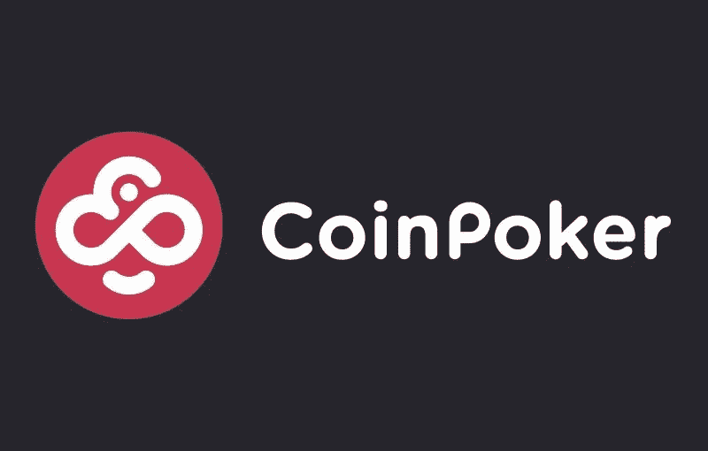

# CoinPoker:建立在区块链上的扑克室

> 原文：<https://medium.com/swlh/coinpoker-poker-room-built-on-the-blockchain-technology-ac8cd07c24c9>

# **什么是 CoinPoker？**

CoinPoker 是一个位于区块链的新平台，旨在为职业和休闲玩家提供一种更安全、更可靠的方式，让他们在分散的分布式网络中参与在线扑克游戏。

CoinPoker 从根本上消除了中间人，为玩家提供了以极具竞争力的价格赌博的机会，并承诺通过大规模促销来增加流量，最终增加名副其实的筹码(CHP)代币/硬币的价值。

CoinPoker 已经不仅仅是一个简单的概念，该服务的开发已经完成，最低可行产品(MVP)已经准备好接受测试，该团队现在准备推出后 ICO，计划进一步开发该产品，并为 CHP 购买带来直接好处。今年 2 月，CHP 在其第一个交易所 Allcoin 上市，此后又在 HitBTC、Kucoin、Idex 和 YoBit 等其他主要交易所上市。

# 有用的 DYOR 信息

【https://coinmarketcap.com/currencies/coinpoker/】CoinMarketCap 网址:

**网页:**

****硬币名称:**cph 硬币扑克**

****总供应量:** — 5 亿 CPH(白皮书)**

****循环供给:** 247，272，469 CHP**

**市值:24，781，647 美元**

****Ico 前价格:**—1 th = 6600 CHP**

**Ico 价格: — 1ETH = 4200CHP**

****通过 ICO 筹集的代币/资金:** — 100，000，000 瑞士法郎**

****白皮书:**——[https://coinpoker.com/downloads/coinpoker-whitepaper.pdf?v1801018](https://coinpoker.com/downloads/coinpoker-whitepaper.pdf?v1801018)**

****令牌类型:** — ERC 20**

# ****硬币扑克概念****

**在线扑克行业在过去经历了一些相当不稳定的起伏。在 21 世纪初迅速崛起后，更严格的法规的实施使该游戏的受欢迎程度慢慢趋于平稳，然而最近积极的政策变化为在线扑克玩家展示了更光明的未来；未来很大程度上可以通过采用区块链技术来驱动。**

**区块链允许开发者克服阻碍在线扑克行业发展的许多主要障碍，即解决支付处理问题，管理游戏完整性，以及公平的随机数生成和整合革命性区块链营销计划的能力。**

**CoinPoker 旨在通过创建一个由玩家和密码爱好者驱动的新的全球生态系统来帮助在线扑克的复兴趋势。**

# ****硬币扑克的好处****

****CoinPoker 商业计划书****

**CoinPoker 的商业计划旨在融合在线扑克玩家的两个世界和加密货币世界。这样做对市场双方都有好处，让游戏更安全、更可靠、更容易获得，同时为投资者提供一个赚取收入的平台。最初，硬币扑克将通过收取少量管理费来发展网络，从而产生收入。潜在的加密货币 CHP 将在交易所上市，以建立二级市场，这将产生不玩扑克的人的兴趣和投资。**

****支付处理****

**阻止在线扑克在全球扩张的一些主要问题是围绕支付处理的严格法规，尤其是在国际支付方面。区块链的对等网络及其新颖的加密货币(无论地理位置如何，都可以通过众多交易所购买)允许 CoinPoker 绕过这些法规，从而将游戏开放给真正的国际玩家。**

**扑克室的传统支付也需要几天，甚至几周的时间来处理，有些人甚至仍然通过邮件发送支票。加密货币支付几乎是即时的，许多交易所现在在几个小时内处理交易，而不是几天。**

****CHP 币****

**硬币扑克代币/硬币，也称为筹码或 CHP，是一种基于以太坊的硬币，可用于生态系统中的所有购买。像 ETH crypto 一样，CHP 可以分成 18 个小数点，并且可以转换成其他货币。**

**要求所有交易都在 CHP 中进行，这使得来自世界各地的玩家都可以获得游戏币，并使每个人都处于公平的竞争环境中。由于在网络上玩扑克的唯一方法是使用 CHP，在 ICO 购买硬币的初始投资者将受益于价格的立即上涨，因为对硬币的需求增加。**

****安全****

**欺诈和安全丑闻也困扰着这个行业，因此，扑克室的声誉和可信度受到了很大的打击。在诚信和公平方面，缺乏透明度一直是奥运会的主要缺陷之一。**

**区块链解决了这个问题，它使黑客无法篡改任何记录，因为它们同时作为不可信的分类账存储在网络的所有节点上。**

****RNG(随机数生成)****

**随机数生成是另一个重要因素，可以用来产生实际上不是随机的数字，因此可以用来获得优势。区块链的透明架构及其自动化智能合约用于改善这一过程，尽管该技术仍然依赖于一些传统技术，但该团队正在努力开发完全依赖于区块链和真正随机的 RNG。**

****公平竞赛(fairblock)计划和倡议****

**现代扑克室已经在分析玩家行为以确定道德行为方面做了大量工作，例如来自一个团队的多名玩家在牌桌上串通一气以获得对其他人的优势。CoinPoker 实施的公平游戏安全和欺诈系统正是这样做的，确保所有行为都是公平的，并消除机器人和其他黑客对游戏的帮助。**

**区块链固有的投票系统将允许根据公众需求推出新产品设计、游戏和其他服务，也允许用户对可能被视为可疑的游戏进行投票。**

**CoinPoker 还为用户提供运营自己的推荐业务的能力，以换取以 CHP 支付的收入分成。那些持续参与改善社区的人将会得到更多的奖励。**

# ****社交媒体信息:****

****T5【脸书】T6****

**网址:——[https://www.facebook.com/CoinPokerOfficial/](https://www.facebook.com/CoinPokerOfficial/)**

**喜欢:**27221**喜欢和**27707**关注者**

**过去 7 天有多少帖子/更新: **58** *帖子***

*****推特*****

**网址:[https://twitter.com/CoinPoker_OFF](https://twitter.com/CoinPoker_OFF)**

**追随者:**4420**追随者**

**过去 7 天有多少条推文/转发: **55 条** *条***

*****电报*****

**网址:——[https://t.me/officialcoinpoker](https://t.me/officialcoinpoker)**

**用户: **2 855** 成员*成员***

*****电报管理员*****

**用户名:芸香属**

**用户名:汤姆**

**用户名:@PauliusMikaliunas**

**用户名:@CoinPoker**

**用户名:托尼·G**

**用户名:阿格内**

**用户名:Tadas**

**用户名:伊莎贝尔·梅塞尔**

**用户名:@Ugnius**

****Reddit****

**网址:——[https://www.reddit.com/r/coinpoker/](https://www.reddit.com/r/coinpoker/)**

****181** 读者:*读者***

****Youtube****

**网址:——[https://www.youtube.com/channel/UC13j_W_xRiu4927ZGYhiiWA](https://www.youtube.com/channel/UC13j_W_xRiu4927ZGYhiiWA)**

**订户: **222** *订户***

*****中等*****

**网址:——[https://medium.com/@CoinPoker](/@CoinPoker)**

**追随者: **326** *追随者***

**最近 7 天有多少更新:**13**帖子**

*****领英*****

**网址:——[https://www.linkedin.com/company/coinpoker/](https://www.linkedin.com/company/coinpoker/)**

**追随者:**8**追随者**

**最近 7 天有多少更新: **4** *帖子***

*****GitHub*****

**网址:——[https://github.com/CoinPokerOfficial](https://github.com/CoinPokerOfficial)**

****员工/团队信息:****

**名称:**勒内·布特斯丁****

**头衔:**首席开发官****

**简历:— René是一名在线游戏软件工程师，在该领域拥有十多年的工作经验。作为首席开发人员，他专门开发多人在线游戏，如扑克、双陆棋、象棋、拉米纸牌和其他纸牌游戏。René在行业中的广泛背景使他能够建立在最佳原则的基础上，并提供行业中的最新创新。**

**领英:——[https://es.linkedin.com/in/turnbasedgames](https://es.linkedin.com/in/turnbasedgames)**

**名称:**Justas kregd****

**头衔: **CTO &智能合约开发者****

**简历:— Justas 是一家在线游戏软件开发商，在该领域拥有超过 12 年的经验。除此之外，他还是一名作家& 10 款已出版的 iOS 和 Android 游戏的撰稿人。在过去的三年里，Justas 一直从事在线扑克软件开发工作。在过去的一年里，他一直专注于区块链相关的项目&智能合同。**

**领英:——[https://lt.linkedin.com/in/justaskregzde](https://lt.linkedin.com/in/justaskregzde)**

**姓名:**迈克尔·约瑟夫****

**头衔:**安全主管****

**简介:在网络游戏安全和欺诈防范方面，迈克尔是个老手。他因揭露扑克界的两起重大作弊丑闻而闻名，并在该领域工作了十多年。他在 PokerStars 和 Full Tilt Poker 的工作经历使 Michael 能够就影响玩家、游戏透明度和安全性的问题提供深刻的分析。**

**领英:——[https://uk.linkedin.com/in/michaeljosem](https://uk.linkedin.com/in/michaeljosem)**

**姓名:**伊莎贝尔·梅塞尔****

**头衔:**首席社区经理****

**简历:Isabelle 是一名职业扑克玩家，职业生涯总奖金超过 1，000，000 英镑。她在扑克界已有超过 15 年的历史，是一位著名的中国扑克大师。作为扑克大使，Isabelle 在法国和加拿大市场拥有强大的影响力，并在网络和传统媒体上开设了专栏。她两次被欧洲扑克大奖提名为年度员工，拥有自己的教学 DVD，并出现在纪录片《那就是扑克》中。**

**领英:——[https://www.linkedin.com/in/isabelle-mercier-9b606419](https://www.linkedin.com/in/isabelle-mercier-9b606419)**

**名称:**保利乌斯·米卡利斯纳斯****

**头衔:**扑克运营负责人****

**简历:— Paulius 已经在在线游戏领域工作了 10 年，在过去的三年里，他一直是 TonyBet Network 的扑克产品经理。他作为职业扑克玩家的经历使他成为立陶宛体育扑克联合会的共同创始人之一。Paulius 的主要关注点一直是扑克，他还在 PokerNews 担任波罗的海地区的编辑兼经理三年。**

**领英:——[https://www.linkedin.com/in/paulius-mikaliunas-2ab3568a](https://www.linkedin.com/in/paulius-mikaliunas-2ab3568a)**

**姓名:**亚历克斯·米舍夫****

**头衔:**在线商务战略&数字营销专家****

**简历:— Alex 是一名战略专家，在电子游戏行业有着广泛的背景。他的专长包括提高盈利能力和效率最大化，以及确定增长引擎。Alex 拥有在 888.com、Playtech 和 The Nation Traffic 等公司工作的经验，并且是多家电子商务公司的董事会成员。**

**领英:——[https://il.linkedin.com/in/alexmishiev](https://il.linkedin.com/in/alexmishiev)**

**姓名:**安塔纳斯·果加—托尼·G****

**头衔:**企业家****

**简介:Tony G 是一位活着的扑克传奇人物，也是世界上最受欢迎的玩家之一。他因在许多扑克电视节目中多次精彩亮相而闻名，如 HighStakes Poker、Poker After Dark 和 The Big Game 等。他还是一个多产的企业家，欧洲议会的成员，也是欧洲最有影响力的秘密社区支持者之一。**

**领英:——[https://lt.linkedin.com/in/antanasguoga](https://lt.linkedin.com/in/antanasguoga)**

**姓名:**音波张****

**头衔:**企业家兼投资人****

**简历:他是区块链 20 国联盟(B20)的联合创始人和全球总监，这是一个国际非政府组织，专注于在全球范围内搭建区块链和加密货币社区的桥梁。和 ValueBank Group 的联合创始人，value bank Group 是一个全球性的菲亚特-加密交易所网络，提供加密钱包和支付解决方案。ValueNet Capital 创始人，专注于投资区块链初创公司和 cryptos。Murint Capital 的联合创始人，这是一家科技和娱乐行业的风险投资基金。SoRelax 的创始人，这是一个跨国营销和服务的全球平台。Sonic 拥有悉尼大学的 MPM 和机电一体化学士学位。**

**领英:——[https://www.linkedin.com/in/sonic-zhang-61180253](https://www.linkedin.com/in/sonic-zhang-61180253)**

**姓名:**迈克·西格尔****

**头衔:**密码学专家****

**简历:— Mike 是密码学和算法方面的专家，自 2011 年以来一直活跃在比特币社区。Mike 是一个超过 15 年的狂热扑克玩家，他创造了自动扑克游戏机器人、赔率计算器和一个可证明公平的游戏引擎。迈克是领先的加密货币金融科技公司 DigitalX 的首席技术官。**

**姓名:**凯文·霍布斯****

**头衔:**区块链技术专家****

**简介:凯文·霍布斯是万贝克斯集团的首席执行官，也是 Genisys 项目的创始人。他有十多年的管理经验，曾在各种具有挑战性的岗位上工作过，并将这些经验带到了目前的工作中。凯文对区块链技术如何帮助进一步创新以及未来如何开展业务有着浓厚的兴趣。**

**领英:——[https://www.linkedin.com/in/kevinhobbs007/](https://www.linkedin.com/in/kevinhobbs007/)**

**姓名:**达尼洛·s·卡卢奇****

**头衔:**营销&传播专家****

**简历:—前在线扑克玩家，创业创始人和营销专家，有 6 年以上的经验。目前在谷歌，领导 YouTube 在英国的社区工作**

**领英:——[https://www.linkedin.com/in/daniloscarlucci/](https://www.linkedin.com/in/daniloscarlucci/)**

**姓名:**埃默森·丰塞卡——加密丰泽****

**头衔:**区块链顾问、加密货币交易员、社区顾问****

**简历:艾默生是 NEM 菲律宾公司的负责人和 Coin Sessions PH .的首席执行官。此外，他还是 LoyalCoin 的顾问委员会成员之一。他作为一名交易员在加密领域开始了他的职业生涯，从那时起就被称为 CryptoFonzy。作为区块链技术的倡导者，他帮助初创企业、ico 和区块链公司建立社区、制定营销策略和进行沟通，以吸引投资机会，同时，他还在菲律宾扩大创新意识。**

**领英:——[https://www.linkedin.com/in/emerson-fonseca-7114048a](https://www.linkedin.com/in/emerson-fonseca-7114048a)**

**姓名:**邓丽君****

**标题:**扑克和社区顾问****

**Bio : — Teresa 是一位拥有超过 15 年经验的游戏专家，在业界享誉全球。她在芬兰扑克市场上是一位受人尊敬的人物，也是一位广受赞誉的扑克锦标赛总监，长期在欧洲扑克巡回赛中工作。她还担任赌场和扑克产品经理，为该领域大多数最大的品牌举办活动。**

**领英:——[https://fi.linkedin.com/in/teresa-nousiainen-7513229a](https://fi.linkedin.com/in/teresa-nousiainen-7513229a)**

**姓名:**沃伦安东尼郁郁葱葱****

**头衔:**公关和营销专家****

**生物:作为在线行业的公关专家，沃伦多年来一直与最优秀和最知名的公司合作。他的丰富经验包括在 PartyPoker 担任公关主管，以及在 Ladbrokes 和 Sky Sports 担任类似职务。除此之外，沃伦还在政界为前反对党领袖兼外交大臣威廉·黑格议员工作。2012 年 1 月，Warren 获得了欧洲扑克行业年度员工的荣誉。**

**领英:——[https://www.linkedin.com/in/warren-lush-6a3b425](https://www.linkedin.com/in/warren-lush-6a3b425)**

**姓名:**布莱恩·托马斯·霍尔****

**头衔:**法律顾问****

**简历:布莱恩是电子商务专家，擅长战略和法律咨询。他的经验包括在该领域的许多不同方面为国内和国际公司提供咨询，包括结构、开发、消费者保护、技能游戏等。作为在 BH 国际战略咨询公司和 Lazarus Charbonneau 工作过的资深专业人士，他精通博彩法和电子商务。**

**领英:——[https://www.linkedin.com/in/technologylaw](https://www.linkedin.com/in/technologylaw)**

**姓名:**尤金·杜博萨斯基****

**头衔:**数据科学家****

**简历:Eugene 是一名数据科学家，在该领域拥有近 20 年的经验。他擅长识别基于数据的解决方案和机会，并确保它们被正确理解和应用。Eugene 是多个项目和社区的创始人，他目前是 Presciient 的董事兼首席培训师。**

**领英:——[https://au.linkedin.com/in/eugene-dubossarsky-09208a1](https://au.linkedin.com/in/eugene-dubossarsky-09208a1)**

**姓名:**查德·伯吉斯****

**头衔:**量化交易员&资本市场顾问****

**简历:— Chadd 作为量化投资组合经理和自营交易员，在金融行业拥有 15 年的经验。他曾在亚洲多个司法管辖区工作，并保持着广泛的基金管理和密码行业联系网络。他目前正在从事多个项目，旨在将区块链技术与传统金融资本市场相结合。**

**领英:——[https://www.linkedin.com/in/chadd-burgess-1029ab112](https://www.linkedin.com/in/chadd-burgess-1029ab112)**

****公司地址:****

**英属维尔京群岛**

**尼科西亚，英语(Linkedin)**

****

## **这个故事发表在 [The Startup](https://medium.com/swlh) 上，这是 Medium 最大的创业刊物，拥有 327，829+人关注。**

## **在这里订阅接收[我们的头条新闻](http://growthsupply.com/the-startup-newsletter/)。**

****