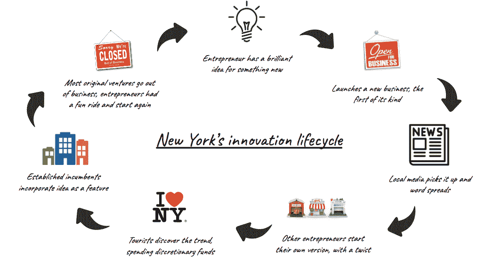

# 纽约如何孕育创新

> 原文：<https://medium.com/swlh/coming-to-america-how-new-york-breeds-innovation-9f60a14ae89f>

纽约处处孕育着创新，这是我在世界其他任何地方都没有见过的。与硅谷不同的是，在纽约，它不全是关于应用或人工智能，而是关于现实生活。

今年年初，我正式搬到了这里，虽然在过去的 10 年里，我花了相当于 3 年多的时间在这座城市出差，但住在这里，我已经意识到了一些我认为是理所当然的独特品质。

# 每个人的市场

如果有人有一个新的商业想法，纽约是他们启动它的地方。

由于来自世界各地的不同人群密度很高，你几乎可以找到任何东西的市场。选择你的美食，选择你的时尚，选择你的乐趣。你会在这里找到它。如果你向其他企业销售(而不是直接面向消费者)，那么你就有了一个大产业。金融、零售、时尚、教育、医疗保健、媒体和广告。

纽约是世界的一个缩影，消费者和全球产业的多样性集中在一个地方(这是硅谷、洛杉矶、波士顿、蒙特利尔、巴黎、迪拜、孟买、里约、东京和北京所不具备的)。最接近的可能是伦敦、多伦多、悉尼或香港，但他们都把自己的地理区域视为自己的市场。纽约视世界为自己的市场。

# 纽约的创新生命周期

我要挑一下[特色甜甜圈热潮](https://www.thrillist.com/eat/new-york/the-best-donut-shops-in-nyc)。我每天都带着好奇心走过这些地方。虽然我还没有踏入其中一步，但他们教会了我很多关于纽约是如何孕育创新的。

你看，我不相信专业甜甜圈是一个独立的业务。它们确实是现有企业(如咖啡店或面包店)的*特色*。那么它们作为独立的企业是如何存在的呢？由于人们愿意尝试新事物(作为消磨时间和金钱的方式)的密度和游客的不断涌入(准备毫无愧疚地消费)，许多这些特征都是人为支撑的。我开始认识到这是一件好事，因为它为路过的其他企业主带来了创新，他们看到了产品系列，并从中获得灵感，随着时间的推移将这些功能融入到他们的业务中。瞧，你现在会在咖啡店和面包店看到特制的油炸圈饼(据我所知)。

这是我制作的一个展示纽约州创新生命周期的视频**。**

概括一下:

1.  企业家对新事物有很好的想法。
2.  一项新业务开始了，风险很大，但需要更多的精力和激情。
3.  当地媒体开始谈论它，主要是因为它是新的。
4.  其他企业家也提出了自己的想法，通常还有点新意。
5.  多亏了 FOMO，游客们开始把钱投入到最新的热潮中。
6.  知名企业家受到启发，并将其融入到自己的业务中。
7.  最初的创业者会歇业(或者感到无聊)，尝试一些新的东西。

要明确的是，我认为最初的企业家继续下一个想法是健康的，因为这是保持整个城市创新生命周期的动力。每个人都有自己的角色，包括媒体、游客和现有企业。

# 纽约没那么紧张

我一直鼓励我的许多企业家朋友在纽约投资一段时间(欢迎你来我家过夜，许多人已经接受了我的邀请)。经常听到的第一反应是“纽约太激烈了”。

嗯，纽约的紧张程度取决于你的选择。

作为一名游客，无论是商务旅客还是游客，是的，纽约通常是一个紧张的经历。原因是一个人对来访者态度的直接反映。从特色甜甜圈店，到新的梦想机器弹出体验，到最新的百老汇表演，午睡豆荚或快速样品销售，新的，有趣的和独特的商业想法无处不在。作为一名游客，你的时间有限，还想尽可能多地看、吃和购物(FOMO)，在那里你有一个强烈体验的公式。

作为一个当地人，我学到的是，你不会像游客那样体验 FOMO。你要学会接受这样一个事实，即你不需要经历每一个新趋势的出现，并选择优先考虑见朋友，在你承诺的活动和自我护理上投入时间。

花些时间去纽约，带着开放的心态和时间表，看看这个地方是否能像它对我一样激励你。

— -

Kunal Gupta 是 [Polar](http://www.polar.me) 的创始人&首席执行官，Polar 是一家技术平台提供商，其使命是实现可信网络的商业模式。Polar 的合作伙伴包括全球主要媒体出版商，该公司在纽约、多伦多、伦敦和悉尼设有办事处。

Kunal 热衷于在现代寻找平静和专注。库纳尔是加拿大领先的精神健康医院和研究机构 [CAMH](http://www.camh.ca) 的董事会成员。他定期在他的博客 findfocus.today 上写关于领导力、正念和技术文化的话题。

你可以在 [LinkedIn](https://www.linkedin.com/in/kunalfindfocus/) 上和他联系。

## 这篇文章发表在 [The Startup](https://medium.com/swlh) 上，这是 Medium 最大的创业刊物，有 331，853+人关注。

## 在此订阅接收[我们的头条新闻](http://growthsupply.com/the-startup-newsletter/)。

