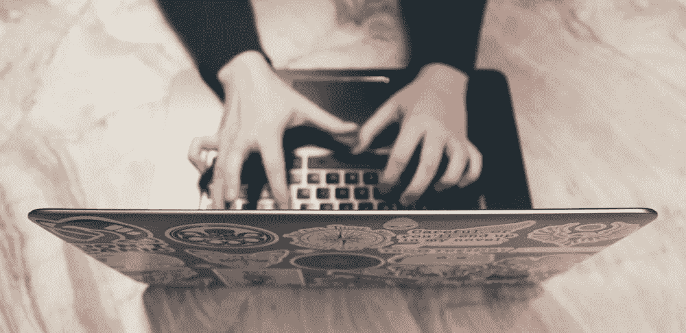
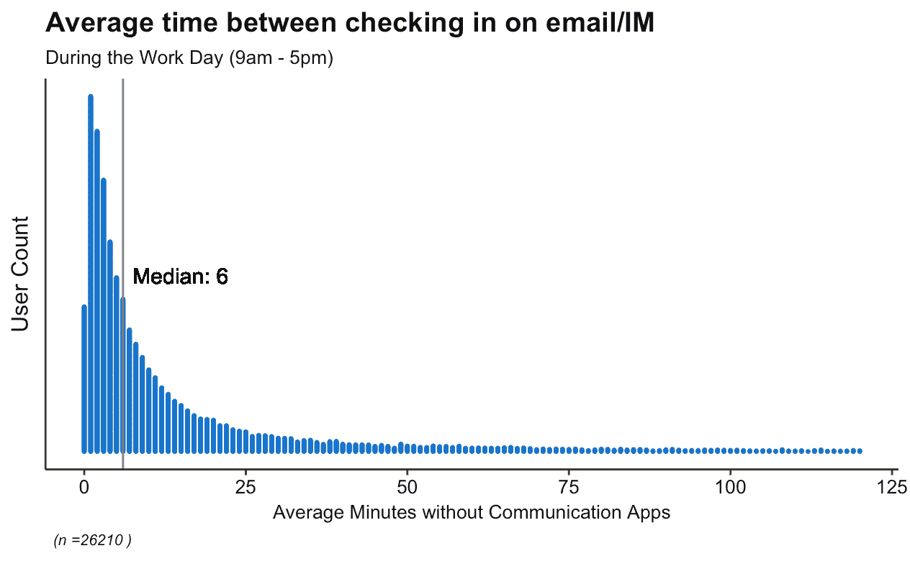
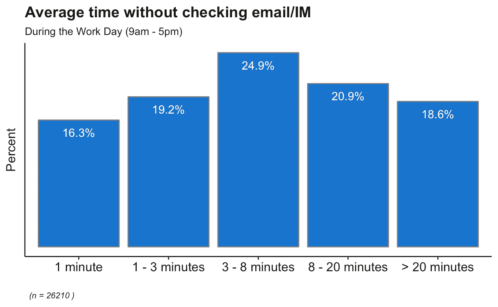
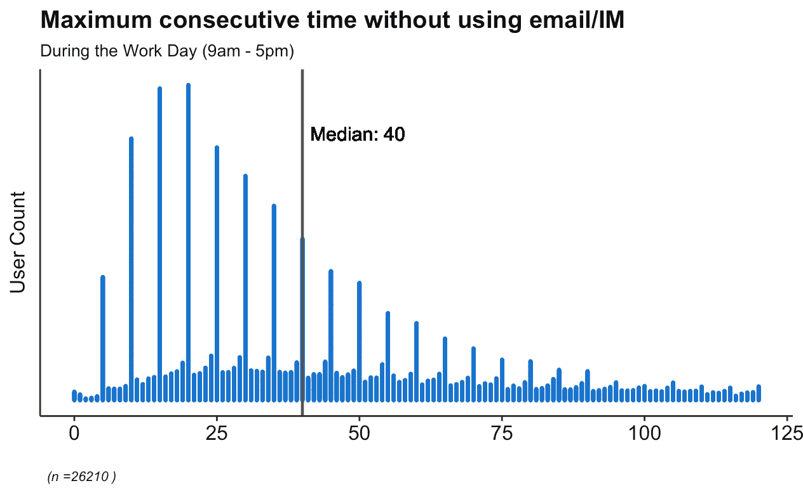
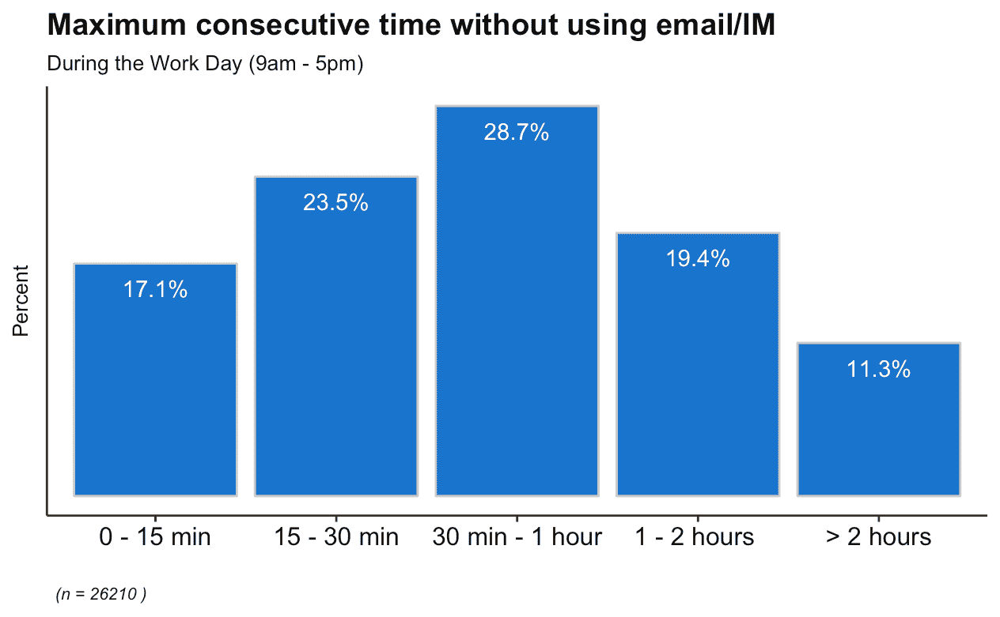
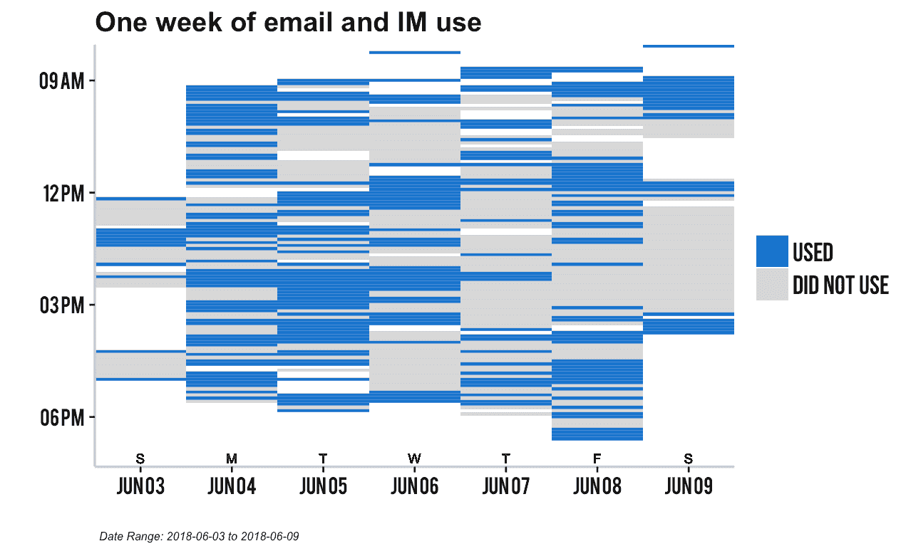
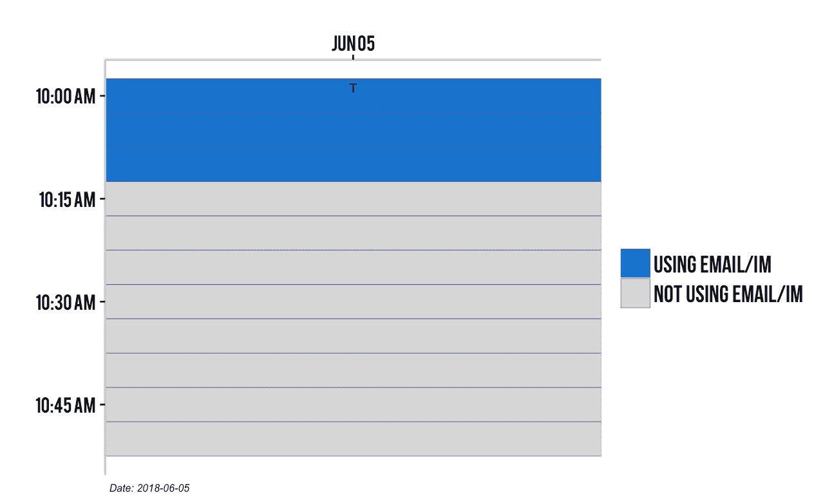
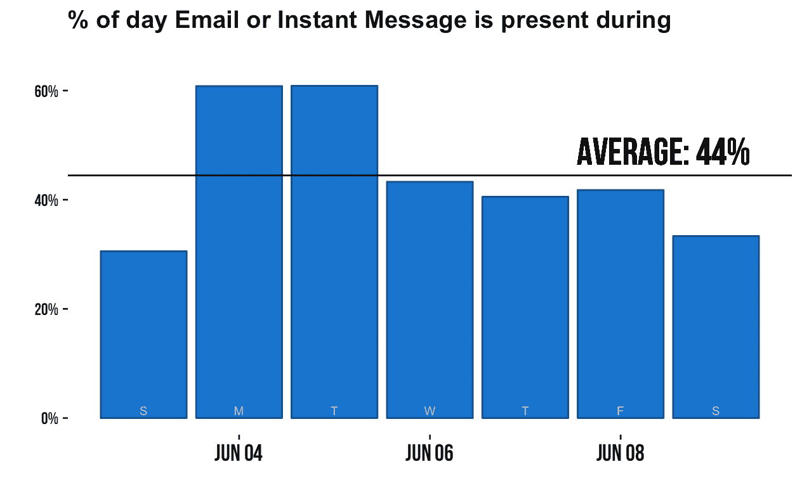

# 沟通超载:研究显示，大多数员工无法在 6 分钟内不查看电子邮件或即时消息

> 原文：<https://medium.com/swlh/communication-overload-research-shows-most-workers-cant-go-6-minutes-without-checking-email-or-im-8ef4392a7159>

## 电子邮件真的接管了你的生活。

不可否认的是，你需要使用电子邮件和其他通讯工具来工作。尽管对[电子邮件接管我们的生活](https://blog.rescuetime.com/communication-multitasking/)有很多不满，但这并不是浪费时间。

工作场所的交流*很重要。但是，如果我们不断地将注意力转移到查收电子邮件或垃圾邮件上，我们就永远没有机会真正关注我们最重要的工作。*

这一点在最近的一项研究中表现得最为明显，该研究发现，仅电子邮件一项，84%的用户就一直在后台打开收件箱，70%的电子邮件在收到后的 6 秒内被打开。

很明显，我们有一个经常被扯进交流工具的问题。虽然我们在之前的帖子中探索了使用通讯工具[进行多任务处理的影响，但我们希望更好地了解这种水平的环境切换在平均一天中有多糟糕。](https://blog.rescuetime.com/communication-multitasking/)

以下是我们的发现:

*这项研究是从超过 50，000 名退休用户的* [*匿名数据中抽取的。RescueTime 是一个工具，它向你展示你是如何度过你的数字时间的，以帮助你更有效率和更专注。*](https://blog.rescuetime.com/personal-data-gdpr/)*[***在这里注册一个免费账号。***](https://www.rescuetime.com/)*

# *普通知识工作者每 6 分钟“查看”一次电子邮件和即时消息*

*对于知识工作者——如作家、设计师、开发人员和项目经理——来说，现代工作场所是在通信工具上运行的。我们的工作越来越依赖于更多的协作、更多的信息访问和更多的实时回答问题。*

*然而，虽然交流工具能让我们快速获得我们需要的答案，但它们也是我们专注工作的持续来源。*

*但是到底有多糟糕呢？*

*当我们查看 50，000+ RescueTime 用户的匿名化行为数据时，我们发现普通知识工作者每 6 分钟就用通信工具“签到”。*

**

*(在这种情况下,“签到”被定义为在进行另一项生产任务时切换到通信工具的任何时间。)*

*所有这些都提出了一个巨大的问题:当我们在回复邮件和信息之间只有几分钟的时间时，我们该如何集中精力完成工作？*

*简而言之，我们没有。*

*事实上，虽然 6 分钟是我们发现的中间值，但完全崩溃看起来同样严峻。*

*我们发现 **35.5%的员工每 3 分钟或更短时间检查一次电子邮件和即时消息。**而**只有 18.6%的人能坚持 20 分钟以上不被拉进交流**。*

**

*更糟糕的是，我们发现使用 Slack——一种流行的团队交流工具，旨在减少电子邮件的使用——的人实际上更经常地转向交流工具*。比起精简我们的交流时间，Slack 用户平均只花了 5 分钟的交流时间，而非 Slack 用户可以花 8 分钟。**

# **40%的知识工作者在工作日从来没有连续 30 分钟的专注时间**

**但是等一下。这些只是平均值。肯定有一段时间，我们用通讯工具检查了很多，而其他时间，我们去长时间的关注，对不对？**

**不完全是。**

**我们都知道，要把工作做到最好，我们需要长时间的专注。不幸的是，我们的数据显示，我们很少有时间进行深入的工作。**

**事实上，我们的研究发现，普通的知识工作者在没有交流的情况下连续 40 分钟左右会达到最大限度。**

****

**同样，这是中间值。当我们深究这些数字时，数据讲述了一个更大的故事。**

****17%的人在没有交流的情况下甚至无法获得连续 15 分钟的专注时间。只有 30%的人每天有一个小时的专注时间。****

****

**如果你觉得在工作日很难找到专注的时间，你并不孤单。**

# **所有这些“签到”让你的注意力变成了瑞士奶酪**

**我们认为这些数据清楚地描绘了现代工作场所中发生了多少沟通超载。但是为了真正理解这些数据意味着什么，我们想把它带到个人层面。**

**使用 RescueTime 数据科学家 Madison Lukaczyk 自己的数据，我们发现，在整整一周的时间里，**她只有 8 个半小时的有效工作时间，她没有*查看电子邮件或即时消息:*****

****

**为了更深入地了解，让我们放大其中的一个时间段:**

****

**6 月 5 日，上午 10 点至 11 点，麦迪逊在 12 个五分钟时间段中的 3 个时间段使用了通讯工具。这意味着当她在工作时，25%的时间都有通讯工具。**

# **你可能只花很少的时间在电子邮件和即时消息上，但是这些工具在你一天的一半时间里都是“存在的”**

**你如何使用电子邮件和沟通工具将取决于你的工作性质。然而，我们可能都同意，我们希望有更多不受干扰的时间来专注和做有意义的工作。**

**事实上，当查看 Madison 的数据时，我们发现虽然她只花了 21%的总时间在电子邮件和即时消息上，但这些工具却在她一天中 44%的时间里**存在**。**

****

**高出席率并不一定意味着你被交流分散了注意力。但是如果你的日常交流出现率远远高于你花在这些工具上的总时间，你很可能会被它们分散注意力。**

# **我们将何去何从？**

**现代工作场所充满了令人分心的。我们不停地查看我们的通讯工具，这对我们自己没有任何好处。**

**虽然我们永远无法摆脱工作日的电子邮件和即时消息(也不想)。意识到它们的存在可以帮助我们对如何使用它们做出更好的选择。**

**许多生产力专家建议将一天中的交流分成特定的部分。而其他人则建议[在一天中不太可能需要你的时候(比如清晨),不发邮件或即时消息，专心工作一个小时或更长时间。](https://blog.rescuetime.com/daily-schedule/)**

**不管对你和你的角色有什么作用，可以肯定地说，有目的地使用沟通工具的时间和方式比让它们占用你半天时间更有利于你的生产力和注意力。**

***你是否觉得很难在没有交流的工作场所找到专注的时间？* [***在这里注册你的免费时间账户***](https://www.rescuetime.com/) ***，拿回你的时间控制权。*****

# **嘿，我是乔里！**

**我帮助公司和有趣的人通过巧妙而集中的写作讲述他们的故事。想一起工作吗？***hello@jorymackay.com 给我发邮件*****

***这篇文章的一个版本最初发表在* [*RescueTime 博客上。*](https://blog.rescuetime.com/communication-multitasking-switches/) *查看更多关于生产力、专注和动力的文章。***

****

## **这篇文章发表在 [The Startup](https://medium.com/swlh) 上，这是 Medium 最大的创业刊物，有 343，876 人关注。**

## **在这里订阅接收[我们的头条新闻](http://growthsupply.com/the-startup-newsletter/)。**

****