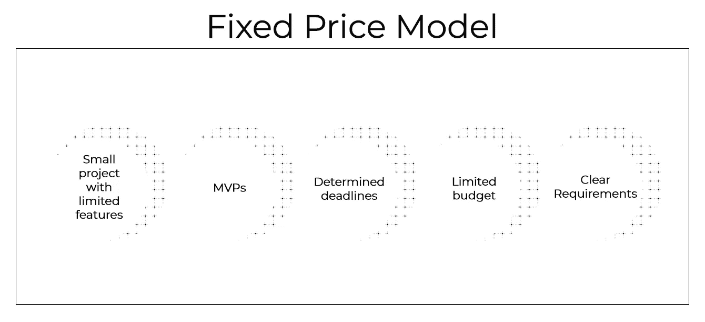
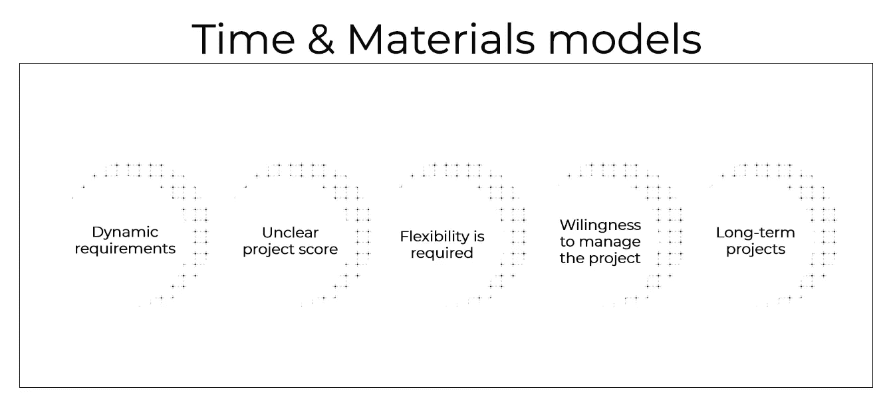
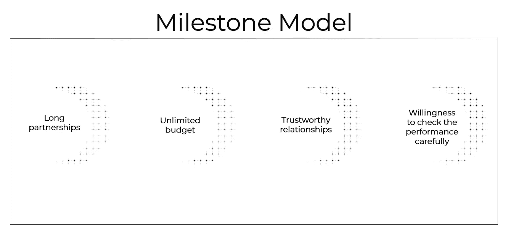

# 比较 3 种流行的定价模式:固定价格、时间和材料以及里程碑

> 原文：<https://medium.com/swlh/comparing-3-popular-pricing-models-fixed-price-time-materials-and-milestone-6b986021f2ed>

当客户雇佣一家软件开发公司时，他们会签署一份计费合同。使用的定价模型取决于项目。主要模型有固定价格、时间和材料以及里程碑。在本文中，我们将探讨这些定价模型的优缺点，并告诉您在什么情况下最好使用哪种定价模型。

# 什么是固定价格模式？

固定价格合同是基于对需要完成的工作量的估计。需要编写项目需求来定义工作范围。还需要创建线框来帮助开发团队计算出实现所有功能所需的时间。对于固定价格的项目，服务提供商和客户都承担一些与范围相关的风险。任何额外的工作(当客户想要添加文档中没有指定的全新功能时)通常都需要签订附加协议。在这种情况下，客户必须支付额外费用。

在这个模型中，为了估计软件产品的成本，在实际开发之前讨论所有的事情是很重要的。固定价格模式确保项目在特定的时间框架和预算内完成和交付。

# 优势

*   最终定价。合同签订后，客户就知道预算了。公司不能不通知就多收费。
*   严格的期限。当客户明白他们想要应用程序的什么特性时，开发者就可以提出一个清晰的计划和明确的期限。每个人都知道在任何给定的时间点要做什么功。
*   可预见性。当所有的事情都已经事先讨论和计划好了，就很容易监控软件开发的状态并预测工作是否会按时完成。
*   几乎没有管理。所有项目细节都在合同中定义，因此项目管理可以传递给项目经理。客户方面不需要过多的监督。

# 不足之处

*   严格的条款。项目启动后，在实施过程中不能调整。如果市场条件发生变化，不再需要某个计划的功能，或者需要一个新的功能，这是不可能的。这一新功能的实现必须独立协商。对于固定价格的项目，文书工作和新功能的批准需要更长的时间，并且可能会拖延整个开发过程。
*   长期规划。固定价格合同需要深入的计划。开发人员需要讨论每一个细节和每一个动作以及可能的陷阱。
*   沟通失误的风险。沟通不畅可能导致交付的产品不完全符合客户的期望，这种风险总是存在的。这种误解可能会发生，因为项目规范不清楚。缺乏项目监控也会导致沟通不畅，尤其是当开发人员需要对必须完成的工作进行确认或反馈时。如果客户与一家离岸公司合作，他们需要知道如何管理一个远程团队以避免项目停滞。

# 何时使用

固定价格模式最适用于功能有限、需求明确的小型项目。这对[MVP](https://steelkiwi.com/blog/what-mvp-and-why-it-necessary/)和预算有限、有明确期限的项目也有好处。

# 什么是时间和材料定价模型？

时间和材料模型包括定期支付已完成的工作。使用这种模型，客户在软件解决方案的开发中扮演更重要的角色，并承担与工作范围相关的所有风险。客户在整个开发过程中对时间和材料的责任水平远高于固定价格或里程碑项目。客户被安排了一个团队，并为实际花费在开发上的时间付费。

# 优势

*   灵活的要求。工作被分成短时间的冲刺，并产生 MVP(最小可行产品)。为了满足客户的期望，可以添加或删除一些功能。
*   每小时费用。客户支付特定公司规定的小时费率。
*   产品质量。由于多次迭代，产品经过了良好的测试并接近完美，从而产生了高质量的软件。
*   透明度。时间和材料模型允许客户在开发人员提交工作完成报告时监控进度。

# 不足之处

*   不确定的截止日期。对项目的任何调整都可能推迟最终发布，项目可能会过期。
*   未定义的预算。价格是大概的，所以客户不知道他们会花多少钱，因为设计和实现功能的时间框架是灵活的。
*   需要管理流程。产品负责人需要管理时间和材料模型中的每一次迭代和每一步开发。
*   艰难的决定。由于市场条件可能会发生不可预测的变化，因此最初计划的一些功能或设计元素可能会变得不再相关。在这种情况下，产品所有者必须立即行动，调整开发以更好地满足市场条件。

# 何时使用

时间和材料定价模型吸引了那些想要灵活程序和敏捷项目执行的客户。该模型适用于需求不断变化的项目，并且适合长期项目。

这种类型的合同适用于没有固定工作范围和需要很大灵活性的情况。客户必须愿意真正参与项目，因为他们的认可和愿景是开发的重要组成部分。

# 什么是里程碑定价模型？

使用里程碑定价，当服务提供商在特定时间段内实施了特定范围的工作，达到了预定义的里程碑时，客户将被计费。在这一点上，客户需要向服务提供者支付一笔费用，这笔费用取决于花费的时间和完成的事情。

# 优势

*   根据成就支付报酬。客户为交付给他们的实际功能付费。
*   控制结果。客户成为批准每个里程碑的人。
*   标准。大多数 IT 公司会向客户提供一份清单，当他们收到一份需要批准的工作时，需要使用这份清单。这份清单旨在指导他们了解是否一切都如预期的那样工作。

# 不足之处

*   没有固定价格。每种类型的功能都将花费不同的金额，因为开发它们所花费的时间不同。客户必须支付每个里程碑批准的总金额。
*   长期纠纷。如果客户发现他们不喜欢的东西或者与清单中列出的功能不相符的东西，开发团队将有权提出异议。随着双方达成协议，这种反复可能需要相当长的时间。
*   没有严格的时间表。由于规划和项目执行是迭代的，所以对于项目何时完成没有具体的时间表。
*   缺乏信任。一些 IT 公司不信任这种模式，并拒绝与坚持这种模式的客户合作。

# 何时使用

当服务提供商和客户有良好的关系以消除欺诈的机会时，里程碑模型是最好的。如果双方互相信任，就不太可能发生纠纷。里程碑模式最适合已建立关系的业务合作伙伴，因此在接受和争议期间停机时间最少。

相关:[从客户提出要求到签订合同:SteelKiwi 是如何做到的](https://steelkiwi.com/blog/how-to-start-working-with-software-developers-from-ukraine/)

# 选择正确的合同模式

客户应该根据他们拥有的项目类型选择定价模式。如果他们对自己的项目有清晰的了解，并且预算有限，那么应该使用固定价格模式。在这种情况下，客户应该避免包含大量的功能，而是只关注核心特性。如果项目非常灵活，需求经常变化，那么应该应用时间和材料模型。当双方有长期的信任关系时，他们可以根据里程碑模型工作。简而言之，客户必须平衡他们对质量、期限和价格的期望。

乌克兰的科技人才在市场上很受欢迎。SteelKiwi 是一家总部位于乌克兰的软件开发公司，自 2011 年上市。我们的技术栈包括 [Python/Django、](https://steelkiwi.com/blog/why-django-best-web-framework-your-project/) AngularJS、React.js、HTML5、CSS3、Flutter、Swift、Objective-C、Java 和 Kotlin。这些技术使我们能够在按需服务、电子学习、业务流程自动化、娱乐等领域实施项目。你可以阅读[我们的投资组合](https://steelkiwi.com/projects/)，更好地了解我们合作过的客户以及我们在克服困难的技术挑战时实现的目标。

如果您有任何关于定价模式的问题，或者想要建立自己的项目，[请联系](https://steelkiwi.com/contacts/)，我们的销售代表将指导您完成整个过程。

## 这篇文章发表在 [The Startup](https://medium.com/swlh) 上，这是 Medium 最大的创业刊物，拥有 337，320 多名读者。

## 订阅接收[我们的头条新闻](http://growthsupply.com/the-startup-newsletter/)。

