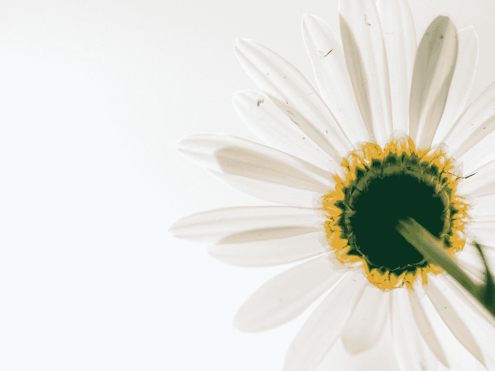

# “攀比是快乐的小偷”

> 原文：<https://medium.com/swlh/comparison-is-the-thief-of-joy-e2f674cee818>

## 西奥多·罗斯福。

Photo by [Aaron Burden](https://unsplash.com/@aaronburden?utm_source=medium&utm_medium=referral) on [Unsplash](https://unsplash.com?utm_source=medium&utm_medium=referral)

> “不要拿自己的人生和别人比。太阳和月亮没有可比性。他们在属于他们的时候会发光”。—未知

攀比烂！！
停止。它。现在！