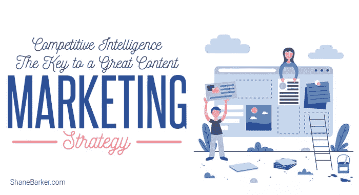

# 竞争情报:伟大的内容营销战略的关键

> 原文：<https://medium.com/swlh/competitive-intelligence-the-key-to-a-great-content-marketing-strategy-406ddc006bee>

大多数消费者，尤其是千禧一代，厌倦了感觉像推销的营销信息。他们更喜欢来自品牌的真实、相关和一致的内容。

事实上， [84%的消费者](https://www.meaningful-brands.com/en/insights)期望品牌通过讲故事来提供有价值的、有趣的、解决方案驱动的内容。这表明品牌创造和分发优秀的内容是多么重要。

你知道在美国 [91%的 B2B 品牌](https://contentmarketinginstitute.com/wp-content/uploads/2017/09/2018-b2b-research-final.pdf)和 [86%的 B2C 品牌](https://contentmarketinginstitute.com/wp-content/uploads/2017/12/2018_B2C_Research_Final.pdf)使用内容营销吗？你也应该这样做(如果你还没有使用它的话)。

精选的相关内容:

*   [爱、恐惧、和谐、悲伤、绝望:如何推动可分享的内容](https://shanebarker.com/blog/love-fear-harmony-drive-content/)
*   [你如何扩大影响者的内容？](https://shanebarker.com/blog/how-do-you-amplify-influencer-content/)

内容营销在吸引客户、建立信任和可信度、增加销售和发展业务方面有很大潜力。

然而，你需要有一个坚实的内容营销战略到位，以获得最佳效果。起草的最好方法之一是通过深入的竞争分析。

在我谈论竞争情报如何促进您的内容营销战略之前，让我们更仔细地了解一下它是什么。

# 什么是竞争情报？

竞争情报是指对你的竞争对手进行研究，帮助你获得关键的洞察力，从而超越他们。

当你研究你的竞争对手时，你可以找到有用的信息来有效地计划你的营销策略，并帮助你的企业更快地发展。

研究你的竞争对手包括但不限于社交倾听、焦点小组，以及确定他们的关键客户和产品特性。

# 竞争情报如何帮助您改进内容营销策略

如果你想计划一个有效的营销策略，了解谁是你的竞争对手是很重要的。更重要的是要知道你的竞争对手在做什么。

如果你分析他们的营销策略，看到他们做得对的地方和失败的地方，你就可以利用这些洞察力。

精选的相关内容:

*   [2018 年你需要知道的 25 个内容营销平台](https://shanebarker.com/blog/content-marketing-platforms/)

通过使用优秀的内容，您可以轻松发现超越竞争对手的机会。你还可以确定你需要投入更多精力和资源的领域。

尽管这可能很困难且耗时，但它可以帮助你创建一个真正有效的内容营销策略。

让我们来看看如何利用竞争情报来改进您的内容营销策略。

# 1.确定谁是你真正的竞争对手

重要的事情先来。你需要确定你在这个行业中的竞争对手，包括直接的和间接的。

销售或营销与你相同产品的企业是你的直接竞争对手。

还有一些企业或出版商可能不销售或营销相同的产品，但他们可能是你的网上竞争对手。他们可能会在你的领域发布内容，并与你争夺相同的关键词。这些都是你的间接竞争对手。

在这两种情况下，他们都竞相抓住你的目标观众的注意力。所以如果你想成功，你需要超越他们。

识别你的竞争对手并不复杂。这里有几个方法:

## 进行市场调查

它可以帮助你找到与你的企业销售相同或相似产品的企业。然后你可以仔细看看他们的产品和营销策略。

## 监控在线社区论坛和社交媒体

你也可以在 Quora 这样的论坛上监控你的客户和潜在客户的对话。这可以帮助你识别你的竞争对手。这是因为很多买家在这类论坛和社交渠道上寻求产品推荐。

精选的相关内容:

*   [2018 年你需要知道的 11 个 YouTube 营销工具](https://shanebarker.com/blog/youtube-marketing-tools/)

## 进行关键词研究

竞争性搜索引擎优化分析可以帮助你发现在搜索结果中竞争相同空间的企业和网站。这是识别间接竞争对手的最佳方式，这些竞争对手在影响买家决策方面发挥着至关重要的作用。

谢天谢地，你不需要全部手动完成。有像 SEMrush 这样的工具可以给你一份完整的竞争对手名单。比较你的受众

你可以使用类似 [**Alexa 的受众重叠工具**](https://try.alexa.com/marketing-stack/audience-overlap-tool) 这样的工具来寻找你的竞争对手。此工具会检查您的受众，并允许您查看拥有相似受众的网站列表。

您可以通过选择只查看与您的网站流量水平相似的网站来进一步缩小列表范围。

一旦你知道谁是你的竞争对手，你就可以深入他们的内容营销策略，这样你就可以胜过他们。

精选的相关内容:

*   [2018 年你现在需要知道的 23 个网上研讨会主办网站](https://shanebarker.com/blog/webinar-hosting-websites/)

# 2.分析它们的内容性能

你的竞争对手和你的目标受众是一样的。但你需要知道的是他们如何针对他们。

首先看他们的内容住在哪里，发布什么类型的内容。为此，您应该检查他们在哪里发布内容。检查他们是否有多个博客或使用内容聚合平台，并监控他们的社交渠道分享。

您可能会发现各种类型的内容，如博客帖子、电子书、视频、信息图、网络研讨会、播客、时事通讯、常见问题解答、案例研究和新闻稿。

一旦你发现了竞争对手的内容，就该分析他们内容的表现了。这将有助于你评估他们的内容营销策略的效率。你也可以找到超越他们的机会。

检查其内容:

## 量

查看您的竞争对手发布了多少博客帖子。此外，跟踪他们的案例研究、电子书和其他内容格式。这将帮助你分析你是否适合应对竞争，或者你是否需要一个更大的内容创作团队来竞争。

## 频率

你还应该考虑跟踪你的竞争对手发布新内容或更新旧帖子的频率。这将有助于你清楚地了解他们目前的内容营销策略和努力。

## 主题分布

同样，你可以使用关键词研究来确定你的竞争对手使用的焦点关键词和他们讨论的关键话题。确定他们在内容营销策略中的主要目标主题。

这将有助于你找到他们擅长的话题，以及他们没有利用的话题。

你有两个选择。你可以围绕竞争对手不关注的话题创作内容。这将帮助你吸引那些他们可能会错过的观众。或者，你可以选择在他们擅长的话题上与他们竞争。

精选的相关内容:

*   [2018 年你需要知道的 16 个内容聚合网络和平台](https://shanebarker.com/blog/content-syndication-network-list-2018/)

## 质量

同样重要的是知道他们的内容有多好。有几个因素可以帮助你评估它们的内容质量，包括准确性、语法错误、语言、长格式或短格式内容以及可读性。

检查他们如何优化搜索结果的内容。通过在页面标题、URL、标题标签、主要内容和图片替代文本中寻找关键词，你可以很容易地做到这一点。

另一个分析内容质量的标准是基于读者如何与之互动。看看哪些话题最能引起目标受众的共鸣。寻找阅读时间、社会参与、喜欢、分享和评论(正面或负面)等指标。

你可以使用 BuzzSumo 这样的工具来识别竞争对手在参与度方面表现最好的内容。

了解哪种内容适合你的观众，哪种不适合，会让事情变得更容易。

您可以利用竞争内容分析的见解来改进您的内容营销策略。创建最符合受众兴趣、需求和偏好的内容。这将让你抓住他们的注意力，并最终将他们转化为忠诚的客户。

精选的相关内容:

*   [2018 年你需要知道的 37 个信息图提交网站，以增加你的影响力](https://shanebarker.com/blog/37-infographic-submission-websites/)

# 3.寻找链接到你的竞争对手的网站

为了给你的内容营销策略收集更多的洞察力，你应该寻找链接到你的竞争对手的网站。

你可以使用像 [Alexa 的竞争对手反向链接检查器](https://try.alexa.com/marketing-stack/competitor-backlink-checker)和 [Ahrefs 的反向链接检查器](https://ahrefs.com/backlink-checker)这样的工具来查看谁链接到了他们。

您可以根据与竞争对手链接最频繁的网站来筛选该列表。请检查他们的域权限。

当你知道哪些网站链接到你的竞争对手，你可以改善你的链接建设策略。你可以利用这些见解来发现你可能错过的反向链接机会。

把所有链接到你的竞争对手(但不链接到你)的权威网站作为你的下一个[链接建设](https://shanebarker.com/blog/automated-link-building/)目标。

还要分析帮助你的竞争对手在网站上被提及的内容类型。它可以是综述文章、客座文章、博客评论、列表文章或媒体报道。

你也可以向链接网站推销类似的内容。这将增加你在这些网站上曝光的机会。

精选的相关内容:

*   [在内容中使用客户评价的 7 种方式](https://shanebarker.com/blog/7-ways-use-customer-testimonials-content/)

# 4.看看谁在社交媒体上放大了他们的内容

在这个数字时代，社交媒体已经成为每个内容营销策略的重要组成部分。所以你需要监控你的竞争对手是如何使用社交媒体的。

确定你的竞争对手利用的社交媒体网站，如脸书、Twitter、Instagram、LinkedIn、YouTube 或 Pinterest。

并非所有的社交网站都与你的定位相关。但是如果你的竞争对手创造性地、有效地利用某个社交网站，你也可以使用它。

对于每个社交媒体网络，分析:

*   他们的追随者数量
*   他们发布的内容类型
*   他们在社交媒体上发帖的频率
*   他们的粉丝如何与他们的内容互动和互动
*   如果他们与任何[有社会影响力的人](https://shanebarker.com/blog/influencer-marketing-the-next-level-of-content-marketing/)合作来增加他们内容的覆盖面

所有这些信息将帮助你为社交媒体创建一个强大的内容营销策略。它可以帮你找到适合你的[最佳社交媒体渠道](https://shanebarker.com/blog/best-channels-b2c-social-media-marketing/)。通过发现竞争对手可能错过的领域，你可以迅速超越他们。

# 5.不要模仿你的竞争对手

现在你已经收集了所有这些见解，你应该有效地利用它们来提高你的内容营销策略。你应该学习竞争对手的长处和短处，以提高你的整体内容表现。

然而，你不应该复制他们的内容，因为这对你弊大于利。

如果你落后于你的竞争对手，寻找你可以轻松击败他们的机会。采取措施解决当前内容营销策略中的问题。解决所有这些问题，以确保您充分利用您的时间和资源。

您还应该考虑每季度进行一次竞争内容分析。如果你的竞争对手更积极地尝试他们的内容营销策略，你可以更频繁地进行分析。

精选的相关内容:

*   [如何写出人们喜欢阅读和分享的内容](https://shanebarker.com/blog/how-to-write-content-that-people-will-love-read-and-share/)
*   [如何利用内容营销成功推出产品](https://shanebarker.com/blog/successful-product-launch-content-marketing/)

# 最后的想法

竞争情报可以帮助您识别与竞争对手的内容营销效率相关的有用见解。然后，您可以利用从分析中获得的见解来发展您的业务。

但是不要让你的竞争对手为你定义一切。使用竞争情报应该只是你整体内容营销策略的一部分。至于其他的，专注于在你的领域中你与众不同的地方。

你是否使用过其他策略来提升你的内容营销策略？请在下面的评论中告诉我。

***最初发表于*******。****

***关于作者***

*[谢恩·巴克](https://shanebarker.com)是[内容解决方案](https://contentsolutions.io/)和 [Gifographics](http://gifographics.co/) 的创始人兼首席执行官。你可以在[推特](https://twitter.com/shane_barker)、[脸书](https://www.facebook.com/ShaneBarkerConsultant/)、 [LinkedIn](https://www.linkedin.com/in/shanebarker/) 、 [YouTube](https://www.youtube.com/channel/UCiD3HGr_vpDp0ApavL-bEGA) 、 [Instagram](https://www.instagram.com/shanebarker/) 上和他联系。*

**

## *这篇文章发表在 [The Startup](https://medium.com/swlh) 上，这是 Medium 最大的创业刊物，拥有+365，945 名读者。*

## *在这里订阅接收[我们的头条新闻](http://growthsupply.com/the-startup-newsletter/)。*

**