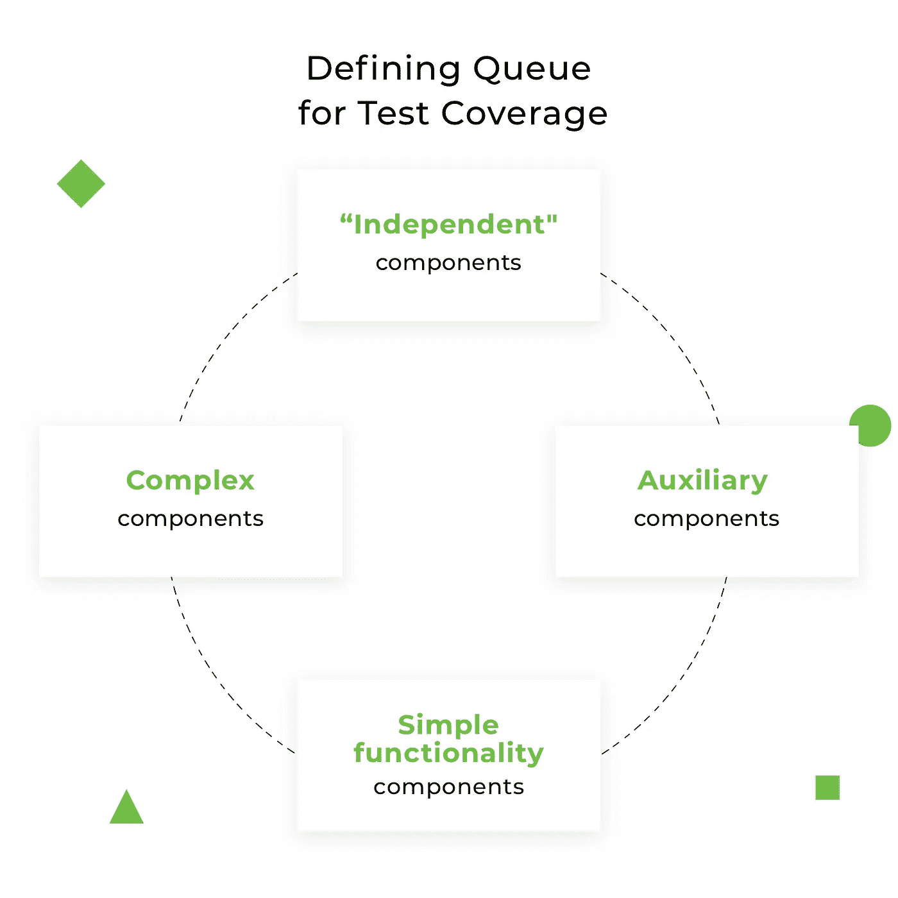
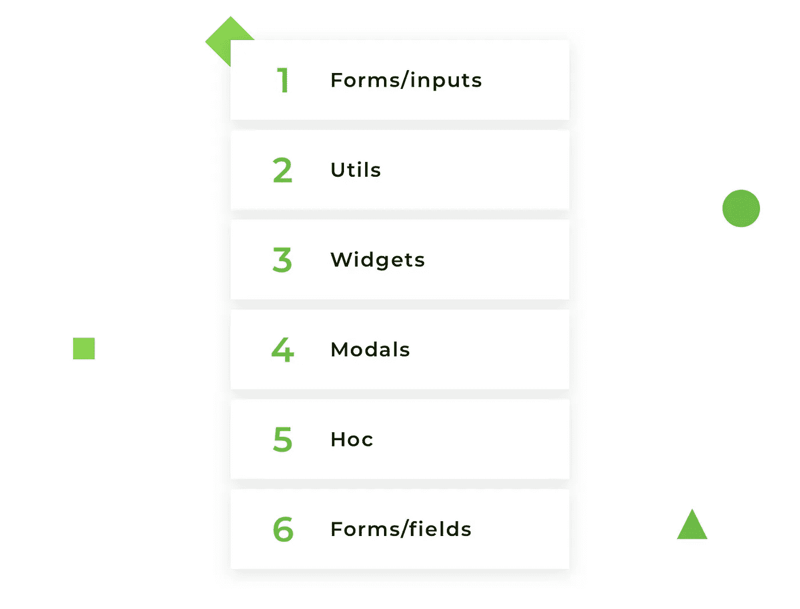
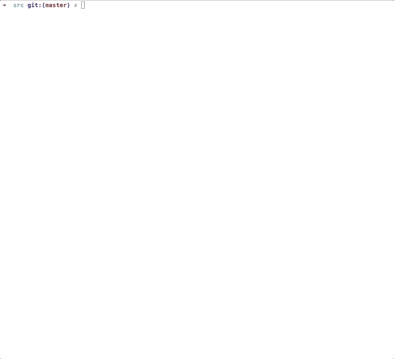
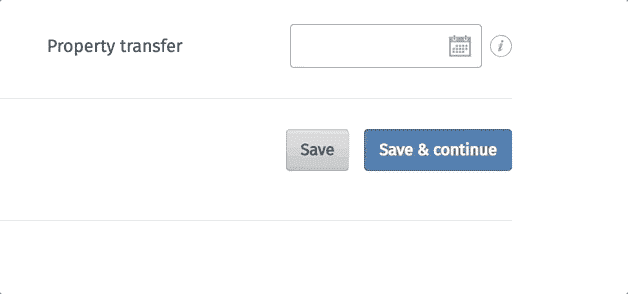
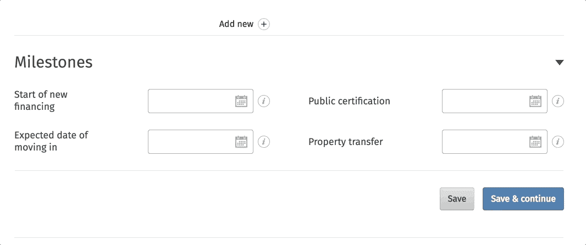

# React 中的组件测试:用 Jest 和 Enzyme 测试什么以及如何测试。

> 原文：<https://medium.com/swlh/components-testing-in-react-what-and-how-to-test-with-jest-and-enzyme-7c1cace99de5>


> 这篇关于 [react 组件测试](https://djangostars.com/blog/what-and-how-to-test-with-enzyme-and-jest-full-instruction-on-react-component-testing/?utm_source=medium&utm_medium=freecodecamp.org&utm_campaign=components%20testing&utm_content=react%20components%20testing)的文章是由 Django Stars 的前端工程师 Alona Pysarenko 撰写的。

> [在 Django Stars 博客](https://djangostars.com/blog/what-and-how-to-test-with-enzyme-and-jest-full-instruction-on-react-component-testing/?utm_source=medium&utm_medium=freecodecamp.org&utm_campaign=components%20testing&utm_content=read%20more%20on%20ds%20blog)上阅读原文。

测试 React 组件对于初学者以及已经从事过测试的[经验丰富的开发人员](https://djangostars.com/services/web-development/?utm_source=medium&utm_medium=freecodecamp.org&utm_campaign=components%20testing&utm_content=experienced%20developers)来说可能是一个挑战。将您自己的方法与我们在项目中使用的方法进行比较可能会很有趣。为了覆盖代码库，您必须知道哪些组件必须被测试，以及组件中的哪些代码应该被覆盖。

在本文中，我将讨论以下主题:

*   根据项目结构定义组件测试的正确顺序
*   找出测试覆盖中要省略的内容(不要测试的内容)
*   确定快照测试的必要性
*   定义组件中要测试的内容以及测试顺序
*   提供详细的自定义代码示例

这篇文章要求你有关于 Jest 和酶设置的知识。关于安装和配置的信息可以很容易地在他们的官方网站上找到。

假设以下情况:您需要用测试覆盖项目代码库。你应该从什么开始，在测试的最后你应该得到什么？100%的测试覆盖率？这是你应该向往的基准，但在大多数情况下你不会得到它。

为什么？因为你不应该测试所有的代码。我们将找出为什么以及什么应该被排除在测试之外。更重要的是，100%的测试覆盖率并不总是确保组件被完全测试。也不能保证它会通知你是否有什么改变。不要追求百分比，避免编写虚假的测试，尽量不要丢失主要的组件细节。

# 根据项目结构定义组件测试的正确顺序

让我们在项目结构的下一部分讨论这个问题:


我选择了`shared`目录，因为它是最重要的。它由项目的几个不同页面中使用的组件组成。它们是可重用的，通常很小，也不复杂。如果一个或另一个组件出现故障，将会导致其他地方出现故障。这就是为什么我们应该确信它们是否写得正确。该目录的结构分为几个文件夹，每个文件夹包含组件。



如何在`shared`目录中定义组件测试的正确顺序:

*   永远遵循从简单到复杂的原则。分析每个目录并定义哪些组件是`independent`——也就是说，它们的呈现不依赖于其他组件。它们是独立完成的，可以作为一个单元单独使用。从上面的结构来看，是`forms`文件夹中的`inputs`目录。它包含 redux-forms 的输入组件，如 TextInput、SelectInput、CheckboxInput、DateInput 等。
*   接下来，我们需要定义`inputs`组件中经常使用的辅助组件，但应该与它们分开测试。这是`utils`目录。这个文件夹中的组件并不复杂，但是非常重要。它们通常是可重用的，有助于重复操作。
*   下一步是定义哪些组件也可以独立使用。如果有的话，带他们去化验。从我们的结构来看，它是`widgets`，具有简单功能的小组件。它们将是测试覆盖队列中的第三个项目。
*   此外，分析其余的目录并定义更复杂的组件，这些组件可以单独使用，也可以与其他组件结合使用。在我们的例子中，它是`modals`目录。这些组件将在下面详细解释。
*   最复杂的组件被留到了最后。它们是`forms`文件夹中的`hoc`目录和`fields`。你怎么定义应该先测试哪一个？我从目录中取出已经在测试组件中使用的组件。因此，`hoc`目录中的组件出现在`widgets`组件中。这就是为什么我已经知道这个目录及其组件在哪里使用以及用于什么目的。
*   最后一个是`fields`文件夹。它包含与 redux-forms 连接的组件。

最终的组件顺序(基于我们的示例)如下所示:



按照这个顺序，您一步一步地增加被测试组件的复杂性。因此，当操作更复杂的组件时，您已经知道最小的组件是如何工作的。

例如，如果您不确定如何测试“文本”字段，请不要将“数组”字段作为测试对象。如果没有测试过“表单”字段本身，就不要使用用 redux-form 修饰的组件。

选择要一致，不要拿第一个想到的组件，切换逻辑。当然，项目的结构可以不同。它可以有其他目录名，也可以有附加的组件、动作和缩减器，但是定义组件测试顺序的逻辑是相同的。

[](https://djangostars.com/services/web-development/?utm_source=medium&utm_medium=freecodecamp.org&utm_campaign=components%20testing&utm_content=frontend_banner)

**让我们定义一下在测试覆盖中应该省略什么:**

*   **第三方库**。不要测试来自另一个库的功能。你不用对代码负责。如果你需要它来测试你的代码，跳过它或者模仿实现。
*   **常量**。名字本身就说明了一切。它们是不可改变的。它们是静态代码集，不打算改变。
*   **内联样式**(如果你在你的组件中使用它们的话)。为了测试内联样式，您需要在测试中复制带有样式的对象。如果对象样式改变，您也必须在测试中改变它们。不要在测试中重复一个组件的代码。你永远不会记得在测试中改变它。此外，你的同事永远不会意识到有重复。在大多数情况下，内联样式不会改变组件的行为，所以不应该测试它们。如果你的风格是动态变化的，可能会有一个例外。
*   **与被测部件无关的事情**。跳过测试组件中导入的测试组件。小心它是否被另一个包裹着。不测试包装器，分别分析测试就好。

那么，实际上如何编写测试呢？我结合了两种测试方法:

*   快照测试
*   组件逻辑测试

我现在将讨论这两个问题。

# 如何使用快照进行测试

如果你想确定用户界面没有改变，快照测试是一个有用的测试工具。第一次面对这个测试工具时，您可能会有关于组织和管理快照的问题。原理很简单，可惜哪里都没有完整描述过。

**第一步。**为组件编写测试，并在 expect 块中使用创建`Snapshot`本身的`.toMatchSnapshot()`方法:

```
it('render correctly text component', () => {  
    const TextInputComponent = renderer.create(<TextInput />).toJSON();
    expect(TextInputComponent).toMatchSnapshot();
});
```

**第二步。**当您第一次在一个级别上运行测试时，将会创建一个名为`__snapshots__`的目录，其中包含自动生成的文件，扩展名为`.snap`。

快照如下所示:

```
// Jest Snapshot v1, [https://goo.gl/fbAQLP](https://goo.gl/fbAQLP)exports[`Render TextInput correctly component 1`] = `  
<input  
  className="input-custom"
  disabled={undefined}
  id={undefined}
  name={undefined}
  onBlur={undefined}
  onChange={[Function]}
  pattern={undefined}
  placeholder={undefined}
  readOnly={false}
  required={undefined}
  type="text"
  value={undefined}
/>
`;
```

**第三步。**将快照放入存储库中，并与测试一起存储。

如果组件已经更改，您只需使用`—updateSnapshot`标志或使用简写形式的`u`标志来更新快照。

# 因此，创建了快照—它是如何工作的？

让我们考虑两种情况:

## 1.组件已更改

*   运行测试
*   新的快照被创建，它与存储在`__snapshots__`目录中的自动生成的快照进行比较
*   测试失败，因为快照不同



## 2.组件没有改变

*   运行测试
*   创建新的快照，并与存储在`__snapshots__`目录中的自动生成的快照进行比较
*   测试通过，因为快照相同


当我们测试一个没有逻辑(只有 UI 渲染)的小组件时，一切都很好。但是实践表明，在真实的项目中没有这样的组件。如果有，也是少数。

**是否有足够的快照用于全面的组件测试？**

# 组件测试的主要说明

## **1。一个组件应该只有一个快照。**

如果一个快照失败，其他快照很可能也会失败。不要创建和存储一堆不必要的快照，它们会堵塞空间，让那些在你之后阅读你的测试的开发人员感到困惑。

当然，当您需要在两种状态下测试组件的行为时，也有例外:例如，在打开弹出窗口之前和打开之后的组件状态中。

然而，即使是这样的变体也总是可以被这个替换:第一个测试存储组件的默认状态，在快照中没有弹出窗口，第二个测试模拟事件并检查特定类的存在。通过这种方式，您可以轻松地绕过创建多个快照。

## **2。测试道具**

通常，我将道具的测试分为两个测试:

*   首先，检查默认属性值的渲染。当组件被渲染时，我期望一个值等于`defaultProps`，以防这个道具有`defaultProps`。
*   其次，检查道具的自定义值。我设置了自己的值，并期望在组件呈现后收到它。

## **3。测试数据类型**

为了测试道具中出现了什么类型的数据，或者在某些动作之后获得了什么类型的数据，我们可以使用特殊的库 jest-extended(附加 jest 匹配器)，它有一个 Jest 中没有的扩展匹配集。有了这个库，测试数据类型变得更加容易和有趣。

另一方面，测试 proptypes 是一个矛盾的问题。一些开发人员可能会反对 proptypes 测试，因为它是第三方包，不应该进行测试。尽管如此，我坚持测试组件的 proptypes，因为我不测试包功能本身。相反，我只是确保属性类型是正确的。数据类型是非常重要的编程部分，不应该被忽略。

## **4。事件测试**

创建快照并用测试覆盖 props 之后，您可以确保组件将正确呈现。但是如果组件中有事件，这还不足以覆盖全部。

您可以用几种方法检查事件。最广泛使用的是:

*   模拟事件= >模拟它= >调用了预期事件
*   模拟事件= >用参数模拟事件= >用传递的参数调用预期事件
*   传递必要的属性= >渲染组件= >模拟事件= >在被调用的事件上预期某种行为

## **5。测试条件**

通常情况下，您可以为特定类的输出设置条件，呈现代码的某一部分，转移所需的道具，等等。不要忘记这一点，因为使用默认值，只有一个分支将通过测试，而第二个分支将保持未测试。

在具有计算和大量条件的复杂组件中，您可能会错过一些分支。为了确保代码的所有部分都被测试覆盖，可以使用测试覆盖工具，直观地检查哪些分支被覆盖，哪些没有被覆盖。

## **6。测试**状态

为了检查状态，在大多数情况下，有必要编写两个测试:

*   第一个检查当前状态。
*   第二个在调用事件后检查状态。Render component = >在测试中直接调用函数= >检查状态是如何改变的。要调用组件的函数，您需要获得组件的一个实例，然后调用它的方法(示例在下一个测试中显示)。

在您完成这个说明列表后，您的组件将被覆盖 90%到 100%。我将 10%留给文章中没有描述、但代码中可能出现的特殊情况。

# 测试示例

让我们转到例子，用测试覆盖组件，就像我们在上面一步一步描述的那样。

## 1.从表单/输入测试组件。

从表单/输入目录中取出一个组件。假设它是 datepicker 字段的组件 DateInput.js。

**被测组件代码清单:**[**date input . js**](https://github.com/ned-alyona/testing-jest-enzyme/blob/master/shared/forms/inputs/DateInput.js) **如下:**



DateInput 组件使用 react-datepicker 库，有两个实用程序:

*   valueToDate(将值转换为日期)
*   dateToValue(将日期转换为值)

这个包是用来处理数据的，而 PropTypes 是用来检查 React 属性的。

根据组件代码，我们可以看到帮助组件渲染的默认属性列表:

```
const defaultProps = {  
    inputClassName: 'input-custom',
    monthsShown: 1,
    dateFormat: 'DD.MM.YYYY',
    showMonthYearsDropdowns: false,
    minDate: moment()
};
```

所有的道具都适合创建快照，除了一个:`minDate: moment()`。moment()将在我们每次运行测试时给出当前日期，而快照将会失败，因为它存储了过期的日期。解决方案是模仿这个值:

```
const defaultProps = {  
    minDate: moment(0)
}
```

我们需要在每个渲染组件中使用 minDate prop。为了避免道具重复，我创建了 HOC，它接收 defaultProps 并返回一个漂亮的组件:

```
import TestDateInput from '../DateInput';  
const DateInput = (props) =>  
    <TestDateInput
        {...defaultProps}
        {...props}
    />;
```

不要忘记`moment-timezone`，尤其是如果您的测试将由来自不同时区的另一个国家的开发人员运行。他们将收到模拟值，但会有时区转换。解决方法是设置一个默认时区:

```
const moment = require.requireActual('moment-timezone').tz.setDefault('America/Los_Angeles')
```

现在，日期输入组件已经准备好进行测试了:

**1。首先创建快照:**

```
it('render correctly date component', () => {  
    const DateInputComponent = renderer.create(<DateInput />).toJSON();
    expect(DateInputComponent).toMatchSnapshot();
});
```

**2。测试道具:**

浏览道具，找到重要的。要测试的第一个道具是 showMonthYearsDropdowns。如果设置为 true，则显示月份和年份的下拉列表:

```
it('check month and years dropdowns displayed', () => {  
    const props = {
            showMonthYearsDropdowns: true
        },
        DateInputComponent = mount(<DateInput {...props} />).find('.datepicker');
    expect(DateInputComponent.hasClass('react-datepicker-hide-month')).toEqual(true);
});
```

测试空属性值。需要进行此检查，以确保组件在没有定义值的情况下呈现:

```
it('render date input correctly with null value', () => {  
    const props = {
            value: null
        },
        DateInputComponent = mount(<DateInput {...props} />);
    expect((DateInputComponent).prop('value')).toEqual(null);
});
```

**3。值的测试属性类型，日期应为字符串:**

```
it('check the type of value', () => {  
    const props = {
            value: '10.03.2018'
        },
        DateInputComponent = mount(<DateInput {...props} />);
    expect(DateInputComponent.prop('value')).toBeString();
});
```

**4。测试事件:**

首先，检查 onChange 事件。

*   模拟 onChange 回调
*   呈现日期输入组件
*   用新的目标值模拟变更事件
*   最后检查 onChange 事件是否已用新值调用。

```
it('check the onChange callback', () => {  
    const onChange = jest.fn(),
        props = {
            value: '20.01.2018',
            onChange
        },
        DateInputComponent = mount(<DateInput {...props} />).find('input');
    DateInputComponent.simulate('change', { target: {value: moment('2018-01-22')} });
    expect(onChange).toHaveBeenCalledWith('22.01.2018');
});
```

接下来，确保 datepicker 弹出窗口在单击日期输入后打开。为此，find date input = > simulate click event = >并期望当类`.react-datepicker`出现时弹出。

```
it('check DatePicker popup open', () => {  
    const DateComponent = mount(<DateInput />),
        dateInput = DateComponent.find("input[type='text']");
    dateInput.simulate('click');
    expect(DateComponent.find('.react-datepicker')).toHaveLength(1);
});
```

**全面测试清单:** [DateInput.test.js](https://github.com/ned-alyona/testing-jest-enzyme/blob/master/shared/forms/inputs/__tests__/DateInput.test.js)

## 2.效用测试:

**测试实用程序的代码列表:** [valueToDate.js](https://github.com/ned-alyona/testing-jest-enzyme/blob/master/shared/utils/valueToDate.js)

该实用程序的目的是将一个值转换为具有自定义格式的日期。

首先，让我们分析给定的实用程序，并定义测试的主要情况:

1.  根据这个实用程序的目的，它转换值，所以我们需要检查这个值:

*   如果没有定义值:我们需要确保实用程序不会返回异常(错误)。
*   如果定义了值:我们需要检查实用程序是否返回了当前日期。

2.返回值应该属于 moment 类。这就是为什么它应该是一个瞬间的例子。

3.第二个参数是 dateFormat。测试前将其设置为常量。这就是为什么它会在每个测试中传递，并根据日期格式返回值。我们应该单独测试日期格式吗？我想不会。这个参数是可选的——如果我们不设置 dateFormat，这个实用程序不会中断，它只会以默认格式返回日期。这是一个临时的工作，我们不应该测试第三方库。正如我之前提到的，我们不应该忘记时间时区；这是非常重要的一点，尤其是对于来自不同时区的开发者来说。

**咱们来码:**

1.  **为第一个案例编写测试。当我们没有价值的时候，它就是空的。**

```
const format = 'DD.MM.YYYY';it('render valueToDate utility with empty value', () => {  
    const value = valueToDate('', format);
    expect(value).toEqual(null);
});
```

**2。检查值是否已定义。**

```
const date = '21.11.2015',  
      format = ‘DD.MM.YYYY’;it('render valueToDate utility with defined value', () => {  
    const value = valueToDate(date, format);
    expect(value).toEqual(moment(date, format));
});
```

**3。检查该值是否属于力矩类。**

```
const date = '21.11.2015',  
    format = 'DD.MM.YYYY';it('check value is instanceof moment', () => {  
    const value = valueToDate(date, format);
    expect(value instanceof moment).toBeTruthy();
});
```

**完整测试列表:**[valuetodate . test . js](https://github.com/ned-alyona/testing-jest-enzyme/blob/master/shared/utils/__tests__/valueToDate.test.js)

## 3.小部件测试

对于小部件测试，我使用了一个旋转器组件。

**被测小工具代码清单:** [Spinner.js](https://github.com/ned-alyona/testing-jest-enzyme/blob/master/shared/widgets/Spinner.js)

看起来像这样:


解释中不需要 spinner，因为几乎所有的 web 资源都有这个组件。

所以如果我们去写测试:

1.  **第一步—创建快照:**

```
it('render correctly Spinner component', () => {  
   const SpinnerComponent = mount(<Spinner />);
   expect(SpinnerComponent).toMatchSnapshot();
});
```

**2。测试道具:**

首先，我们查看默认道具标题，并检查它是否正确渲染。

```
it('check prop title by default', () => {  
 const SpinnerComponent = mount(<Spinner />);
    expect(SpinnerComponent.find('p').text()).toEqual('Please wait');
});
```

然后我们检查自定义道具标题。我们需要检查它是否返回了正确定义的属性。看一下代码，标题是用 rawMarkup util 包装的，借助 dangerouslySetInnerHTML 属性输出。

rawMarkup util 的代码列表:

```
export default function rawMarkup(template) {  
    return {__html: template};
}
```

我们需要在 spinner 组件中包含 rawMarkup 的测试吗？不，它是一个独立的工具，应该与旋转器分开测试。我们不关心它是如何工作的——我们只需要知道 title prop 返回正确的结果。

澄清:使用 dangerouslySetInnerHTML 属性的原因如下。我们的网站是多语言的，由翻译营销团队负责。他们可以简单地用单词组合来翻译，甚至用 HTML 标签来装饰，比如`<strong>`、`<i>`、`<s>`，甚至用列表`<ol>`、`<ul>`来分割文本。我们不确定他们是如何翻译和修饰文本的。我们只需要正确地渲染这些东西。

我在一个测试中结合了两个主要的测试用例:

*   返回正确的自定义道具标题
*   使用 HTML 标签正确呈现属性标题

```
it('check prop title with html tags', () => {  
    const props = {
            title: '<b>Please wait</b>'
        },
        SpinnerComponent = mount(<Spinner {...props} />);
    expect(SpinnerComponent.find('p').text()).toEqual('Please wait');
});
```

取下一个道具字幕。它是可选的，这就是为什么它没有默认道具，所以跳过默认道具这一步，测试自定义道具:

*   检查字幕中文本是否正确呈现:

```
const props = {  
        subTitle: 'left 1 minute'
    },
    SpinnerComponent = mount(<Spinner {...props} />);it('render correct text', () => {  
    expect(SpinnerComponent.find('p').at(1).text()).toEqual(props.subTitle);
});
```

我们知道字幕是可选的。这就是为什么我们需要根据切片标记检查它是否是用默认道具渲染的。只需检查标签数量`<p>`:

```
it('check subTitle is not rendered', () => {  
  const SpinnerComponent = mount(<Spinner />);
    expect(SpinnerComponent.find('p').length).toEqual(1);
});
```

**3。测试道具类型:**

*   对于预期为字符串的标题属性:

```
it('check prop type for title is string', () => {  
    const props = {
            title: 'Wait'
        },
        SpinnerComponent = mount(<Spinner {...props} />);
    expect(SpinnerComponent.find('p').text()).toBeString();
});
```

*   对于字幕属性也应该是字符串:

```
const props = {  
        subTitle: 'left 1 minute'
    },
    SpinnerComponent = mount(<Spinner {...props} />);it('type for subTitle is string', () => {  
    expect(SpinnerComponent.find('p').at(1).text()).toBeString();
});
```

**完整测试列表:** [Spinner.test.js](https://github.com/ned-alyona/testing-jest-enzyme/blob/master/shared/widgets/__tests__/Spinner.test.js)

## 4.模态测试(ModalWrapper.js 和 ModalTrigger.js)

**看起来像:**



**如何测试模态**

首先，我想解释一下在我们的项目中情态动词是如何组织的。我们有两个组件: **ModalWrapper.js** 和 **ModalTrigger.js** 。

ModalWrapper 负责弹出布局。它包含模式容器、按钮“关闭”、模式标题和主体。

**模态触发器**负责模态处理。它包括 ModalWrapper 布局，并包含 modal 布局控件的事件(打开和关闭操作)。

我将分别介绍每个组件:

**1。被测组件代码列表:** [ModalWrapper.js](https://github.com/ned-alyona/testing-jest-enzyme/blob/master/shared/modals/ModalWrapper.js)

**咱们码:**

首先，ModalWrapper 接收组件并在内部呈现它。首先，检查 ModalWrapper 在没有组件的情况下不会失败。使用默认属性创建快照:

```
it('without component', () => {  
    const ModalWrapperComponent = shallow(<ModalWrapper />);
    expect(ModalWrapperComponent).toMatchSnapshot();
});
```

下一步是用通过 props 的组件渲染来模拟它的实际情况:

```
it('with component', () => {  
   const props = {
           component: () => {}
        },
        ModalWrapperComponent = shallow(<ModalWrapper {...props} />);
    expect(ModalWrapperComponent).toMatchSnapshot();
});
```

**测试道具**

正在接收自定义类名属性:

```
it('render correct class name', () => {  
    const props = {
            modalClassName: 'custom-class-name'
        },
        ModalWrapperComponent = shallow(<ModalWrapper {...props} />).find('Modal');
        expect(ModalWrapperComponent.hasClass('custom-class-name')).toEqual(true);
});
```

接收自定义标题属性:

```
it('render correct title', () => {  
    const props = {
           title: 'Modal Title'
       },
       ModalWrapperComponent = shallow(<ModalWrapper {...props} />).find('ModalTitle');
    expect(ModalWrapperComponent.props().children).toEqual('Modal Title');
});
```

接收正确的演出道具:

```
it('check prop value', () => {
        const props = {
               show: true
           },
           ModalWrapperComponent = shallow(<ModalWrapper {...props} />).find('Modal');
        expect(ModalWrapperComponent.props().show).toEqual(true);
    });
```

**测试 prop 类型**

*   为了表演道具

```
it('check prop type', () => {  
    const props = {
           show: true
        },
        ModalWrapperComponent = shallow(<ModalWrapper {...props} />).find('Modal');
    expect(ModalWrapperComponent.props().show).toBeBoolean();
});
```

*   对于舷侧支柱

```
it('render correct onHide prop type', () => {  
    const props = {
            onHide: () => {}
        },
        ModalWrapperComponent = shallow(<ModalWrapper {...props} />).find('Modal');
    expect(ModalWrapperComponent.props().onHide).toBeFunction();
});
```

*   对于部件本身

```
it(‘render correct component prop type’, () => {  
   const props = {
           component: () => {}
       },
       ModalWrapperComponent = mount(<ModalWrapper {...props} />);
   expect(ModalWrapperComponent.props().component).toBeFunction();
});
```

**完整测试列表:**[modal wrapper . test . js](https://github.com/ned-alyona/testing-jest-enzyme/blob/master/shared/modals/__tests__/ModalWrapper.test.js)

**2。被测组件代码列表:** [ModalTrigger.js](https://github.com/ned-alyona/testing-jest-enzyme/blob/master/shared/modals/ModalTrigger.js)

模态包装已经包含了一个测试。第二部分将介绍模态触发器组件。

组件概述:它基于表明 ModalWrapper 可见性的状态`toggled`。如果`toggled: false`，弹出窗口隐藏，否则可见。函数 **open()** 打开子元素上的弹出窗口。click 事件和函数 **close()** 隐藏在 ModalWrapper 中呈现的按钮上的弹出窗口。

快照创建:

```
it('render ModalTrigger component correctly', () => {  
    const ModalTriggerComponent = shallow(<ModalTrigger><div /></ModalTrigger>);
    expect(ModalTriggerComponent).toMatchSnapshot();
});
```

应该用组件道具渲染测试 ModalTrigger 吗？否—因为`component`将在 ModalWrapper 组件中呈现。它不依赖于被测试的组件。它已经包含在 ModalWrapper 测试中了。

测试道具:

我们有一个道具`children`，我们希望确保我们只有一个孩子。

```
it('ensure to have only one child (control element)', () => {  
    expect(ModalTriggerComponent.findWhere(node => node.key() === 'modal-control').length).toEqual(1);
});
```

测试属性类型:

子道具应该是一个对象，所以在下一个测试中检查它:

```
const ModalTriggerComponent = mount(<ModalTrigger><div /></ModalTrigger>);it('check children prop type', () => {  
      expect(ModalTriggerComponent.props().children).toBeObject();
});
```

ModalTrigger 组件的一个重要部分是检查状态。

我们有两种状态:

*   弹出窗口打开。要知道模态是打开的，我们需要检查它的状态。为此，从组件的实例中调用 open 函数，并期望状态中的`toggled`应该为真。

```
it('check the modal is opened', () => {  
    const event = {
        preventDefault: () => {},
        stopPropagation: () => {}
    };
    ModalTriggerComponent.instance().open(event);
    expect(ModalTriggerComponent.state().toggled).toBeTruthy();
});
```

*   弹出窗口已关闭。反之亦然，`toggled`处于应假状态。

```
it('check the modal is closed', () => {  
   ModalTriggerComponent.instance().close();
   expect(ModalTriggerComponent.state().toggled).toBeFalsy();
});
```

**完整测试列表:**[modal trigger . test . js](https://github.com/ned-alyona/testing-jest-enzyme/blob/master/shared/modals/__tests__/ModalTrigger.test.js)

现在模态已经完全测试过了。测试相互依赖的组件的一个建议是:首先检查组件并编写测试计划，定义每个组件中需要测试的内容，检查每个组件的测试用例，并确保不要在两个组件中重复相同的测试用例。仔细分析测试覆盖的可能的和最佳的变体。

## 5.特设测试(高阶组件)

最后两个部分(HOCs 和表单域测试)是相互关联的。我想与你分享如何测试现场布局与它的特设。

下面是对什么是 BaseFieldLayout、我们为什么需要这个组件以及我们在哪里使用它的解释:

*   js 是表单输入组件的包装器，如 TextInput、CheckboxInput、DateInput、SelectInput 等。它们的名字以`-Input`结尾，因为我们使用 redux-form 包，这些组件是 redux-form 逻辑的输入组件。
*   我们需要 BaseFieldLayout 来创建表单字段组件的布局，即呈现标签、工具提示、前缀(货币、平方米缩写等。)，图标，错误等等。
*   我们在 BaseFieldHOC.js 中使用它来包装字段布局中的 input 组件，并借助于`<Field/>`组件将其与 redux-form 连接起来。

**被测组件代码列表:** [BaseFieldHOC.js](https://github.com/ned-alyona/testing-jest-enzyme/blob/master/shared/hoc/BaseFieldHOC.js)

它是一个接收表单输入组件并返回组件的特设组件，与 redux-form 连接。

分析特设:

*   这个组件只接收一个道具，`component`。首先，我需要创建这个组件，并将其包装在 BaseFieldHOC 中。
*   接下来，我需要用 redux-form 修饰包装后的 HOC，以便用 redux-form 连接字段。
*   在 React Redux `<Provider>`组件中呈现这个字段，使测试组件可以使用这个存储。要嘲笑商店，只需:

```
const store = createStore(() => ({}));
```

现在，在每次测试之前，我需要做以下事情:

```
let BaseFieldHOCComponent;beforeEach(() => {  
    const TextInput = () => { return 'text input'; },
        BaseFieldHOCWrapper = BaseFieldHOC(TextInput),
        TextField = reduxForm({ form: 'testForm' })(BaseFieldHOCWrapper);
    BaseFieldHOCComponent = renderer.create(
        <Provider store={store}>
            <TextField name="text-input" />
        </Provider>
    ).toJSON();
});
```

之后，组件就可以进行测试了:

1.  创建快照:

```
it('render correctly component', () => {  
    expect(BaseFieldHOCComponent).toMatchSnapshot();
});
```

2.确保呈现后输入组件被包装在 BaseFieldLayout 中:

```
it('check input component is wrapped in BaseFieldLayout', () => {  
    expect(BaseFieldHOCComponent.props.className).toEqual('form-group');
});
```

仅此而已，特设已涵盖。测试与 redux-form 连接的组件最复杂的部分是准备字段(用 redux form 装饰并设置存储)。剩下的就简单了，只要按照说明做就行了，别无其他。

**完整测试列表:**[basefieldhoc . test . js](https://github.com/ned-alyona/testing-jest-enzyme/blob/master/shared/hoc/__tests__/BaseFieldHOC.test.js)

## 6.表单/字段测试

测试覆盖了域 HOC，因此我们可以移动到 BaseFieldLayout 组件。

**被测组件代码列表:**[basefieldlayout . js](https://github.com/ned-alyona/testing-jest-enzyme/blob/master/shared/forms/fields/BaseFieldLayout.js)

让我们编写 BaseFieldLayout.js 代码，并根据上面的说明编写测试:

1.  **首先，创建快照。**

如果没有 defaultProps，将不会呈现此组件:

*   输入组件
*   redux-form 提供的道具:输入和元对象。属性名称为的输入和属性错误的元已被触及:

```
const defaultProps = {  
   meta: {
        touched: null,
        error: null
    },
    input: {
        name: 'field-name'
    },
    inputComponent: () => { return 'test case'; }
}
```

要在每个测试的包装器中使用 defaultProps，请执行以下操作:

```
import TestBaseFieldLayout from '../BaseFieldLayout';const BaseFieldLayout = (props) => <TestBaseFieldLayout {...defaultProps} {...props} />;
```

现在，我们准备创建快照:

```
it('render correctly BaseFieldLayout component', () => {  
    const BaseFieldLayoutComponent = renderer.create(<BaseFieldLayout />).toJSON();
    expect(BaseFieldLayoutComponent).toMatchSnapshot();
});
```

**2。测试道具:**

这个组件有很多道具。我将展示几个例子，其余的将通过类比进行测试。

*   确保`icon`道具被正确渲染

```
it('render correctly icon prop', () => {  
    const props = {
            icon: <span className="icon-exclamation" />
        },
        BaseFieldLayoutComponent = mount(<BaseFieldLayout {...props} />);
        expect(BaseFieldLayoutComponent.find('span').hasClass('icon-exclamation')).toBeTruthy();
});
```

*   确保工具提示内容呈现在标签旁边

```
const props = {  
        labelTooltipContent: 'tooltip for label'
    },
    BaseFieldLayoutComponent = mount(<BaseFieldLayout {...props} />);it('check prop is rendered', () => {  
   expect(BaseFieldLayoutComponent.find('span').hasClass('tooltip-icon')).toBeTruthy();
});
```

*   测试`fieldLink`道具
*   确保默认情况下 fieldLink 为空

```
it('check prop is null by default', () => {  
    const BaseFieldLayoutComponent = shallow(<BaseFieldLayout />);
    expect(BaseFieldLayoutComponent.props().fieldLink).toBe(null);
});
```

*   确保 fieldLink 使用自定义值正确呈现

**3。测试错误:**

```
it('check if field has error', () => {  
    const props = {
            meta: {
                touched: true,
                error: 'This field is required'
            }
        },
        BaseFieldLayoutComponent = mount(<BaseFieldLayout {...props} />);
    expect(BaseFieldLayoutComponent.find('.error')).toHaveLength(1);
});
```

**完整测试列表:**[basefieldlayout . test . js](https://github.com/ned-alyona/testing-jest-enzyme/blob/master/shared/forms/fields/__tests__/BaseFieldLayout.test.js)

# 结果

现在您知道了如何基于项目结构执行组件的全覆盖测试。根据我自己的经验，我试图解释什么是测试所必需的，以什么样的顺序，以及在测试覆盖中你可以省略什么。此外，我演示了几个测试组件的例子，并指出代码库覆盖的顺序。

我希望你会发现这篇文章很有用，并分享你的回答。感谢您的阅读。

[](https://djangostars.com/services/web-development/?utm_source=medium&utm_medium=freecodecamp.org&utm_campaign=components%20testing&utm_content=banner_end)

> 如果你觉得这篇文章有用，请点击👏下面的按钮:)