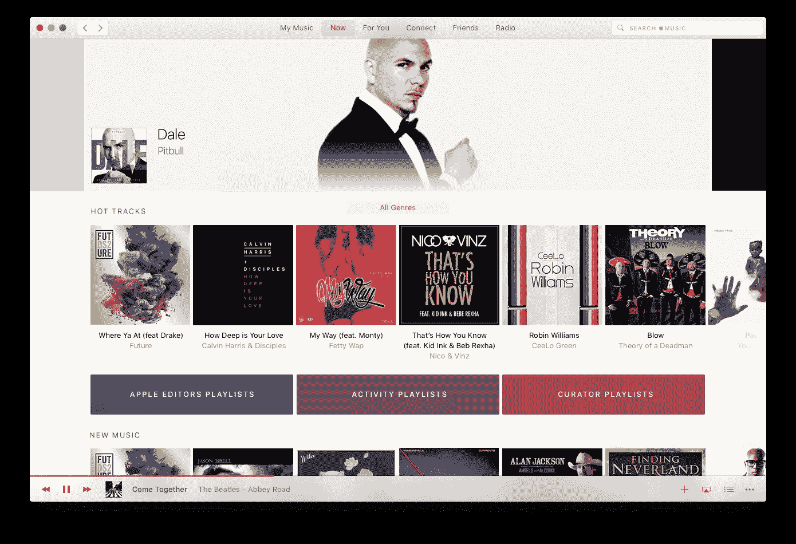
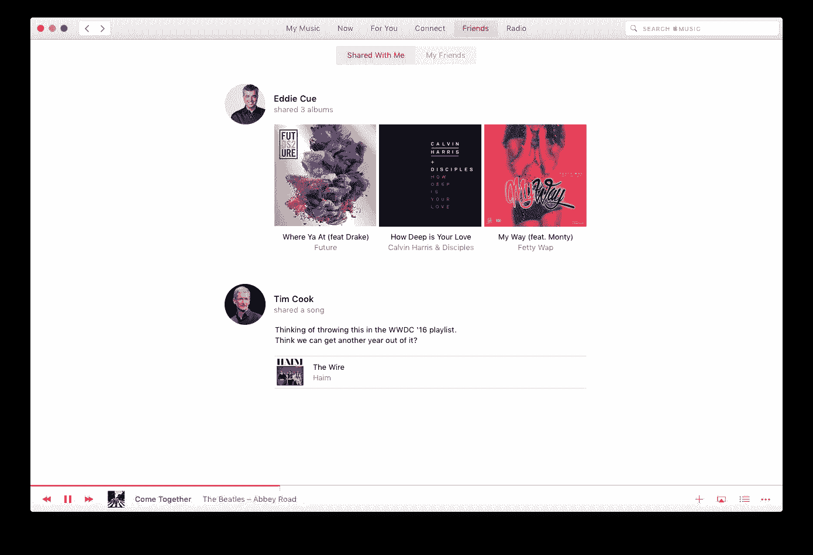
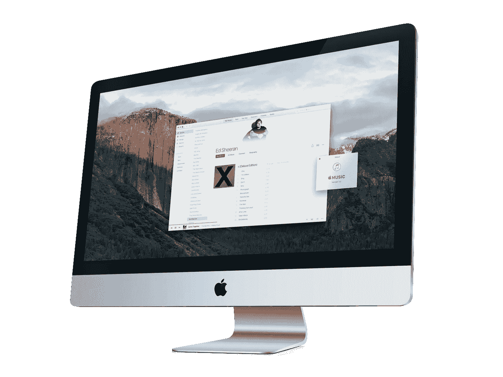

# 苹果音乐，拿着 iTunes

> 原文：<https://medium.com/swlh/concept-apple-music-hold-the-itunes-bfa321c9f6b6>

和许多人一样，我对苹果音乐寄予厚望。和许多人一样，我也是一名 Spotify 用户，希望获得更好的体验，并在如何设计流媒体音乐应用程序方面拥有成熟的 Apple-eque“最终决定权”。和许多人一样，我对苹果的最新服务只有失望。

**注:**本文原载于 2015 年 7 月 30 日 www.ajambrosino.com。在 [macOS 概念](/swlh/macos-it-s-time-to-take-the-next-step-ee7871ccd3c7)中包含了一个新版本(如上所示)。

这些严重的缺陷是有据可查的。从[消失的曲目](http://www.loopinsight.com/2015/07/22/apple-music-is-a-nightmare-and-im-done-with-it/)到[“地狱炖”基于 iTunes 的后端](http://fortune.com/2015/07/27/apples-toxic-hellstew/)到[用户体验的全面灾难](http://9to5mac.com/2015/07/28/opinion-itunes-nuke-from-orbit/)，苹果音乐令人失望。

让 Apple Music 如此非苹果的是在服务的许多方面完全无视用户体验。在 iOS 上，它更像是热带风暴，而不是 5 级飓风——该应用程序通常非常漂亮，布局合理，但仍比 Spotify 复杂。

第五层是 Mac(和 Windows)。来源很容易找到—**iTunes。为了让苹果音乐获胜，我们所知的 iTunes 必须消亡。任何经常使用 Mac 和 Apple Music 的人都吵着要一个独立的 Apple Music 应用程序，就像在 iOS 上一样，也像 OS X 上的照片一样。**

作为一名设计师，抱怨对我来说还不够。我很好奇，想看看我能把什么放在一起，所以我花了三四天的时间来构思一个概念。这是它所有非 iTunes 的荣耀(点击放大)。你可以在旁边随意打开 iTunes！欢迎任何性质的评论。

我们马上有了一个独立的应用程序。顶部有一个导航栏，底部有一个播放器。内容介于两者之间。和更有意义的网格(真的——去比较它们吧！)

使用聚类和一个源而不是两个源进行更平滑的搜索。为什么现在“我的音乐”搜索能产生聚类结果而“苹果音乐”搜索不能？

“我的音乐”的设计很有趣。苹果已经为 iTunes 的几个版本在侧边栏上进行了一场战争，甚至将播放列表分组在一个单独的部分。这产生了两个主要问题。首先，从歌曲视图、艺术家视图或播放列表切换的可发现性和简单性较差。其次，大多数用户不知道你可以把一首歌拖到播放列表中，因为播放列表面板只有在拖动开始时才会出现。在试图从视觉上简化用户界面的过程中，苹果只是让它变得更加复杂。

在这里，我做了一些改变。一个是左边的双层“侧边栏”,在交互和视觉上提供可发现性、速度和简单性。第二点——在这个屏幕上，我不仅仅局限于我自己的音乐。

我现在已经点击了一个不同的艺术家，主题现在是黑暗的。Apple Music 应用程序提供了一种身临其境的体验，让艺术家融入自己的风格。侧边栏文本会自动改变外观以与之匹配。

popover airplay 菜单允许我将音乐控制权交给手机(如 Spotify)并选择在哪里播放(如 iTunes)。

当我想要相册视图时，只需点击一下。侧边栏保留，内容被替换。一次点击，高度可发现，并且仍然在视觉上优雅。

“给你的”屏幕。这里的产品添加是使用日期、时间和我的习惯来提供我接下来想听的内容。

我一直想知道为什么分享不是 Apple Music 的一部分。在这个概念中，我的朋友可以与我分享，我也可以查看我朋友的公共播放列表。

正如 Nilay Patel 在 Verge livestream 上评论的那样，“实际上，我不确定是否有人有情感工具来驾驭一场不涉及海姆《火线》(The Wire)的苹果主题演讲。”

> 本文原载于 2015 年 7 月 30 日[www.ajambrosino.com](http://www.ajambrosino.com/new/2015/7/29/apple-music-hold-the-itunes)。在 [macOS 概念](http://ajambrosino.com/new/macOS)中包含了一个新版本。