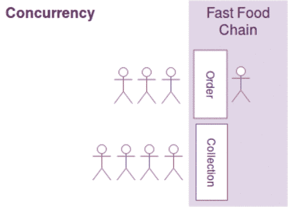

# Python 中的并发编程并不是您所想的那样

> 原文：<https://medium.com/swlh/concurrent-programming-in-python-is-not-what-you-think-it-is-1e624fdb6fd1>

在本文中，我将首先向您介绍并发编程和并行执行之间的区别，讨论 Python 内置的并发编程机制以及 Python 中多线程的缺陷。

并发编程不等同于并行执行，尽管这两个术语经常互换使用。

Illustration of concurrency without parallelism