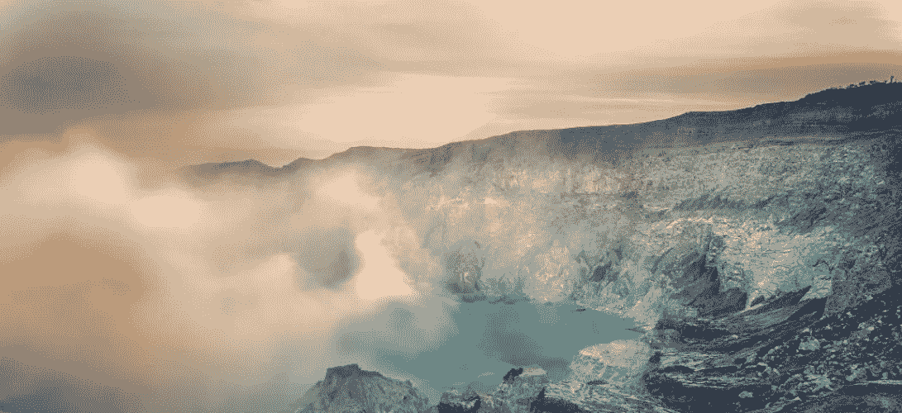
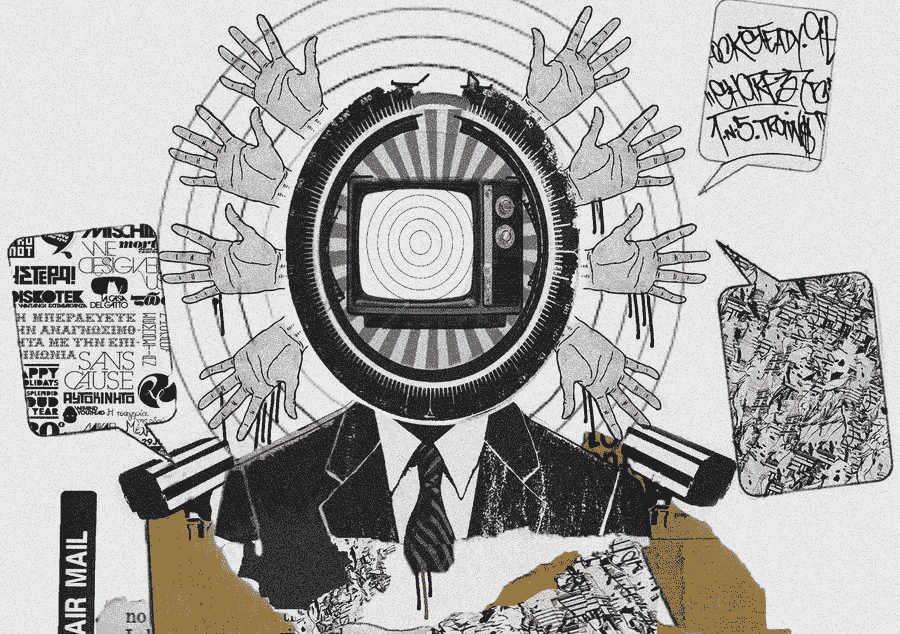

# 习惯于反应，而不是思考

> 原文：<https://medium.com/swlh/conditioned-to-react-not-to-think-28e60bf76856>

## 敏感的心态

我们的发帖习惯、不断滚动的提要、点击和点赞文化真的是由根深蒂固的欲望、自我强迫、自我形象和不安全感驱动的吗？也许吧。

或者我们仅仅是对软件、设备和社会行为的刺激进行了自我调节和生物反应？无意义、无意识地参与任务或行为，告诉自己最符合我们世界观的故事，告诉自己为什么要这么做？我们已经在从事机器学习，我们就是机器，我们完全没有意识到。

虽然我们喜欢这样想，但我们并不是因为这个帖子有趣或者里面有一只可爱的猫或婴儿而“喜欢”它，我们甚至没有看到它。我们只是通过重复来教会自己这么做和这么想。在某个阶段，我们内化了“这就是人们所做的，在这种情况下我应该如何看待、感受、行动和认同。”可能是从一个节目，电影，看其他一些，但关键是，现在它是反动的。

当我们对现在做出反应时，我们是在和过去的旧事物互动。它只是更容易，更有效，更舒适，我们不必质疑后果。我们甚至不用再考虑了。

我们不断地接纳、学习和适应自己，通过一生的个人和文化经历来行动，成为我们想成为的人，让自己成为我们想成为的人。

我们的行为、输入和对刺激的反应决定了我们如何思考、感知并最终接受我们生活的世界。我们喜欢认为我们有自由意志，一种中央控制的自我意识，灵魂或对我们意识的控制，然而它的存在对有史以来最优秀的头脑和科学来说仍然是虚幻的。

我们是简单的二元有机体，由算法构建，这些算法随着时间的推移通过细胞突变存活并进化，形成了我们今天的体验。有人类经验的生物。

只要我们积极投入到目前的心态中，我们就有能力去创造和塑造我们想要的任何东西。

不管那是什么？

# **原始想法**

> "当乌龟很酷，因为你可以赢得比赛."从长远来看，兔子是第二名，如果它们能完成比赛的话。

成功是旅程

你得到了什么——结果、奖励、成就——都不重要；重要的是你所拥有的，你一路走来所学到的，以及你所帮助的人。目标是废话，它们只是积累的经验。生活是一次旅行，结束给予的过程；时间，注意力和精力。剩下的就交给狗去争了。

实验者&讲述者

我们有两个自我，一个是体验的，一个是叙述的。理性的体验者是二元的，在决策中被计算，通过我们的感官受体判断我们周围环境的平均整体净效应。他们感受到了真正的痛苦，知道真正的影响，并且只有在我们处于安全边缘时才有最小的影响力。叙述者操纵着表演，没有任何持续时间或存在感。他们的判断是非理性的，根据高峰或终点经验来定步调，以产生和创造我们将告诉自己和他人的故事，以获得知道(错误地)为什么的安慰。

仅>最佳

“只有”比“最好”更好。不要争着证明自己是最好的或最聪明的，而是成为唯一一个这样思考、那样做、从那个角度看待或参与的人。把更多的东西带到桌面上，带到对话中，带到问题中，带到其他人的互动中。

自信地满足于你的生活

在你生活的任何时候，无论你在做什么，无论你在哪里工作，无论你把时间和精力花在谁身上，我们都应该坦然地说，“我可能会在接下来的 3-5 年里这样做。对此我非常高兴。”如果现在、明天或后天不是你，那么可能是时候重新评估了。这是你的生活，做你喜欢的事，寻找目标并帮助他人度过难关；带着自信和沉着去做，在可预见的未来你会幸福地投入其中。否则，做你想做的事情；现在就做。

## 这篇文章发表在《创业公司》杂志上，这是 Medium 最大的创业刊物，有 303，461 人关注。

## 订阅接收[我们的头条新闻](http://growthsupply.com/the-startup-newsletter/)。

