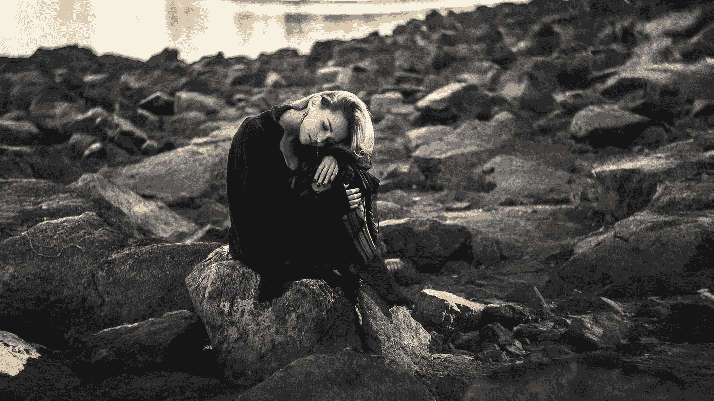

# 直面压力，不要压抑

> 原文：<https://medium.com/swlh/confront-stress-dont-suppress-227e42159d77>

压力偶尔会进入我的世界。

你可能会惊讶地发现，生活教练也会陷入压力陷阱。

这一切都始于经验的积累，加上我选择坚持的一些糟糕的想法。

压力，对于那些没有被它拜访过的幸运的人来说，是那片迁移到你的区域并接管的乌云，把它所经过的一切都变成混乱。

它变成了人体龙卷风。

在你头脑后台的想法占据了中心位置，突然之间，那些感觉可以控制的东西不再感觉得到了。

压力相信一切都是紧急情况，没有人在紧张时表现良好。

## 没有领袖，没有表演者，没有运动员，没有父母。

在这种状态下，我们只能获得很小一部分技能和智力。这是因为每一个其他的空间都充满了其他的情绪，如期望、沮丧和愤怒，这些情绪在这段时间里被鼓励重新出现。

而这只是冰山一角。

然后我们也为他人制造压力——我们对他们需要如何表现的期望。所以这种感觉被放大了一千倍，然后我们坐在这厚厚的乌云中几个小时，几天甚至几周。

知道这一点很重要；

## 你的个人压力源是什么？

是一个人，一个反复出现的情况还是你想避免的事情？

我们处理生活常常有一个循环，通常，事件遵循一个规则的模式，虽然这令人深感不适，但由于它的熟悉，它同样令人舒服。

你可以走出压力思维的循环，就像你走出呼啦圈一样。

## 杜桑·朱克奇在他的精彩著作《直线领导》中介绍了一个循环生活与直线生活的伟大例子；

> 人们在一个循环中旅行，通常是一个恶性循环，周而复始，重复相同的旧的不可行的行为，执行相同的行动，并希望在他们的个人和商业生活中有不同的结果。
> 
> 这种无休止的循环运动就是当头脑停留在过去时所做的，一遍又一遍地过着土拨鼠般的生活，试图改善表现，但改善是不需要的。
> 
> 我们需要的是打开这个圈子，把它理顺。从你现在所在的地方到你想去的地方会有一条新的分界线。

通常当我问某人为什么会感到压力时，他们会列出所有他们目前正在做的事情。忙碌并不总是等于压力。忙碌就是忙碌。

参与大量需要完成的任务本身不会带来压力感。

造成压力的是忙碌的头脑，而不一定是忙碌的生活。

我们可以对我们参与的所有任务进行堆积如山的思考，在这种混合中，我们包括对每个任务需要如何执行的判断。我认识一些家庭人口多、孩子多、工作多的女性，她们的压力比我的单身朋友要小，她们只是在“要做的事情”清单上多加了两项任务就感到有压力了。

## 我的一位伟大导师在讨论我们的想法时提出了一个有趣的问题。

“如果一个喝醉的人在路中间向你走来，试图与你交谈，你会停下来，听或者认真对待他们说的任何事情吗？”

我的回答是“当然不是”。

我的家乡直布罗陀的当地醉汉的形象浮现在脑海中。一想到这个男人油油的头发从一边走到另一边，一边分开，手里拿着一瓶啤酒，我就不寒而栗。无论如何都要避开他。

但是听他的？

号码

我看都没看他一眼就跑开了。

导师继续说道:

## “这正是你的想法，喝醉了”。

对我来说，这是一个很好的方式来了解我们如何认真对待我们的想法，重视它们，然后迷失在爱丽丝梦游仙境的世界中，在那里一会儿事情看起来很大，一会儿又变得很小。

我们被吸进了疯帽子和所有各种角色的混乱世界，这些角色在电影院看起来非常有趣，但当他们被吸进我们的世界时就不那么有趣了。

## 所有东西看起来都颠倒了。

思想的积累表现为“我应该”、“我必须”、“我必须”，随之而来的是巨大的压力。它有时会让你忙得团团转。

当然，不是所有的想法都是醉了。

但是你知道他们是谁，因为突然从感觉良好的一刻，你开始陷入漩涡。

当你拼命挣扎的时候，它会把你吸进去。

## 如果压力可以被直面而不是被压制会怎样？

不要觉得你需要给它看后门，而是和它在一起。

压力是你的身体告诉你你正在超负荷思考的方式。

同样，当我同时打开十个不同的应用程序时，我的 Mac book Air 拒绝工作。它无法工作，因为它被内容淹没，没有能力容纳它。我不能忽视或假装它没有发生，因为它显然工作得更慢。

已经到极限了。

## 我们有无限的潜力，但我们在头脑中容纳过量信息的能力有限。

我不是一个带着俗气微笑的禅宗大师，可以完美地摆出瑜伽姿势，对着天空吟唱。我也有自己的时刻，但我更擅长的是识别压力思维的阴云何时会降临，或者何时已经在我的脑海中扎根。

在这一点上，我知道我在和一个喝醉的头脑打交道(我滴酒不沾)，所以当它停留在这种状态时，我知道我会有一段时间感到有压力，但我从来不在这个地方做决定。

我已经学会不这么做了。

## 这个州已经做出了最坏的决定。

就像天空中厚厚的云层阻挡了阳光一样，我们的思维也是如此。

思考创造了我们的感觉，感觉创造了我们当下的体验。

每时每刻。

## 我们的经验是由我们思维的后台创造的。

我们知道这是真的，因为五个人可能会遭遇同样的悲剧。每个人都会有不同的体验，仅仅是因为他们会受到这种想法会给整个故事添加什么颜色或味道的支配。

你可以根据自己的想法创作一部好莱坞电影——可以是轰动一时的《飘》或《沉默的羔羊》。

你的选择。

只是永远不要在这个地方做出改变生活的重大决定。

说起来容易做起来难。

我只能分享我所做的，这不是去看心理学家或精神病学家，尽管在这种时候和我的私人教练交谈会很棒。

## 对我有帮助的是要么在其中导航直到它消失，要么我做一些更有趣的事情。

我开车去了一家老式的英国茶馆，在伦敦市中心开车 20 分钟就到了。这是你能得到的最真实的东西，小晶体管收音机播放的老式音乐，漂亮的印花桌布，中国陶器(不是星巴克的单调纸板杯)，最好的烤饼和茶，带着最温暖、最友好的微笑。

那里没有播放天空体育节目的大型平板电视，也没有人在打电话或使用笔记本电脑，因为那里没有互联网接入。

## 它平静地提醒我们，在我们沉迷于忙碌之前，生活是怎样的。

事实上，上次我觉得有必要开车去那里，我在到达后不久就拿起一支笔，在餐巾纸上写了这篇文章。我无意写作，我只是抽出一些时间。20 分钟前，我不可能写下我的名字，但当所有的思想有机转移时，这篇文章的文字就脱口而出了。

当我吃完最后一块烤饼时，世界看起来完全不同了。什么都没变，但我的内心世界变了，这是唯一重要的事情。

## 同样的情况经历不同。

当我到家时，我充满了活力，并准备好应对任何事情。有时候，我甚至不需要去任何地方让思想传递，但这样做更有趣。

如果你感到有压力，不妨享受一下旅程。

作为一名教练，我的日常健康是至关重要的，我努力保持清醒的头脑，以促进我的客户的过程。我总是注意回到一个清晰的精神状态，不管有多少次我被拉离这个状态。

忽视感觉或把它们推开是不可能的，同样我们也不能把云推开。我们必须等到大气中的条件发生变化，然后云将有机地移动以露出太阳，带来光明和清晰。我们不需要做什么。

一旦思维动了，我们就能看清楚，路径揭示了我们下一步需要做什么。这听起来很简单，在某种程度上，我们可能需要它有更多的复杂性，但压力是生活的温度计。这是你的身体让你知道你在你的思想的支配下，你需要的是像一件乐器一样对它进行微调。

你呢，你是如何应对压力的？

## 如果这篇文章引起了你的共鸣，看看我的新书[看看里面:停止寻求开始生活](https://www.amazon.co.uk/Look-Inside-Seeking-Start-Living/dp/1781332959)。

## 如果你想和米歇尔预约 30 分钟的免费战略会议，以获得如何应对你面临的最大挑战的见解，[点击此链接。](https://calendly.com/micheleattiascoaching/30-minute-diagnostic-call/03-05-2018)

 [## 首页|米歇尔·阿提亚斯生活蔻驰&演讲者

### 你非常热衷于帮助他人。也许达到你的目标或成为一个人需要的时间比你想象的要长…

www.micheleattiascoaching.com](http://www.micheleattiascoaching.com/) 

## 这篇文章发表在[《创业](https://medium.com/swlh)》上，这是 Medium 最大的创业刊物，拥有 299，352+人关注。

## 在这里订阅接收[我们的头条新闻](http://growthsupply.com/the-startup-newsletter/)。

