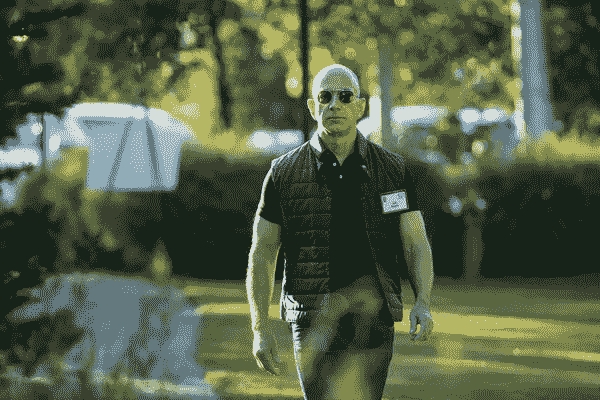

# 对工作的迷茫和“跳来跳去”？你必须读读这个

> 原文：<https://medium.com/swlh/confused-about-work-and-jumping-around-you-must-read-this-78a6e8452b1>

> 你用这一个策略成功的新默认习惯。

众所周知，亚马逊创始人杰夫·贝索斯通过对公司进行再投资，以牺牲利润为代价投资增长。

这在实践中意味着什么？

*   他做实验。
*   他尝试新事物。
*   他买东西。

事实上，他尝试了 19 年，将每一美元重新投资到公司，并在亏损的情况下运营——直到 2003 年他们实现了 19.5 亿美元的收入，他们才首次盈利——可能是因为他们是上市公司，并最终被股东强迫。

否则，他可能会继续更积极地对增长进行再投资。

## 这和你有什么关系？

如果你是一个众所周知的“跳来跳去”或“从一个演出跳到另一个演出”的人，不要再烦恼了。

选择认为自己是有成长意识的，而不是古怪的。

有成长意识，不矛盾。

改变你对“跳来跳去”或“蹦蹦跳跳”的看法，把它变成“有增长意识”——你选择的是增长和进化，而不是稳定的停滞。

做出决定了吗？好极了。

作为一个“跳跳者”和大规模实验者，不断保持饥饿和愚蠢(如史蒂夫·乔布斯所说)，我选择了增长和进化，而不是利润和停滞。

事实是，如果你感到满意和满足，不去突破界限，就很难成长和发展——从而不“投资”回“你”的业务。

很多时候，这意味着过早地不断升级，咬掉我们不能咀嚼的东西。

这就是稳健的人误解我们的地方:

我们大多数“跳来跳去”或“从一个演出跳到另一个演出”的人这样做是因为我们想要更多，去探索，变得更大，不断升级。我们很有竞争力，有很高的标准，想要赢。

这不是我们能控制的，这是必须要挠的痒处。

这是我们不能不做的事。

我们相信我们应得的，并且知道有一天我们会找到金子。

我们宁愿冒着失败的风险进行远射，也不愿走捷径。

人们对我们不屑一顾的原因是因为人们是普通人，而我们不是——普通人无法理解我们在追求什么——这就是为什么他们是普通人。

他们没有探索未知领域的企业家心态。

他们无法理解被社会的“琼斯”认为“不一致”。

他们无法理解为什么你不能保持一份稳定的工作，而不是睡在沙发上继续做你喜欢的事情。

他们不能理解你为什么一直跳来跳去。

*他们不能理解，因为他们没有成长意识和/或不相信他们值得。*如果你深入了解，你会发现他们真的在内心深处嫉妒你。

所以表面上，当着你的面，他们不能理解金钱和稳定不是一切，许多人从不同的事情中找到满足感。

饥饿的艺术家愿意挨饿来创作艺术是有原因的，因为没有比让你的声音实现并影响他人更好的感觉了。

我选择写作和指导个人发展是有原因的，这是以一份 30 万美元的工作和一家风投支持的发展良好的公司为代价的。

不要为跳来跳去感到难过。

不要为跳来跳去而感到内疚。

请记住:

每次你尝试新事物，你都在选择成长。

每运一次东西，你就成长了一分。

每次你在某件事上失败，你都在学习，并且离成功更近了一步。

每当你在某件事上取得成功，你就会成长，变得更聪明。

## 思维策略

成长心态是一种尝试的心态，希望你的大胆举措能成功一次，并一路拥抱这个旅程——而不是失败。

现在就从你的程序中消除失败。没有这回事。

我们生来都是成功的，都有一个内在的向导，指引我们到达心中的目标。

我们只是以自己的方式行事(就像当我们因为跟随直觉去尝试一些事情而感觉不好的时候一样)。

成长的心态是体验第一，外在结果第二。

成长思维在目标上有重大突破。

> 正如马克·库班所说:“你只需要做对一次。”

正如安迪·沃霍尔所说:

> “不要想着做艺术，把它做好就行了。让其他人决定它是好是坏，是爱是恨。在他们决定的时候，创造更多的艺术。”

有一个成长的心态，选择乐观地承认每一次失败的成功和胜利。

要有成长的心态，看到自己想看到的，塑造自己的现实。这不是一次“失败”，这是一次经历，离胜利又近了一步。

成功从来不会发生，没有这回事——因为每一次胜利都成为昨日新闻和新常态。这发生得太快了。

一天下来，你还是要去上班，去创造有意义的生活。

在山顶，只有(通常是孤独的)景色。

甚至那也变得陈旧，你会回到你想要更多的猴子思维。

现在找到满足感，尝试你能做的一切。

投资于增长，只有伟大才会存在。

投资成长，你就会实现自我。

投资于成长，总有一天你会意识到你已经并且一直拥有你所需要的一切。

这是到达那里最快的方法。

这是过真实生活的最快方式。

这是分享您声音的最快方式。

如果你不去做，你会一直想知道会发生什么。

如果你不去做，你永远不知道你能走多远。

对于那些跳伞的同伴们，不要因为尝试新的东西或四处跳跃而感到难过。

你会找到你的真相。

你会找到你的幸福。

你会发现是什么点亮了你的大脑，让你出类拔萃。

现在分享你自己。继续跳来跳去。

记住，只有普通人会给你狗屎，而伟大和成长的人会尊重你。

我现在向你致敬。

Art by Emily May Rose

## 每周一次点击接收我承诺的改变游戏规则的文章，这是你在互联网上其他地方找不到的。你还会收到我的指导，告诉你如何在你所做的事情上成为世界上最好的。你不会后悔的。

## 这个故事发表在[的创业](https://medium.com/swlh)上，这是 Medium 最大的创业刊物，有 308，589+人关注。

## 订阅接收[我们的头条新闻](http://growthsupply.com/the-startup-newsletter/)。

