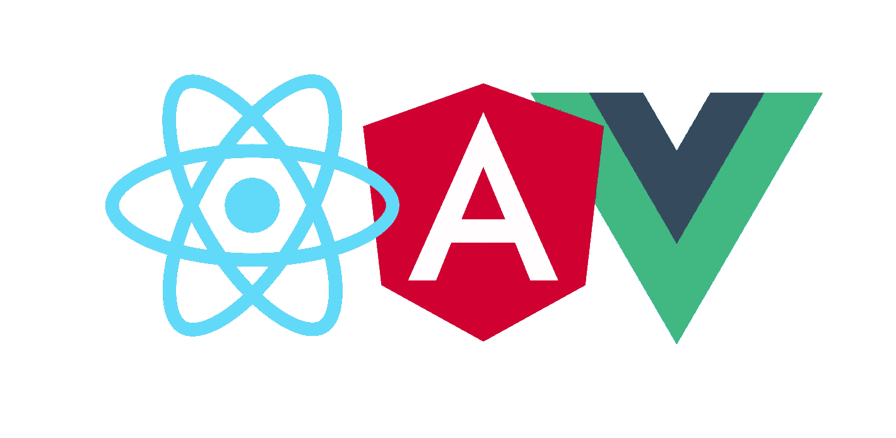

# 在不同的 JavaScript 框架之间迷茫？了解共同部分

> 原文：<https://medium.com/swlh/confused-between-different-javascript-frameworks-understand-the-common-part-c9439e853331>

棱角、Vue、React、聚合物……这个列表似乎永无止境。作为一名 web 开发人员，您可能不想错过这些框架所提供的任何工作机会。但几乎不可能学会每一个概念，总有一些独特或怪异的东西。幸运的是，在 web 开发人员社区中有一些被接受的概念，这使得我们很容易切换框架。

# 基于组件的体系结构

将应用程序分成更小的组件是一种被广泛接受的方法。你把你的应用分成更小的实体，最后，所有的实体组合在一起，形成一个面向客户的大组件。

所以在这里要学习什么，检查每个已知的库来识别，它是如何划分自己的，它是否返回一个 JavaScript 对象作为一个组件或一个 HTML。输入和输出属性如何传递给组件？如何创建一个哑组件和一个智能组件？它们是如何融合在一起的？如果你能弄清楚这些问题，你肯定会发现框架之间的组件架构是非常相似的，你只需要理解而不是记忆语法。

# ES6

在 web 开发中，我们已经开始避免 var 和其他令人困惑的概念，并处理像 let、const 和 class 这样的新关键字。所有主要的框架也发展到包含这些变化，所以如果你对 arrow 函数、ES6 的面向对象编程有很好的了解，理解框架的概念将是一件轻而易举的事情。

虽然 angular 使用 typescript 作为语法语言，但是如果您想使用 angular，您可能需要额外介绍 typescript 概念。将来，我们希望主流浏览器也支持 typescript。

# 函数编程

根据维基百科的定义，函数式编程是一种范式，其中编程是通过函数表达式和声明而不是语句来完成的。它还避免了数据突变。最新的框架接受了函数式编程范式，并使用它来编排 redux 和其他模式的数据流。由于这种方法作为一种新标准被业界接受，所以如果你学会在 react 中实现它，那么在 angular 和 vue 中实现它也不会有任何障碍。

我不想在这里解释函数式编程，因为本文将列出您需要的常见概念。

# Redux

我在上一点提到了 redux，redux 是函数式反应式编程范式的一部分，每个框架都有自己的实现。但是，数据流和状态不变性的概念是相同的，因为 redux 本身是一种模式，而不是一种工具。

# 路由和延迟加载模块

路由是 SPA 框架不可或缺的一部分，在每个框架中都有实现，所以你需要了解如何把你的应用划分成路由？如何保护你的路线？如何传递参数到你的路线等。

在当前版本中，您可以根据您的路由将您的应用程序代码分成小块，这些块不会被加载到浏览器内存中，除非路由被命中，这提高了您首次页面加载的性能，并且该概念是跨框架实现的。

# 模块构建者

你需要一个模块构建器来将你的代码编译成一个 javascript 文件，因为浏览器本身目前并不理解模块化应用的概念，这就是为什么你的组件需要被编译并折叠成一个 js 文件，这就是像 web pack 这样的模块构建器的作用。理解模块构建器的概念，以及每个框架需要什么样的移植器是非常重要的。Webpack 目前似乎最受欢迎，所以它可以是一个很好的起点。

# 模板引擎

每个框架都有自己的模板引擎，你可能需要学习所有的东西，但是像 dom 操作、循环、表单验证这样的概念可能很重要。通过架构图来学习，模板引擎将进入图片。

# 性能和安全措施

在选择框架之前，您应该问以下问题:

1.  您的应用程序有多复杂？
2.  你有表演预算吗？拥有性能预算非常重要，这取决于您所支持的客户端和平台的类型。
3.  每个框架的学习曲线是什么？
4.  需要为 OWASP 十大安全合规性做些什么。？

最好早点问这些问题，因为很多时候，你只是为了实现一个新的框架而做得过多或过少。

因此，如果您了解所有这些概念，您可能很快就会编写自己的 JavaScript 框架:)

最后，重要的是不要忘记 HTML、CSS、vanila javascript 和浏览器兼容性。

## 这篇文章发表在 [The Startup](https://medium.com/swlh) 上，这是 Medium 最大的创业刊物，有+391，714 人关注。

## 订阅接收[我们的头条](http://growthsupply.com/the-startup-newsletter/)。

