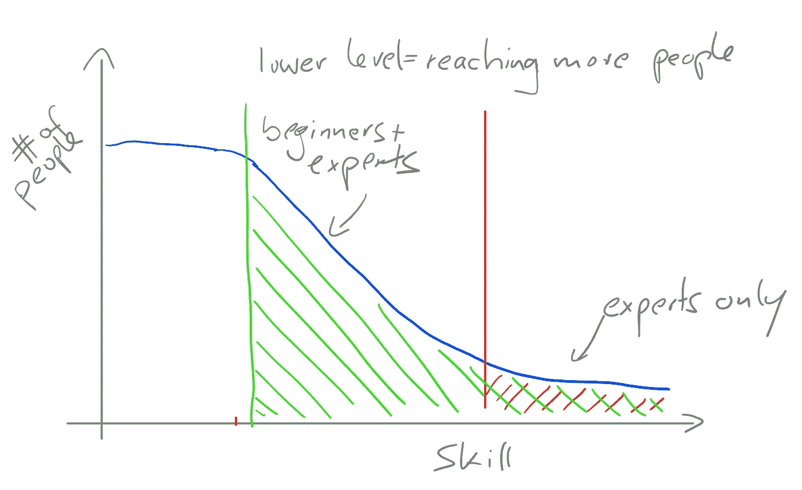

# 用这四个策略联系你的听众，让听众的参与度直线上升

> 原文：<https://medium.com/swlh/connect-to-your-audience-with-these-four-strategies-and-let-listener-engagement-skyrocket-1c717f5021b4>

Photo by [Marcos Luiz Photograph](https://unsplash.com/photos/R6xx6fnvPT8?utm_source=unsplash&utm_medium=referral&utm_content=creditCopyText) on [Unsplash](https://unsplash.com/search/photos/audience?utm_source=unsplash&utm_medium=referral&utm_content=creditCopyText)

## 了解你的听众是成为更好的演讲者最重要的步骤之一

这听起来可能是老生常谈，但在准备演讲、推销或演示之前，你需要了解你的听众，这一点至关重要。它应该贯穿你演讲的每一个部分:你表达自己的方式，如何组织你的演讲，以及如何设计它。

我们可以将您需要了解的内容分为四个方面。

## 1.你的观众有一定的经验。

听你讲话的人对你的话题有一定的了解。他们可能是任何人，从完全的初学者到专家，或者两者兼而有之。

> 你需要知道在什么层面上你可以向你的听众发表演讲。如果太低，专家就会厌烦，把注意力放在别的地方。如果水平太高，听众会感到沮丧，因为他们跟不上你。

游戏设计中有一个很有用的概念，叫做“流道”。理想情况下，玩家不会因为简单的游戏而感到无聊，同时也不会因为游戏不可能被击败而感到沮丧。这取决于游戏设计师来平衡挑战和技能。

[http://indiedevstories.com/2011/08/10/game-theory-applied-the-flow-channel/](http://indiedevstories.com/2011/08/10/game-theory-applied-the-flow-channel/)

你可以在你的演讲中使用同样的原则——但前提是你知道你的听众的技能水平。

有时，你需要在不同技能的观众面前展示。以我的经验来看，最好降低水平——告诉观众你是这么做的。你可以把它作为“评论”卖给专家(他们可能还能学到一两件事)，初学者会感到被欣赏。

> 想一想你正在交谈的群体的经历，问问你自己“他们会有什么样的知识水平？”还有“他们接触这个对象多久了？”

作为一个专家，有时候很难回想到一个更低的层次。我的建议是:如果这听起来对你来说太容易了，那可能是对的。另外，你总是有机会问你的听众，比如他们是否需要对某些单词或概念的解释。

x: skill, y: number of people. Lowering the level of the talk allows you to target more listeners.

尝试抓住尽可能多的人:“每个人都知道这个术语是什么意思吗？”这是一个简短但重要的问题，它向你的听众表明你关心他们是否理解这个话题。

## 2.你的观众有一定的期望。

每个听你说话的人都会带着一定的期望。

他们可能会从之前的经历中获得信息(“上次的谈话很有趣/很无聊”)。

他们可能已经投入了时间和金钱来听这个演讲(尤其是在昂贵的会议上)，并且非常期待学习。

或者，他们可能听说过你本人，现在有兴趣看看你如何介绍。

在所有情况下，考虑听众的期望将有助于你组织你的演讲，因为你可以在一开始就解决这些期望。告诉他们你打算给他们什么来回报他们的时间。更好的是，问问他们在期待什么。

这有助于你从一开始就在某些话题上花更多的时间，并将极大地提高你的听众参与度。

> 问问自己:“他们想带什么回家，哪些想法是核心，哪些建议或灵感是必不可少的？”关注这些话题。

如果你不确定，试着组织一下你的演讲，这样当听众需要的时候，你就可以更深入地讲述细节。当你被安排进行一系列的谈话(或者一个连续的演讲)时，你应该在开始的时候花时间收集这些期望，并且尽可能经常地回到这些期望上来。

## 3.你的观众有一定的动力

为什么有的老师能坚持一节课一整个学期的兴趣，而有的老师连 10 分钟都坚持不了？

作为听众，我们有时会情不自禁地对一次谈话或讲座失去足够的热情，即使它很重要。看一下你演讲的时间，以及如何激励听众跟上。是在黑暗温暖的房间里吃完午饭吗？你一定会得到几个昏昏欲睡的听众！或者是在一个星期五的下午，周末前的最后一次谈话，在一系列的其他谈话之后？

因为所有的听众都是人，所以要考虑到他们可能会如何被激发来听你说话，并采取一些预防措施。你可以放慢说话的速度和深度，以适应听众的情绪。

> 例如，当每个人都经历了艰难的一天时，增加一些幽默和轻松会提高他们的参与度。传达你的策略，向他们展示你的关心。“我知道您刚刚完成了三个小时的测试，这就是我们今天放慢速度的原因。”只要表现出你理解和关心，每个人都会觉得受到了重视，会更愿意倾听。

问问你自己:“对于听众来说，我演讲的背景是什么，他们以前做过什么，以后还会做什么？这会在多大程度上影响他们的倾听意愿？我该如何满足他们的需求？”

例如，午餐后的讲座可以在室外而不是闷热的房间里进行。

## 4.你的听众和主题有一定的关系

无论你在说什么，你的每一个听众都和这个话题有关系，并且在他们的头脑中，已经赋予它一些价值和相关性。通过增加谈话对听众的价值，你会得到大量积极的反馈。

> 这可能是看起来最简单的问题，但如果你诚实的话，这真的很难回答。"这和听众有什么关系？"

我有很多教授，他们绝对肯定他们所教的主题将是所有学期中最重要的。他们是专家，他们当然有很强的自我意识，因此，他们的专业领域怎么可能不是我们所学知识的精华呢？你猜怎么着，他们的讲座从来都不是最好的。他们完全高估了他们的主题对学生的相关性。

作为一名优秀的讲师，你应该知道(或找出)你的主题有什么相关性，并对此保持诚实。好的一面是，你绝对可以通过告诉听众这将如何影响他们的生活和学习来增加他们的相关性！许多数学老师没有做到这一点——他们认为每个人都自动理解做微积分有多重要。

> 但你能做的最好的事情是给出大量真实世界的例子，并问自己:“我如何才能让这些例子与正在听的人更相关？我该如何用一种他们从经验中了解的方式来表达呢？”

遵循这四种模式肯定会增加听众的参与度，因为你与他们建立了联系。

这些建议将会把焦点转移到与你交谈的人的需求上，而不是陷入乏味的专家谈话中。

如果你被卡住了，问问最了解的人:听众自己。**建立一个对话而不是独白，这要有趣得多。**

## 这篇文章发表在[《创业](https://medium.com/swlh)》上，这是 Medium 最大的创业刊物，有 285，454+人关注。

## 在这里订阅接收[我们的头条新闻](http://growthsupply.com/the-startup-newsletter/)。

