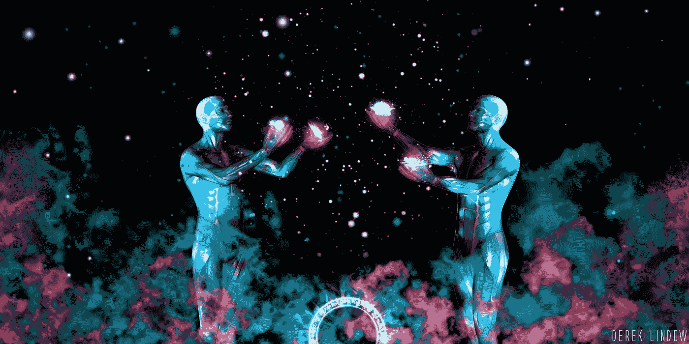
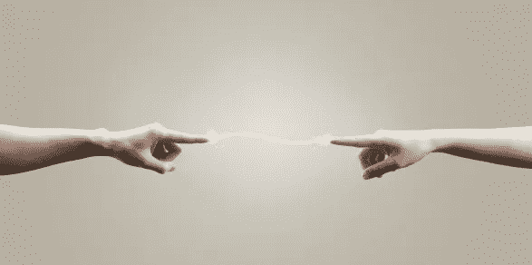

# 互联:我们是“他们”

> 原文：<https://medium.com/swlh/connected-we-are-them-d3d5ebf6166d>

# 我们是“他们”

很容易指着它想，“看那里，那里，那是不同的，他们是不同的，我们是不同的，我在这里是安全的，这是现实。”

很容易分开和隔离。很容易做到，感觉和创造一个与同一个房间里的人相距数英里的界限，当他们在屏幕后的世界的另一边时甚至更容易。我们分离和隔离得越多，我们在试图定义自己和自己的位置时就越有安全感。与此同时，我们越是创造出“我们”和“他们”的心态，我们就越是感到孤独、不安全和困惑，因为我们是事实上的，而不是真实的。

这种“我们”和“他们”的分离，揭示的更多的是“我们”而不是“他们”的姿态、位置和提升。它揭示了我们的恐惧、不安全感和偏见；暴露了我们狭隘的思想和我们设计现实时的社会假设。

而我们之所以沉迷于这种叙事，是因为我们无力控制它的频率、持续时间或剂量。如果我们要找到我们所寻求的意义，找到过上有价值生活的经历，这是我们应该意识到的一个重要方面。

我们是“他们”，他们是“我们”。我们都有东西可以给予，也可以互相学习。并且可以通过以激进的开放态度接触未知和不确定的事物来实现联系、交流和集体进化；来推动人类的体验，我们的体验。这就是神奇之处。

“如果我接受你本来的样子，我会让你变得更坏；然而，如果我把你当成你有能力成为的人，我会帮助你成为那样的人。”―――约翰·沃尔夫冈·冯·歌德

我们都有权力和自由去选择如何影响和塑造我们周围的世界；决定我们将如何对待我们被赋予的天赋，以及我们一生努力培养的天赋。问题是…

我们该拿他们怎么办？它将如何影响“他们”？
你会选择用它为谁服务？
你想成为谁？想让"我们"成为。你代表什么？你将如何与世界，与“我们”中的其他人联系并分享它？

# 连接和收集

想象一下，当你处于一种完整的状态，头脑完全清醒的时候，一天中的每件事都井井有条，一个偶然的时刻来到下一个。一段充满笑声和自发性的时光，以至于第二天微笑、交谈甚至睁开眼睛都会受伤。称之为“完美”。

现在想象一下，一个不完美的时代..因为它发生了。似乎我们在经历这种“少于”的状态时，要么是失去了联系，要么是失去了收藏

当失去联系时，我们会感觉脱离了周围的环境，这种感觉就是我们在“这里”,而世界的其他部分在“那里”,有点远离整体。无所事事地漂浮在混乱中，一个时空的观察者，一切都遥不可及。这是一个安静、平静而又孤独的地方，但我们仍然在一起，仍然是一个令人信服的整体，仍然在努力寻找和建立新的联系，或者以其他方式复活和重新连接。

被丢弃是完全不同的。是内心混乱的感觉。而不是观察和能够看到克服的潜力，一个人迷失了。就是那种被打破的感觉。虽然我们仍然与我们的世界保持联系，但我们的内心是破碎的；无法概念化我们的形状是什么，我们是谁，这些部分如何组合在一起，如何将它们融合在一起，即使我们重新发现了形状的感觉。

现在，一个无助的人可能会说，思考或感知到他们都是，无关联的和未收集的。他们是分子或尘埃，在无限的时间和空间中独自漂浮。但此时此刻，当你发现自己处于这种看似无形的状态，与所有的事物都脱节，你与你曾经所在的宇宙整体是最紧密相连和最紧密相连的。

这可能看起来很可怕，但它是不可思议的，我们应该坐下来拥抱它，而不是害怕它。坐在如此接近我们所知的生命的核心和本质的地方，是所有事物和所有人作为一个整体移动和互动的一部分。拥抱你自己，你的奋斗，知道我们都在一起。

“我是他，你是他，你是我，我们都在一起。”

## 这个故事发表在 [The Startup](https://medium.com/swlh) 上，这是 Medium 最大的企业家出版物，拥有 282，454+人。

## 订阅接收[我们的头条](http://growthsupply.com/the-startup-newsletter/)。

