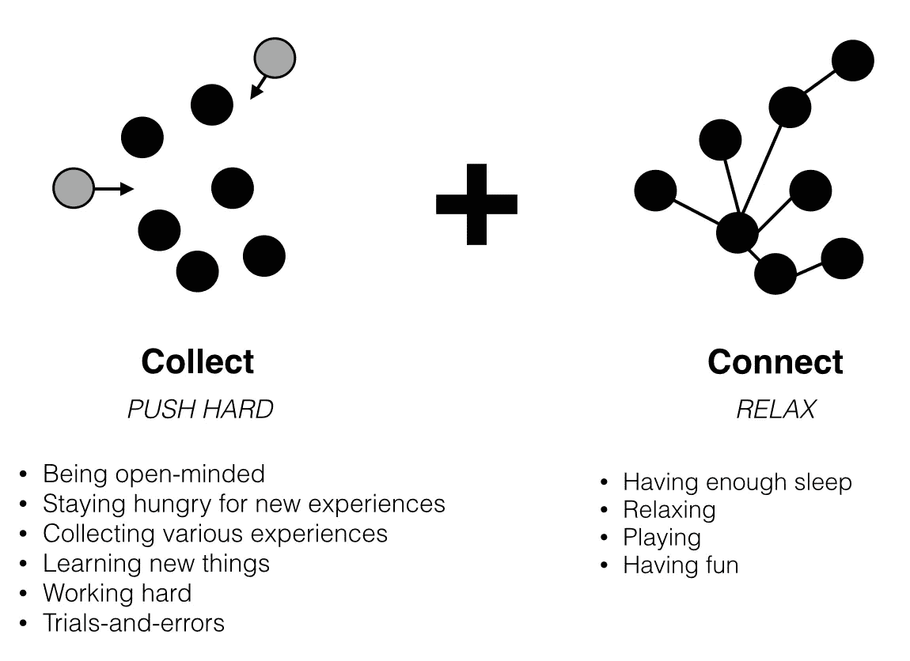

# 生产创造力

> 原文：<https://medium.com/swlh/connecting-dots-969620d685c6>

# 通过连接点

科学发现和商业创新背后的简单而强大的概念。

在野生动物中，点与点之间的联系对于生存是绝对必要的。一些野生动物，如美洲虎，进化出点状和斑点，变得更加难以辨认。你无法识别这种模式，你活不了太久。

人类的世界没有那么残酷(至少在这方面没有),但仍然**为了创造一些颠覆性的东西，你可能需要注意乍一看似乎不相关或非常复杂的事物之间的联系**。就像在门捷列夫和他的周期表的情况下找出化学元素之间的关系，或者在 Brainly 的情况下注意到全球对家庭作业的需求。

**把点点滴滴联系起来是一种混合，它收集各种各样的经历，给你的大脑时间去处理这些经历，并把它们联系起来**。

Jerzy Vetulani on connecting dots in science at TEDxKrakow.

它是如何工作的？

嗯——首先，你需要圆点。

点是不同的体验。你读的书，你看的视频，你遇到的情况，你讨论的话题，你所有的成功和失败。越多样化越好。

对选点要求太严格没有意义。即使有些事情看起来不切实际或消极——你永远不知道它将如何融入几年后的大局。就像史蒂夫的印刷术课程和从大学辍学的情况一样，这最终导致了最佳设计操作系统的创建。你应该保持开放的心态，渴望新的体验。

**其次，人脉。**

第二件事是给你的大脑时间去连接这些点。它可能发生在你睡觉的时候，也可能突然发生在一天当中。

你不能完全控制它。但是你可以影响它。

研究表明，肯定不是通过过度工作，而是通过放松和玩耍，因为这会让你的大脑更加活跃。所以一定要保证充足的睡眠，让自己有一些乐趣。玩游戏、看电影、社交或散步都可以完成这项工作。一些诺贝尔奖获得者和科学家在激发他们的创造力方面走得更远。

In order to stay productively creative you have to combine collecting and connecting dots. Tactics to achieve them are completely different.

努力工作真的有助于完成任务。很多时候这是绝对必要的。但是为了有创造性和破坏性，你可能需要完全不同的东西。

不要对自己太严格。

*原帖*[*【wojtekskalski.com】*](http://wojtekskalski.com)*。
受到耶日·韦图拉尼* [*在 TEDxKrakow 的演讲*](https://www.youtube.com/watch?v=L6N06hTuESE) *的启发。*

*发表于* **创业、旅游癖和生活黑客**

-