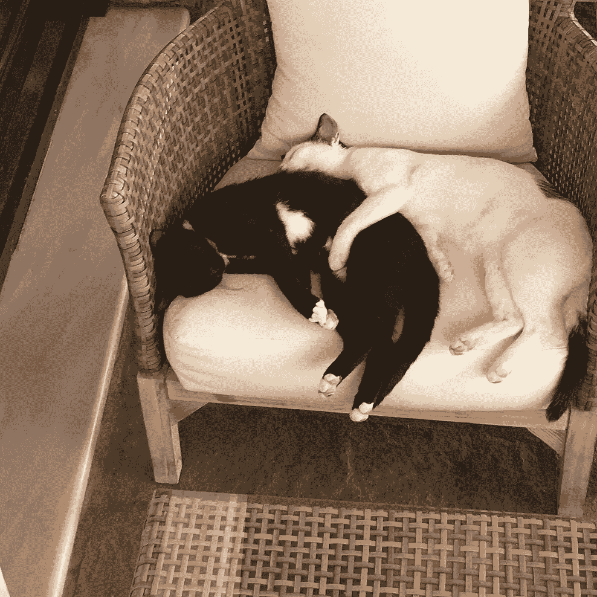

# 如何拥抱无为，并把它变成一种行动

> 原文：<https://medium.com/swlh/conscious-inaction-86b23595bc1d>

NOT what I’m talking about here, this is unconscious inaction!

有意识的不作为也是行动

沃伦·巴菲特把他的许多决定和成功归功于他花了大量时间阅读和思考。他的成功充分说明了不活动的好处。但也许我们需要定义不活动，并重新定义它，以更好地理解如何使它有益。