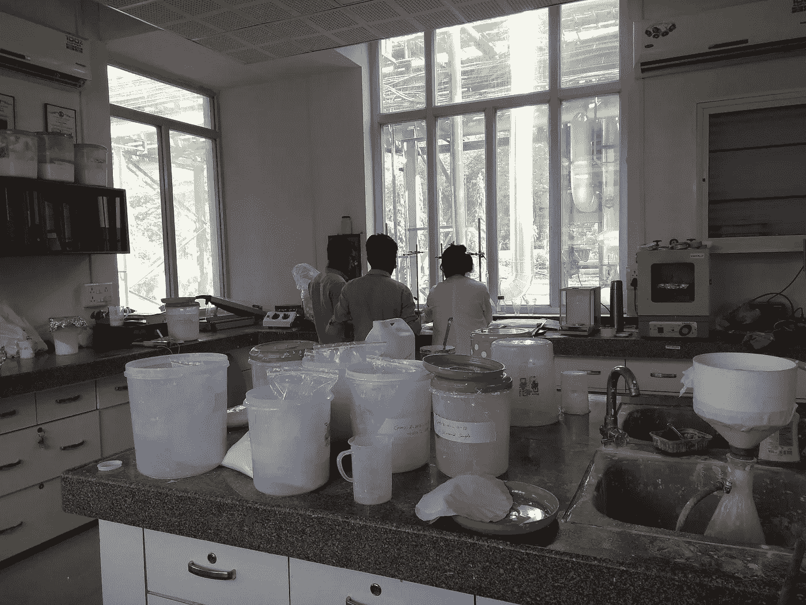
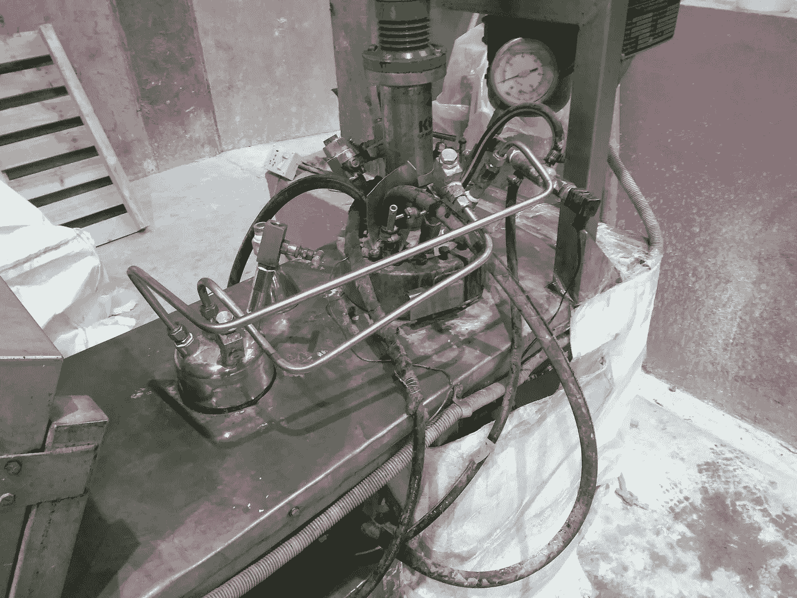

# 凡事一致

> 原文：<https://medium.com/swlh/consistency-over-everything-4bd5e5c05c28>

## 为什么科学方法会成就或破坏你的过程

> "你知道取样后的时间如何影响硅酸钙的粘度吗？"我问。
> 
> “请听我说，我需要解释我们的测试程序是什么”——我的老板把样品放在桌子上，向我解释问题

我们在印度，我们无法销售我们的产品，因为它不泵。粘度太高。

Visual inspection

我为一家工业化学品领域的初创公司工作，为纸张、塑料和油漆制造颜料。你可能没有意识到我们在所有事物中使用了多少白色。

我们无法找出是什么导致了我们的粘度问题。我们决定快速建立粘度与以下因素的关系:

1.  粒度
2.  集中
3.  吸水性

我们立即拿走了积压的样品，并让轮班工人开始重新测试我们的样品。我们设法建立关联，找出如何降低我们的粘度以适应泵的规格，并再次开始销售。

The scramble of testing old samples

## 停下来。这个过程已经有问题了

首先，当出现问题时，走出去看看问题。获得关于错误的反馈。在我们的例子中，它是走出实验室，跟踪我们的管道，然后检查泵。*我们的管道在漏水，我们的水泵残留的产品盖住了风扇。每当处理任何问题时，看看错误是什么。如果你是做软件的，看看错误日志。如果你发货晚了，检查你的集装箱实际在哪里。*

Can the problem be replicated in controlled conditions? Lab-scale reactor

第二，写一个遵循方法的计划。我们集思广益，认为影响粘度的物理特性，然后立即设置参数并开始测试。一个**试验计划**或**实验程序**需要被研究、书写、评审，然后在采取行动前被接受。这允许进行一致的测试，可测量的结果，并记录所发生的事情。*程序中的偏差随着时间的推移而发生，妨碍了我们在测试后做出正确的分析和结论。*

第三，确保无论你做什么，都坚持不懈。下面是我对**科学方法**的定义。

> “问个问题。定义你的自变量和因变量。实验，分析，得出结论。”

最后，我们希望有一个 X 和一个 Y 来作图。就这么简单。在测试期间，我们有不同的轮班工人不恰当地使用我们的设备。这没什么，因为我们不能指望一个工人测试所有的东西，但是需要适当的培训来确保持续的测试。我可以问，“当你测量液体的水分含量时，你怎么知道它是完全干燥的还是风干的？”。如果不是每个工人在实验室开始工作时都有一个定位，假设就会像电话游戏一样传递下去，直到我们不能再调用相同的测试。甚至我的老板也为此感到内疚。他没有意识到在测试我们的粘度时，温度、沉降时间和粘度计的握持方式都很重要。一致性是关键。

# 这如何适用于你的创业？

所有的商业决策，其后果几乎总是不可想象的。我们不能假设只有颗粒大小会决定粘度，但我们可以假设，如果我们复制所有变量，我们可以获得所需的颗粒大小。看看从你的行动中得到的**反馈**。如果因为交通或道德问题，你开始让员工在家工作，确定一些可衡量的指标，来检查你是否达到了预期的产出。如果你开始在汉堡中使用一种新型番茄酱，检查前后顾客的满意度。制定试验计划。这是决定你成功的因素。

Thanks for reading

## 这篇文章发表在[《创业](https://medium.com/swlh)》上，这是 Medium 最大的创业刊物，拥有+ 372，020 读者。

## 订阅接收[我们的头条新闻](http://growthsupply.com/the-startup-newsletter/)。

