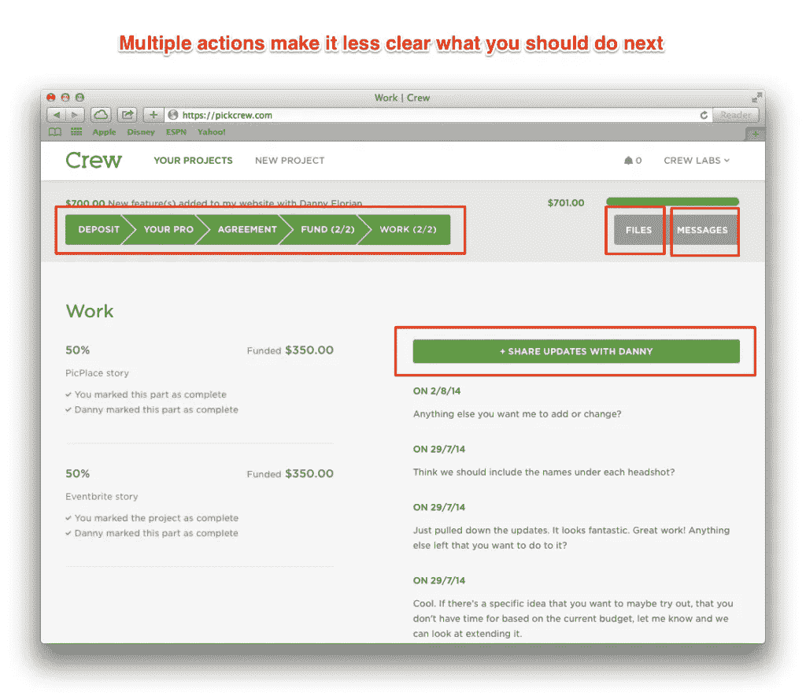

# 约束，而不是障碍

> 原文：<https://medium.com/swlh/constraints-not-barriers-84629bf49ce2>

## 好的产品不妨碍。它引导。

[unsplash.com/@benchaccounting](https://unsplash.com/@benchaccounting)

*这是一个 6 集系列* *的* [*的第 3 集，在这里，我们分享了剧组制作产品的一切。隐私见鬼去吧。建筑队在公众面前不仅仅充满了荣耀。它充满了我们在创造产品时所面临的挣扎和怀疑。*](/@mikaelcho/every-mistake-we-made-building-the-last-version-of-our-product-7b086cb8ae77#.69ascbcw8)

前几天我在一家服装店。

我想试穿一件衬衫，但是他们的更衣室锁了。我和买这件衬衫之间唯一的障碍是确保它合身。

问题是，我找不到在那里工作的人让我进更衣室。我环顾四周，等了 5 分钟，但找不到任何人。

我说‘去他妈的’，没有买那件衬衫。

也许那天我很不耐烦，但是每次我想试衣服的时候都要等待和询问，这让我感觉很不好。如果你在做某件事之前必须请求，你做这件事的可能性就会降低。

问是一种障碍。

很多人在购买衣服之前都会试穿，这可能是真的，所以这是一个必要的步骤。但是，由于许多人在购买前都会试穿，所以这个过程应该尽可能的无缝。试穿应该是轻而易举的事。如果人们能够快速试穿，这可能会增加他们购买的机会，有利于商店。

“试穿衣服”的过程不应该感觉像一个障碍。

如果我们将这一点与产品设计联系起来，相反的方法，允许人们做任何事情，通常也不是最好的方法。一个允许人们做任何事情的产品可以让事情变得如此混乱，以至于很难做任何事情。

需要找到一个平衡点。

Instagram 允许你从某些照片过滤器中进行选择，但不会马上提供所有可能性。

脸书允许您编辑个人资料和更新状态，但您不能更改颜色或字体。

Instagram 和脸书是两个例子，这两个产品给你足够多的感觉，让你觉得你在控制，但又不会太多，让你很难使用。

我们不喜欢在使用产品时感到受限制或迟钝。我们希望感受到力量和自信。好像我们做的每个决定都是正确的。成功平衡约束和授权感的产品才是坚持的产品。

我们已经注意到了我们的产品感觉不尽如人意的地方。在大多数这样的地方，我们的会员需要等待或者需要向我们寻求帮助，因为他们是否能做些什么还不是很清楚。

它们受到限制，需要向我们发送消息来执行操作。在很多地方，我们这样做是为了确保项目顺利完成，但我们现在的感觉是，有些地方有太多不需要的约束。

我们的目标是建立一个提供指导的产品。该产品展示了一条清晰的道路，可以让您轻松获得想要的东西。

在我们的问题列表中，这些感觉不太对劲的地方被贴上了“等待时间”和“搁置项目阻碍工作”的标签:

由于我们没有定义所有这些点在哪里，以及我们将如何解决它们，我们认为这是一个“难以解决”的问题。

我们的第一步是找到我们的成员正在等待的所有区域。

# 我们在哪些方面阻碍了客户的需求？

我们从项目概述页面开始，这是您每次登录 Crew 时看到的主页面。本页的目的是向您展示您目前所处的阶段以及下一步的行动。

项目概述页面目前看起来如下:

这里有很多可以改进的地方，但是我们还不知道应该如何去做。

所以我们刺了几下。

第一，问题。现在项目概述页面的主要问题是有太多的冲突行为。并不总是清楚你下一步该做什么。

例如，以下用红色标出的主要行动是您接下来可以做的:

有太多这样的选择并不能让你的下一步行动变得明显。无论你以前是否已经建立了一个应用程序或网站，或者这是你的第一次，你可能不知道仅仅看这个页面你应该做什么。

这不应该发生。

因此，我们将您在流程的每个步骤中可以采取的每个操作分开，以明确您每次登录时应该关注的一个操作。

我们首先重新设计了项目概述页面:

我们觉得这是一个好的开始。但是看了设计之后，我们还是觉得少了点什么。

我们没有在明确你下一步应该做什么方面做出重大改进，我们仍然不确定每个页面如何组合在一起。

理解成员如何经历团队是这个阶段最重要的部分，我们还没有清晰的拼凑起来。

# 什么时候重新开始

我们没有设计更多的模型，而是转向了最小的线框。这将使我们对页面之间的交互有更好的感觉，并更好地定义成员如何通过 Crew 导航。

以下是我们的线框制作过程的一些镜头:

1.我们选取每一页，并定义组成每一页的元素:

2.然后，我们看了如何从一页到另一页:

这给了我们一个更清晰的想法，当你需要做一个动作(付款、留下反馈、选择设计师等)时，你将如何浏览 Crew 以及会发生什么。).

现在，页面如何组合在一起的大图已经有了更好的定义，我们可以回到设计每个页面的一些细节。

# 建筑工人在公共场合

隐私见鬼去吧。《公众中的建筑工人》是一系列 6 篇关于产品设计哲学和我们在设计自己的产品时所面临的斗争的短文。可以在 [*剧组后台博客*](http://backstage.crew.co/building-in-public/) *上阅读正版，在路上启发版。*

## 1.[我们都在销售经验](/swlh/were-all-selling-experiences-58ae13a8a0bc)

## 2.[从问题入手。不是解决方案。](/swlh/start-with-problems-not-solutions-8521c53264b2)

## 3.你在这里

## 4.[多问问题](/@mikaelcho/you-can-never-ask-too-many-questions-6d9926988f82#.ynoz2zshy)

## 5.[剖析一个主页](/@mikaelcho/anatomy-of-a-homepage-redesign-9d911e832c4b#.lhlspqtoa)

## 6.[旅程比目的地更重要:设计最佳入职流程](/@mikaelcho/the-journey-is-as-important-as-the-destination-ddc598989eaf#.ddxqmqyga)

# 又及:新成员

我们最近在 Crew 为我们的产品的一个全新版本再次经历了这个过程。你可以在这里阅读全部内容。

