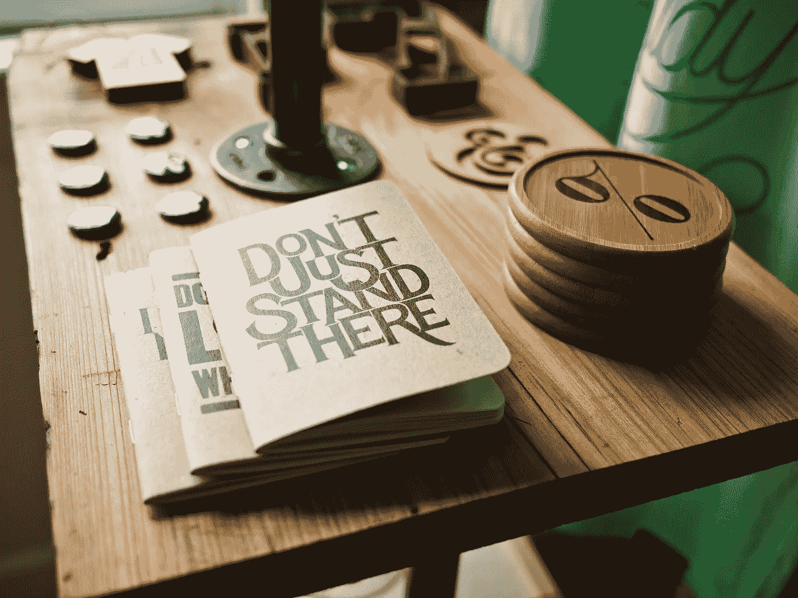

# 消费者与生产者——思维方式的改变将改变你的生活

> 原文：<https://medium.com/swlh/consumer-vs-producer-a-change-in-mindset-that-will-change-your-life-11cf8092e3e6>

Photo by [Jeff Sheldon](https://unsplash.com/photos/o6Y9E-DdG6w?utm_source=unsplash&utm_medium=referral&utm_content=creditCopyText) on [Unsplash](https://unsplash.com/search/photos/create?utm_source=unsplash&utm_medium=referral&utm_content=creditCopyText)

> “每个人都是消费者，也应该是生产者。他天生昂贵，需要变得富有。”——拉尔夫·瓦尔多·爱默生

是什么阻止我们开始那个副业？还是因为建立了那家公司？是什么让我们不停地为我们不能开始找借口？

# 消费者心态