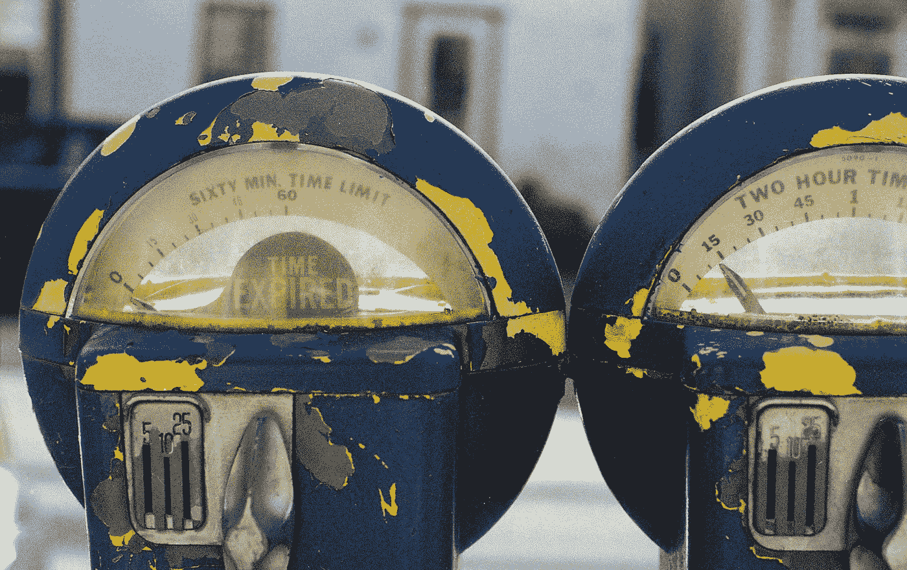

# 消费者最牛$#！*米:品牌名称中的真实性和故事

> 原文：<https://medium.com/swlh/consumers-have-the-best-bull-meters-authenticity-and-story-in-brand-names-2dd91a8a50da>

扎克里·维克斯

最近，慧俪轻体[宣布它将被称为“WW”](http://fortune.com/2018/09/24/weight-watchers-name-change/)这家有着 65 年历史的公司推出了新的口号“健康有效”，进行了大胆的战略转型，成为一家以健康为中心的组织，与现代自我保健和身体积极的理念保持一致。在这一过程中，他们删除了“节食”等词汇，这些词汇近年来有了更多负面含义。

这个决定来自观点的转变。[2016 年盖洛普民意测验](https://news.gallup.com/poll/198074/fewer-americans-lose-weight-past-decade.aspx)显示，更少的人积极想要减肥——尽管肥胖率处于历史最高水平，但更少的人形容自己“超重”

随着越来越多像[多芬这样的公司反对过时的美容和健康定义](https://www.huffingtonpost.com/2014/01/21/dove-real-beauty-campaign-turns-10_n_4575940.html)，今天的消费者不一定认为体重是一个表面问题，而是自豪地将其作为他们个性的一部分。像慧俪轻体这样的公司——他们的商业模式依赖于糟糕的身体形象、自我意识，或者[“向他们展示缺陷，向他们出售解药”](https://www.nbcnews.com/think/opinion/weight-watchers-rebranding-won-t-help-save-company-built-its-ncna913041)——必须转型才能生存。唯一的方法是讲述一个品牌故事，真实地讲述公司的新目标，一切从名字开始:故事的标题。

慧俪轻体或 WW 正是这么做的——他们通过一个引人注目的故事改变了自己的名字、文化和信息。

批评家们最初对这一举动持怀疑态度，称体重观察者的转变只不过是“伪装的饮食文化”如果纯粹是装饰性的，这样的变化很容易被认为是滑稽和不真实的——公然试图利用最新的趋势。公司一次又一次地成为这种仓促且考虑不周的方法的牺牲品。乍看之下，WW 似乎又是一个新的例子。

改变一个家喻户晓的名字风险更大，因为品牌资产可能会越来越少。当肯德基在 1991 年将他们的名字缩写为 KFC，将“Fried”从消费者的词汇中删除时，该品牌随后[失去了宝贵的知名度](https://www.adweek.com/brand-marketing/why-weight-watchers-is-shedding-the-baggage-of-an-old-name/)，需要从头开始。然而，通过将品牌重塑和更名植根于一个引人注目的故事，将顾客——故事的主人公——放在第一位，公司可以在投资未来的同时真正顺应流行趋势。

WW 不仅仅是精简他们的名字，选择一个肤浅的缩写来阻止“饮食”的负面影响，他们还将他们的目的投入到一个情感叙事弧中。他们不再推销快速减肥方案，也不再用会员减肥前/后的照片进行营销，这传达了一个信息，即瘦与健康等同。

现在，WW 已经修改了他们的签名积分系统，以说明每个人的身高、体重、性别和活动；他们已经与冥想应用 Headspace 合作，并推出了“连接群组”，以连接志同道合和需要类似*的*成员，比如那些无麸质的成员。他们还开发了新的食谱，并从食品中去除了人工甜味剂、色素、调味料和防腐剂。所有这些举措都代表了他们的产品和服务的内在和根本的变化。

尽管有些人可能会对这个缩写感到困惑(它是慧俪轻体的缩写还是新的“健康有效”口号？)并质疑这对公司的方向意味着什么，答案就在他们的故事里。慧俪轻体从来就不是关于节食的耻辱，尽管目前节食文化受到了指责。相反，他们一直是关于社区和鼓励彼此走向更健康的自我意识——创始人 Jean Nidetch 设想当志同道合的人可以分享技巧和支持时，减肥会更容易。

因此，WW 的故事并没有改变，它只是变得更加情绪化地投资于他们的成员，向任何可能不相信瘦是健康或幸福的人开放他们的哲学。虽然随着时间的推移，我们对美的定义发生了变化，但 WW 故事的核心却没有变。如果“WW”感觉没有方向，也许没有方向就是方向——也许“WW”含义的开放性既是慧俪轻体历史的锚，同时也努力变得更容易接近:会员有权选择自己的方向，定义自己的健康，过自己最好的生活。

更名为 WW 不仅仅是为了美容，他们已经改变了企业的文化，从专注于理想的节食解决方案转变为对每个人的生活方式进行全面而现实的投资，拥抱一种让每个成员都能过上最健康生活的方式。正如他们新的[愿景声明](https://www.weightwatchers.com/us/impact-manifesto)解释的那样，WW 的目标是“创造一个所有人都能享受健康的世界，而不仅仅是少数人。”

“消费多头[#！*]米价高得不能再高了，”[肯德基首席营销官](https://www.businessinsider.com/kfc-is-finally-turning-business-around-2016-5)凯文·霍奇曼说。“他们知道你什么时候是真实可信的。”

虽然一个授权的故事，真实地讲述，可以跨越暂时的时尚和趋势以及不断变化的观点的障碍，将公司与观众联系起来，但这是一个棘手的走钢丝。任何与公司核心品牌故事相矛盾的举动都同样有害。

2009 年， [Radio Shack 将自己重新命名为“The Shack”](https://www.wired.com/2009/08/radioshack-rebrands-as-the-shack/)试图在百思买、沃尔玛和手机零售店时代保持不断萎缩的市场份额。新名字(去掉“收音机”以疏远与过时技术的联系)旨在唤起相关性和“酷”，并吸引新老客户。但这种短视的更名表明，该公司的故事缺乏重点——在一个日益被技术淹没的世界里，为客户提供全面的答案。

虽然 Shack 可能表面上更相关，但公司的其他方面没有变化，他们仍然提供相同的产品。除了名称本身，顾客看不到任何真正的变化。Radio Shack 未能像竞争对手百思买(Best Buy)那样，将顾客转化为品牌传播者。百思买的故事是通过便利和专家员工，从咨询到购买到安装再到服务，让客户能够做出适合自己的最佳选择。如果技术旨在改善客户的生活，那么百思买可以改善您的技术零售体验，从通过大量价格合理的商品和友好的知识渊博的员工找到合适的产品，到通过他们的极客队现场技术支持维护该产品。

例如，百思买[最近的更名](https://corporate.bestbuy.com/best-buy-launches-refreshed-branding-logo/)，通过重新安排所有视觉元素的优先次序，简单地更新了他们的标志，因此避免了牺牲品牌资产。“讲述我们员工的故事——以及我们如何对顾客的生活产生有意义的影响——是这项工作的核心，”百思买首席营销官惠特·亚历山大说。百思买区别于其他所有公司的核心是，我们了解您的独特需求以及技术如何改善您的生活，这也是我们让客户对我们刮目相看的原因。"

Radio Shack 的不真实更名未能在他们寻找的客户中培养出“狂热”的追随者，因为这与他们的品牌故事不符——在这个充斥着新技术和大型零售商的破碎世界中，Radio Shack 是唯一的选择，因为他们提供“合格的销售人员来帮助客户从你的技术产品中获得最大价值。”

短暂的“窝棚”时期弊大于利，剥离了该公司在忠诚客户群中仅剩的一点品牌资产。在经历了几年的重大财务损失和裁员后，RadioShack 于 2015 年[申请破产，并于 2017 年](https://www.forbes.com/sites/brianrashid/2017/04/08/the-complications-that-lead-to-radioshack-declaring-bankruptcy-for-a-second-time-in-two-years/)再次申请破产。

最近，Dunkin' Donuts 在品牌重塑中放弃了第二个 D，包括新的设计、数字订购亭和桶装硝基冷饮。

“我们的新品牌是我们正在做的许多事情之一，作为我们增长蓝图的一部分，为我们的客户提供现代化的邓恩体验，”[邓恩品牌首席执行官大卫·霍夫曼](https://www.businessinsider.com/dunkin-donuts-changes-name-no-donuts-2018-9)说。“我们致力于为我们的客人提供优质的饮料、美味的食物和无与伦比的便利。”

Dunkin 的品牌故事植根于快速方便的食品(包括甜甜圈)和饮料。然而，他们新的数字订购亭与这个故事相吻合，尽管缩写的名称也可能重申快速服务，[正如联邦快递的名称同样传达了](http://www.wodenworks.com/seeing-is-believing-when-contemporary-aesthetics-are-valued-over-timeless-storytelling/)的意思，这一变化损害了品牌的权益，因为它破坏了消费者对第一个“d”的看法。这一变化后来让许多消费者感到困惑和恼火:

*他们真的发明了“甜甜圈”这个词他们应该永远保留它*。

@larocciDave 发推文

*等等，邓肯甜甜圈以他们的名字命名？真正的问题是，你还卖甜甜圈吗？*

@BigballerDee 发推文

甚至在 Dunkin Donuts 最初被称为“甜甜圈先生”的时候，它就保留了“甜甜圈”这个名称保持甜甜圈的名称使特许经营负责做出好的甜甜圈，因为这些是重点！也许吧。

@ cryptolectic 发推文

霍夫曼说:“两年来，[我们一直专注于将 Dunkin’发展成为首屈一指的、以饮料为主导的移动品牌](https://www.businessinsider.com/dunkin-donuts-name-change-explained-by-ceo-2018-9)。虽然数据可能支持这一决定(大约 60%的 Dunkin 销售是由他们的饮料产品组成的)，但数据并没有衡量品牌名称的品牌资产价值。

这并不是说霍夫曼不应该投资更多的咖啡产品和机会。销售不会说谎——但他们也不会说出事情的全部。通过放弃“甜甜圈”，Dunkin '背叛了消费者的信任，走上了一条似乎与消费者喜爱该品牌的方向相反的道路，而不管销量如何。

一个新的名字同样有能力把一个任性的品牌和它瞬间联系起来。1902 年，明尼苏达采矿和制造公司开始了刚玉矿的开采，但很快就失败了，因为他们的矿只含有斜长岩。几十年来，该公司在这个笨重的名字下运营，但根本不从事采矿——事实上，该公司经营(并将继续经营)工业、医疗保健和消费品，并负责制造数千种产品，如便利贴和透明胶带。

20 世纪 50 年代，这家位于明尼苏达州的采矿和制造公司首次推出了一个简化的标志，抛弃了“3M”这个越来越不相关的名称，这一更名以适应该公司的发展而闻名成为一家创新的、价值 600 亿美元的跨国公司。如果 3M 仍然是明尼苏达州的采矿和制造公司，它会取得如此大的成功吗？

“3M”仍然植根于他们的历史，包括他们的第一个独家和有利可图的产品，一种砂纸/砂布片，被称为“3M-ite”，[公布了该公司的第一笔股息](https://www.3m.com/3M/en_US/company-us/about-3m/history/timeline/)。但是最初的名字歪曲了公司的实际运作，以及他们作为全球研究者和创新者的故事。

此外，每个“M”都可以代表“错误”，因为它的三个里程碑和创新都围绕着[事故](http://www.todayifoundout.com/index.php/2011/11/what-the-company-name-3m-stands-for/)——最初的地雷，“三 M-ite”，以及一种压敏粘合剂，丙烯酸酯共聚物微球，这导致了便利贴。这与该公司的故事一致:“但我们的成功和长寿从一开始就不明显。我们试过了。我们失败了。我们尝试了新的东西。重复循环。创新和坚持不懈的精神推动着我们的创始人，今天这种精神继续推动着 3Mers。”

名字不是一个吸引人的、装饰性的附属品，而是每个公司品牌故事的标题。一个品牌的名字永远不应该反驳，歪曲，或测试消费者的公牛$#！*仪表。相反，公司的名字应该反映他们作为导师的地位，他们的产品或服务的神奇礼物赋予消费者——他们故事的英雄——解决他们内在的需求或问题，从而征服他们破碎的世界。

扎卡里·维克斯是沃顿 *的合伙人。无论你讲故事的需求是什么，沃顿都可以帮助你。* [*阅读我们的广泛指南*](http://brandstory.wodenworks.com/) *了解如何精心组织您的叙述，或者给我们发电子邮件至*[*connect@wodenworks.com*](mailto:connect@wodenworks.com)*讨论我们如何帮助讲述您的故事。*

## 这篇文章发表在 [The Startup](https://medium.com/swlh) 上，这是 Medium 最大的创业刊物，有+ 379，306 人关注。

## 订阅接收[我们的头条新闻](http://growthsupply.com/the-startup-newsletter/)。

