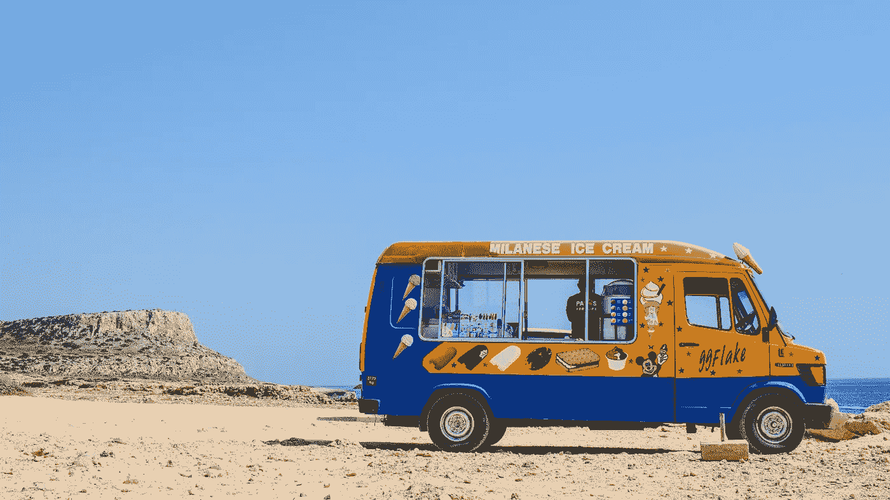
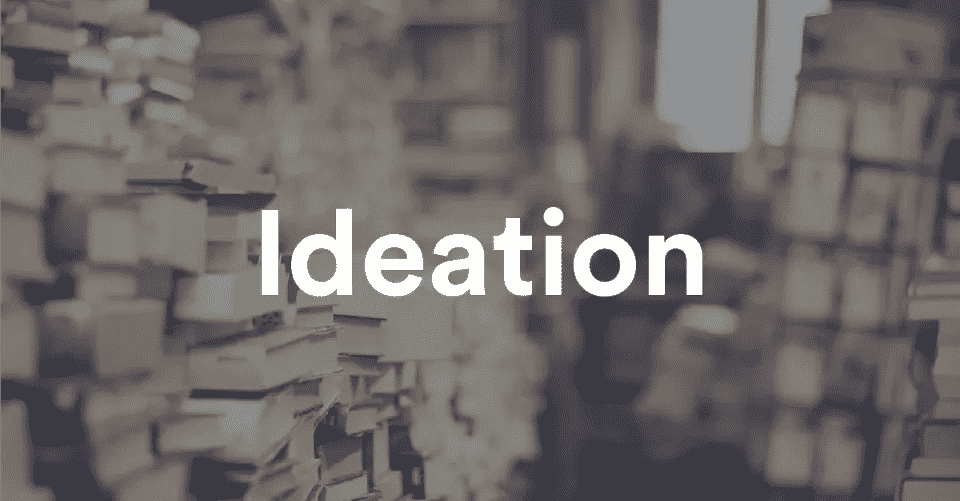
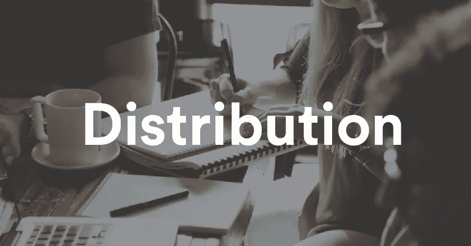

# 创业内容营销 101——指南和完整资源

> 原文：<https://medium.com/swlh/content-marketing-101-for-startups-a-guide-and-complete-resources-72f44f6fbf79>

> ***“真正的内容营销不是改变用途的广告，而是制造一些值得谈论的东西”——塞思·戈丁***

如果你正在读这篇文章，你要么是一个内容营销者，要么是想学习更多关于内容营销的人。

太棒了，非常感谢。

当今世界，每个品牌都在以许多不同的方式进行内容营销活动。

但是内容营销的基本原则是一样的。3 个重要阶段，第一次构思，第二次创造，第三次分配。

现在，你可以很容易地在互联网上找到所有关于内容营销的信息。有大量有价值的资源可以激励你成为一名优秀的内容营销者。

在我目前的公司，由于我们所做的内容营销活动，我们的内容营销团队设法在东南亚获得了 500 多家顶级媒体出版物。我们从不付钱给媒体和博客来发布我们的内容。我们还登上了[福布斯杂志](https://www.forbes.com/sites/joeescobedo/2017/07/05/how-to-get-media-coverage-for-your-startup/)。

旅途并不轻松。在过去的 12 个月里，我一直在阅读、观看和消费大量关于内容营销的信息。

所以在这篇文章中，我想和你分享来自内容营销专家的 50 多条有价值的信息。

我将文章分为三个部分:

1.内容构思

2.内容创作

3.内容分发

在每一部分，你都会看到许多来自专家的有价值的资源。

# **内容构思**

通过阅读这一部分，你会获得很多信息，可以帮助你开始你的内容营销活动。你可以决定你想做什么样的内容。

**内容营销的一般思路:**

1.  内容营销初学者指南— [**Moz**](https://moz.com/beginners-guide-to-content-marketing)
2.  如何制定内容策略:从头到尾的指南— [**HubSpot**](https://blog.hubspot.com/marketing/content-marketing-plan)
3.  5 未开发的内容构思— [**搜索引擎期刊**](https://www.searchenginejournal.com/5-untapped-content-ideation-tips/118029/)
4.  101 种来源内容创意的方法— [**亲度量**](https://blog.kissmetrics.com/101-content-ideas/)
5.  6 位专家揭秘如何成为内容创意巨星—

****内容营销实例:****

1.  **2015 年最佳信息图— [**HubSpot**](https://blog.hubspot.com/marketing/best-infographics-2015)**
2.  **2016 年最佳信息图— [**HubSpot**](https://blog.hubspot.com/marketing/best-infographics-2016)**
3.  **应用内容营销的快速指南— [**Leah Godden**](https://www.linkedin.com/pulse/quick-dirty-guide-using-content-marketing-apps-leah-godden/)**
4.  **碾压内容营销的 7 款应用— [**Apptamin**](https://www.apptamin.com/blog/7-apps-that-are-crushing-content-marketing/)**
5.  **搞笑又精彩:2016 年 10 大最佳视频营销案例— [**Vidyard**](https://www.vidyard.com/blog/10-best-video-marketing-examples-of-2016/)**
6.  **启发内容营销人员的 20 个最佳信息图— [**NewsCred**](https://insights.newscred.com/the-20-best-infographics-to-inspire-content-marketers/)**

****有价值的内容营销网站:****

1.  **将数据转化为美丽的信息— [**信息是美丽的**](http://www.informationisbeautiful.net/)**
2.  **视觉散文周刊—**
3.  ****可视化谷歌数据— [**谷歌趋势**](https://trends.google.com/trends/story/US_cu_6fXtAFIBAABWdM_en)****
4.  ****网上营销代理有很多很棒的内容例子—****

# ********内容创建********

************

******在第二部分中，你将学会把你的想法转化为真正的内容营销。将会有很多不同类型的内容格式的例子。来自文章、信息图表和交互式内容。******

********决定内容营销的形式:********

1.  ****对内容格式采取新方法的 8 种方式— [**内容营销学院**](http://contentmarketinginstitute.com/2016/04/fresh-content-formats/)****
2.  ****哪些内容营销形式最有效？——[**塞姆拉什**](https://www.semrush.com/blog/content-marketing-formats-effective/)****
3.  ****受众和出版商喜爱的 24 种创新内容格式— [**Fractl**](http://www.frac.tl/innovative-content-formats/)****

******信息图:******

1.  ****创建优秀信息图表的 7 个原则— [**内容营销学院**](http://contentmarketinginstitute.com/2017/05/principles-creating-infographics/)****
2.  ****12 个你希望几年前就知道的信息图表提示— [**亲吻指标**](https://blog.kissmetrics.com/12-infographic-tips/)****
3.  ****布局备忘单:充分利用视觉布局— [**皮克图**](https://piktochart.com/blog/layout-cheat-sheet-making-the-best-out-of-visual-arrangement/)****

******视频:******

1.  ****关于为脸书、Snapchat、Twitter 等创建史诗内容的视频营销指南— [**Buffer**](https://blog.bufferapp.com/video-marketing)****
2.  ****创建成功社交视频内容的最佳工具、技巧和策略— [**下一个网站**](https://thenextweb.com/socialmedia/2014/05/05/best-tools-tricks-strategies-create-successful-social-video-content/)****
3.  ****任何人都可以使用的 10 个视频营销内容创意— [**Brainshark**](https://www.brainshark.com/ideas-blog/2013/January/10-video-marketing-content-ideas-anyone-can-use)****

******互动内容:******

1.  ****分分钟打造互动内容的 4 个工具— [**内容营销学院**](http://contentmarketinginstitute.com/2016/01/tools-interactive-content/)****
2.  ****创建精彩互动内容的 4 个步骤— [**Marketo**](https://blog.marketo.com/2017/04/4-steps-to-create-awesome-interactive-content.html)****
3.  ****45 个在内容营销中互动讲故事的引人入胜的例子— [**HubSpot**](https://blog.hubspot.com/marketing/interactive-content-examples)****

******博客文章:******

1.  ****创建读者喜爱的博客的 10 个简单步骤— [**Moz**](https://moz.com/ugc/10-simple-tips-for-creating-a-blog-your-readers-will-adore)****
2.  ****如何写博文:一个可书签的公式+ 5 个免费的博文模板— [**HubSpot**](https://blog.hubspot.com/marketing/how-to-write-blog-post-simple-formula-ht)****
3.  ****抓住你的读者:撰写引人入胜的博文的 8 个技巧— [**HongKiat**](https://www.hongkiat.com/blog/writing-engaging-blog-posts/)****

******数据驱动的研究:******

1.  ****如何将数据转化为令人惊叹的视觉内容— [**商业 2 社区**](https://www.business2community.com/content-marketing/turn-data-stunning-visual-content-01160748#jA2IS2uduT7lwV5T.97)****
2.  ****将定性数据转化为可视化的讲故事内容— [**外观**](https://visage.co/turn-qualitative-data-visual-storytelling-content/)****
3.  ****数据驱动的内容营销战略的 6 个步骤— [**内容营销学院**](http://contentmarketinginstitute.com/2014/06/data-driven-content-marketing-strategy/)****

# ******内容分发******

********

****在最后一部分，您将学习如何分发您的内容以优化覆盖范围。您将学习向更广泛的受众推广您的内容的实用策略。****

1.  ****包含在你的内容营销策略中的 50 种推广策略— [**苏扬·帕特尔**](https://sujanpatel.com/content-marketing/50-promotion-tactics-include-content-marketing-strategy/)****
2.  ****6 内容推广的操作策略— [**内容营销学院**](http://contentmarketinginstitute.com/2017/04/how-to-strategies-content-promotion/)****
3.  ****内容推广如何为大大小小的博客服务:我们最喜欢的 11 个内容分发策略— [**缓冲**](https://blog.bufferapp.com/content-promotion)****
4.  ****推广你的新内容的 17 种高级方法— [**亲吻指标**](https://blog.kissmetrics.com/17-advanced-methods/)****
5.  ****通过内容分发让你的博客流量暴涨的 16 种方法— [**尼尔·帕特尔**](https://neilpatel.com/blog/16-proven-content-promotion-strategies-to-make-every-blog-post-successful/)****
6.  ****内容推广— [**Moz**](https://moz.com/beginners-guide-to-content-marketing/content-promotion)****
7.  ****在你的内容营销策略中包含 33 种推广策略— [**集客火箭**](https://inboundrocket.co/blog/33-advanced-methods-for-promoting-your-new-piece-of-content/)****
8.  ****准备您的黑仔内容营销推介— [**Moz**](https://moz.com/blog/preparing-your-killer-content-marketing-pitch)****
9.  ****为什么推介是伟大的内容营销的关键— [**心满意足地**](https://contently.com/strategist/2017/02/08/pitch-stories-great-content-marketing/)****
10.  ****我没有看就删除了你的邮件。而且不，我不觉得遗憾— [**Ahrefs**](https://ahrefs.com/blog/outreach/)****

****如果你想深入内容营销的世界，这是你需要学习的所有重要的东西！****

# ******行动号召:******

****如果你喜欢这篇文章，请为它鼓掌，并与和你有相同兴趣的朋友分享！****

****本文翻译自印度尼西亚版本，来自[**iPrice Insights**](https://iprice.co.id/trend/insights/content-marketing-101-panduan-dan-sumber-informasi-lengkap/)****

********

## ****这个故事发表在 [The Startup](https://medium.com/swlh) 上，这里有 263，100+人聚集在一起阅读 Medium 关于创业的主要故事。****

## ****在这里订阅接收[我们的头条新闻](http://growthsupply.com/the-startup-newsletter/)。****

********