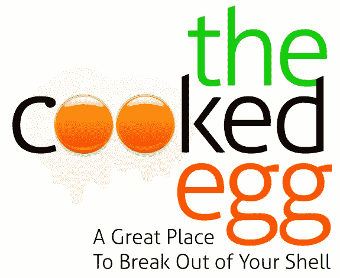
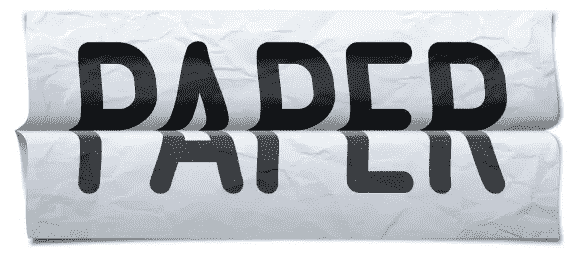
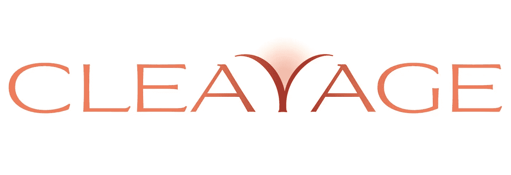
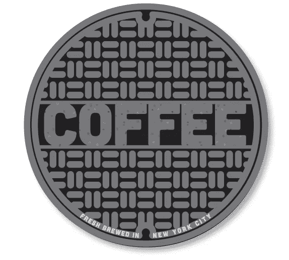

# 内容营销策略——如何让你的内容(真正)超越你的竞争对手

> 原文：<https://medium.com/swlh/content-marketing-strategy-how-to-make-your-content-really-outshine-your-competition-57b52203ccd6>

## 用 6 个例子来说明如何正确地做这件事

*由* [**布瑞尔**](http://www.risingabovethenoise.com)

# 为什么妈妈不是最好的选择？

**内容营销。一个几乎和社交媒体一样流行的现代营销术语(我们也看到了许多公司因此陷入的麻烦)。**

然后，还有另一个大词:**策略。**长期的、更宏观的解决方案与公司为实现短期目标(如推动销售)和处理更紧迫问题而采取的日常战术行动*。*

# *内容营销之后，然后呢？*

*内容营销已经被 [***内容营销学院***](http://www.junta42.com/resources/what-is-content-marketing.aspx) (谁知道有个学院？哇哦。):*

> *“内容营销是一种营销技术，旨在创建和分发相关且有价值的内容，以吸引、获取和吸引明确定义和理解的目标受众，从而推动有利可图的客户行动。”*

*用外行人的话来说，这可以称之为**有用、T21、**不落俗套的信息、数据和见解。我猜你从… *朋友那里得到的交流类型。*顾问或专业人士。还有，哦耶，*家庭！**

> ***不同的是，世界已经从推销转向信息灵通，甚至从完全陌生的****[**。**](http://www.risingabovethenoise.com/is-your-brand-ordinary-or-extraordinary-infographic/)***

***因此*内容营销策略*应该是:***

***在更具编辑性的环境中使用内容来呈现有用的信息，这些信息会以其他媒体形式无法做到的方式积极影响你的品牌。它会随着时间的推移，在相关性和对你的受众的意义方面不断增长，并赋予你的品牌比“传统媒体”更大的潜在相关性***

> ***但是在你获得了好的内容(文字、故事、想法)之后， ***如何以一种任何人都会在意的方式呈现出来呢？******

# ***妈妈不具备的技能***

***妈妈可能是一个伟大的厨师。***

***可能会讲一个好故事。***

***或许还能唱一首曲子。***

***当其他人摇摆的时候可能会摇摆。***

***甚至可以避免瞎指挥。***

***甚至可能会因为和你一样的黄色笑话而发笑。***

***但是她能帮助你的内容看起来像实际上一样有意义和相关(T2)吗？嗯……不太可能。***

***因为每半秒钟左右就有一个新的博客，人们必须问，“我如何才能竞争？”***

# ***斯皮尔伯格，电影和失落的艺术(类型，咖啡和电影)***

***说到在线交流，高质量的设计浮出水面是一条缓慢的船。***

> ***最被滥用和忽视的技能是*排版。
> 美学地、聪明地使用字体和字母的艺术形式。****

***我的意思并不是“选择字体”，尽管在线排版已经有了长足的进步。***

***为了记录在案，*印刷术*指的是*按照* ***的顺序排列字体的艺术和技术，以使语言可见(以及可理解和有意义)。*** 它来源于希腊单词τύπος(错别字)= form 和γραφή(字形)= writing。***

***但是像任何事情一样，你有低端和高端。***

> ***说我 7 岁的侄子拍电影和斯皮尔伯格拍电影可能会传达他们在做同样的事情。***

***然而，虽然他们都在拍摄电影，但最终结果的差异会像大峡谷的跨度一样巨大。这相当于说，他们在快餐连锁店或便利店出售的“卡布奇诺”与你最喜欢的精品咖啡馆里的高级咖啡师制作的卡布奇诺是一样的。***

> *****一个人有多少种“让语言可见”的方式？*****

*   ***通过选择不同的字体。好的。***
*   ***你可以通过放大字体来使*更加明显*(但是如果你选择的是一种糟糕又难看的字体，那么你已经让它变得更加糟糕和难看了——把“啊”放在“难看”中)。***
*   ***人们可以把它变成一个多彩的选择，但是(再次)如果它以前是丑陋的，现在它仅仅是丑陋的**和多彩的**。(还记得《德鲁·凯里秀》中的咪咪这个角色吗？)***
*   ***这个清单还可以继续，但你要抓住重点。***

***还有一种方法可以“让语言可见”***

***让打字者说话。下面我会用一个直观的例子来解释。***

# ***我听到你说的话了。现在，你能告诉我你的意思吗？***

***假设我们有以下主题(标题)用于一些文章或博客帖子:***

> *****煮熟的鸡蛋*****
> 
> *****论文*****
> 
> ***谷歌、古根海姆博物馆和 YouTube 的合作是一个艺术事件(是的，这确实发生了！)***
> 
> *****一个关于*盒子的故事*作为包装设计元素*****
> 
> *****乳沟(我为** [**我的*快公司*栏目**](http://www.fastcompany.com/1739019/kardashian-brand-boom-or-bust) **论卡戴珊女士的曲线美帝国)*****
> 
> *****纽约的咖啡*****

***你如何用上面的单词“让语言可见”？***

***除了仅仅*选择字体*，我们还能做什么？***

## ***这些话赋予了生命***

******

## ***或者这个:***

******

## ***或者这个:***

******

## ***或者这个:***

******

## ***或者这个:***

******

## ***或者最后，这个:***

******

## ***事实是，打字是一种工具，*不仅仅是另一种不加思索地随意挑选的东西。****

***是的，我设计了上面所有的例子，但是当你帮助读者描绘画面时，添加视觉边缘会改变对话。***

***有点像照片和有动作和声音的视频之间的区别。它只是帮助信息 A-R-R-I-V-E。***

***当你进行品牌推广时，无论是否在“内容营销”的保护伞下，这都很重要。 ***每个细节都做到。******

***《鲨鱼池》的戴蒙德·约翰在这里解释了[。](http://www.risingabovethenoise.com/anatomy-shark-a-daymond-is-a-girls-best-friend/)***

***最棒的是，你可以在周六下午和妈妈坐在一起喝咖啡或吃点心的时候做这件事。***

***喜欢你看到的吗？想要一些自己的品牌吗？[我们来聊聊。](http://www.risingabovethenoise.com/contact/)***

> ******喜欢这个帖子？*** 然后跟着我上 [**媒体**](/@davidbrier) 以及我的新媒体刊:
> [**成功品牌+颠覆性策略**](https://medium.com/successful-brands-disruptive-strategies)***

******

****获得超过 320 个国家和国际设计和品牌认可和奖项，*[*David Brier*](http://whywebpr.com/davidbrier/index.php)*是一位获奖的品牌形象设计师，* [*作者*](http://www.risingabovethenoise.com/thebook/) *，以及品牌专家。他的* [*事务所的工作*](http://risingabovethenoise.com/) *赢得了同行和组织的赞赏，但更重要的是，帮助客户以新的和创新的方式启动他们的品牌，即使(尤其是)他们在以前的品牌改造中失败了。****

****既然你已经读到这里，你可以索取一本免费的* [*《幸运品牌》电子书*](http://risingabovethenoise.com/brand_leadership/) *。****

****最初发表于*[*【www.risingabovethenoise.com】*](http://www.risingabovethenoise.com/content-marketing-strategy-why-moms-not-the-best-choice/)*。****

******

****发表于* **创业、旅游癖和生活黑客*****

******************

***-***