# 对话式用户界面原则——设计网站聊天机器人的完整过程

> 原文：<https://medium.com/swlh/conversational-ui-principles-complete-process-of-designing-a-website-chatbot-d0c2a5fee376>

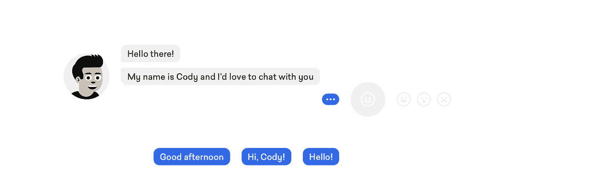

在这篇文章中，我将向你展示一个案例研究，描述为一个 B2B 网站设计对话式用户界面的整个过程，包括对话脚本的片段、沟通理论的基础以及一些我认为使这个项目有点独特的技巧和诀窍。

# 开始

现在是 2016 年末。许多人说对话式 UI 是 web 界面的未来。IM 应用程序、聊天机器人、基于文本的用户界面或表情符号可能从未如此流行过。有些人可能会说这只是另一种设计时尚，或者说基于文本的界面并不是什么新鲜事，但坦率地说——让我们承认——随着 iPhone Messages、Slack 或 Facebook Messenger 的出现，我们交换信息的方式发生了不可逆转的变化。如今，短信已经成为极其自然的交流方式。

因此，很自然地，当[矩形](https://therectangles.com)有机会为我们的一个客户在一个对话网站上工作时，我们没有一秒钟的犹豫。

*来吧——让我看看哪个团队现在不想参与这个项目。*

# 项目目标

客户:

*   Chop-Chop——一家网络开发公司

我们在本项目中的主要任务:

*   设计一套完整的对话式 UI 资产
*   创建对话脚本
*   处理最常见类型的*对话随机性*(意为 *f*ck* s 和*dfdffjhfkf*s)
*   传达品牌特征(也通过使用公司的品牌英雄， [Cody](https://cody.chop-chop.org) )
*   提高用户(对话者)的好奇心和喜欢度
*   展示公司网站开发技能

我会一步一步向你展示我们是如何做到的，但首先…

# 一点理论

让我们从基础开始。我认为，有时在进入更复杂的问题之前，暂时后退一步是很重要的。在这种情况下，它真的帮助了我们。信不信由你，但是通读所有这些基本的定义让我们看到了一些创造性的解决方案，并促进了整个构思过程。

我认为*你也不应该*跳过这一部分。

## 交流的原则

解释*沟通*的定义有上百种。下面这个是我找到的几个的混合版本。

> 交流是一个分享有意义信息的过程

信息(一般交流)可以是**口头的**或**非口头的**。

最常见的**言语交流**工具是*语言，*是一组用于以文字形式交换信息的符号，这些文字可以转化为意义。

*例子:*你好；谢谢大家；你今天看起来很棒

相比之下，非语言交流指的是任何不同于语言的交流方式。它可以是*手势、面部表情、语调、*，也可以是*动作、*或*符号、*，它们都具有共同的社会意义。

*例子:*👍,😞,😀

沟通是一个所有方面都相互影响的过程。这意味着沟通是整体的，整个过程创造了一个系统，在这个系统中所有的元素(所有的信息)为了共同的利益一起工作。

这些信息是**功能性的**，这意味着我们使用它们来获得期望的效果，但也是**适应性的**——这意味着，根据情况，它们可以被修改和调整，以实现更好的结果。

最后，我们用来交流的语言是基于**交流代码**的，这是一套原则和意义。他们为**解读**创造了基础。这种通信代码也被称为*规则*；有两种类型:

1.  构成规则:指特定词语的意义，以及我们应该如何解释它们。此外，它们告诉我们如何在特定的上下文中理解信息。
2.  规范性规则:根据给定的消息解释，帮助确定适当的反应。换句话说，他们告诉我们在特定的情况下，我们应该做什么，不应该做什么。

当然，最自然、最常见的交流方式之一就是对话。因此，在讨论对话式用户界面时，我认为我们还应该看一看一个示例对话定义:

> 会话是两个或更多人之间的谈话，通常是非正式的

那么，在没有强大的人工智能策划的情况下，有没有可能创建一个符合通信原理的界面呢？

对话式用户界面(CUI)定义可能是这样的:

> 一种基于功能性、适应性和有意义的信息交换的整体系统的界面，其中对话双方使用和解释语言代码，以友好、非正式的方式维护和遵守构成性和规范性规则

我们想创造这样的用户界面。

# 理论到实践—构建对话式用户界面

## 定义目标

B2B 中的聊天机器人有它们的功能。人们访问这样的网站有一个特殊的原因，因为他们想要的东西。这就像去餐馆或进入实体店一样。当然，有时人们这样做是因为他们没有更好的事情可做，或者他们只是想自娱自乐，但一般来说——这背后有一些目的；点餐、买一双鞋或了解价格。另一方面，当与客户交谈时，服务员或店员也有他们的任务和脚本要遵循。一个对话网站可以以完全相同的方式工作，聊天机器人的角色可以类似于店员或服务员。

*在这种情况下，我们确切地知道我们想要实现什么，因为我们已经与 Chop-Chop 合作多年(实际上，我在 2010 年共同创建了它)，但如果你需要帮助定义聊天机器人/用户的目标，你可以使用* [*以用户为中心的设计画布*](https://ucdc.therectangles.com) *。*

[](https://ucdc.therectangles.com) [## 以用户为中心的设计画布——第一个将用户需求与商业目标相结合的 UX 工具

### 以用户为中心的设计画布(UCDC)是一个易于使用和有效的 UX 工具，用于分析，组织和促进…

ucdc.therectangles.com](https://ucdc.therectangles.com) 

我们为聊天机器人指定了以下目标:

*   快印-快印品牌特征
*   使用网站*本身*来展示快速的网络开发技巧
*   向用户提供有关 Chop-Chop 服务的信息
*   鼓励用户将网站加入书签
*   了解用户的一些信息(姓名、职业、电子邮件、电话)
*   帮助联系(CUI 作为备选联系方式)
*   鼓励用户注册订阅时事通讯

# 第一部分。设计语言交流

## 构建对话脚本

UX 设计师应该能够预见。在这个项目中，我们知道这是我们建立一个没有人工智能支持的整体通信系统的唯一方法。我们需要一个使用自适应语法的伟大的**对话脚本**,它也能让对话对用户来说愉快而有意义。

## 1.对话框架

使用白板，我们从一个简单的思维导图开始。考虑到聊天机器人的目标，我们记下了所有可能的话题和对话部分。我们想快速检查最终脚本的复杂程度。

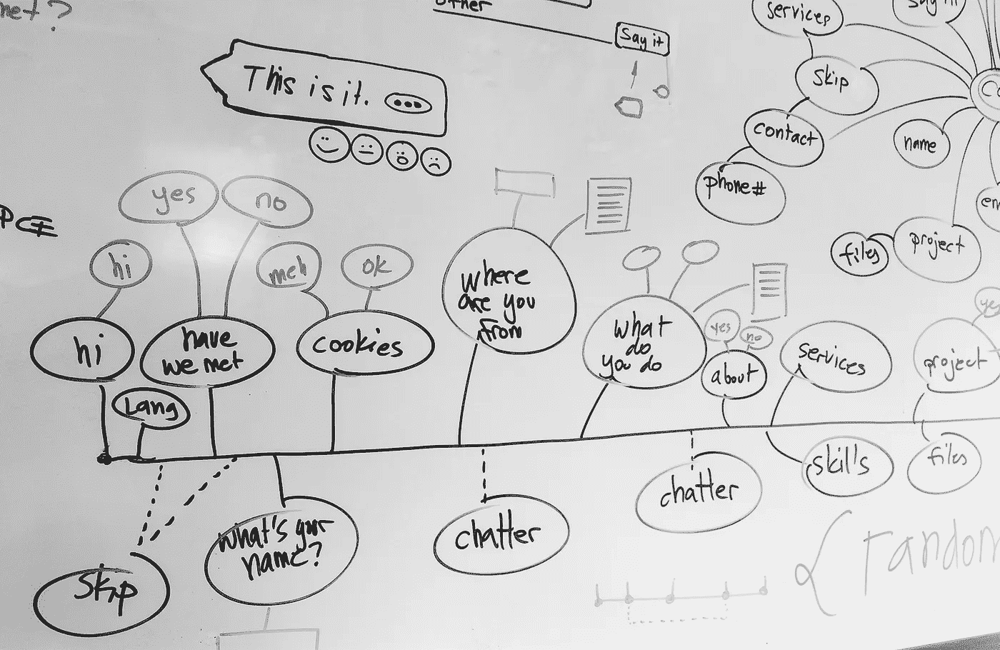

Early stages of writing conversation script

然后，我们按功能组对零件进行了划分和排列(我们称之为*块*)。我们已经开始看到一些模式。一些小组与目标相关(我们称之为*核心*)，其他小组负责使对话不那么正式(*聊天者*)，还有一个小组为用户提供选项或额外信息(*额外内容*)，还有对用户回答的反应。最后， *skips* 可以将对话快进到不同的脚本块。

脚本块的最终列表:

*   开始
*   额外的
*   跳过
*   核心
*   聊天
*   结局

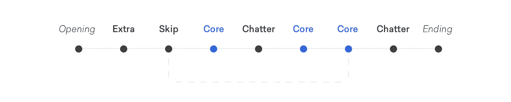

Example of simple conversation frame timeline

当然，最终的脚本结构比线性框架要复杂得多。基于对话整体性的所有依赖和无止境的组合使整个事情变得极其复杂。

## 2.剧本

从项目的第一分钟开始，这就是我们一直在等待的时刻:我们终于可以开始写真正的对话脚本了。这一部分很有趣，但也需要最大限度的关注。将脚本分成块要容易得多，因为所有的对话部分都可以单独编写。

好消息是，编写 CUI 脚本所需的唯一工具是纸笔或文本编辑器。

下面是一些脚本块的例子。

开场:

```
Hi, there 
I’m Cody and I’d love to chat with you 
    **Hi, Cody** 
How are you, today?
    **Well… Could be better**  
Bad day, huh? That happens…
```

额外:

```
I hope you don’t mind I use cookies  
    **What are these?**
My breakfast!
Haha, poor joke
Cookies are data about you stored by a browser
    **Sounds creepy but hm… OK**
Great!
```

跳过:

```
Hello, there!
You seem familiar 
Have we met?
    **Yes we have**
Ha! I’ve got good memory!
Last time we talked about Magento development
Do you want to continue our conversation?
    **Let's continue**
```

核心:

```
 **Tell me about you** 
With pleasure! :-)
Do you want to know where I come from?
Hear my story?
Or maybe learn what do I do for a living?
    **Where do you come from?** 
Well, the idea of me came from UX design studio The Rectangles
But it was Polish designer Jan Kallwejt who dressed me and did my hair
```

聊天:

```
You see that share in the top corner?
    **What about it?** 
If you liked our chat, introduce me to your friends! :-)
I’ll be happy to talk to them too.
   ** Maybe later**
```

结尾:

```
I have to go soon
Want to see some trick before?
    **Show me!** Press Cmd + D
Haha!
Did you bookmark me?
    **Not yet** 
Do it then! :-) 
Ok, it’s time for me to go 
Let’s keep in touch
    **Goodbye, Cody!**
```

## 3.语法

一个好的剧本应该让你创造一个不同的对话场景。如果用英语对话会更容易，因为英语语法相对简单。然而，在许多语言中，你应该能够通过用一个单词替换另一个单词来创建一个消息(短语)的多个选项。此外，**脚本设计师**应该能够指定用户的答案，选项等地方。

为了创建这样的脚本**符号**，你需要一组符号:圆括号、方括号、花括号，以及你和你的团队能够阅读和理解的任何东西。这对于将要实现脚本的开发人员来说也非常重要。他们也应该能够理解。

```
{ (Good morning) | Hello | Hi }, friend, { I’m | my name is } Cody!
```

在某些情况下，聊天机器人可以从特定的集合中随机选择一个单词*(Hello；嗨，嘿；Yo)* ，但它也可以更智能一些，根据用户一天中的时间显示一些消息*(早上好；*晚上好。

以下是一组符号及其功能的示例:

*   { } *花括号*:定义一组选项
*   | *管道*:分隔集合中的选项
*   ()*括号*:指定集合中与条件相关的选项
*   [ ] *括号*:表示用户输入


Example of syntax notation

⚠️ *如果你想了解更多关于写剧本本身的知识，* [*让我们知道*](http://therectangles.com/contact?ref=medium) *。*

## 4.聊天机器人消息

对话的视觉显示是这个项目最重要的 UX 挑战之一。以下是一些亮点。

**单一语句 vs 完整段落**

人家不是段子说话的。我们用单句说话。当然，这些有时会形成没完没了的话语，但在*对话*中，人们经常会轮流说话。此外，我们认为显示大段文字，用户需要在回答之前阅读，可以比作与一个语速惊人的人交谈。因此，我们决定显示单(短)句的组合，而不是段落。

**将单个语句组合成块**

通过操纵气泡的角半径，可以创建单个消息的逻辑文本块。这样，我们仍然可以*用句子而不是段落*交谈，但是给用户一个温和的提示——*嘿，这部分对话从这里开始，在那里结束*。

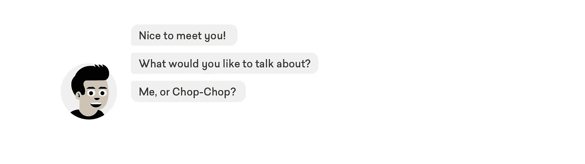

Rounded corners help to combine single statements into text blocks

**淡出 vs 滚动**

显示对话流最常用的方法是在旧消息下面不断添加新消息，并让用户滚动。

作为一个实验性的选择，旧消息可以淡出，因此不再需要滚动。我知道这种解决方案的实用性是有问题的，但是从不同的角度来看——这种解决方案反映了真实对话的本质。当你和别人交谈时，你也不能一直接触到交流的信息。

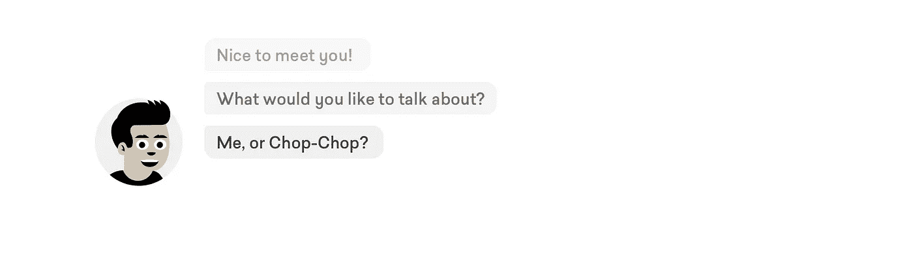

Using transparency to mark previous messages

此外，在某些时候，你可以简单地使用 *skips* 来询问用户是否想要返回到对话的任何先前部分，或者显示一个永久的“跳转到”按钮，当点击该按钮时，将触发机器人关于返回到任何过去段落的问题。

## 5.用户消息(回答)

对于一个不使用人工智能来解释用户答案的对话式用户界面来说，这是编写脚本最具挑战性的部分。脚本应该让用户(让我们在这里称他们为**对话者**)为聊天机器人提供逻辑答案(记住，构成性和规范性规则)，但对话越自然、越开放，对话者就越有娱乐性。

我们使用了两种类型的答案:

A.**已定义**(受控，*封闭式*)

*   它们相对容易处理
*   他们需要良好的预测技能
*   用户可能不被允许说出他们想说的话

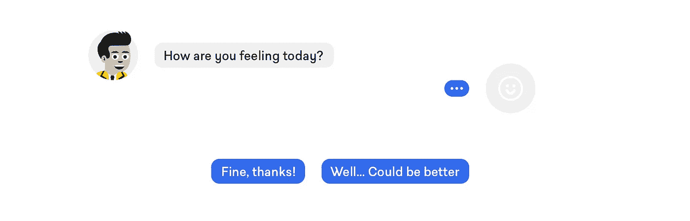

Sample defined answer

B.**未定义**(非受控，*开放式*)

*   它们更难处理
*   它们可能需要解析一些预定义的单词数据库
*   用户可以更自然地交流

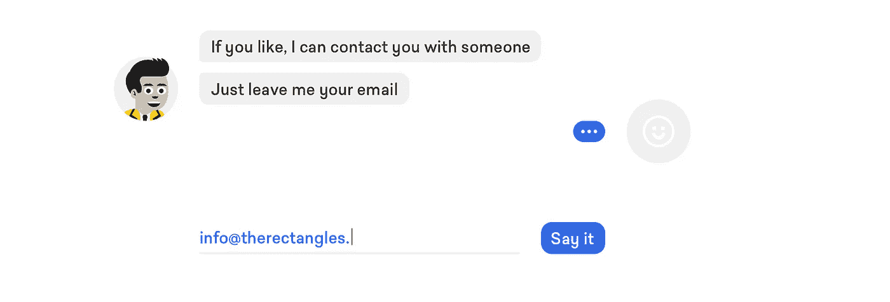

Sample non-defined answer

可能没有处理开放式答案的通用方法。我们不能假设人们会遵循**沟通代码**。一些未定义的消息将违反(尤其是)T2 的规范性规则。当然，一些用户会说*(写)*，就像他们会和人类说*(写)*一样，但是当然，其他人会试图通过发送**性短信**、**脏话**或**胡言乱语**来挑战你的机器人。

以下是一些如何控制未定义消息的提示:

*   输入可以仅限于指定的符号集(例如，如果要求输入名称，则只允许输入字母)
*   正则表达式(regexp)可用于某些输入(如电子邮件)
*   使用大量最流行的脏话
*   (我会小心使用这个，但是)使用一些带有 API 的字典来检查你期望的答案是否真的是单词

自然，一个理想的对话应该是无拘无束的，但是在没有人工智能支持的对话用户界面的情况下——嗯，*一点点*控制是不可避免的。

*还有一件事:*

当使用定义好的问题时，你可以通过一个小小的改进让回答的体验稍微好一点。不要问这样的问题:

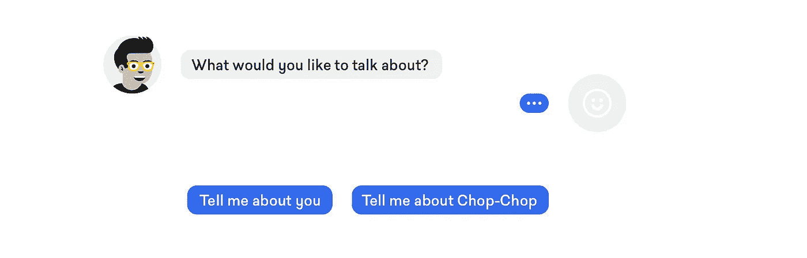

Close-ended question without options

这样问:

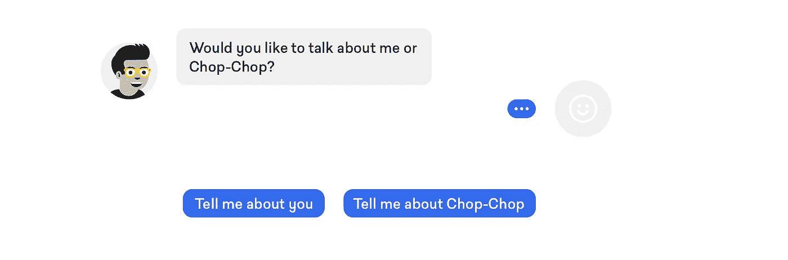

Close-ended question with options

这是纯粹的心理学——在第一个例子中，用户可能拥有的(可能)无限的选项范围是有限的，而在第二个例子中，你指定了这个范围，并给了用户一个选择。两种情况下的结果是相同的，但 UX 在后一种情况下更好。

## 6.感叹词、填充词、非词汇对话声音

人们说话时会含糊不清、犯错误、犹豫不决或迷失方向。这很正常。我们希望与聊天机器人的对话也能如此自然。所以我们也用了它们。

这里有一些流行的**会话非词汇音** : *是的，好的，嗯，哦，嗯，嗯，嗯，嗯，嗯，你知道，嗯嗯*


Sample usage of non-lexical sounds

# 第二部分。设计非语言交流

## 1.消息排列

机器人和用户的头像及其信息的排列方式也不应该是偶然的。有两种最常见的类型的*显示*对话:

A.头像+消息一个接一个对齐(大多数情况下，靠左)


Aligned message arrangement

B.两个用户的头像+消息彼此相反


Opposite message arrangement

我们认为选项 B 更好地反映了真实对话的本质。通常两个人说话的时候，都会看着对方。因此，为了让对话界面感觉更自然，对话者的头像和他们的信息也应该以这种方式显示。

## 2.聊天机器人的出现

我们很幸运，因为 Chop-Chop 有一个品牌英雄。更重要的是，Cody 绝对适合任何对话式 UI 用途，因为他有一个我们可以使用的大型预设计外观库。我认为很快公司将开始通过测试不同的**聊天机器人头像**来测量和优化**对话式用户界面转换率**。

不仅如此，我敢肯定，如果我们有科迪的*女性*对等物，用户的反应将与那些*男性*完全不同。

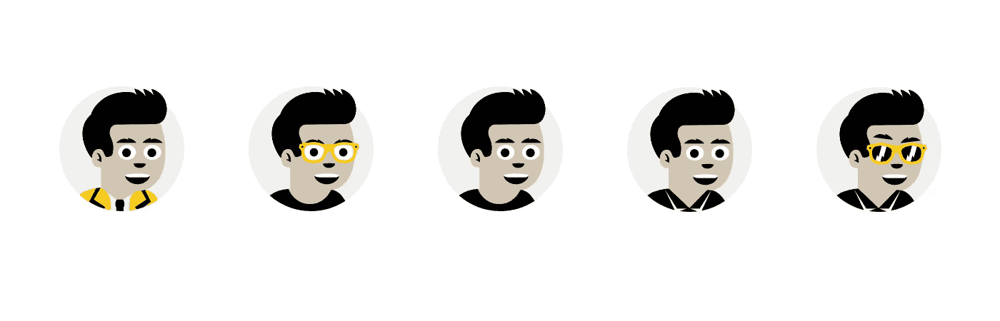

Cody avatar variants

另外，我认为人们应该避免使用他们的照片作为聊天机器人的头像。这很令人困惑——我是在和一个机器人说话，还是在和一个人说话？真的，机器人的视觉外观是设计师应该非常小心的事情。顺便说一句，这是一个进化的事实:面部识别是小孩子最先发展的能力之一，通常发生在他们学会说话的几个月之前。

此外，如果你想用你的真名作为你的机器人的名字，确保你的脚本也反映了你的真实个性。与机器人的日常聊天可能会对你的真实形象产生不利影响。

## 3.聊天机器人的面部表情

面部表情超级重要。我们也想把它包含在我们的项目中。

**眨眼和眨眼:**

人们平均每分钟眨眼 10 次。科迪也一样。还有，**眨眼**可以是附加的非语言信号*(比如:不，我只是开玩笑；开玩笑)*。


Blinking chatbot avatar

**6 种基本情绪:**

此外，聊天机器人的反应可能属于 6 种基本情绪之一:

*   快乐
*   悲哀
*   惊喜
*   害怕
*   厌恶
*   愤怒

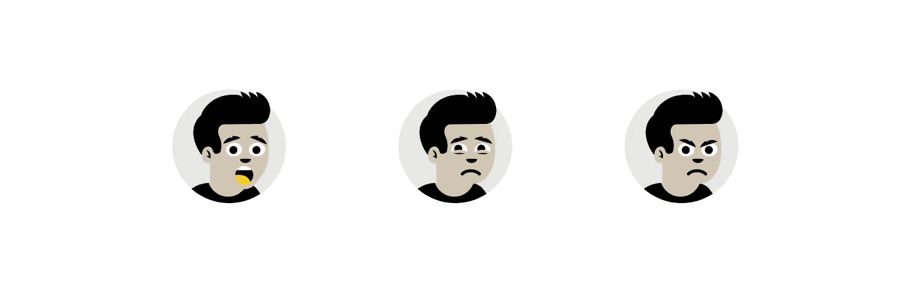

Sample Cody facial expressions

## 4.用户的面部表情(实验)

我们希望用户也能向科迪发送非语言信息。我们使用用户头像来做到这一点。通过悬停头像，用户可以改变他们的面部表情，作为对科迪信息的反应。它没有明显地反映出*真实的*面部表情，但它是与对话式 UI 进行交流的另一种方式。


Alternative user facial expressions

## 5.使用表情符号

现在大家都用表情符号。这不应该是一个惊喜。它们是普遍的和非常有用的，它们给书面交流增加了非语言的层面。

比较这两条短信:

A.我讨厌你！

B.我讨厌你！😄

我想对我们大多数人来说，b .可以很容易地翻译成:*我爱你，伙计！*

显然，科迪和我们大多数人一样使用表情符号。

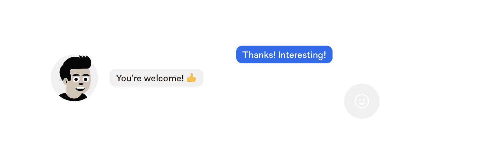

Message with emoji

## 6.寒暄式表达——活跃对话

动画可以将对话式 UI 用户体验提升到一个新的水平，使 UI 交互对用户来说更加自然和愉快。但这还不是全部，动画元素可以在整个对话中发挥重要作用，负责所谓的**寒暄表达**。简单来说，这就是让对话流畅的一切。

**制作聊天机器人头像的动画**

当两个人见面时，他们通常以握手开始交谈。它可以让你更接近谈话者，看着他们的眼睛，更清楚地看到他们的脸。因此，Cody 的头像在对话开始时会稍微大一点，让用户熟悉 Cody，当第一条消息被交换时，头像会变小。

**打字指示灯**

简单的加载(打字)指示符可以作为说话中相当于 phatic 的表达，告诉用户——*保持冷静，蜜兔，我还在，给我一秒钟反驳*。

打字指示器的数量是无限的。这里有一个最常见的:


Typing indicator

**打字指示器和悬停状态**

此外，我们决定使用输入指示器来提示用户— *嘿，你就要说出来了*。一个静态的打字指示器显示在用户头像旁边，但是当用户悬停时，比如说封闭式的回答按钮，打字指示器开始动画化。

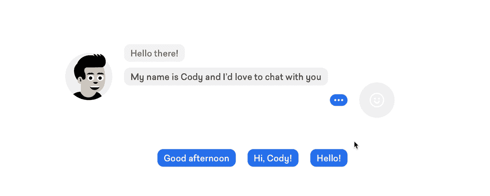

Hover activated typing indicator

# 结局

这绝对是矩形最近参与的最有趣的项目之一。对于我们的团队来说，在网上的对话网站还很少的时候设计一个对话网站是一次奇妙的冒险。老实说，我们学到了很多——我们不能再等待这样的项目了。

现在，我们也看到了——UX 设计的未来是写作。

*描述我们聊天机器人脚本编写过程的文章已经发布:*

[](https://uxdesign.cc/making-chatbots-talk-writing-conversational-ui-scripts-step-by-step-62622abfb5cf) [## 让聊天机器人说话——一步一步编写对话式用户界面脚本

### 作为一名内容作家，在 UX 设计公司工作，我已经学会接受这样一个事实，视觉效果通常要大得多…

uxdesign.cc](https://uxdesign.cc/making-chatbots-talk-writing-conversational-ui-scripts-step-by-step-62622abfb5cf) 

科迪聊天机器人网站目前正在快速开发中。
准备就绪时得到通知— [*保持联系*](https://therectangles.com/newsletter) *。*

如果你喜欢这篇文章——如果你能推荐或留下评论，我会非常感激。也可以 [*在 Twitter 上关注我*](https://twitter.com/leszekzawadzki) *。和平！*