# 使用 SaaS 工具进行转换优化

> 原文：<https://medium.com/swlh/conversion-optimization-tools-4f7669fceb07>

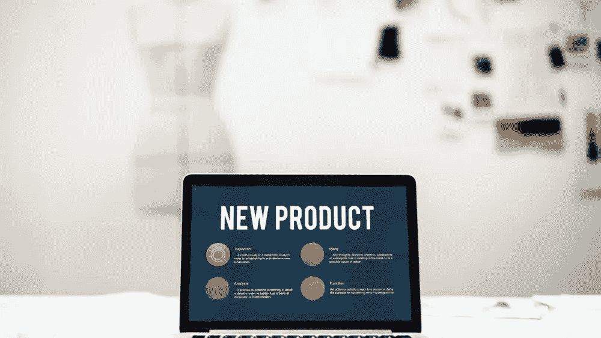

我敢打赌**你的网站充满了有价值的内容**，放在不同的地方。你有没有想过如何用你做的东西吸引用户？这比你想象的要容易。

如果你开了一个博客，写了一本电子书，甚至是一个洗衣机的说明书，你就有了用户正在寻找的大量内容资源。**你唯一需要的是稳固的分销渠道**。社交媒体？是啊！但是还有更多…

您听说过登录页面和销售线索捕获工具吗？如果没有，我会在下面给你展示这些工具的例子，有了它们，几乎不费吹灰之力，**你就可以提高网站的转化率并获得销售线索！**

**—是一种由接收者、潜在客户为回应互联网上针对他的广告宣传或 SEO 行为而做出的确定的、预期的行为。例如，如果您的客户购买了您的产品或下载了一本电子书，就可能发生转化。**

*但这还不是全部！我将要写的应用程序在 SaaS 模式下是可用的。有了它们，**您将能够构建一个复杂的环境来运营您的业务**，方法是将它们连接到 CRM、您的邮箱、邮件自动化工具和许多其他工具。我们开始吧。*

# *什么是登录页面？*

**一个* [*登陆页面*](https://instapage.com/what-is-a-landing-page) *是一个简单的网站，为广告和营销活动而创建，以获得客户。**

*用户点击你的 Google AdWords 活动后会发现自己在这个网站上。他/她也可以来自脸书的广告，链接在时事通讯或简单地通过浏览互联网到达。*

***提示！将你的登陆页设置为主页不成问题——你创建、发布、定位就大功告成了。***

# *登陆页面的目的是什么？*

*把访问者的注意力吸引到分离的内容上可能会导致离开他的电子邮件，下载电子书，访问你的网站或者购买你的产品。*

*也许你想知道，为什么你需要登录页面，而在你的主页上有电子书标签？是的，但是主页上有很多标签或者信息，用户经常会感到困惑，找不到他要找的东西。*

***提示！精确的信息和透明的内容使登陆页面有效。***

*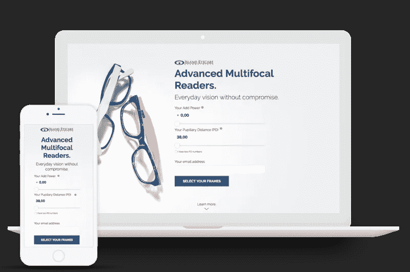*

# *如何利用登陆页面？*

*有很多方法可以应用登陆页面，这取决于你，你将如何使用它，它会给用户带来什么样的竞争。最受欢迎的方式有:*

1.  ***电子书和指南分发** —用户访问您的登录页面并留下他的电子邮件地址来下载资料。*

*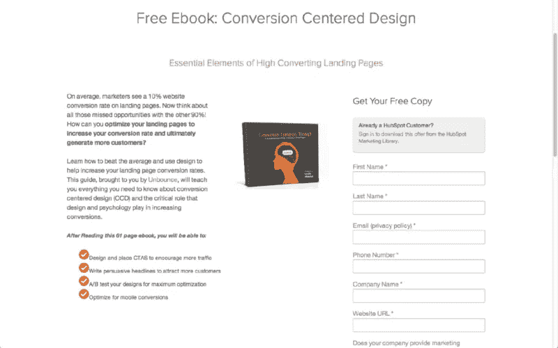*

*2.**注册网上研讨会，注册活动** —用户填写表格。*

**

*3.**招聘表格** —你得到基本数据和详细信息。商务化人际关系网*

*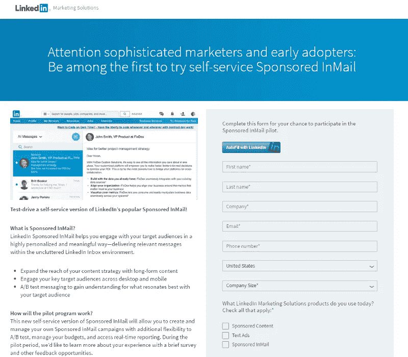*

*4.**产品推广**——你在网上建立特定产品的知名度。*

*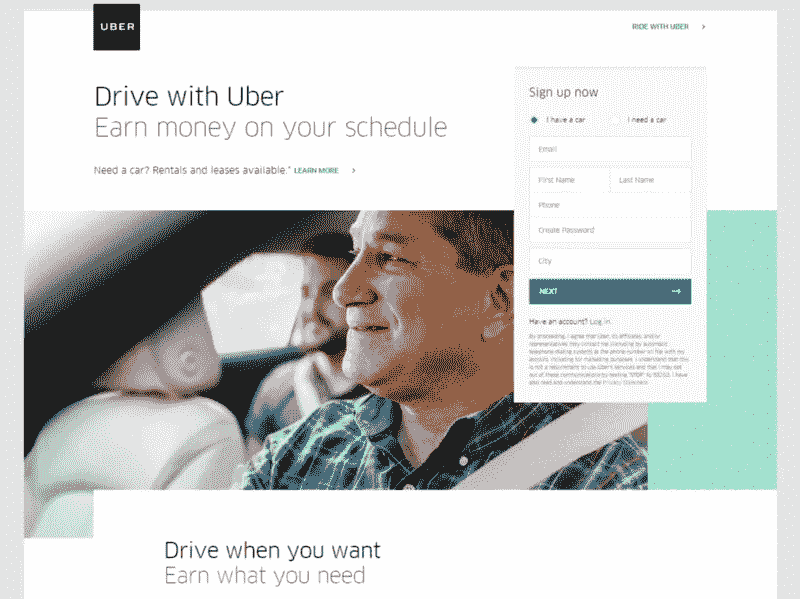*

*现在你知道什么是登陆页面了！虽然看到它的专业例子可能会让你认为，IT 技能和专业知识是创建这样的网站所必需的。你大错特错了。这是件轻而易举的事，此外，像 Landingi 这样的应用程序可以帮助你。*

# *兰丁吉*

*Landingi app 是一个编辑器，可以轻松创建专业的登陆页面。所有这些都需要专家的帮助。*

*使 Landingi 与众不同的是编辑提供的**支持和设施。在他们的网站上，你可以找到[指南、视频资料、指示](https://landingi.com/blog)，让你了解编辑的所有秘密。他们会告诉你如何制作完美的登陆页面。***

*Landingi 是一个负担得起的解决方案。它的基础版价格是其他的不能比的，像 [Instapage 的](https://picksaas.com/landing-page-builders/instapage?utm_source=blog&utm_campaign=Conversion%20tools)。*

*您还可以将 Landingi 与您日常使用的其他应用程序连接，如 [Pipedrive](https://picksaas.com/crm/pipedrive?utm_source=blog&utm_campaign=Conversion%20tools) 或 [LiveChat](https://picksaas.com/live-chats/livechat?utm_source=blog&utm_campaign=Conversion%20tools) 。*

*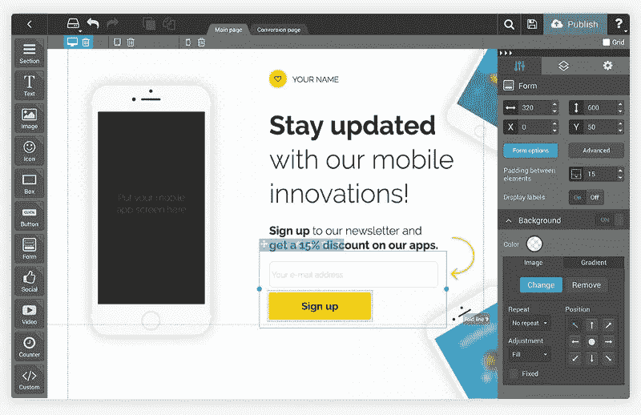*

# *Instapage*

*Instapage 是一个用户友好的登陆页面编辑器。它的界面非常像 PowerPoint 所有必要的功能都放在顶栏上，只需点击一下就可以打开。*

*创建一个登陆页面，你可以添加不同的元素，比如表格，形状，照片，电影，按钮，甚至时钟。您将找到创建独特目标网站所需的每个细节。*

*由于简约和专业的外观，登陆页面的布局吸引了人们的注意。这是登陆页面应用的另一个优势。它们有一百多个，但和其他页面生成器没什么区别…*

*值得你关注的，是丰富的分析可能性。 [A/B 测试](https://blog.kissmetrics.com/ab-testing-introduction/)支持对各种系统或已发布网站形式的效率进行分析。*

***提示！**热图可以读取用户在网站上的行为，这让您可以总结出如何根据用户需求调整网站。*

*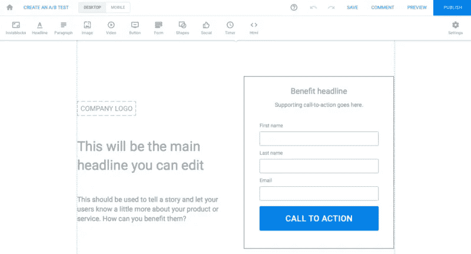*

# *如何创建登陆页面？*

*你需要的只是一个想法。如果你还没有，那也没关系——这些应用程序提供了根据用户需求制作的模板，你可以在你的活动中使用它们。*

*你曾经使用过像 PowerPoint 或 Prezi 这样的工具来制作演示文稿吗？他们使用拖放界面，这意味着你选择一个元素，将其拖动到你选择的幻灯片上的位置，然后放下。这没什么难的，你同意吗？*

# *拖放并完成！*

*兰丁吉就是这样工作的。照片、视频、表格或形状等小工具放在编辑器的左侧栏中。您可以将它们添加到目标站点的模板中，方法是单击并将其拖动到您想要的任何位置。*

# *小部件还不够吗？*

*您可以个性化您的字体，更改图片或文本的透明度，添加效果——所有这些都在屏幕右侧的选项面板中。*

*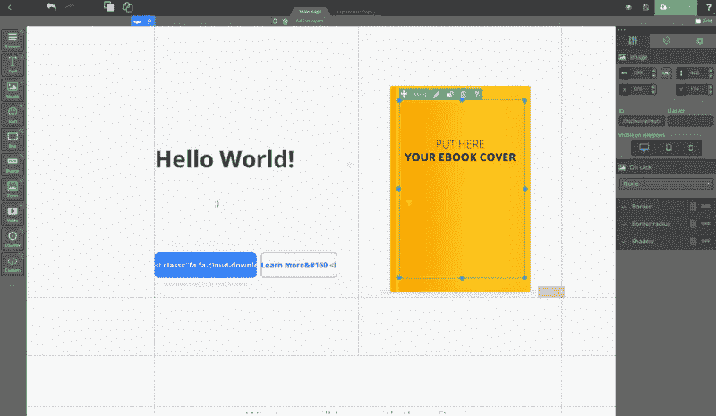*

***提示！在创建登陆页面时，不要忘记表单，毕竟用户应该把他的数据留在那里。此外，最好确保您的表单符合 GDPR 标准。***

*和其他东西一样，你可以随意编辑表单，例如，在表单上留下姓名、电子邮件地址或鞋码。*

# *一步一步…网站转换后*

*快好了！下一步是准备“转换后的网站”——显示的网站，同时用户填写表单并单击“发送”。*

*你可以在这里写上感谢你填写表格或者下载资料，比如电子书。*

***表格中的潜在客户将被发送到您的 Landingi 帐户的潜在客户库。**由于应用程序的集成，它也可以发送到您的邮箱或 CRM。*

***提示！**记住！登陆页面的可能性是无限的！这取决于你，取决于你如何使用它们。*

# *更多用户的参与？线索捕捉应用程序*

*你已经知道，你的网站每天都有人访问，但是用户并没有找到最有价值的内容。**销售线索捕获工具可以保存更长时间**。*

**销售线索捕捉应用是吸引用户访问您的网站、获取他的电子邮件或鼓励他推荐它的好方法。**

*我保证你熟悉这些工具的作用方式，并且你一直在使用它们。*

*这些是**弹出窗口和智能栏**，包含订阅鼓励、销售优惠、电子书下载邀请、反馈请求等。*

*很难不关注这样的消息。尤其是当它们突然出现，用信息覆盖整个屏幕的时候。我不想撒谎，我不止一次以这种形式留下我的电子邮件地址。但另一方面，很多时候这很烦人！*

***提示！**弹出广告不是[谷歌广告](https://picksaas.com/marketing-channels/adwords?utm_source=blog&utm_campaign=Conversion%20tools)或[脸书广告](https://picksaas.com/marketing-channels/facebook-ads?utm_source=blog&utm_campaign=Conversion%20tools)。*

*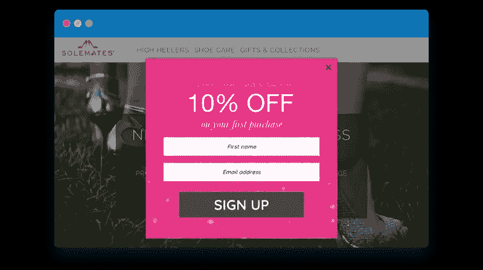*

*相扑和 [Poptin](https://picksaas.com/lead-capturing/poptin?utm_source=blog&utm_campaign=Conversion%20tools) 可以通过使用弹出窗口帮助你提高转化率。*

# *波普丁*

*Poptin 是一个弹出式编辑器，它允许你创建**对话框，在你的站点上共享以增加用户的参与度**。*

***提示！**设置显示选项——何时、何地、为谁以及如何显示对话框，例如:弹出，当用户想要离开站点时弹出。*

*当您个性化您的弹出窗口时，应用程序将生成一行代码粘贴到您的站点上。它还包含显示对话框数量、出现的销售线索等的分析。*

*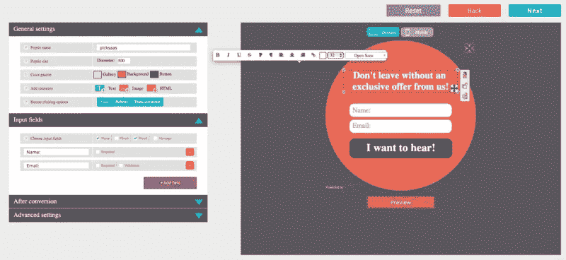*

*我认为 Poptin 适合所有人，不仅仅是因为它很简单——它没有不必要的功能，所以它是为弹出窗口创建者而生的。而波普丁是其中的佼佼者。*

# *相扑*

*这是最好的线索捕捉应用程序之一，允许您准备、启动和分析弹出式活动。*

*第一次接触相扑可能会有点受不了。登录后，会出现许多显示可用功能的栏。*

*只需要一会儿就可以开始在场地周围顺畅地移动。你可以在那里找到一些功能:弹出式编辑，联系表格或分享按钮。利用率分析内置图表，与其他分析工具(如 Google Analytics 或其他工具)集成，您可以在以后使用。*

*相扑的功能可以分为 4 个部分:*

1.  *创建一个典型的弹出表单，鼓励订阅、下载电子书，推广你的博客材料，并创建一个网站联系表单，允许用户给你留言。*
2.  *分享按钮——你可以根据自己的需要进行配置，例如，在你的网站上显示你的社交媒体链接。*
3.  *相扑使您可以设置自己的实时聊天对话框。该应用程序结合了数量惊人的功能。*
4.  *分析和热图——相扑有一个面板，可以获得公司的统计数据。热图也很有趣。他们让你测试你网站的流量，所以你可以根据你用户的需求进行调整。*

***提示！**将相扑与谷歌分析相结合，这样你就可以在相扑的界面上显示你的一些数据。*

***是时候创建自己的弹出窗口了。***

*很难吗？当然不是！就像登录页构建器一样，每个人都可以使用线索捕获工具，您需要的只是一个想法。*

# *获取弹出窗口的 5 个步骤*

1.  *在我们的表单上选择活动的目标、数据个性化和 CTA。*
2.  *设计-选择形状、颜色和字体。*
3.  *弹出显示设置。*
4.  *与邮件自动化工具(如 CRM)的集成。*
5.  *在您的网站上发布。*

*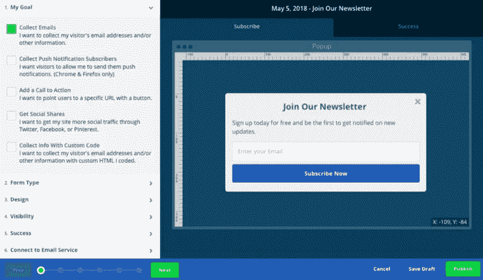*

*线索捕获工具可提高转化率。很难错过在你想离开网站之前突然出现的表格。值得记住的是，他们的力量是有效的行动号召和他们带来的信息。*

# *自动化来自登录页面和销售线索捕获工具的工作流*

*Sumo、Landingi、Poptin 是在 SaaS 模式下运行的应用程序。这带来了许多可能性，让您的日常工作更加有效。*

*[自动化](https://picksaas.com/blog/6-saas-apps-to-automate-workflow?utm_source=blog&utm_campaign=Conversion%20tools)为您节省宝贵的时间！例如，从 Landingi 导入销售线索只需点击两下鼠标。**在登陆页面的帮助下获得的销售线索将会出现在你的销售渠道上**而无需分别复制和粘贴每一个联系人的漫长而乏味的过程。*

# *为什么集成是向前迈出的一步？*

*将 [Sumo](https://picksaas.com/lead-capturing/sumo?utm_source=blog&utm_campaign=Conversion%20tools) 与 [MailChimp](https://picksaas.com/mailing-automation/mailchimp?utm_source=blog&utm_campaign=Conversion%20tools) 集成是您公司营销自动化的第一步。由于这种集成，网站的引导信息会进入 MailChimp，并自动以时事通讯的形式发送出去。*

*[LiveChat](https://picksaas.com/live-chats/livechat?utm_source=blog&utm_campaign=Conversion%20tools) 语音气泡出现在你的 [Landingi](https://picksaas.com/landing-page-builders/landingi?utm_source=blog&utm_campaign=Conversion%20tools) 登陆页面上。它们的集成非常容易，你需要做的只是复制一行代码，然后粘贴到 Landingi 的编辑器中。有了这个，你就能和客户直接接触，也能很快回答问题。*

# *营销的新艺术——修复转变的方法*

*在过去的几年里，由于市场营销和销售的诸多变化，获得客户的新方法变得越来越重要。**从商业的角度来看，艺术不再是在网站上创造流量，而是对****的转换和优化。今天介绍的 SaaS 工具一定会帮你做到这一点。这就是为什么现在就开始为你的公司建设一个更美好的明天。***

****在*[*picksaas.com*](https://picksaas.com/?utm_source=blog&utm_campaign=Landingi)*，我们帮助您找到 SaaS 软件来发展您的业务。****

****我们发现、研究和分析 SaaS 应用，并为我们的用户推荐最佳解决方案。****

****原载于【picksaas.com】**。******

******

## ***这个故事发表在 [The Startup](https://medium.com/swlh) 上，这是 Medium 最大的创业刊物，拥有 333，253+人关注。***

## ***在这里订阅接收[我们的头条新闻](http://growthsupply.com/the-startup-newsletter/)。***

******