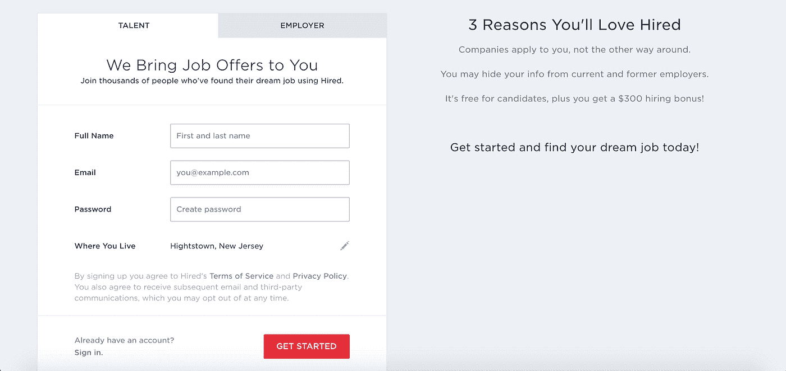
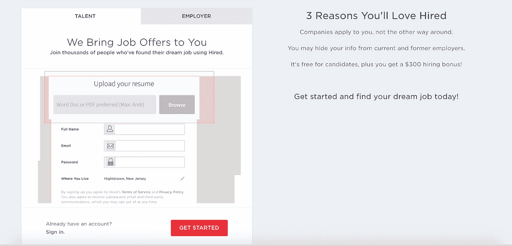

# Hired.com 的转换率优化

> 原文：<https://medium.com/swlh/conversion-rate-optimization-for-hired-com-47777c8f4ea1>

Hired.com 是一个双向求职市场，它逆转了招聘过程，让公司表达对候选人的兴趣，要求面试，并在面试过程中帮助他们。该公司提供人才倡导者，帮助候选人打开招聘之路的一部分，并为他们找到合适的工作提供建议。他们独特的收购策略之一是为候选人在网站上进行的招聘活动提供招聘奖金。

如果 Hired.com 的目标是增加完成注册流程并准备被雇用的销售线索/申请人的数量，会怎么样？产品经理如何着手解决这个问题？

这是一个典型的转化率优化案例，目标是优化网站的登陆页面/注册以增加转化率。虽然增加登陆主页的人数可以解决这个问题，但这是一个间接的解决方案。解决这个问题的最好方法是增加通过注册漏斗的用户流量，一种流行的方法是 A/B 测试。

## 假设生成:

A/B 测试假设可以这样表述:

“添加简历上传字段**将**帮助求职者更快地完成个人资料填写阶段，**因此，通过漏斗降低**流失率。”

谨慎的做法是查看网站的当前状态，以及一些可能表明为什么访问者会有某种行为方式的提示。

1.  Hired.com 的访问者首选的浏览位置是他们的工作场所。平均花费在网站上的时间接近 3 分钟。
2.  有 4 个不同的页面上的多个字段，其中大多数是用户注册的强制性。注册过程需要 7-9 分钟，经过多次来回输入信息。

人们可以从这些信息中推断出，许多访问者可能没有时间完成注册过程，因为他们可能是在工作场所浏览网站。许多指针将进入构建假设，我选择列出假设，但不进入指针(其中一些来自研究、经验和直觉)。

1.  添加简历上传字段将有助于求职者更快地完成个人资料填写阶段，从而降低漏斗中的流失率。
2.  添加一个指向注册/登录标签的视觉提示将有助于引导用户找到行动项目，从而降低跳出率。
3.  通过提供一个进度+里程碑栏来修改注册过程将有助于用户了解商店里有什么，从而减少漏斗流失
4.  在字段中添加图标并突出显示已填充的字段会给用户一种成就感，从而减少注册流失。
5.  添加“立即聊天”应用程序，直接将您与人才顾问联系起来，这将有助于用户更加信任网站，从而增加行动号召的数量。
6.  在移动和网络平台的“注册”选项卡中添加社交注册选项将有助于用户快速注册，从而增加行动号召的数量。
7.  在主页上增加一个免费下载内容的选项将会激励用户留下他们的电子邮件 id，从而增加从这个漏斗中产生的潜在客户。
8.  将“注册”和“开始”框的颜色修改为红色将加强用户采取行动的呼吁，从而提高 CT 率。
9.  修改社交注册图标的大小，并将它们添加到注册动作中，将促使用户快速开始建立个人资料，从而提高 CT 率。

我选择了第一个，因为他们的大多数用户都是从他们的工作场所访问网站的，他们应该被激励尽快完成这个过程，回到他们的工作中。雇员可以更早地要求用户上传简历，而不是在过程的四分之三后才提示潜在用户上传简历。

在我看来，做出这一修改的复杂性并不显著，即使候选人选择退出注册过程，它也可以至少保留候选人的简历，从而使 Hired.com 受益。这将为被雇佣者提供有价值的信息，然后他们可以根据从简历中获取的数据，向候选人发送个性化的电子邮件、提示，甚至是工作建议。

## 规格和线框:

Current layout

Redesigned layout

我使用草图重新设计了布局，添加/修改的内容在红框中突出显示。

1.  附加:一个输入字段，允许用户上传他们的简历。

在后端，文档解析器可以提取下面列出的信息，并在配置文件完成过程中将它们填充到字段中。本地技能分类法可以提取关于他们的技能、使用的工具等信息。

1.  技能
2.  语言
3.  LinkedIn/ Github 个人资料链接
4.  作为开发人员，项目经理等的经验。

## 如何对此进行衡量:

在这种情况下，产品经理需要仔细衡量的几个指标是:

1.  转换百分比增加
2.  注册过程中节省的时间
3.  部分注册数量的百分比增长

**转换率增长**在两种场景中占完成注册过程的用户的百分比:A 和 b。场景 A 处理显示当前注册过程的用户。场景 B 伴随着新的注册过程。计算这两种情况下的转换，以了解此更改是否会产生任何积极影响。

**注册过程中节省的时间**非常简单。顾名思义，它计算在两种情况下完成注册过程所需的时间，并确定其影响。

部分注册用户根据他们的兴趣向他们发送有针对性的电子邮件，通过分析他们简历中的信息来寻找职业道路，这样就可以计算出能够重新回到网站的用户比例。可以在之前和之后的场景中进行百分比比较，以观察该指标的改进。

## **样本量:**

Optimizely.com 的[有一个计算器，可以帮助产品团队的某个人计算执行 A/B 测试所需的用户样本量。根据一些网上信息，我计算出 Hired.com 的基线转换率约为 42%。要实现 20%的增长(到 52%)，必须考虑 300 个用户的样本规模，以 95%的统计显著性来衡量变化。](https://www.optimizely.com/sample-size-calculator/?conversion=42&effect=20&significance=95)

这是一个典型的过程，在这个过程中，人们将从用户行为中理解转换问题，拟定假设，定义关键指标，设计解决方案，计算测试假设的样本量，并最终实施解决方案以优化更好的转换。

## 这篇文章发表在 [The Startup](https://medium.com/swlh) 上，这是 Medium 最大的创业刊物，有 287，184+人关注。

## 订阅接收[我们的头条新闻](http://growthsupply.com/the-startup-newsletter/)。

