# 使用额外副本进行转换:5 个长格式登录页面示例

> 原文：<https://medium.com/swlh/converting-with-extra-copy-5-long-form-landing-page-examples-e988c6ab93d0>

*由* [*詹妮弗·佩珀*](https://twitter.com/pepperswrite) ，*营销经理在发布会上负责内容创作*

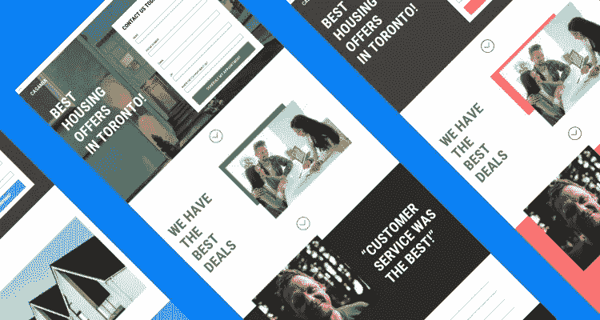

我们都知道一个短小精悍的登陆页面是多么有效。它读起来很快，而且根据可供选择的内容，可以说服访问者快速购买或选择加入。

但是构建长格式页面也有好处。首先，较长的页面可以提供访问者做出明智决策所需的深入信息，帮助您从一开始就吸引更多合格的潜在客户。此外，你的公司可能会提供更适合更长的页面来做更有说服力的工作。

根据我们的[转换基准报告](https://www.conversionbenchmarkreport.com/?_ga=2.211348757.1067376729.1532639172-1324364861.1530660550?utm_medium=referral&utm_source=medium&utm_campaign=blog-post-long-form-lp&utm_content=conversion-benchmark-report)，该报告分析了超过 7400 万 lead-gen 登录页面访问者的行为，125 个单词或更少的页面*通常*有 15%的高转换率(我的意思是，简洁转换！)但是对于 250 到 750 个单词的页面，我们发现转化率在这个范围内变化很小。

这是每个文案都面临的问题:

> “我的登录页面应该有多长？”

嗯，答案是微妙的，归结为手头的报价。**在很多情况下，长格式的登录页面实际上会比短格式的登录页面更好**。例如，如果你是:

*   描述产品的技术细节和深层优势，
*   展示贵公司的成就以建立信誉，或
*   说服客户投资特别昂贵的软件、服务或高承诺产品。

页面长度与偏好关系不大，而与手头产品的复杂程度和购买过程的阶段关系更大。你需要涵盖你所有的基础，预见到反对意见，并表明你的提议是合法的。对数量有限的拷贝来说是一项艰巨的任务。

因此，为了启发你下一个不那么短的页面，我们分析了下面五个长格式的登录页面示例。下面是我们对为什么这些内置非绑定页面工作得这么好的看法。

# 例子 1:美国行政中心

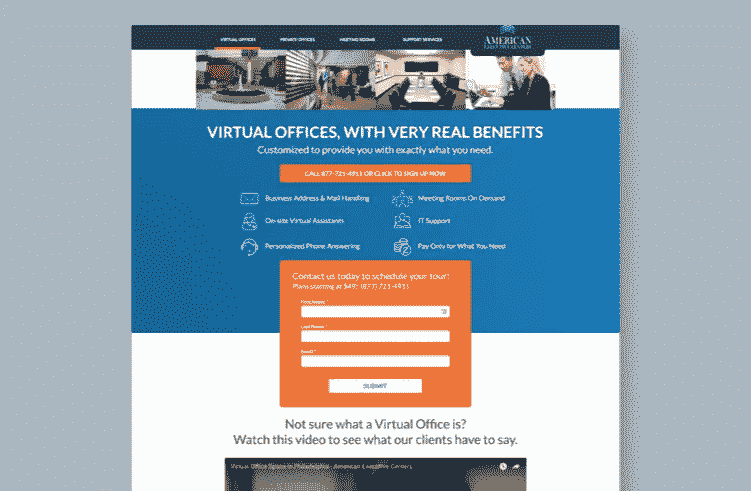

[Click here](https://unbounce-wpengine.netdna-ssl.com/photos/aec-long-form.jpg) to see the full page

> 为什么会这样:没有什么问题是没有答案的

这种长格式的登录页面立即在标题和折叠上方突出了美国行政中心的独特产品(即，他们提供虚拟办公服务，如邮件处理、虚拟助理和会议室)。考虑到潜在客户在这里面临的决定，品牌在页面的开头提供一个项目符号，快速阅读的列表是很重要的。

通过像这样列出所有关键特性，读者可以很快了解 AEC 是否能满足他们的核心需求。这对于忙碌的决策者来说尤其重要，他们正在比较他们的选择。举例来说，如果 AEC 的登录页面只是其他人在其浏览器中打开的众多页面之一，那么它就为竞争页面提供了一个强有力的理由，在这些页面上，核心产品可能更难被发现。

登录页面也不止于此。他们的联系形式出现在两个部分之间的橙色矩形折叠的上方。这种对比鼓励眼睛向下移动页面。

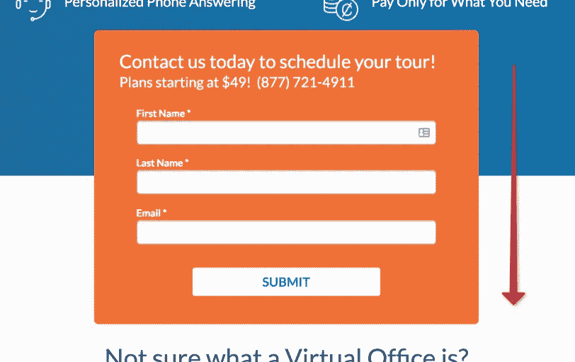

在文件夹下方，AEC 分享了关于他们在何处运营的详细信息，并强调了相对于竞争对手的优势。他们还列出了套餐和价格，因此客户可以独立决定服务是否符合他们的预算。

**这里的教训？可能不需要额外的文案来说服消费者购买个人产品，但当他们的决定影响到整个团队或工作场所时，这显然会有所帮助。**对于像 American Executive Centers 这样的 B2B 公司来说，使用长格式的登录页面是有意义的，因为它允许该品牌迎合买家旅程中更激烈的考虑阶段。

# 例 2:鲁特先生管道

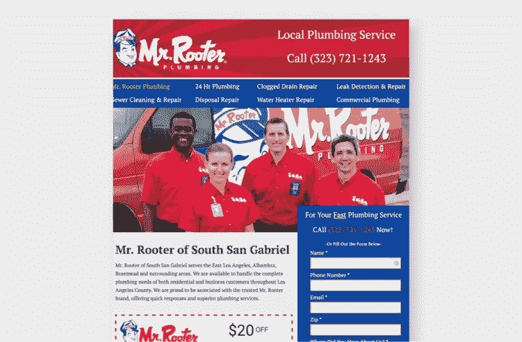

[Click here](https://unbounce-wpengine.netdna-ssl.com/photos/mrrooters-long-form.jpg) to see the full page.

> 为什么这么做:简单、直接的设计——以及对顾客的激励。

鲁特先生的登陆页面(为推广他们的南圣盖博服务区而开发的)就页面部分的数量而言不一定很长，但它有很多副本和细节。读者马上就能看到鲁特先生提供了什么。在标题上添加一个电话号码也给了急需找水管工的顾客一个直接的联系点。嘿——当水聚集在你的脚踝周围时，你没有时间阅读整个登陆页面。此外，还列出了南圣盖博地区的所有城市，因此客户不必做进一步的研究。

**和喜欢交易的人。通过提供 20 美元的折扣，该页面给了顾客额外的动力去使用 Rooter 先生而不是竞争对手。要约的位置在页面的左侧，考虑到在线读者倾向于以 Z 形或 F 形的模式从左向右扫描页面，这是非常理想的。这一优惠也是一个基本但有效的例子 [skeuomorphism](https://en.wikipedia.org/wiki/Skeuomorph) ，虚线让人立即想起印刷媒体上的优惠券。**

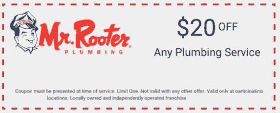

该页面继续详细描述该公司的专业领域——这是精简的登录页面所不提供的——并通过包括他们服务的一些好处(24/7 可用性、可靠的专家、本地知识)以及推荐来强调客户选择鲁特先生的原因。

这个例子证明，在许多行业中，内容比令人惊叹的设计更重要——你不需要技术背景就可以创建一个成功的登陆页面(无耻的插一句:尤其是没有我们的[登陆页面模板](https://unbounce.com/landing-page-templates/?utm_medium=referral&utm_source=medium&utm_campaign=blog-post-long-form-lp&utm_content=landing-page-template))。

# 示例 3: Chronotek

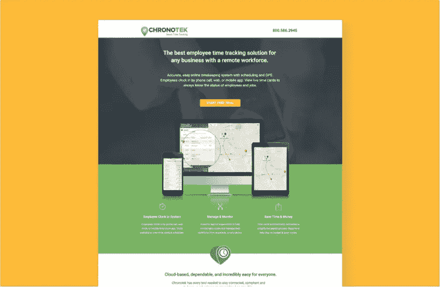

[Click here](https://unbounce-wpengine.netdna-ssl.com/photos/chronotek-long-form.jpg) to see the full page.

> 为什么有效:专家的洞察力和深入的产品细节。

我们开始看到一些模式。就像上面的长格式登录页面示例一样，Chronotek 在文件夹上方展示了它的主要功能，同时还有一个直接的标题，用清晰、简单的术语描述了他们的产品。将这两个元素放在折叠上方，可以在目标读者一落地就抓住他们的注意力，并鼓励他们继续阅读。

但他们不会就此止步。由于 Chronotek 是 B2B 软件，可能需要大量的时间和金钱投资，所以他们的登录页面必须描绘出完整的画面。通过列出客户受益的六种主要方式(例如简化工资单、实时报告、应用内消息传递)，Chronotek 概述了在时间跟踪软件上投资 it 美元的价值。

虽然他们的主要信息相对简单，但页面下方的 Chronotek **使用带有视频和插图的简短文字在更情绪化的层面上进行联系**。在这种情况下，这些元素灌输了一种紧迫感(“Chronotek 在为时已晚之前发出警报。”)夹杂着他们有你罩着的保证(“放心，全知道！”).这部分的文案也更以“你”为导向。“你”或“你的”出现了六次——文本中夹杂着情感词汇，比如“压力”

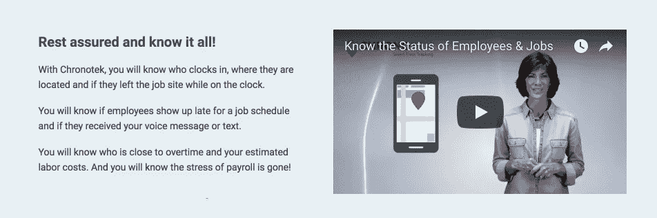

An example of the copy paired with videos Chronotek uses throughout the page.

Chronotek 在整个页面中使用的与视频配对的文本示例。

尽管许多潜在客户可能会被该产品的特性和优势所说服，但使用长格式的登录页面可以让 Chronotek 对任何仍有异议或需要在注册免费试用之前听到某些关键短语的人产生更具情感的吸引力。

# 示例 4:王座和豪泽

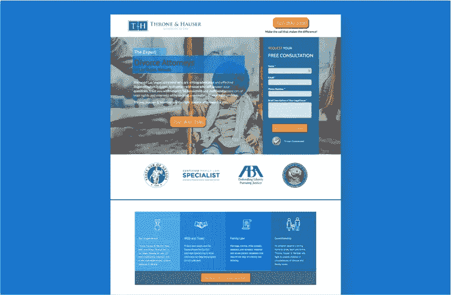

[Click here](https://unbounce-wpengine.netdna-ssl.com/photos/thronehauser-long-form.jpg) to see the full page.

> 为什么这样做:透明和便利建立信任。

同样，在这一页上没有一吨的篇幅，*但是*这家律师事务所的页面确实包含了相当数量的副本。也就是说，它也不会浪费访问者的任何时间。该公司的服务和位置会立即出现——外加一段简短的描述，说明为什么客户应该与王座&豪泽合作。他们还展示了访问者期望从一家声誉良好的律师事务所预先获得的证书。最后，我们看到了两种联系公司的简单方法(通过电话或表格)。

通过包含该公司律师的个人简历(包括照片)，该页面建立了一种联系，这在一个很大程度上由关系驱动的行业中是至关重要的。推荐通过展示快乐客户的例子，进一步增强潜在客户对公司的信任。

这个长长的登录页面还巧妙地**讲述了一个故事，在它选择的照片中有一个美好的结局**:

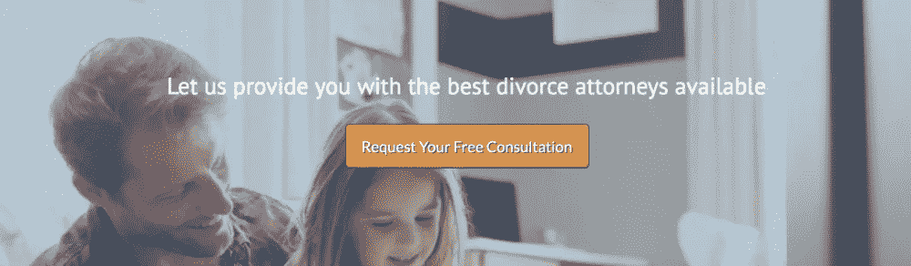

英雄的照片展示了一个被父母分开的悲伤的孩子，而底部号召行动的图像显示了父母和孩子快乐地团结在一起。以这种方式使用他们的页面可以让王座和豪泽讲述一个故事，唤起情感。

# 例 5:乔治·梅森大学沙尔学院

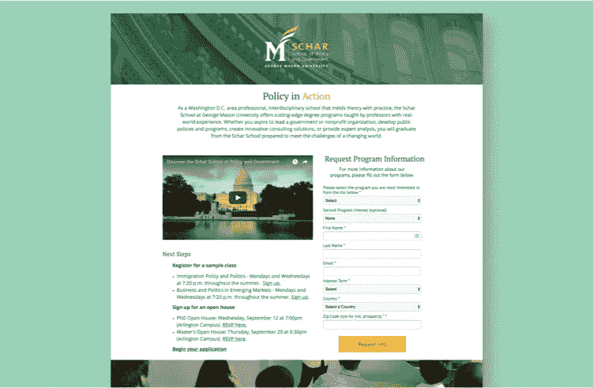

[Click here](https://unbounce-wpengine.netdna-ssl.com/photos/gmu-long-form.jpg) to see the full image.

> 为什么会这样:该表扬就表扬。

为了给潜在的学生留下深刻印象，乔治梅森大学的沙尔学院在其长长的登录页面上提供了大量信息。读者很快就会了解到，这所学校位于华盛顿特区(选择大学时，地理位置是一个主要因素)，项目将技术技能和理论结合在一起。如果学生感兴趣，他们可以很容易地要求更多的信息，并开始使用表格申请。也有机会报名参加样本班或参加开放日。

沙尔学院还以成就为特色，将自己划分在一个竞争类别中，在这个类别中，选择可能是无穷无尽的。推荐书来自最近毕业的学生，他们现在在与学校项目相关的领域中占据着高需求的工作:

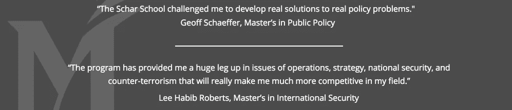

该网页还包括学位课程描述。对于这些(冗长！)导语，短格式的页面是不够的，但是**这是准学生需要的具体信息，以确定给定的选项是否适合他们**。

该网页以该校的硕士项目为头条，占其注册人数的大部分。虽然为每个学位项目创建单独的登录页面可能有意义，但使用较长的登录页面有助于为可能考虑多个项目的学生提供一个概览。

# 现在你有了:五个有效的长格式登录页面示例…

…至少跨越五个行业！这些公司都需要更多的文字来表达他们的观点，包括详细的描述、证明和成就，而这些在短短的篇幅中是没有空间的。额外的副本有助于品牌理解手头的优惠对个人或财务的重大影响。

最终，*的性质、你的*行业、产品或服务将决定登陆页面的长度。重要的是要记住**没有硬性规定**。我们经常被告知越短越好，但是登陆页面——像小睡、白天时间和假期——有时可以持续更长一点。

*原载于 2018 年 11 月 22 日*[*【unbounce.com】*](/unbounce-marketing/converting-with-extra-copy-5-long-form-landing-page-examples-725354497b57)*。*

[*脸书*](https://www.facebook.com/Unbounce/)*|*[*LinkedIn*](https://ca.linkedin.com/company/unbounce)*|*[*推特*](https://twitter.com/unbounce)*|*[*insta gram*](https://www.instagram.com/unbounce/)

## 这篇文章发表在 [The Startup](https://medium.com/swlh) 上，这是 Medium 最大的创业刊物，拥有+391，714 名读者。

## 在这里订阅接收[我们的头条新闻](http://growthsupply.com/the-startup-newsletter/)。

