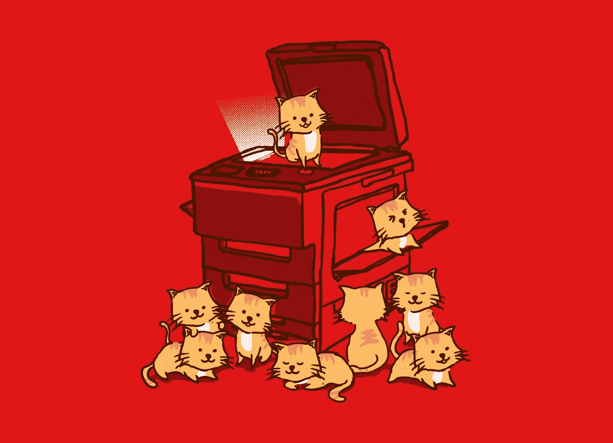

# 模仿者总是存在:创业生存指南

> 原文：<https://medium.com/swlh/copycats-are-always-out-there-startup-survival-guide-8f0ac20b7d45>

就像特朗普总统说的“让美国再次伟大”，现在很多人开始使用这个短语。这些模仿者。

T2:猫总是在那里。

人只有看到东西好的时候才会去抄袭！

如果有人试图用一种方式模仿你，那很好！这意味着你在做正确的事情，这应该激励你前进，让更多的人支持你。

现在，当你有了潜在客户*【如果你没有阅读我关于竞争的第一篇文章，请点击链接- >* [*所有的初创公司都有竞争*](/swlh/all-startups-have-competition-startup-survival-guide-62097d9bc478)*】*现在不是微笑和庆祝的时候，因为现在你有工作要做。

模仿者是你的竞争对手，他们只是作为企业家来“窃取”想法和创新，最终他们希望获得比你的企业更多的资本，并获得更多的市场。

我很喜欢 Cliff Ennico 用这个例子来描述模仿者(计算机的创造者):

> "基本上，它们是一台通过电话线与打字机键盘相连的电视机，对吗？"

那是纯粹的抄袭者的例子！现在看，几乎每个人都在使用电脑。另一位企业家创新并创造了笔记本电脑，这就是我用来写这篇文章的设备。

## 现在，我们中的一些人可能正在研究一个想法，那么我们如何阻止模仿者呢？

如果你试图合法地做它，你真的不能。最重要的是对自己保密和敏感的信息。

## 有时我们可能想和某人一起工作，那么我们该怎么做呢？

这就是我在开发我的应用程序 ShareME 时试图解决的问题，比如我如何才能事先预防问题，我听说了保密协议(NDA)。

保密协议是帮助你(企业主)和你的员工互相保守敏感信息的协议。

《NDA》还包括了员工即使离职也无权分享机密信息的内容。

真的很重要。NDA 将防止你面对那些只想掏你口袋的人的诉讼。

下面我有一个 ShareME 员工保密协议的例子:

> **共享员工保密协议**
> 
> **根据******捍卫商业秘密法案，雇主现在被要求加入一项** [**豁免通知**](http://www.ndasforfree.com/NDAS/Boilerplate2.html#Adding_DTSA) **条款。“与员工签订的任何控制商业秘密或其他机密信息使用的合同或协议。”****
> 
> ****保密协议****
> 
> **本保密协议(以下简称“协议”)由 ______________ _ _ _ 与其位于 ShareME 的主要办事处(“[披露方](http://www.ndasforfree.com/NDAS/GetBasicExp.html#Who_Is_Disclosing_Who_Is_Receiving)”)和位于 _ _ _ _ _ _ _ _ _ _ _ _ _ _ _ _ _ 的 _ _ _ _ _ _ _ _ _ _ _ _ _ _(以下简称“接收方”)签订，目的是防止未经授权披露以下定义的机密信息。双方同意就某些专有和机密信息(“机密信息”)的披露建立保密关系。**
> 
> **1.[机密信息的定义](http://www.ndasforfree.com/NDAS/GetBasicExp.html#2.____Defining_the_Trade_Secrets)。就本协议而言，“机密信息”应包括在披露方从事的业务中具有或可能具有商业价值或其他用途的所有信息或材料。如果机密信息是书面形式，披露方应在材料上贴上“机密”字样或类似的警告。如果机密信息是口头传播的，披露方应立即提供一份书面文件，表明该口头交流构成了机密信息。**
> 
> **2.[机密信息的排除。](http://www.ndasforfree.com/NDAS/GetBasicExp.html#3.____Excluding_Information_That_Is_Not_Confidential)接收方在本协议项下的义务不延伸至以下信息:(a)在披露时为公众所知或随后并非由于接收方的过错而为公众所知的信息；(b)接收方在披露方披露之前发现或创造的信息；接收方通过合法途径而非从披露方或披露方代表处获悉的信息；或(d)接收方在获得披露方事先书面批准的情况下披露的信息。**
> 
> **3.[接收方的义务](http://www.ndasforfree.com/NDAS/GetBasicExp.html#4.____Duty_to_Keep_Information_Secret_)。为了披露方的唯一利益，接收方应对机密信息进行严格保密。接收方应严格限制员工、承包商和第三方接触机密信息，并要求这些人员签署至少与本协议中的保护性限制相同的保密限制。未经披露方事先书面批准，接收方不得出于自身利益使用、出版、复制或以其他方式向他人披露任何保密信息，或允许他人出于自身利益或损害披露方的利益使用任何保密信息。如果披露方提出书面要求，接收方应立即向披露方归还其拥有的与保密信息相关的任何及所有记录、笔记和其他书面、印刷或有形材料。**
> 
> **4.[时间段。](http://www.ndasforfree.com/NDAS/GetBasicExp.html#5.____Duration_of_the_Agreement)本协议的保密条款在本协议终止后仍然有效，接收方对机密信息保密的责任仍然有效，直到机密信息不再被视为商业秘密，或者直到披露方向接收方发出解除接收方本协议义务的书面通知，以先发生者为准。**
> 
> **5.[人际关系。](http://www.ndasforfree.com/NDAS/Boilerplate.html#Relationships)本协议中的任何内容不得被视为出于任何目的将任何一方视为另一方的合伙人、合资人或雇员。**
> 
> **6.[可分割性](http://www.ndasforfree.com/NDAS/Boilerplate.html#Severability)。如果法院发现本协议的任何条款无效或不可执行，本协议的其余部分应被解释为最好地实现双方的意图。**
> 
> **7.[整合](http://www.ndasforfree.com/NDAS/Boilerplate.html#Integration)。本协议表达了双方对标的的完全理解，并取代所有先前的提议、协议、陈述和理解。除非双方书面签字，否则不得修改本协议。**
> 
> **8.[弃权](http://www.ndasforfree.com/NDAS/Boilerplate.html#Waiver)。未能行使本协议中规定的任何权利不应视为放弃在先或后续权利。**
> 
> **[9。豁免通知【可选】](http://www.ndasforfree.com/NDAS/Boilerplate2.html#Adding_DTSA)**
> 
> **通知员工，根据任何联邦或州商业秘密法，个人无需为以下行为承担刑事或民事责任:( I)直接或间接向联邦、州或地方政府官员或律师秘密披露商业秘密；以及(ii)仅出于举报或调查涉嫌违法行为的目的；或在诉讼或其他程序中提交的起诉状或其他文件中作出，如果此类提交是密封的。如果个人(I)提交了任何密封的包含商业秘密的文件，则因举报涉嫌违法行为而被雇主报复的个人可以向个人的律师披露商业秘密，并在法庭诉讼中使用商业秘密信息；以及(ii)不披露商业秘密，除非根据法院命令。请理解，即使你离开 ShareMe，你也不允许分享任何信息，只要你活着，如果你这样做，联邦政府将立即对你提起诉讼。**
> 
> **本协议和各方的义务应对该方的代表、受让人和继承人具有约束力。各方已通过其授权代表[签署](http://www.ndasforfree.com/NDAS/Boilerplate.html#Signatures)本协议。**
> 
> **_ _ _ _ _ _ _ _ _ _ _ _ _ _ _ _ _ _ _ _ _ _ _ _ _ _ _ _ _ _ _ _ _ _ _ _ _ _ _ _ _ _(签名)**
> 
> **_____________________________________________________**
> 
> **(键入或打印的姓名)**
> 
> **_ _ _ _ _ _ _ _ _ _ _ _ _ _ _ _ _ _ _ _ _ _ _ _ _ _ _ _ _ _ _ _ _ _ _ _ _ _ _ _ _ _ _ _ _ _ _ _(日期)**
> 
> **_ _ _ _ _ _ _ _ _ _ _ _ _ _ _ _ _ _ _ _ _ _ _ _ _ _ _ _ _ _ _ _ _ _ _ _ _ _ _ _ _ _(签名)**

**现在，当保护你的产品时，你需要打上商标。**

**如果你是刚开始做生意的菜鸟，不知道什么商标——它们真的只是一个标记，让你知道你的产品来自哪里。**

**模仿者无处不在，记住你不希望他们拿走你的产品。**

**有些地方的政府很腐败，你可以在几乎所有事情上找到漏洞，所以你不想冒任何风险。**

**记住你的生意是你的宝贝，你应该想尽一切办法让它离开这个世界，变得比你发现它时更好。**

***【我只知道有很多关于企业法律工作的内容，我不想在这篇文章中深入探讨，但我会考虑就此制作一个系列】***

****键值🔑我想让你离开:****

*   **不要认为抄袭者是 100%的，这是表明你的工作是好的，值得抄袭的一个标志**
*   **当你注意到有人在模仿你时，这意味着你有更多的工作要做(但是，这并不意味着如果没有人模仿你，你就会放松，因为我宁愿为我的房子安装一个安全系统，也不希望在我被抢劫时安装它。)**
*   **当你和员工一起工作时，让他们签署一份保密协议以防止诉讼**
*   **在你的产品和商业公司上使用商标和版权**

## **谢谢你看我的文章！欢迎在下面留下评论或了解更多关于我的信息！！**

## **如果您错过了我的上一篇文章:**

*   **所有的创业公司都有竞争:创业生存指南**

## **关于作者的更多信息:**

**我 16 岁|程序员|出版公司首席执行官|内容营销人员**

*   **如果你有兴趣和我一起跟进，请查看我的网站:【https://jdombele.wixsite.com/jayson **
*   **如果你对我的 ShareMe 创业感兴趣，请点击下面的链接:【www.jdombele.wixsite.com/shareme **
*   **想要了解政治、商业、科技等方面的新闻吗？[https://documentedpress.wordpress.com/](https://documentedpress.wordpress.com/)**

## **跟随我:**

**[**TWITTER**](https://twitter.com/jay_dombele)|[**LINKEDIN**](http://www.linkedin.com/in/jayson-dombele-195a55155)**

**任何问题，业务查询或关注，请随时发送电子邮件给我@:jdapple4357@gmail.com**

****

## **这个故事发表在 [The Startup](https://medium.com/swlh) 上，这是 Medium 最大的企业家出版物，拥有 291，182+人。**

## **在这里订阅接收[我们的头条新闻](http://growthsupply.com/the-startup-newsletter/)。**

****