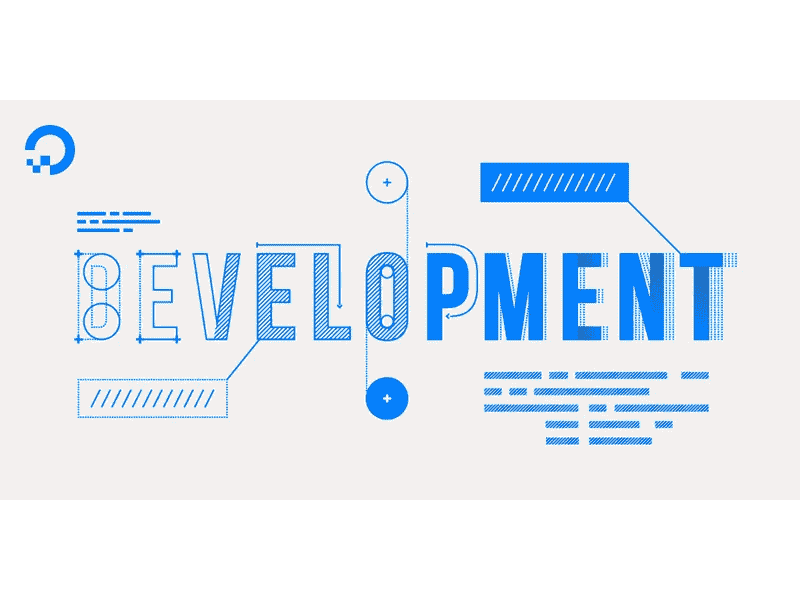
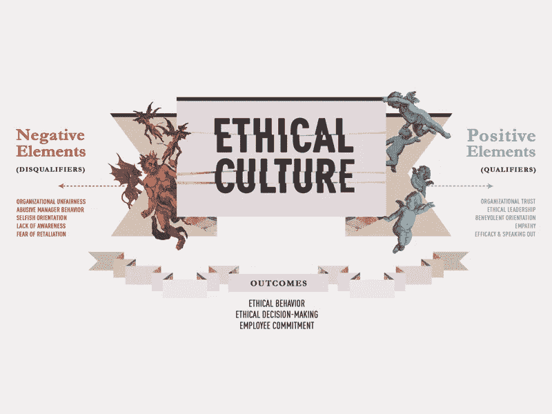

# 核心发展原则和道德

> 原文：<https://medium.com/swlh/core-development-principles-and-ethics-34bff1ea8f52>

[倪傳婧 Victo Ngai](http://victo-ngai.com/Work)

每个科技公司业务发展的基本部分是不断改进。到处都在引入方法论，[设计趋势](https://uxplanet.org/mobile-ui-design-trends-in-2018-ccd26031dfd8)被彻底研究，市场学家大肆宣传，而且总是精益求精。

# 为今天的网络而建

与此同时，这是一个很大的照顾。说到 web 和移动设计和开发服务，我们需要首先关注用户。

> *用户希望被牢牢地理解，被照顾，并对使用一个数码产品感觉良好。*

无论你在制造什么类型的产品，这些都是行业的焦点。我们制作的内容必须是搜索引擎友好的，有趣的，相关的。设计必须是独一无二的。代码必须易读、可编辑、清晰，以便以后修改。

还有。除了纯粹的技术要求之外，对当今数字产品的需求也发生了变化，以适应新的现实。安全性受损、数据操纵、新闻订阅战和 infocalypse 迹象——这些都是现代数字产品面临的挑战，谁知道还会发生什么。

对于我们这些 web 开发专业人士来说，这些都是令人生畏的，但是对于科技创业世界之外的人来说，它们看起来有多陌生呢？我们的核心责任是带领他们穿过这些我们称之为*在线存在*的浑水。

> *不幸的是，很多时候是服务供应商需要一些正确的指导。*

大多数开发机构没有将自己定位为具有高级数字应用能力的商业分析师。这一趋势为所谓的“IT 机构商店”创造了机会，这意味着他们只做实施，而不考虑行业见解。这完全转化为一些发展公司集群提供的服务的不满。整个地区都可能成为这种困惑的受害者。

> 随着时间的推移，企业主适应了这些问题，并开始通过给自己增加更多任务来解决它们。

他们开始成为数字产品的建筑师，他们必须成为 UX 的远见者，决定是提高生产力和性能还是利用可访问性。

有些人在这方面做得很好，甚至在不熟悉编码或原型制作的情况下就成为了真正的创业大师。然而，大多数人继续用低质量的应用程序冲淡市场，并把钱花在错误的想法上，即使它们最初是好的。毕竟，制定设计决策、考虑后端容量和编写技术文档不应该是企业所有者的工作。

> 数字服务供应商不仅要对产品的执行负责，还要对产品的可行性、视觉吸引力和建造方法负责。

客户主要关心的是实现业务目标。我们必须在这方面发挥作用。这意味着你必须在接近客户的理解水平上运作。设计的某些方面将永远是客户的领地，比如选择图像。然而，在需要的时候教育客户是网页设计师的工作。内容写作也一样。如果一个品牌的声音的获得有问题，它必须由多个变量综合而成。

> *产品不一定是所有者灵魂的反映。*

IT 专家施展他们的魔法让你的网站(不)工作的时代已经过去了。现在，老板们希望能够掌控他们生意的方方面面。很公平，但是他们需要成为每个功能的一部分，并根据直觉或直觉做出每个决定吗？事实上，客户必须负责他们的业务资产，但不负责这些资产是如何构建的。

我们生活中的每一天都依赖于医生、飞行员、建筑师、汽车工程师，那么为什么同样的事情不能应用于发展呢？我觉得答案很简单。从事上述职业之一意味着得到权威机构的认可。许可的，授权的，批准的，允许的。在 web 和移动设计与开发领域，我们有什么样的许可证？除了我们的好名声。好名声不会无缘无故而来。这是必须的。赢得它的过程的一部分是*致力于核心原则*。

Image credit: [Kasia Bojanowska](https://dribbble.com/kabojanowska)

# 遵循发展的核心原则

机会主义产品开发实践背后的机制是完全自然的。当一切都很紧急的时候，你从哪里开始？当只有最后期限是确定的时候，你如何制定战略？当到目前为止还没有参考资料时，应该优先考虑什么？当一切都是高风险的时候，什么都不是。

让客户的视觉在图像和排版的选择中闪耀，或者更好，定义品牌/产品的使命陈述和其他重要的东西，同时我们将努力为接下来的所有工作建立一个坚实的基础。

# 原则:这一切存在的原因

数字产品必须存在的原因不是因为每个人都有它。继续构建 web 或移动应用程序的决定是，它必须*为用户提供价值*。在任何东西被制造出来之前，通过询问产品的特性是否给人们的生活增加了任何价值来分析它。如果答案是“不”,和客户一起想办法改变这个想法。

不要依赖于一般的判断，因为*值*可以是一个相对的范畴，大处着眼，探索和研究问题。

> *核心:不要有偏见，不要忽视步法。*

# 原则:保持简单，笨蛋！(亲吻)

找到价值后，保持它的安全是很重要的。客户可能对产品有太多的热情，这几乎对他们不利。他们可能会将项目变成一个功能堆积、价值消失的混乱过程。从设计开始，一切都必须*简单但不简单化* *或原始*。事实上，构建一个优雅的解决方案需要更多的时间和精力。

随着更好的性能、可维护性和构建时更少的压力，事情会得到回报。

> *核心:集中精神，避免诱惑。*

# 原则:保持愿景

每一个项目进入下一个发展阶段都可能面临关键选择的问题。大多数情况下，它来自于财务方面，需要在做出决策之前进行大量的思考。从这个意义上说，拥有清晰的愿景对于项目的成功至关重要。如果没有内在的完整性，产品就有变成由胶带粘在一起的不兼容功能的拼凑品的危险。

这就是为什么前两个原则应该一起工作，以确保在所有阶段的愿景清晰。

> *核心:不要强迫自己陷入功能性选择的陷阱。*

# 原则:你生产什么，就会有人使用

重要的是，不仅要了解你的用户将如何和为什么使用产品，还要了解它将如何到达他们手中，它将召唤什么类型的用户，以及这种交互的变量是什么。你无法预测这种交互的所有情况，但是如果你记得*会有人依靠他们的理解和产品的可用性来完成各种目标*，一切都会变得更好。

让这些人站在你这边，还有那些可能在你之后从事设计和编码工作的人。

> 核心:思考如何让你之后使用或开发你产品的人开心。

# 原则:面向未来

在当今短暂的注意力跨度下，对于一款数码产品来说，不仅要通过时间的考验，还要一直不断地证明自己，这一点至关重要。为此，产品必须坚固、灵敏，并能适应我们遇到的一切。*如果客户不仅仅是将产品卖给大公司，找到一个舒适的利基市场是远远不够的*。

这是一个永无止境的发展过程，会产生永恒的相关性。

> 核心:保持正直，同时不断观察另一面。

有一个统一所有原则的共同常数，它经常被忽视。正是这种*思维*让你着手的每个项目都与众不同。随着每一个任务的完成，你不仅仅是将这个特性传递到测试就绪状态，只是为了关闭 sprint，你也在提升你的游戏水平。要么是积极的经历，要么是一堆磕磕碰碰也是学习的经历。

> *你收集的模式越多，你就越有机会真正帮助客户不仅实现他们的假设，而且把它提升到他们做梦也没想到的水平。这就是你的好名声。这是回报最多的地方。*

然而，它不仅仅是一个成功的工作流程。这是化学反应。化学不是流程图的范畴。这是情感和伦理的范畴。

Image credit: [Sarah Edmands Martin](https://dribbble.com/sarahedmands)

# 数字生产中的伦理

既然计算机捕捉了我们生活的方方面面，奇怪的是它从来没有真正触及到被媒体之类的监管规则之外的东西监管的可能性。不同的公司在市场上自由漫游，如果有的话，他们有自己对社会规范、价值观和道德标准的理解。监管互联网内容的想法从未像监管色情资源那样受到如此广泛的关注。

封锁并没有真正起作用，黑暗网络正在蓬勃发展，这将我们带到了这样一个点，如果改变不能被强加，它们必须来自内部。互联网上没有其他的东西。

然而，这个问题被提出来是因为过去的事件。正如约纳坦·宗格尔著名的[所写的](https://www.bostonglobe.com/ideas/2018/03/22/computer-science-faces-ethics-crisis-the-cambridge-analytica-scandal-proves/IzaXxl2BsYBtwM4nxezgcP/story.html):

> *【从物理学家到计算机科学家的转变】让我对这种情况有了具体的看法。与其他科学不同，计算机科学领域还没有对其从业者的工作产生严重的负面影响。”*

互联网的蛮荒西部在某个时候必须消失，现在看来是时候了。重大的恶意掩盖，巨大的错误信息运动，剑桥分析的争议，等等。原本为娱乐而打造的数码产品的作用已经过了不归路。你不能再为了好玩而设计和开发了。

这些天你放出来的每样东西都必须检查潜在的有害特征。某种程度上…在现实中，没有办法确切地预测每项技术产生的每种可能的结果。所有的责任都落在那些构思、设计和制造数字产品的人身上。

由于大多数开发人员都是被雇佣的，他们经常处于满足技术需求和期限的压力之下。考虑到跨文化和跨部门沟通等其他变量，我们已经忙得不可开交了。在大多数情况下，道德问题直到有了先例才会出现。开发人员倾向于坚持的唯一道德准则是一般有道德的人的准则。它包括开放、勇气、尊重、专注和承诺。光是这些就给了我们一个坚实的基础，让我们在困惑的时候可以依靠。

> 扪心自问你做的事情是否正确，这是一个来自内心的强有力的验证工具。

技术的力量在于模糊性。你可以用它来让世界变得更好，也可以毁掉它。

# 化剑为犁

任何复杂的东西都可以用来做好事或坏事。事实上，已经开始的好事可以在一瞬间让你兴奋。我们对人工智能的热情会把我们带到[的黑暗](https://shakuro.com/blog/technology-steering-us-towards-singularity/)中，在那里没有人能够分辨谎言和真相。如果我们不能改变进步的本质，我们所能做的就是遵循一些行为准则，这些准则的好处必须清晰可见并具有吸引力。

这是*的影响者*可以表明立场的地方。直到社会，至少它的西部部分遵循一般的基督教道德，才有机会保护信仰。在当今自由的极端有害的环境中，我们所能依靠的是由那些比标签和时尚更有个性的人所推动的精神纽带。在我们为技术发展制定出标准化的道德准则之前，我们所能依赖的就是教人们提出正确的问题，做出正确的选择。

作为人类，我们以前也经历过这种情况。转折点是核武器的发明。它将人类的历史分为“前”和“后”时期，并将我们带入了一个即将毁灭的世界。

> 我们知道我们可以建造任何东西，但是我们必须这样做吗？

也许有一天当我们意识到我们创造的一切有多大影响时，根深蒂固的枪支、细菌和钢铁态度会抓住不放。如果人工智能七倍地反映了我们所有最糟糕的恶习，我们最终会把注意力从赚得更多转移到付出更多吗？

技术领域的道德规范是有前提条件的，而利用数字产业的力量来实现美好的共同目标是一种内在的冲动。我们的时代可能是新的伦理技术发展时代的转折点，成为其中的一员令人兴奋。

## 这篇文章发表在 [The Startup](https://medium.com/swlh) 上，这是 Medium 最大的创业刊物，有 329，974+人关注。

## 在这里订阅接收[我们的头条新闻](http://growthsupply.com/the-startup-newsletter/)。

