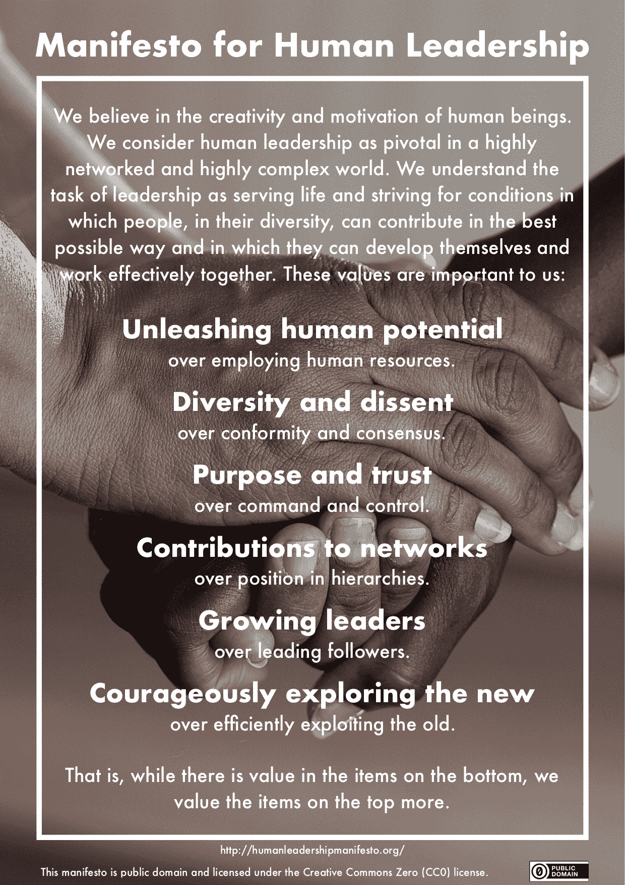

# 企业反叛者:变革需要干扰

> 原文：<https://medium.com/swlh/corporate-rebels-change-needs-disturbance-ce139d242a97>

一位历史学家曾经说过，“好人不一定是好公民。”因此，一个好员工并不总是一个顺从的员工。组织反叛者制造混乱，从而使他们的组织得以生存。这篇文章概述了有教养的叛逆，从非暴力反抗的起源到组织叛逆的原则，以及如何领导、挑战和训练这些叛逆的问题。

# 公民不服从作为基础

> *但是如果法律的本质要求你成为他人不公正的代理人，那么我说，违反法律吧。让你的生活成为阻止机器运转的阻力。我必须做的是，无论如何，不要让自己陷入我所谴责的错误之中。*
> 
> *亨利·大卫·梭罗*

公民抗命是现存秩序中的一种反抗形式。它不反对现有的结构，也不打算解散该系统。因此，那些实践公民抗命的人并没有将自己置于秩序之外，而是有意识地接受对他们公开庆祝的抗命的惩罚。然而，通过这种甘冒惩罚风险的意愿，他的反抗变得极其真实，成为一种深刻的道德信念。

这个概念最近通过亨利·大卫·梭罗的文章《论公民不服从的义务》而为人所知，在这篇文章中，他解释了为什么他不再纳税以抗议反对墨西哥和奴隶制的战争。他这样做是故意公开违反法律，目的是指出(相对于更高一级法律的)不公正，并通过这种非暴力的公开抗议行动带来改变。

因此，诚实公民的特点不是绝对服从，而是有条件地服从法律。这必然包括公民抗命形式的抵抗。这也导致了对组织反叛者的道德要求。他们不会与组织作对，而是始终致力于改善组织。他们认同组织和组织的实际目的，但不一定认同所有不一致的规则或被视为有害因素的组织文化。因此，他们不同的思维和不同的工作方式是保护一个组织免于自满和惰性的决定性干扰。

# 企业反叛者的 10 条原则

> 虽然每个公司都需要一名企业家来启动，但健康的增长需要一些内部企业家来推动新项目，探索新的和意想不到的业务发展方向。
> 
> *理查德·布兰森*

1986 年，吉福德·平肖特三世在他的书《内部创业:为什么你不必离开公司就能成为一名企业家》中提出了内部创业者的 10 条戒律，他后来通过[又增加了 6 条](http://www.pinchot.com/2011/11/the-intrapreneurs-ten-commandments.html)对其进行了扩展和澄清。基于这些戒律，再加上一些响亮的和[实现](https://en.wikipedia.org/wiki/Effectuation)，我认为以下原则可以指导组织反叛者的工作:

1.  勇敢——激进。每天来上班都愿意被解雇。
2.  有一个伟大的愿景和明确的原则来指导你。
3.  独立于你的工作描述，专注于此时此地你可以采取的下一步行动，以更接近你的愿景。
4.  找到一些盟友，建立一个网络，成为一个运动。
5.  绕过规章制度来达到你的目的，但它本身并不是目的。
6.  尽可能长时间地在地下工作——太多太早的曝光会唤醒组织的免疫系统。
7.  感激支持。
8.  从抵抗和失败中学习。
9.  坚持不懈地努力，对成功保持谦虚的期望。(格茨·沃纳)
10.  始终为组织及其客户的利益而行动。

# 如何领导、挑战和蔻驰企业反叛者

> *文化变革的关键是个人赋权。我们有时会低估我们每个人能做的事情，高估别人需要为我们做的事情。在一次员工问答中，当有人问我“为什么我不能用手机打印文件”时，我变得很生气我礼貌地告诉他，“让它发生。你有全权。”*
> 
> *塞特亚·纳德拉，* [*点击刷新*](https://www.fastcompany.com/40457741/satya-nadella-the-c-in-ceo-stands-for-culture)

想要支持反叛者的领导人需要一种基于多样性和异议的文化。需要一个安全的空间，在这个空间里，质疑现状是可取的，也是受欢迎的。这个空间远远超出了各个经理的实际职责范围。在组织的政治丛林中，有足够多的陷阱会立即引发系统或多或少的严重免疫反应。领导者的工作是识别并避免这些陷阱，从而保护他的反叛者。这也让他们成为了反叛者。

反叛者需要质疑现状和尝试新事物的自由。如果不仅仅是少数被选中的反叛者拥有这种自由，而是尽可能多的人拥有这种自由，以便反叛的思想能够以积极的方式产生共鸣，这将是非常好的。因此，提供这种自由是领导的一项重要任务，方法是始终关注可持续发展的要素和文化，在这种文化中，不要将忙碌与生产力混为一谈。

你对这些领导任务思考的时间越长，你就越会得出这样的结论:这一切其实和造反派关系不大。换句话说，每个员工都应该像一个叛逆者一样被领导。每个人都应该有尝试和学习的自由，而不会迷失在公司政治的磨砺中。每个人都应该有跳出框框思考和质疑现状的自由。每个人都应该被授权和鼓励去利用它。这正是为什么这些原则反映在[人类领导力宣言](https://fuehrung-erfahren.de/en/2018/02/manifesto-human-leadership/)中，你可以在这里[签名](https://fuehrung-erfahren.de/en/2018/02/manifesto-human-leadership/)。

*原载于 2018 年 2 月 17 日*[*fuehrung-erfahren . de*](https://fuehrung-erfahren.de/en/2018/02/corporate-rebels-change-needs-disturbance/)*。*

## 这个故事发表在 [The Startup](https://medium.com/swlh) 上，这是 Medium 最大的企业家出版物，拥有 297，332+人。

## 在此订阅接收[我们的头条新闻](http://growthsupply.com/the-startup-newsletter/)。

