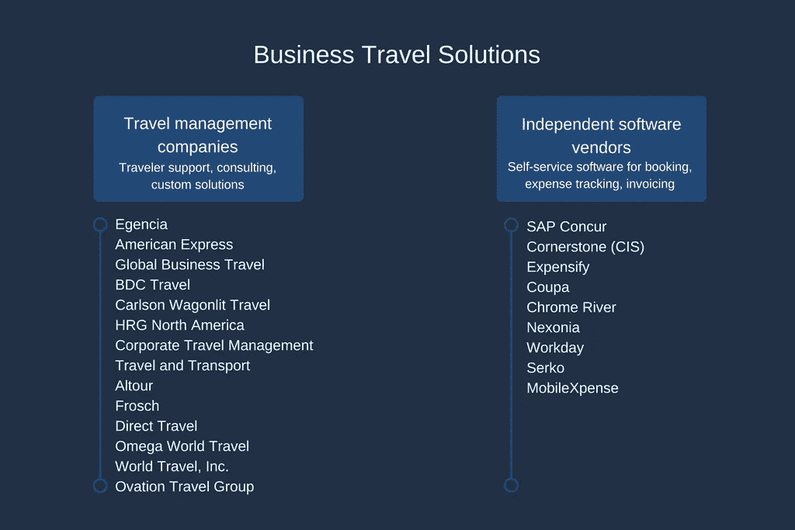
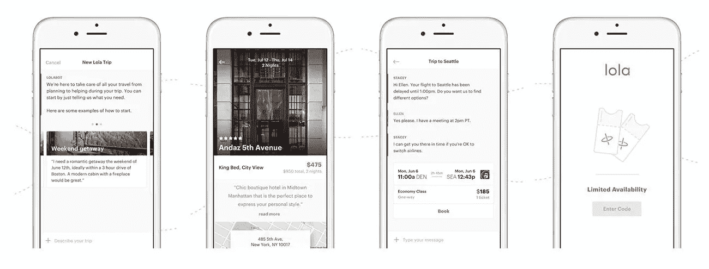
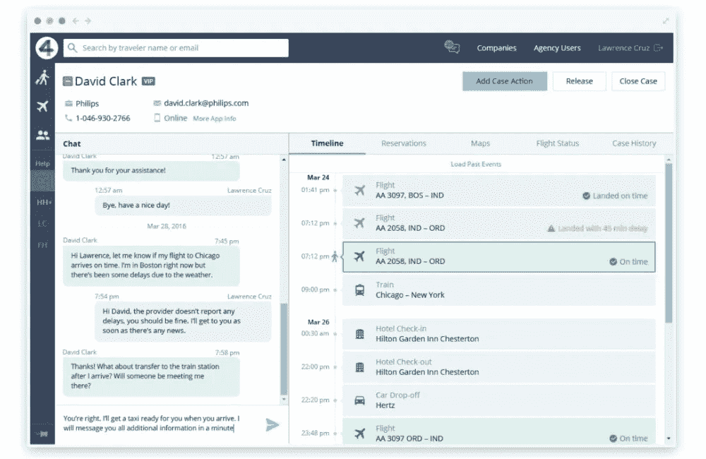
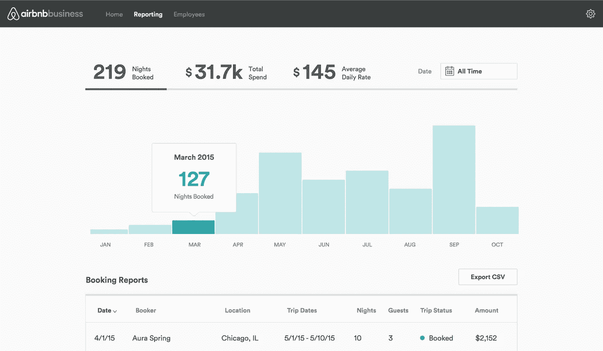
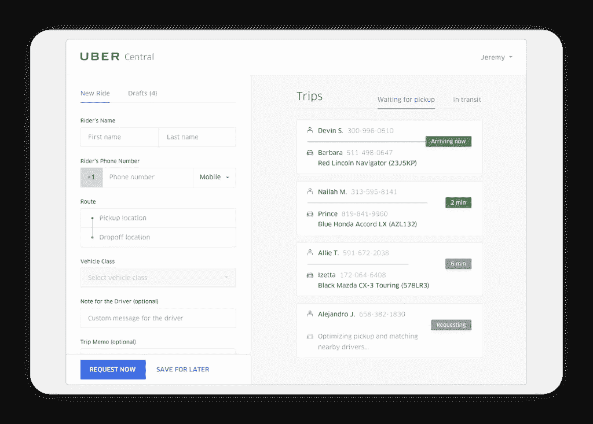
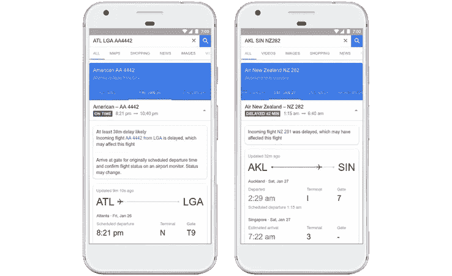
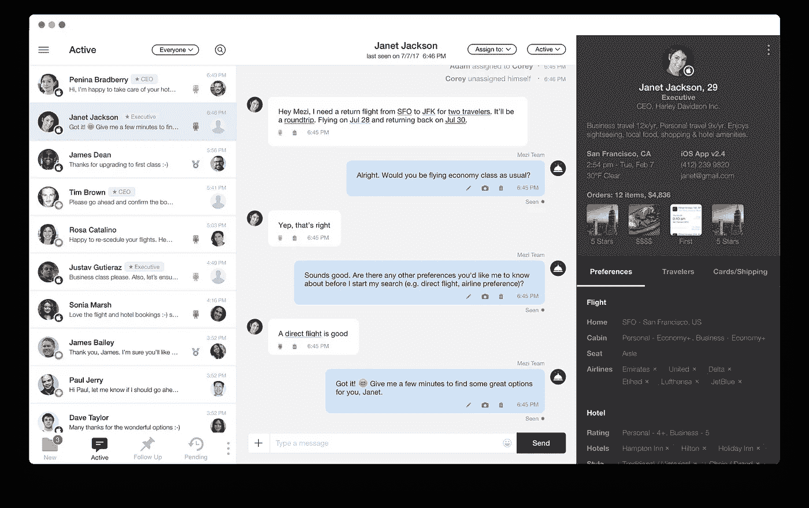

# 公司差旅管理:推动商务旅行领域的技术变革

> 原文：<https://medium.com/swlh/corporate-travel-management-driving-technological-transformation-in-the-world-of-business-travel-107cf48e3f6a>

商务旅行行业变化缓慢。当一切运行良好时，为什么要进行实验并冒损失的风险呢？尽管休闲旅游正通过采用消费者预订工具和移动支付快速向前发展，但随着它与传统旅行社渐行渐远，商旅管理仍犹豫不决。但不是旅行者本身。

到 2020 年，千禧一代将占美国劳动力的 50%。这些人习惯于在智能手机上规划他们的个人旅行，以数字方式管理支出，并将重要的分析决策交给人工智能，他们很快学会并接受了技术。他们要求雇主也这样做。Sabre 调查的企业旅行者[中有一半表示，他们的组织不建议使用任何旅行应用，大约三分之一的人最终使用了自己喜欢的解决方案。虽然大多数员工在商务旅行期间和紧急情况下使用移动应用程序与办公室联系，但他们的公司没有技术来跟踪他们的整个旅程并在需要时提供帮助。](https://www.sabretravelnetwork.com/transformation/)

现有的解决方案可以满足旅行者的需求，并适应他们的新行为。您可以将这些解决方案分为两类:

*   **独立软件供应商** —为差旅费管理、预订、开具发票、支持仪表盘以及实现组织差旅管理流程整体自动化提供自助服务解决方案的公司
*   **旅游管理机构** —提供上述所有服务的公司，以及包括访问旅行社、咨询、定制旅游计划制定等服务

两者的例子见下图。

为了最终跟上并优化您公司的差旅管理，请从商务旅行中的这些重要数字趋势开始。

# 从消费者应用到企业的自助服务

移动技术和快速移动互联网的兴起增强了连通性。我们使用应用程序在排队前点咖啡，或者从家里办理登机手续。旅行者也有信心在应用程序甚至聊天机器人的帮助下进行网上购物、改变行程和预订。而不是在办公室里给一个人打电话，他们享有自主权。这并不意味着商务旅行者想要逃避公司政策，在旅行中保持独立。相反，他们想自己控制一些旅行。

企业旅行应用程序 [Lola](https://www.lolatravel.com/) 就是这么做的。它为经常旅行的人提供顺畅、个性化的旅行计划，并使用聊天作为连接礼宾和客户的主要媒介。在这种情况下，选择和预订取决于旅行者，他们独立于代理人审查不同的选项。罗拉的创始人保罗·英格利西[分享](https://skift.com/2017/10/09/lola-pivot-to-business-travel-is-all-about-the-app/)、*“我以为我在建立一个像 Kayak 一样的消费者公司，结果发现商务旅行者需要聊天。第二件事是，我认为我们正在为聊天、电子邮件和电话做准备。我们发现，人们几乎从来不愿意打电话。”*

【Lola 个性化行程规划流程

不，差旅经理和差旅管理公司的角色不会过时。有了更多的时间，旅行社可以研究和实施新技术，更新旅行政策，使用分析来探索旅行者的行为，并在未来应用个性化。此外，员工无法仅使用智能手机解决所有的旅行问题。旅行经理会一直在那里帮助解决中断，并通知突然的变化。

# 注意义务和通过技术进行旅行风险管理

**注意义务**是一个概念，意味着公司在道德和法律上有义务保护其员工，为他们在偏远地区工作提供安全保障。虽然商务旅行者喜欢在旅途中保持相当独立，但他们需要知道有人支持他们。为了履行他们的注意义务，公司正在实施**旅行风险管理**解决方案。然而，今天，这些措施只涉及通过教育为旅行者的旅行做准备，而不是在他们离开时提供安全和监控。

在过去的几年里，旅行一直与风险密切相关:监管变化、罢工、恐怖袭击和自然灾害是一些最大的干扰因素，它们不仅可能阻止商务旅行者按时到达目的地，还可能带来健康或生命危险。与 12 个月前相比，65%的旅行者对商务旅行更加恐惧，这并不奇怪。一半的人担心他们不愿意出差可能会损害他们的职业生涯。这些令人震惊的数字进一步证实，拥有一个有效和透明的风险政策是必须的。

根据 GBTA 的 [2016 年调查，72%购买旅行的公司都有风险管理策略。然而，28%的受访公司要么没有既定的风险管理计划，要么他们的员工不知道他们是否有。让我们来看看组织如何利用商务旅行技术来简化风险管理流程。](http://blog.gbta.org/2016/03/31/gbta-poll-shows-vast-majority-of-companies-have-effective-risk-management-plans/)

应及时通知旅行社任何新出现的风险，并根据既定程序迅速做出反应。[像 4Site](https://www.altexsoft.com/case-studies/travel/altexsoft-cornerstone-reimagining-the-user-experience-for-a-corporate-travel-management-solution/#utm_source=MediumCom&utm_medium=referral) 这样的旅行管理软件可以让代理在仪表板上看到每个旅行者不断更新的信息，并通过聊天与旅行者交流，告知变化。

*旅行社可以在时间线上查看旅行者的详细信息，并远程处理中断*

记录过去的中断和风险将有助于组织评估未来的危险。然后，您可以过滤数据并将其分发给不同的部门，供人们使用。利用有关天气或机场服务的信息，该系统可以警告可能的中断并采取相应行动。在我们的文章中，了解更多关于数据科学在旅行中的[使用案例。](https://www.altexsoft.com/blog/datascience/data-science-and-ai-in-the-travel-industry-9-real-life-use-cases/#utm_source=MediumCom&utm_medium=referral)

*   代表您保护第三方旅行者

有时，当承包商或合作伙伴代表公司出差时，组织需要照顾他们。通过建立一个监控和沟通工具，您可以轻松地为任何这样的人创建一个档案，并跟踪他们的状态，就像他们是您的员工一样。

即使你有一个有效的计划，你也不能让你的员工对公司的程序一无所知，以防出现混乱。无论是简单的航班延误还是严重的障碍，旅行者都必须知道有人在处理这个问题，他们不会被抛弃。建立一个对差旅经理和出差员工都方便的沟通平台，并确认他们接受过使用该平台的培训。

# 拥抱安全便捷的虚拟支付

当优步等服务开始允许客户通过应用程序直接支付时，人们很快习惯了用手指轻点支付。然而，企业旅行仍然落后。为什么？AirPlus 的[调查指出了主要原因——缺乏对信用卡和虚拟支付选项之间差异的了解。简单解释一下吧。](https://www.airplus.com/editorial-files/france/documents/white-paper/mobile_payment___how_it_will_transform_corporate_travel_and_expense_management.pdf)

Apple Pay 或 Samsung Pay 等移动钱包使用近场通信(NFC)技术进行非接触式支付。你只需将智能手机或可穿戴设备靠近终端或其他兼容设备，这与使用塑料卡的过程非常相似。移动钱包可以存储你所有的虚拟货币——公司和个人卡，为每个特定供应商提供的具有特定限额的有限用途卡，忠诚度和折扣点。

所有类型的支付都有其优势，但让我们看看移动支付如何改变企业差旅和费用管理。

*   风险和欺诈防范

人们不必担心公司信用卡在旅行中丢失或被盗，而使用个人卡进行商务活动。从组织的角度来看，虚拟货币允许创建虚拟卡号(vcn ),这些虚拟卡号在特定事件或消费金额后过期，以确保遵守公司政策。这可以防止盗窃、欺诈或被旅行者滥用。

*   改进的费用管理和报告

使用虚拟支付还允许代理商将所有旅行数据保存在一个地方，而不必处理多个账单和数据来源。所有费用都实时出现在报告工具中，可以链接到 GPS，并创建更加复杂的报告。这简化了费用管理，同时节省了旅行者和代理商的时间。

*   为第三方旅行者付费

并不是所有代表公司出差的人都是公司的员工，或者都可以获得公司信用卡。在这种情况下，经理可以更容易且无风险地为所有很少出差的承包商或员工创建虚拟卡号。

虚拟支付技术对旅行者和旅行管理者都有利。员工可以快速简单地付款，而不必携带现金或用自己的钱支付。经理可以获得更准确的数据和简化的费用管理。

# 共享经济正在加入这场游戏

共享经济企业正在改变我们作为一个社会接受和提供服务的方式。许多美国成年人([66.3%](https://www.emarketer.com/Article/Uber-Airbnb-Lead-Way-Sharing-Economy-Expands/1016109))预计今年将使用共享经济服务，无论是要求搭车，请人帮他们购物，还是在度假时照顾宠物。

在过去的几年里，酒店客房价格逐渐上涨，预计[在 2018 年也会上涨](http://www.latimes.com/business/la-fi-travel-costs-increase-20170718-story.html)。随着越来越多的酒店对 Wi-Fi 或室内保险箱收费，过去免费的服务费和附加费也在[创下历史新高](https://www.nytimes.com/2017/09/29/travel/hotels-rake-in-record-fees-and-travelers-foot-the-bill.html)。为了减少旅行费用，公司正在寻找替代的住宿选择。当然，我们说的是 Airbnb。

自 2015 年推出该计划以来，已有超过 250，000 家公司使用其平台进行商务旅行。一个用于管理旅行和出差员工的高功能仪表板，以及越来越多的商务住宿列表，帮助该服务大幅提升了其企业差旅计划。当考虑一个“商业就绪”的家时，精选的具有 24 小时入住、无线互联网和舒适工作场所的家是优先考虑的

*AirBnb 商业报告仪表板*

这样的选择符合最近将商务旅行和休闲旅行结合起来的趋势——bleisure——我们有一整篇文章专门针对 blei sure 旅行者为您准备。在漫长的旅途中，除了友好的主人和宾至如归的感觉之外，员工还可以享受更广泛的便利设施，从网飞账户到功能齐全的厨房区。在会议室度过漫长的一天后，公司旅行者可以真正体验当地的感觉并得到适当的休息。

优步也正成为昂贵出租车和租车的首选替代选择。就像 Airbnb 一样，这家运输巨头提供了一个活动仪表板，以帮助在一个地方管理所有的公司运输，代表您的员工或客户请求搭车，以便在酒店或机场准备好，甚至可以根据每个员工的偏好定制您的设置。

*管理优步的商务运输*

至于航班，甚至有选择跳过商业航空公司，使用价格低廉的私人飞机。像 [SurfAir](https://www.surfair.com/eu/) 这样基于订阅的服务，当你作为一个团队旅行或会见一个有价值的客户时，可以提供灵活方便的航空运输。

# 利用机器学习来增加价值和降低成本

谈到商务旅行，有很多可预测性。旅行固定在会议日期，停留时间通常很短，当谈到舒适的飞机座位和酒店房间时，公司旅行者有类似的要求和需求。如果你收集并分析你从同一类别的人那里得到的所有数据，你可以了解他们很多。你做得越好，未来的旅行者就会越满意。数据科学在旅行中有许多应用，在商务旅行中也不例外。

最近，[谷歌航班](https://www.tnooz.com/article/google-flights-delays/)开始使用机器学习算法预测延误。虽然这种工具对所有类型的旅行者都有用，但在企业中，这种中断可能会导致重大的财务损失，应该及时有效地处理。通过对可能出现的混乱发出警报，旅行社可以调整时间表和旅行细节，例如，延长酒店房间预订，而不必让重要客户在机场等候。

*谷歌航班延误预测*

聊天机器人的繁荣在旅游行业尤为突出，允许人们使用人工智能智能助手处理紧张的旅行计划。这样的技术从你过去的选择中学习，你用得越多，它会给出更好的建议。他们还从所有其他用户那里收集数据，这有助于细分和提供更有针对性的选项。例如，旅行助手 [Mezi](http://mezi.com/) 保存每个旅行者的生活档案，并根据用户行为自动更新。这允许代理提供更个性化的服务。在我们的专题文章中，了解更多关于旅行中的[客户个性化](https://www.altexsoft.com/blog/datascience/customer-experience-personalization-in-travel-and-hospitality-using-behavioral-analytics-and-machine-learning/#utm_source=MediumCom&utm_medium=referral)。

*由 Mezi 设计的人工智能旅行仪表盘*

机器学习不仅有助于预测延误，还可以提供对未来旅行价格的洞察。通过分析历史数据，算法可以根据需求、季节趋势和其他因素，准确预测航班和酒店价格的下降或上升。AltexSoft 为 Fareboom 开发的基于分析的软件允许代理商提前计划几天、几周或几个月，从而节省时间和金钱。

# 克服数字鸿沟

如今，企业旅行正在努力解决当前技术环境可以帮助解决的问题。上涨的住宿价格、不稳定的自然和政治环境、旅行者的需求——所有这些因素都影响着公司及其员工做生意的方式。

这里的主要观点是，技术不存在来取代旅行经理和完全自动化商务旅行。事实上，它为代理人提供了工具，使他们能够为公司旅行者降低风险和压力。利用服务和工具将带来更快、更高效的解决方案，为战略和分析决策腾出时间。

***喜欢这个故事？为我们鼓掌，让更多的人可以找到它！👏***
原载于 AltexSoft 的博客:*[*企业差旅管理:推动商务差旅领域的技术变革*](https://www.altexsoft.com/blog/business/corporate-travel-management-driving-technological-transformation-in-the-world-of-business-travel/#utm_source=MediumCom&utm_medium=referral)*

****

## **这个故事发表在 [The Startup](https://medium.com/swlh) 上，这是 Medium 最大的创业刊物，拥有 299，352+人关注。**

## **在这里订阅接收[我们的头条新闻](http://growthsupply.com/the-startup-newsletter/)。**

****