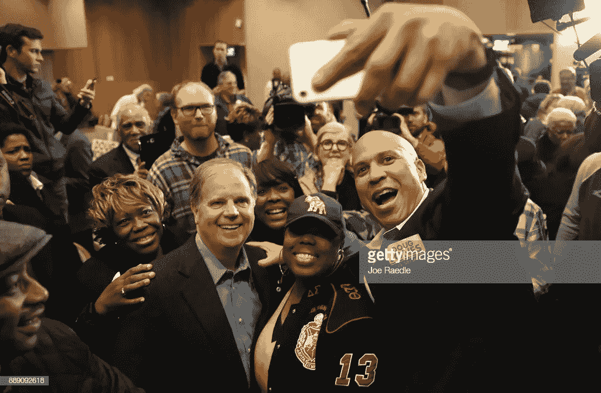

# 科里·布克的导师弗吉尼亚·琼斯谈在最艰难的时候保持乐观

> 原文：<https://medium.com/swlh/cory-bookers-mentor-virginia-jones-on-being-optimistic-in-the-hardest-times-9f3d4830755e>

> "我们对他人的评价比他们更能说明我们是谁."弗吉尼亚·琼斯

就在她儿子被谋杀的同一栋大楼里，弗吉尼亚·琼斯向美国参议员科里·布克提出了这个建议。布克在一段[优美的对话](https://onbeing.org/programs/cory-booker-civic-spiritual-evolution-jul2018/)中讲述了这个故事，琼斯要求他“描述一下”纽瓦克的“社区”,她和布克住在那里的经济适用房开发区，甚至在他担任市长的时候。纽瓦克到处都是[贫困和犯罪率几乎是当时美国平均水平的三倍](http://www.city-data.com/crime/crime-Newark-New-Jersey.html)——像绝望和贫困这样的词应该是公平的描述。

当琼斯从布克对这座城市的诚实描述中感觉到犬儒主义时，琼斯简短地提醒了他选择的权力:

> “孩子，你需要明白，你看到的外面的世界是你内心的反映，如果你是那种只看到黑暗和绝望的人，那就只有黑暗和绝望了。但是如果你看到希望，机会，如果你足够固执，每次你睁开眼睛，看到爱和上帝的面孔，那么你可以成为这里的变革推动者。然后你就可以有所作为了。”
> 
> “在我生命的开始，这是一个具有纪念意义的时刻。你有选择。”布克说，关于那一刻，琼斯女士“仔细检查了他”。

正是这种内在的能力，在某种情况下选择我们的态度，使人类的精神变得神圣——能够克服复杂的障碍，如城市中的犯罪和贫困，并通过想象，以一种创造变化本身的方式看待它。

一个很好的例子是这篇关于布克和纽瓦克的文章，把它描绘成一个堕落和绝望的地方，很快就产生了布克的这封信，展示了他和市民们每天看到的光明和进步。

正是这种纪律使布克在纽瓦克取得了成功，现在成为了国家舞台上的一名参议员。

这就是我们这个时代的规律——艰苦的工作是在被认为无处不在的黑暗中看到似乎隐藏的光明。每天都有比我们所知道的更多的事情发生。每天，我们当中有 80 亿人在晚上醒来后上床睡觉。

每天，我们起床、开车，或长或短地与他人合作，没有过失或犯规。

我们必须假设，虽然许多人可能会迷失，但在这一切之下是无辜的——即使是那些混乱的演员，他们也不得不尽其所能。

当然，这些都是邪恶的行为，必须受到惩罚。可悲的是，许多人很可能迷失得太远而无法回来，除非一个剧烈的事件或环境降临到他们身上。

但是，如果我们想要像布克和其他像他一样的人那样看待世界，我们必须像布克一样接受琼斯的建议:

> “如果你固执到每次睁开眼睛，都能看到爱，面对上帝。那么你可以成为这里的变革推动者。然后你就可以有所作为了。”

当我们在人们身上寻找光明并承认它的存在。我们激发了希望，甚至可以激发改变本身。

当我们为确实存在的黑暗承担责任时，承认邪恶的行为确实发生了，所有人都是天生善良的，即使他们可能迷失了。

> 原谅他们吧，神父，因为他们不知道自己在做什么。路加福音 23:34

是我们的假设创造了描绘我们世界现实的思想、言语和行为。掌握在我们手中的假设。

我们有责任像弗吉尼亚·琼斯和今天的科里·布克一样保持乐观的假设。

我是一名全职作家，传播我的作品是你能给予的最高荣誉。如果你欣赏我的作品，请考虑鼓掌到 50 和/或分享给别人看。衷心感谢。

[点击接收我个人用来赢得一天的晨间例行电子表格和愿景板。多年来我一直在改进它，它改变了我的生活。每周日早上你还会收到我的最佳每周文章。](https://betreatedhowyouwanttobetreated.com/optin-main)

## 这篇文章发表在[的《创业](https://medium.com/swlh)，这是 Medium 最大的创业刊物，拥有+396，714 人关注。

## 在这里订阅接收[我们的头条新闻](http://growthsupply.com/the-startup-newsletter/)。

