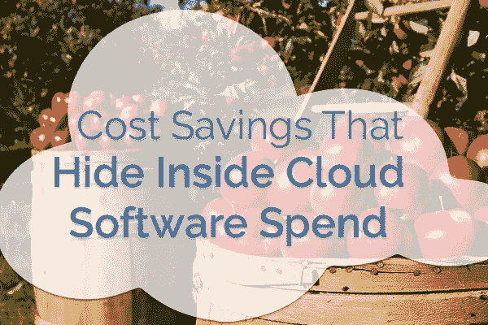

# 隐藏在云软件支出中的成本节约

> 原文：<https://medium.com/swlh/cost-savings-that-hide-inside-cloud-software-spend-d2d20544ddd>

云软件可能包含大量易于削减的成本。就像低垂的水果果园。

如果你曾在财务、采购、财务规划或会计部门工作过，你可能会理解降低成本带来的良好感觉。如果你能花很少的时间或精力削减成本，那就更好了！

本周，我们将关注这些云成本的趋势，在下一篇博文中，我们将讨论可以用来快速削减这些成本的工具。

# 云中隐藏着哪些可削减的成本？

许多可削减的成本可能隐藏在您的云中。我们准备了这个清单，所以你有一些东西要找。

**重要提示**:包括 Gartner 在内的多个研究来源表明，**难以找到的云软件费用占整体 IT 支出的 30–50%**([参见我们之前关于影子 IT 的帖子](https://alpin.io/blog/saas-spread-stampede-cycle/))。

如果你对现实生活中的场景感兴趣，包括下面的一些例子，看看我们的[恐怖故事博客](https://alpin.io/blog/shadow-it-problems/)。

# 隐性硬成本

*额外许可*

有时合同规定了许多许可证。但当他们不这样做时，额外的许可证可以累积起来，成为理想的成本削减目标。

*非活跃用户(包括前员工)*

有些人从来不用软件。如果 IT 部门不管理应用程序，一些员工可能*仍然需要取消调配*。根据我们的经验，一些组织有数百或数千个不活动的帐户。

*重复的应用程序或多个实例*

一些员工或部门决定获得自己的应用程序。即使存在类似应用的公司订阅。同样，有时员工会为一个已经付费的应用程序建立单独的账户**。**

*未优化的许可证和现成的定价*

有些许可证比其他许可证价格更高，提供对更高级功能的访问。但是，如果不是每个人都能使用这些高级功能，那该怎么办呢？这些人应该使用较便宜的许可证。如果不了解云环境，很难发现这些案例。

*分级定价，简单注册*

无论是电子邮件、交易、联系人的数量，还是其他一些指标，一些软件的价格都会根据数量而变化。如果用户可以很容易地注册一个企业帐户，并使用更多的应用程序…突然你就在下一层，并支付比预期多得多的费用。

*不合规许可费*

你应该为每张执照付费。但有些人可能会开始使用免费增值版本。或者营销部门使用他们的 marketing@电子邮件地址共享一个登录。这些用户不知道的是，软件提供商在审计你的账户后，会因为这些违规行为向你收取可观的费用。哎呀。

*用户发起的升级*

用户可以在几乎没有跟踪或监督的情况下开始注册高级功能，直到钱已经花完。

*付费订阅*

一些用户或部门自行注册，只是简单地花费成本，而很少或根本不考虑软件购买如何适应更大的购买决策。

*转换后的免费试用或免费等级*

当免费试用结束时，费用就会增加，而且不可逆转。或者随着越来越多的人在免费层注册，软件可能需要付费。随着人们习惯于使用软件，他们要求软件继续存在。

*监管罚款*

如果云软件包含敏感数据，它不应该包含这些数据，而监管机构发现了这些数据，该怎么办？然后他们可能会对你进行实质性的罚款。仅 GDPR 一家就可能导致 4%的收入或 2400 万美元的罚款(以金额较大者为准)。

*合并狂潮*

基本上，把所有这些问题放到一个合并场景中。随着合并的进行，跟踪云软件可能不是任何人的最高优先级，但账单仍然会得到支付。

# 偷偷摸摸的软成本

*管理问题和关系*

如果 IT、采购或财务部门不管理软件供应商关系，那么谁来管理呢？各部门负责人或其他工作人员总是承担这一负担，往往损害他们的其他职责。

*跟踪和审计*

至少应该有人尝试跟踪或审计这些云费用。如果他们以手动方式进行，会给他们和他们为了确定云成本而必须追踪的部门带来成本。谁愿意浪费时间带着电子表格到处跑呢？从来没有人。

想看看 Alpin 如何帮助您找到这些成本并采取行动吗？请继续关注我们的下一篇文章。想和我们聊聊吗？电子邮件 [info@alpin.io](mailto:info@alpin.io)

## 这个故事发表在 [The Startup](https://medium.com/swlh) 上，这是 Medium 最大的企业家出版物，拥有 353，974+人。

## 在这里订阅接收[我们的头条新闻](http://growthsupply.com/the-startup-newsletter/)。

