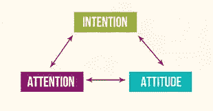

# 2018 年可能是我们的注意力跟随我们的意图的一年吗？

> 原文：<https://medium.com/swlh/could-2018-be-the-year-when-our-attention-follows-our-intention-e741908ec61b>

the mechanisms of mindfulness

**我们生活在一个“太多”的时代**:太多的数据，太多的信息，太多的刺激，太多的噪音。感觉我们的注意力被包围了:每个人都想分一杯羹——如果你像我一样，你就太容易放弃了。

**这就是为什么我的 2018 年愿望是每个人都更加专注。**

让我们不要忘记我们的注意力是一份神圣的礼物。它稀缺而珍贵。我们的选择就是这样具体化的。这让我们变得有趣和独特。

我们的注意力也是我们大脑的皮肤，保护它免受精神污染，免受那些不断让我们失去注意力的干扰。

但是，更重要的是，我们的关注也是我们的投票。我们花在不值得的事情上的每一秒钟，都让它看起来值得。**所以这是一个更大的问题:今天的关注塑造明天的互动**。或者，换句话说，每次我们点击垃圾，我们都在刺激更多的垃圾被创造出来并提供给我们。

我们的意图没有反馈回路——我们头脑中重视的是什么，我们的愿望是什么，我们希望看到世界向何处发展……它不创造数据，因此它不存在。*参与度*作为我们这个由数据驱动的世界的主要衡量标准，我们共同花费注意力的方式正在塑造商业、通信、技术、娱乐、政治议程……显然，我们在屏幕上看到的一切都是我们花费大量时间盯着看的。正如特里斯坦·哈里斯和其他人指出的那样，我们的注意力正在被偷走。我肯定在 2017 年让我的注意力被偷走了太多次。

耸人听闻的头条新闻、引发负罪感的禁令、劫持心智的通知、“三个人现在看着同一家酒店”……我们被骗了，我们被编程为点击我们并不想要的、不重视的、更重要的是，不想要更多的东西。

> “这些是我们的生命……我们宝贵的、有限的、必死的生命。如果我们不保持警惕，电视、电脑和移动设备会引导我们以不符合我们内心深处愿望的方式花费时间和注意力。”
> 
> 贾斯汀·罗森斯坦

因此，这里有一个对 2018 年的建议:让我们抵制总是多点击一次、多滚动一次、多花一分钟在不会丰富我们的内容上的数字诱惑……让我们有意识地努力在我们转移注意力的方式上更加深思熟虑。

**新年快乐，愿我们的关注追随我们的心意。**

— — — — — — — — — —

了解更多关于 [JOJA](http://www.jojanyc.com) 的信息

## 这个故事发表在 [The Startup](https://medium.com/swlh) 上，这是 Medium 最大的创业刊物，拥有 289，682+人关注。

## 在这里订阅接收[我们的头条新闻](http://growthsupply.com/the-startup-newsletter/)。

