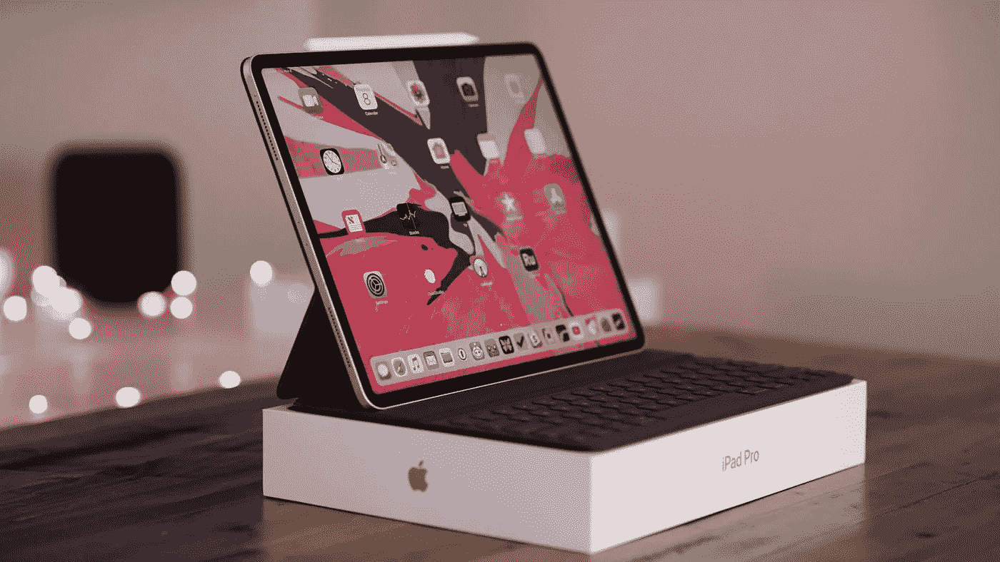
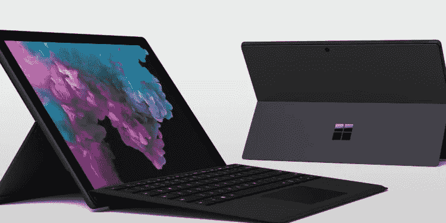
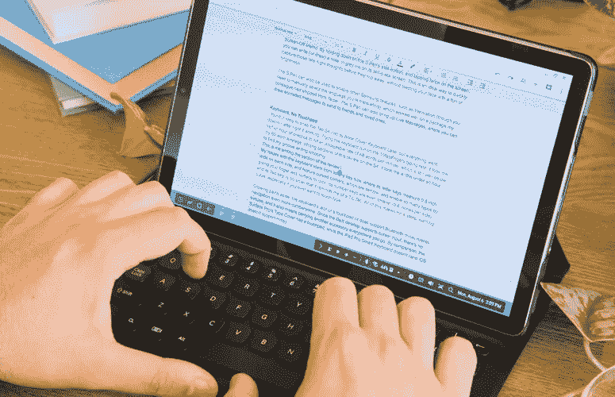

# 最新的平板电脑真的能取代笔记本电脑吗？

> 原文：<https://medium.com/swlh/could-latest-tablet-models-replace-laptops-for-real-7ae2deee8187>

技术的趋势取决于各种因素，如重量、尺寸、功率、价格和其他各种先进因素。每次由于这些因素的进步，一种技术被它的最新形式所取代。最近，技术领域也发生了显著的变化，似乎是时候说笔记本电脑是最新平板电脑的祖先了。

最近**苹果**发布了其 **iPad pro(2018)** ，三星也发布了其新 **Galaxy Tab S4，**微软也发布了其新 **Surface Go** 平板电脑。所有这些都是或多或少在同一时间发布的药片。这些型号中最吸引人的特点是，与以前的平板电脑相比，技术上有了巨大的进步。它们变得纤薄，内部内存和处理器有了巨大的改进，最显著的特点是其设计和容量接近笔记本电脑的性能和功能。

起初，我们主要使用智能手机和笔记本电脑，因为首先，它们都是便携式的，如果我们需要打电话、拍照，我们使用智能手机，发送邮件或做一些繁重的工作，我们使用笔记本电脑。几乎没有人使用平板电脑，对于大多数人来说，它只是一个炫耀其大屏幕和更好的显示器的工具。大多数公司更专注于改进智能手机和笔记本电脑，而不是平板电脑。

但现在未来即将改变。现在，平板电脑已经准备好超越笔记本电脑。平板电脑总是有一个超薄的外观，所以没有什么新的，只是它可能比以前更薄了一点。真正的变化出现在它的功能上。现在，我们有了一个可拆卸的智能键盘和一支数字笔，这让我们在平板电脑上工作感觉就像是在使用更智能、更轻便的笔记本电脑。它不仅让我们觉得我们在使用智能笔记本电脑，而且内部也有很多变化，这使它成为笔记本电脑的一个很好的竞争对手。例如，让我们考虑最新的 Ipad pro 2018，如果你滑动它的屏幕或点击，你肯定会感觉到它与其他平板电脑或智能手机相比在平滑度上的差异。它配备了最新的 A12X 仿生处理器，这是一种人工智能处理器，1Tb 至 512Gb 的存储空间，face id 解锁和许多其他智能功能。虽然在苹果的情况下，我们需要从外部购买可拆卸键盘和 Ipen，这两种产品比我们预期的要贵一些，但作为交换，我们确实得到了优质产品，特别是 Ipen。在其他公司的情况下，您可以通过平板电脑免费获得这些配件。不仅是苹果，就三星而言，你也可以获得最新的高通骁龙 845 处理器，7300 毫安时电池和更多智能功能，就像微软 surface 一样。

> 为什么有人应该购买平板电脑而不是笔记本电脑？

仅仅因为这是未来...这些最新的平板电脑不能做的事情。这些平板电脑代表着未来。你可以用它来进行演示、视频编辑、照片编辑、邮寄等等。这些可以被大学生用来完成他们的项目和任务。我的意思是你不需要再带着书去学校了，你只需要一个包和一个平板电脑。它也可以用于商业目的。它是如此的方便、轻巧和易于携带，而且随着它性能的提高，你现在可以做任何你可以用笔记本电脑做的事情。

虽然就目前而言，我不包括计算机科学工程师的百分比，他们将使用它进行机器学习、深度学习或游戏开发编程，也不包括游戏玩家的类别，他们需要重型厚笔记本电脑来运行大型游戏。它们的处理器可能很强大，但不足以处理如此繁重的工作。这仅仅是走向未来的第一步，这些只是在市场上推出的第一系列平板电脑，它们带来了如此巨大的技术变革。未来还会有更多的会带来更多的变化，也将有能力处理繁重的工作。

那么，桌子会被改进以完成繁重的工作吗？或者笔记本电脑会被做得更薄更轻来与平板电脑竞争吗？从微软最近推出的最新 **Surface pro 笔记本电脑**(**Surface Laptop 2**)中，你可以看到这些笔记本电脑变得更轻更薄，具有优质的设计和质量。如果你仔细看看那台笔记本电脑或观看它的评论，你会发现它的大多数功能都与上面提到的最新平板电脑型号相匹配，它重量轻，机身非常纤薄，具有触摸屏功能，也具有基本的现代笔记本电脑的功能。它清楚地展示了现代笔记本电脑向未来的演变。

不仅仅是微软公司，像联想、华硕、惠普都在向更轻的笔记本电脑迈进，这种笔记本电脑也可以执行繁重的任务。

技术不断进步，但一切都取决于人们的接受程度。我们是否准备好接受一个兼容的智能平板电脑的未来，它可以执行相当于普通笔记本电脑的任务，或者笔记本电脑可能笨重，但与平板电脑相比可以执行繁重的任务？

# **请在下面评论，让我知道你对这个话题的看法**

## 这篇文章发表在 [The Startup](https://medium.com/swlh) 上，这是 Medium 最大的创业刊物，有+391，714 人关注。

## 在这里订阅接收[我们的头条新闻](http://growthsupply.com/the-startup-newsletter/)。

