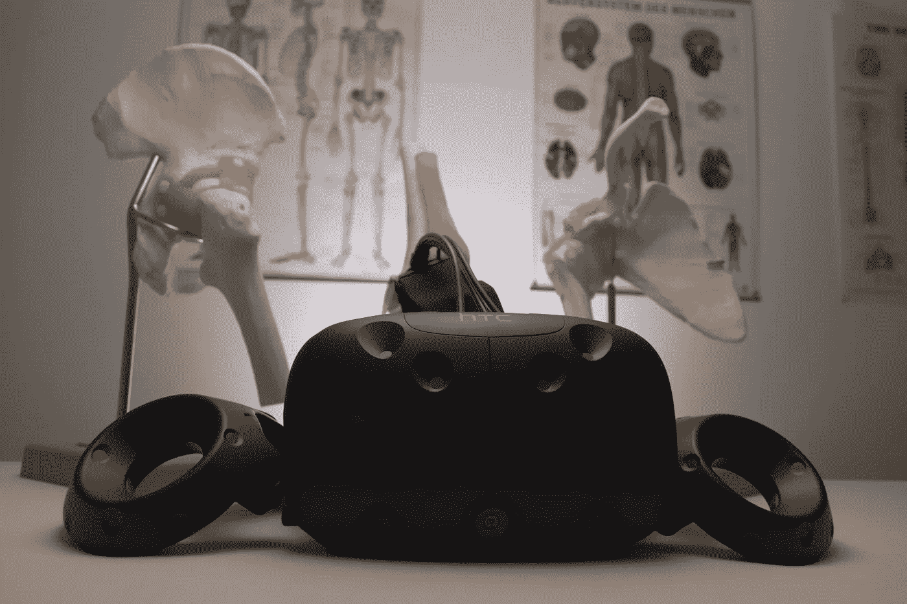
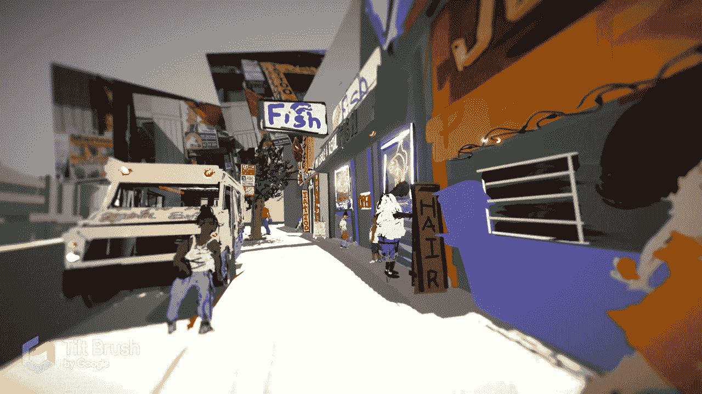

# 虚拟现实和美术能终结鸦片危机吗？

> 原文：<https://medium.com/swlh/could-virtual-reality-and-fine-art-end-the-opiate-crisis-c12391481f60>

为什么医学专家把像素换成止痛药。

每天，[超过 115 人死于过量服用阿片类药物](https://www.drugabuse.gov/drugs-abuse/opioids/opioid-overdose-crisis)。许多专家预测，这一趋势将继续恶化。尽管死亡，你很可能认识某个人(或知道某个人)已经对鸦片上瘾(我知道我是这样)。

虽然有太多的研究旨在结束鸦片成瘾，但有一个方面科学家还没有解决——也许直到现在:疼痛。

因药物治疗或疾病而疼痛的人通常别无选择，只能使用鸦片制剂。而且，一旦开始，就很难停下来，即使你以前没有接触过毒品。

然而，有一种不寻常的治疗显示出患者疼痛的可量化下降，它依赖于像素而不是止痛药。

## **这一切都是从拍摄泰迪熊开始的。**

在洛杉矶的 Cedars-Sinai 医疗中心，轮床通常带有一套虚拟现实护目镜。Cedars-Sinai Health Services Research 的主任 Brennan Spiegel 是越来越多的用虚拟现实对抗疼痛的医学专家之一，并且它产生了巨大的积极影响。

例如，最近有人进入医院窒息。作为一名胃肠病学家，斯皮格尔准备开始手术，但在仔细检查后，他告诉病人戴上 VR 护目镜，并将他带到了一个宁静的夏威夷景观。这种疾病原来是恐慌症发作，几秒钟后，病人停止了窒息，感觉好多了。眼泪从病人的脸上流了出来，他们说:“我一直在想我在那里的一生。我感觉它在失去控制地旋转。”

这只是明镜通过虚拟现实结束病痛的一个例子。说到鸦片制剂，这种方法也显示出巨大成功的迹象。使用一种叫做“Bear Blast”的游戏，Speigel 在临床试验中给病人一个机会来抑制疼痛而不会上瘾。游戏非常简单:你试着用红球射击泰迪熊。然而，结果非常令人信服:在临床试验中，患者报告疼痛减少了 25%。

那么，它是如何工作的呢？像这样的 VR 环境会分散你的大脑。通过抓住它的所有注意力，游戏关闭了从你的周围神经系统传递疼痛信号的路径。越沉浸，越不觉得痛苦。

医院已经与三星在这个项目上合作，他们将继续进行更大规模的测试，试图解决从 PTSD 到脊髓损伤的所有问题。三星首席医疗官 David Rhew 博士告诉 MobiHealthNews 说:“我们刚刚完成了一项随机对照试验，表明使用 VR 可以减少 52%的疼痛。”

**美术的运用**

在美国的另一边，纽约布朗克斯的 Montefiore 医疗中心正在尝试将艺术、虚拟现实和减轻疼痛结合起来。他们以一种非常大的和本地的方式在沉浸方面进行游戏:

通过[虚拟现实美术项目](https://montefiorefineartprogram.squarespace.com/the-virtual-reality-fine-art-program/)和艺术家[汤姆·克里斯托弗](http://tomchristopher.nyc)，他们创造了布朗克斯和纽约植物园的表现主义版本，你可以在其中穿行和探索。它基于该地区的真实素描(包括流浪汉和争吵的夫妇)，但充满了明亮的色彩和抽象的笔触。

测试正在进行中，该中心希望这种著名的环境能让患者有宾至如归的感觉，同时减轻疼痛。汤姆·克里斯托弗说，它还提供了控制，“疼痛中的人无法控制自己的疾病，他们受医生和其他人的支配——这种环境让他们感觉自己控制了生活的一个方面。”

虽然还有一段路要走，但虚拟现实似乎是一种有希望治愈席卷全国的流行病的方法。随着特朗普向鸦片宣战，甚至教皇呼吁医药创新，这可能是答案。

你认为这有助于解决危机吗？请留下你的想法评论！

查看 LTProject.com，了解更多关于虚拟现实艺术及其应用。

## 这个故事发表在 [The Startup](https://medium.com/swlh) 上，这是 Medium 最大的创业刊物，拥有 327，829+人关注。

## 在此订阅接收[我们的头条新闻](http://growthsupply.com/the-startup-newsletter/)。

