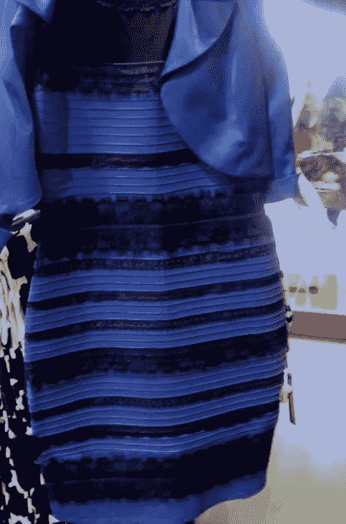

# 掩盖，你的确认偏见正在显现

> 原文：<https://medium.com/swlh/cover-up-your-confirmation-bias-is-showing-9ff380d21925>

Photo by [rawpixel](https://unsplash.com/@rawpixel?utm_source=medium&utm_medium=referral) on [Unsplash](https://unsplash.com?utm_source=medium&utm_medium=referral)

## 范例，假新闻，倾向，老实说…一切

三天前，当我在攀岩馆抱石时，一个二十多岁的金发碧眼、皮肤黝黑的年轻人向我走来。他张开嘴解释其中一条路线，这时我立刻注意到他浓重的口音。他说话的时候，我在想他可能是哪里人。也许他是法国人？不，也许他是德国人？还是荷兰人？好奇心占了上风，我不得不问他。他笑了。他告诉我他家是德国人。我心想:“啊哈！我就知道！”然后，他继续说他实际上是在墨西哥长大的。他有一口*墨西哥口音。*

我的脸暴露了我的惊讶。尽管我一生中一直听到墨西哥口音，但这可能是我最后的猜测之一。我怎么会如此离谱？显然，我的意识已经意识到他的德国特征，并在他的外表和他的讲话之间建立了潜意识的联系；但是为什么呢？简而言之，我陷入了自己的确认偏见。

# 什么是确认偏差？

有人记得 2015 年[的着装惨败](https://en.wikipedia.org/wiki/The_dress)吗？也许这张照片会唤起你的记忆:

The Famous Dress originally posted by Grace Johnston

网络世界对这条裙子感到震惊。我记得走进我的大学宿舍，被智能手机屏幕轰炸。一个朋友让我告诉他我看到了什么颜色。我困惑地看着他。“这是诡计吗？明明是黑色和蓝色的……”大家立刻开始喧哗，声称很多人看到的反而是白色和金色。我怀疑地再次盯着那张照片。几分钟过去了，颜色没有变化。这件衣服明显是黑色和蓝色的，我的朋友被骗了。我确信有人在传播一个虚假的故事。我拒绝上当。

日子一天天过去，我开始听到更多关于这件可笑的衣服的消息。我的新闻订阅中弹出的每个故事都让我发笑。怎么会有这么多人上当呢？有人给我发了一个关于我们眼球中视锥细胞和视杆细胞的研究链接。她说争议是真实的，并且已经被科学证明。我告诉她不要再被她看到的文章所迷惑。

然后，我的心理学教授在课堂上提出了这件衣服。我不敢相信。一个拥有博士学位的人会被一个社交媒体骗局所迷惑吗？她开始解释对立视觉背后的一些神经科学。我开始怀疑自己最初的不情愿。我看着贴在我面前屏幕上的照片。我*真的*看了一下。我像几天前一样盯着它。随着老师越来越多的解释，我无法相信我的眼睛开始看到的东西。裙子在变色。大约过了五秒钟，这条裙子从我最初看到的宝蓝色中褪去，变成了柔和的米色-白色。我眨了眨眼。又是蓝色的。

我的眼睛愚弄了我吗？我坚信不疑的事情怎么可能就在我眼前发生了变化？

如果你在谷歌上搜索确认偏见，你会得到这样的定义:

> "把新的证据解释为对现有信仰或理论的确认的倾向."

我对我先前存在的关于这件衣服的信念如此确信，以至于我自己的眼睛拒绝看到就在我面前的东西。我读的每一篇文章都只是坚定了我的信念。我无视科学解释，好像它们都是欺骗。直到我理智上信任的人粉碎了我的倾向，我看到的每一个迹象都只是重申了我的信念。一位教授的反对让我的大脑质疑我是否弄错了。当我不再坚定地认为我的观点是唯一正确的时候，我的思想就开放了。我最终看到了白色的裙子，因为我相信这是真的。

## 范例

虽然我的眼睛拒绝看到白色，或者我的耳朵拒绝听到任何不是欧洲；认知偏差助长了我的观点，封闭了我的思维。不幸的是，我的故事不是唯一的。这个陷阱是普遍的。

《T2 高效能人士的 7 个习惯》的作者斯蒂芬·柯维以范例的形式解释了这一现象。我们的范式是我们对世界的看法。例如，有人可能认为枪支是邪恶的，全球变暖是一个骗局，性别是一个社会议程，毒品战争是违反直觉的。相反，有人可能会认为枪支是一种必要的权利，人类正在破坏环境，性别是二元的，大麻应该是附表 1 药物。

你可能同意我刚才陈述的一些观点。你可能会发现自己对其中一些感到沮丧。无论哪种方式，你阅读这些范例的方式都重申了你的信仰和不信仰。可能你看了“枪支是邪恶的”这句话，想到了最近的枪击案。你的大脑对自己说，“那些枪击太可怕了。枪支*是*邪恶。”**确认** *。也许你读过“全球变暖是一个骗局”这句话，并想到了你最近读到的一篇解释北极冰层融化是自然循环的一部分的文章。你的大脑对自己说，“北极冰融化是正常的。全球变暖是一个骗局**确认。***

也许你读了这句话，“大麻是令人厌恶的”，想起了你的第二个堂兄，他因为小规模销售大麻正在监狱服刑。你的大脑对自己说，“我的表弟正在无缘无故地失去他一生中最好的时光。大麻不应该是附表 1 药物。现在他下半辈子都要努力找工作了。毒品战争是违反直觉的。**确认。**

确认偏见助长了我们听到我们想听的东西的自然倾向。它削弱了我们对思想开放的迫切需求。你和我生活在同一个世界，经历着同样的事情，但是对我们经历的*解释*完全取决于我们现有的信念。

## 老套

> “我们还会忽略与我们的预期不符的信息。我们更有可能记住(并重复)与刻板印象一致的信息，忘记或忽略与刻板印象不一致的信息，这是即使面对不确定的证据也能保持刻板印象的一种方式。如果你了解到你的加拿大新朋友讨厌曲棍球而喜欢帆船，你的墨西哥新朋友讨厌辛辣食物而喜欢说唱音乐，你就不太可能记住这种新的刻板印象——不一致的信息。”凯瑟琳·桑德森，社会心理学

如果确认偏见强化了我们对世界的看法，它不会止步于刻板印象。正如凯瑟琳·桑德森所说，人类倾向于更优先考虑与我们先前存在的理想一致的记忆。不幸的是，这意味着我们目前的大多数信念都是基于我们成长的环境。

如果我在一个宗教家庭中长大，即使我的观点与父母不同，我也可能会更加反对滥交。如果我是被有纹身和穿孔的父母养大的，我更有可能对他们有积极的内涵。类似地，如果我是在听到关于不同种族、性别或年龄的刻板印象中长大的(即使我后来知道它们不一定是真的)，它们仍然会影响我的范式。

## 数据科学

认知偏见不仅仅影响人类，它影响所有学习的东西。就像我的童年影响我现在的思想一样，训练数据影响机器学习算法。如果训练数据使系统歧视永久化，机器学习算法也会这样做。

2017 年的一项[实验](https://motherboard.vice.com/en_us/article/j5jmj8/google-artificial-intelligence-bias)显示，谷歌云的自然语言 API 的情感分析将短语“我是基督徒”标记为正面，但将短语“我是同性恋黑人女性”标记为负面。显然，谷歌的开发人员并没有为故意歧视开发工具。相反，这是数以千计的[机器学习偏见](https://academicworks.cuny.edu/cgi/viewcontent.cgi?article=1042&context=jj_etds)的例子之一。

# 假新闻

> “社交媒体平台远不是受过教育的精英们深思熟虑的意见的渠道，而是传播错误信息，煽动党派分歧。事实上，脸书和推特上的人们更有可能分享煽动性的帖子，而不是基于理性的复杂争论——杰弗里·罗森，[美国正活在詹姆斯·麦迪森的噩梦中](https://www.theatlantic.com/magazine/archive/2018/10/james-madison-mob-rule/568351/)

2016 年大选带来的一个意想不到的现实是假新闻的灾难性影响。大量的错误信息会带来灾难性的后果，不管这是不是有意为之。在美国，假新闻影响了选举。在缅甸和印度，它引发了谋杀。认知偏见是如何助长这种情况的？

[正如莉贾娜·里尼解释的那样](https://philpapers.org/rec/RINFNA)，人们不仅仅可能分享诉诸情感的帖子；他们希望分享他们认为有效的帖子。社交媒体上的信任通常以喜欢和分享的形式出现。换句话说，人们信任那些被分享和喜欢的帖子。具有讽刺意味的是，假新闻会引起争议。争议滋生情绪。情绪引发更多的喜欢和分享。喜欢和分享创造信任。*直接导致人们信任误传*。

童年的信念影响我们的观点，网上的喜欢和分享影响我们的信任。认知偏差有多种形式。

# 与我们的倾向开战

正如数据科学家在创建机器学习预测器时认识到他们有偏见的训练数据很重要一样，人类在对世界做出假设时认识到他们的倾向性也很重要。人类是自己主观性的奴隶，但不一定是这样。

当两个人发现自己处于激烈的争论中时，这通常源于价值观的冲突。我们的价值观影响我们的信仰。我们的信仰就是我们的观点。尽管表面上看起来一场争论需要一方赢一方输，但双方都有可能是对的。我认为裙子是蓝色和黑色的，有些人认为是白色和金色的。事实证明我们都是正确的。直到我用客观的眼光看待这场争端，我才看清了现实。

想象一个世界，每个人花五分钟坐下来，写下他们对这个世界的看法。他们可以写下他们的信仰:

*   宗教
*   流产
*   资本主义
*   同性恋的权利
*   环境
*   政治
*   关系
*   药
*   隐私
*   战争
*   他们的朋友
*   他们的敌人
*   食物
*   他们的喜好
*   他们的厌恶

现在，想象一下，如果每个人都拿着这张单子，写下这些信念的来源。如果他们第一次写下这个信念会怎样？大多数源于他们的童年吗？来自创伤性事件、上级的影响或单一经历呢？

然后，想象一下，如果这些人从他们限制性的信念中抽身出来。如果他们对自己的动机大吹大擂呢？如果他们坐下来真正质疑这些信念是在增强他们的生活还是限制他们，会怎么样？许多人可能会意识到他们正不知不觉地被几十年前的倾向所控制。

思想开放不仅仅是尊重他人的观点，也是质疑自己的观点。当我们可以刮掉污点并找到精神上的清晰时，为什么要用小时候制作的肮脏的镜头来看待这个世界呢？

改变我们的想法没有错。认知偏差并不一定会赢。

## 这篇文章发表在 [The Startup](https://medium.com/swlh) 上，这是 Medium 最大的创业刊物，有+386，607 人关注。

## 订阅接收[我们的头条新闻](http://growthsupply.com/the-startup-newsletter/)。

