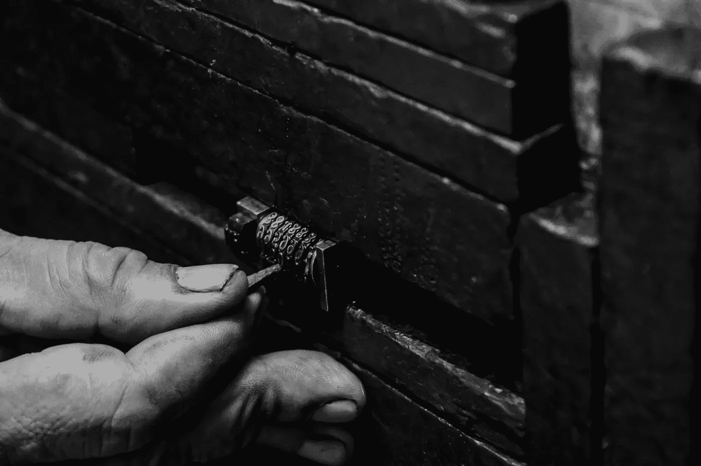

# 破解成功密码——虚幻的最后一位数

> 原文：<https://medium.com/swlh/cracking-the-code-to-success-the-illusive-final-digit-ca3804b4ffaf>

(Photo by [Ariel Besagar](https://unsplash.com/photos/Oal07Ai4oTk?utm_source=unsplash&utm_medium=referral&utm_content=creditCopyText) on [Unsplash](https://unsplash.com/search/photos/lock?utm_source=unsplash&utm_medium=referral&utm_content=creditCopyText))

*描绘场景:*

我们在银行金库里找东西。两名蓬头垢面的保安被绑在角落里，旁边站着一名挥舞着棒球棒的肌肉发达的暴徒。保险箱前蹲着另一个小偷，他的脑子比肌肉发达，专注地听着他转动密码锁上的轮子，他的听诊器贴在门上。他已经破解了一半…