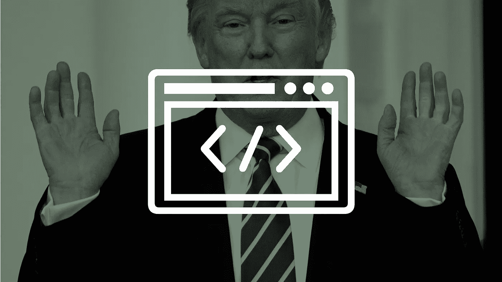
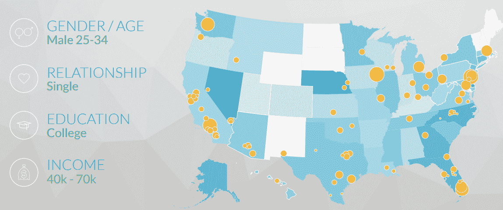
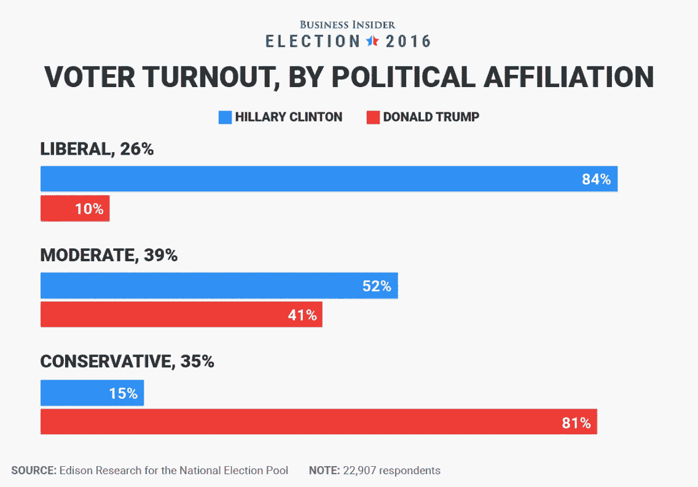
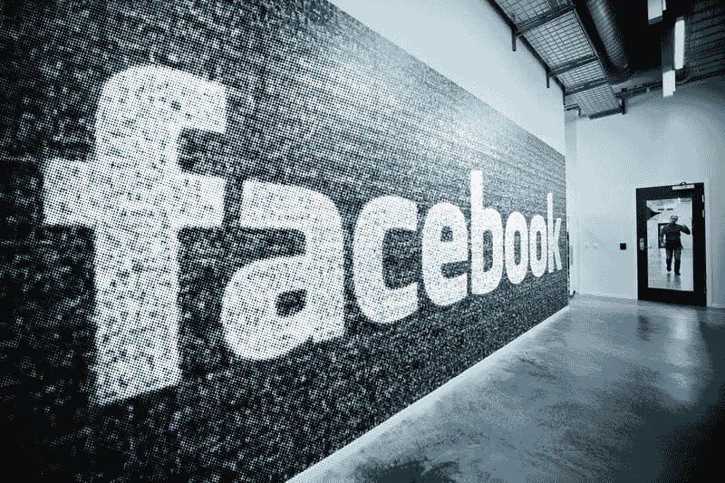
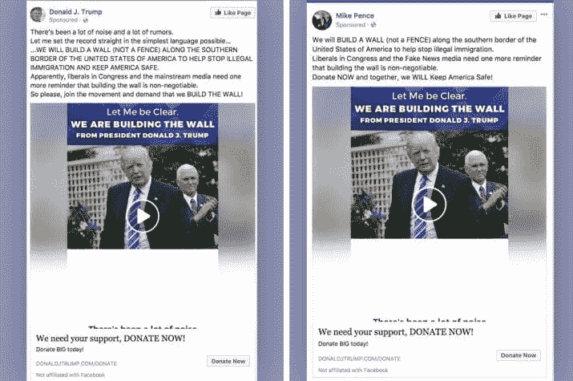
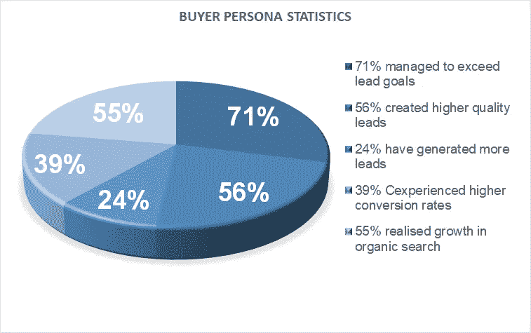
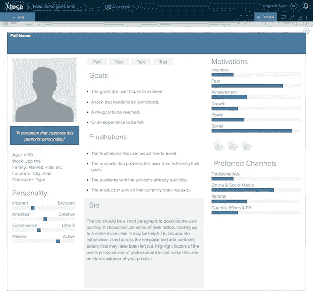
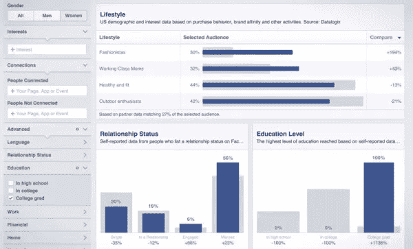

# 如何塑造你的买家形象？首先，像特朗普那样做！

> 原文：<https://medium.com/swlh/craft-your-persona-like-trump-daca6b44d770>

Image source: [Wired](https://www.wired.com/story/how-trump-conquered-facebookwithout-russian-ads/)

# 川普、脸书和其他一些策略将如何让你掌握你的买家角色，而不留下丑闻。

你认识他。你已经听说了所有关于他的怪异故事，并亲眼目睹了他作为新世界统治者——美国人喜欢这样称呼他们的领导人——所采取的可疑的政治做法。

唐纳德·川普是美国第 45 任总统，也是现任总统。一个像美国一样备受争议的人物。迄今为止，美国有史以来最两极化的总统。古怪，极其成功的商人，守旧——如果我们从他迄今为止的言论和行动来判断——还有什么呢？嗯嗯……让我想一想。哦，是的，在选择他的营销团队时有很好的品味——就结果而言。

我不会带你回忆过去，也不会向你提及他过去让自己走到今天这一步的一些做法。然而，在这篇文章中没有。作为一名集客营销人员，我不能逃避自己，我非常钦佩他对受众的了解以及如何锁定受众。

> 毕竟，任何形式的广告执行，无论是否是业绩、内容或增长营销计划的一部分，都只是达到目的的一种手段，如果你不了解你的受众 *，就不会给你想要的线索或你需要的品牌知名度。*

# 特朗普(广告宣传)案

让我们切入正题，好好看看特朗普的竞选特点:

**目标群体(又名买家角色)**:

正如任何有策略的政治家一样，特朗普非常清楚他将瞄准什么样的受众。他的竞选活动的主要信息是“让美国再次伟大起来”，针对那些在国家提供给他们的生活质量和他们不断减少的就业机会方面感到委屈的人们。

更具体地说，这一群体由固执己见、积极参与政治和没有受过教育的男性组成，由于全球化、制造业就业的解体和相关因素，他们的就业率受到了严重影响 。毫无疑问，他们是向大众传播他的信息的最佳团体。因此，通过直接与他们的价值观对话，他设法让他们站在自己一边。

## **人口统计**

*   年龄在 25-34 岁之间的人
*   单一的
*   他们没有受过教育(来源:“ [**《大西洋》**](https://www.theatlantic.com/politics/archive/2016/03/who-are-donald-trumps-supporters-really/471714/) ”)
*   中低收入(4 万到 7 万英镑之间)
*   对政治感兴趣(达到 44.06%)

Image Source: [**Cubeyou**](http://blog.cubeyou.com/audience-analysis-donald-trump/)

*   政治上活跃的保守派
*   倾向于聚集在保守派/共和党网络中(ForAmerica/ 195.14 Popularity)
*   茶话会。
*   固执己见
*   地理位置多样(德克萨斯州、佛罗里达州南部、加利福尼亚州南部、华盛顿、得梅因、爱荷华州和东北海岸)

Voter Turnout Trump vs Hillary. Source: [**Businessinsider**](http://www.businessinsider.com/exit-polls-who-voted-for-trump-clinton-2016-11?op=0#clinton-edged-out-trump-with-52-of-moderate-voters-more-people-identified-as-conservative-leaning-than-liberal-though-a-stark-divide-between-the-left-and-the-right-is-evident-here-5)

## 达到目的的手段:脸书

T 作为许多政治候选人，特朗普利用社交媒体来执行他的竞选活动——他在推特上也有 [**非凡的表现**](https://www.cnet.com/news/donald-trump-tweets-twitter-political-landscape/) 。毫无疑问，脸书是他利用最多的平台，正如最近“谣言”所说，是他当选的主要手段之一。但由于这篇文章并不关注这一丑闻的细节，所以让我们把俄罗斯人和与之相关的任何细节都撇在一边。

## 背后的黑客

他的团队关注了关于平台广告基础设施的两个因素。 [**广告拍卖**](https://www.facebook.com/business/help/163066663757985) 和脸书广告史上最古老的把戏——或者我应该说增长黑客？！？！？——****——**作[**安东尼奥·加西亚·马丁内斯**](https://www.wired.com/author/antonio-garcia-martinez/) 在他的 [**篇**](https://www.wired.com/story/how-trump-conquered-facebookwithout-russian-ads/) 上书提到。**

**他是怎么做到的？如果你对这个不陌生，你很可能知道脸书在**广告拍卖中的模式通过考虑你提交的出价和你的广告被认为有多好的点击诱饵来收费**。你的广告对参与度的预测越好，它就越贵。**

****然而，一个有经验的营销人员可以通过发布挑衅性内容**来击败系统，就像川普专门用来获得社交媒体关注的内容一样，**来触发参与循环**该平台可以提供真正快速的服务。在这样的等式中，你需要考虑的最后一个因素是**每个地理区域的目标受众成本**——就川普而言，这比他的竞争对手更便宜，因为他的大多数选民都不在城市地区。**

> **请记住，新闻订阅算法仅基于用户参与度。每一个用户都能不断地看到他喜欢的内容，每次都能看到更优化的内容，这样他就会一次又一次地关注它，直到永远。**

**加上以上所有因素，川普的团队利用了脸书的传统受众(**包括具有上述所有特征的人)**来有效地影响他的选民和……你刚刚迎来了一位新总统！！！**

****

**Trump’s sample Facebook ad. Image source : [**Ukprogressive**](http://www.ukprogressive.co.uk/trump-is-using-targeted-facebook-ads-to-reassure-supporters-he-will-build-the-border-wall/article67435.html)**

****目标信息****

**毫不奇怪的是 [**广告内容**](https://www.wired.com/story/how-trump-conquered-facebookwithout-russian-ads/) 聚焦于社会问题——如果我们考虑它的目标群体——关于移民和 LGBT 权利，以及对黑人和穆斯林的种族仇恨。而广告的地理定位涉及美国的某些地区(大约 25%)。不过这只是表面现象。**

**鲁姆普对观众的分析如此之好，以至于他想尽一切办法让观众对他忠诚。**

*   **他了解了他的观众的痛苦:构成其选民的部分是那些在经济上挣扎的人——大多数是中等收入的蓝领工人，他们目睹了工作岗位的减少，并感到国家一再亏待他们。**
*   **他找到了一个替罪羊来承担责任:在那种情况下，生活在美国的非法移民。**
*   **他提出了解决方案:一个简单但像他自己一样有争议的解决方案，立即减轻了目标群体的痛苦。**
*   **他基于情感营销发起了一场声势浩大的运动:一场以脸书和其他社交媒体为主要武器的席卷互联网的运动。**

****结果****

**这场运动的好处是多方面的。除了当选之外，川普成功筹集了**[**2.5 亿美元的大部分**](https://www.wired.com/2016/11/facebook-won-trump-election-not-just-fake-news/) 作为他竞选的资金，总的来说，他的 [**15 万美元的政治广告有 1000 万次独特印象。**](https://www.wired.com/story/what-we-know-and-dont-know-about-facebook-trump-and-russia/)****

> *****印象深刻吧？是的，任何活动都可能令人印象深刻* -总是不考虑预算支出，这使得每个活动的数字在每个案例中有很大差异- ***当你知道世卫组织是目标时！*******

****也就是说，这里的重点不是用卑鄙的手段来达到你想要的结果，而是要了解策略背后的逻辑。营销本身并不是任何故事的大灰狼。 **试图用正确的策略利用人们情绪的公司是。诉诸情感的策略，因为人们总是先倾听情感——不管你提供的是什么产品或解决方案——然后才是逻辑。因此，在构思你想要传递给目标受众的信息时，请牢记这一点。******

# ****买家角色也就是你的理想客户****

****现在你知道一个成功的有针对性的活动能给你的企业带来什么了。你已经准备好更进一步，学习如何像特朗普一样了解你的受众，从而掌握你的潜在客户生成活动- *但不留下丑闻。*****

****这里只有这么多的信息可以牵着你的手，告诉你通往成功的道路。不要犯被突然出现在你脑海中的问题弄得不知所措的错误，比如:****

*   ****我将如何吸引我的观众？****
*   ****我了解我的观众吗？****
*   ****我的产品是面向一个还是多个受众？****

****当你仍被认为是一家初创公司时，不可否认的事实是，你的营销预算非常有限，甚至更糟，几乎不存在。在这种情况下，针对您的理想客户*的营销活动就变得必不可少。* ***让我说得更清楚些，这就是创建你的买家角色的必要之处。*******

> ****简而言之，Hubspot“A[***买家角色***](https://blog.hubspot.com/blog/tabid/6307/bid/33491/Everything-Marketers-Need-to-Research-Create-Detailed-Buyer-Personas-Template.aspx) 是一个基于市场调查和现有客户真实数据的理想客户的半虚构形象。”****

****在我们深入研究人物角色的特征之前，明智的做法是先看看一些实际利用了人物角色的公司的 [**有趣的统计数据**](https://blog.kissmetrics.com/ab-testing-buyer-personas/) :****

********

****Buyer Persona Statistics Chart****

****还要注意的是，与不使用人物角色的电子邮件活动相比，使用人物角色的电子邮件活动的打开率 [**是前者的两倍，点击率**](https://www.mltcreative.com/blog/the-roi-of-buyer-personas-in-b2b-marketing/) 是后者的五倍。****

****一个 [**人物角色的特征**](https://blog.bufferapp.com/marketing-personas-beginners-guide) 可以是但不限于:****

****✔️Professional 方向****

****✔️Basic 人口数据****

****✔️Goals 和挑战分别与每种类型的人物角色相关****

****✔️Personal 价值观和兴趣****

****如果你忽略了建立一个人物角色，你的企业将面临的一些 [**后果如下:**](http://www.business2community.com/marketing/know-ignoring-buyer-persona-means-failed-marketing-strategy-01784253#xbDrHm3vqSji8GuO.97)****

****✔️Wrong 选择收购渠道来推广您的产品****

****当谈到你的产品的性能和实用性时，✔️You 会误导你的顾客****

****✔️Wrong 战役目标****

****✔️In:如果你正在建立一个列表，你最终会拥有冷漠的订阅者——这最终会损害你的产品。****

# ****打造你的角色****

****我们的下一步将关注如何开始创造你的个人形象——相信我，你不需要雇佣特朗普的营销团队来做这件事。您只需要收集所有必要的数据，找到合适的软件来创建它和/或更好地满足您需求的模板。买家角色工具****

****你会问: W 通过使用工具来创建你的角色。因为如果作为一个过程手动完成，人物角色的创建即使不是混乱的，也可能是彻底的。此外，如果你是新手，可能不太清楚应该遵循哪些步骤来获得你需要的所有证据。一个专门的工具会让你填写正确的数据，并让你的团队也为这一过程做出贡献，从而省去你所有的麻烦。****

## ****买家角色工具****

****这些工具的一个例子可能是:****

1.  ****[**Xtensio**](https://xtensio.com/tour/) 允许你输入所有必要的信息来塑造你的人物形象，如人口统计、简历、动机等。****

********

****Xtensio sample persona template****

******2。**[**make my persona**](http://www.makemypersona.com/)by[**Hubspot**](https://www.hubspot.com/)**这是一个免费的 word 文档生成器，通过回答 19 个与角色相关的问题来帮助您创建角色******

********3。**[**McorpCX**](https://www.persona.mcorpcx.com/)**是一个高度互动的平台，它可以将您的人物角色映射到特定的对象，在每个人物角色选项卡下组织您的定性研究数据，并将您的人物角色导出为 PDF 格式，以便于以后访问。********

********4。Userforge** 一款免费工具，与 Xtensio 相比功能有限，但在团队协作方面仍然非常有效******

## ****数据源****

****一个准确的数据是使你的战略运转的东西，它构成了一个单一的元素，如果解释错误，它会严重损害你的业务。回到买家角色的形成，有两件事很重要。你的数据从何而来，如何找到它们。****

******有用数据的来源可能包括:******

1.  ****直接搜索****
2.  ****您网站上的任何内容，他们都可以参与(视频、白皮书、选择加入表格等)。)****
3.  ****您的销售部门(电话、会议、现场销售演示)****
4.  ****您的客户成功部门(客户调查、客户反馈、跟进电话、实时聊天反馈等。)****
5.  ****社交媒体数据****
6.  ****竞争研究和测绘:了解竞争对手的客户——尤其是当它是直接客户时——就等于了解你的客户。****
7.  ****市场研究和细分****
8.  ****现有客户的数据和人口统计资料，以防你不只是推出你的产品****

******您可以用来获取数据的工具:******

1.  ****[**【谷歌分析**](https://analytics.google.com/analytics/web/) :获取用户行为、人口统计数据以及他们在你的网站上实现的几乎任何单一行为的数据。不要忘记设定与你的 KPI 相匹配的必要目标。****
2.  ******CRM 和营销自动化平台**:多个自动化平台如 [**Hubspot**](https://www.hubspot.com/products/marketing) ， [**Act-on**](https://www.act-on.com/) ， [**Mailchimp**](https://mailchimp.com/) 和多个 CRM 自动化工具如 [**Close.io**](https://close.io/) ， [**Hubspot CRM**](https://www.hubspot.com/products/crm) 和 [**Pipedrive**](https://www.pipedrive.com/en-gb) 所以现在你可以为任何与你的网站互动的人做任何你需要的细分，更好地设计你的客户旅程。****
3.  ******:从脸书社区的成员、你的页面的关注者和自定义受众中找到许多不同的数据类别。数据类别可能包括年龄和性别、教育、关系状况、家庭规模、生活方式、购买行为和方法。******

************

******Sample Facebook Insights dashboard******

******[**4。对讲机**](https://www.intercom.com/) :这听起来可能有偏见，但如果你是 SaaS 的所有者或进入电子商务，你有 9/10 的可能使用对讲机进行客户成功行动，在页面上或在应用程序促销和实时聊天中。这些工具提供的一些分析包括广泛的用户细分、关键指标的可视化、将您的对话转化为切实见解的方法等。******

******5。** [**【脸书聊天机器人**](https://messenger.fb.com/) :获取消费者数据的另一种方法是在你的网站上安装 facebook 聊天机器人，或者也为你的 Facebook 页面创建一个。****

******6。** [**谷歌消费者晴雨表**](https://www.thinkwithgoogle.com/tools/consumer-barometer/) :万一你想提升研究水平，找到与互联网使用相关的消费者数据。通过使用谷歌晴雨表，你可以在不同的屏幕上跟踪用户的行为——针对主要的地理区域、消费者细分市场和产品细分市场。你可以在找到如何使用它的详细指南****

********7。调查工具:**收集你需要的所有客户反馈。常用的工具可能是[**survey monkey**](https://www.surveymonkey.com/)**，**[**survey gizmo**](http://www.surveygizmo.com/)**，**[**Google Forms**](http://www.google.ie/forms/about/)******

****8。您可以从当前使用的自动化工具中获得的任何其他分析。示例包括社交媒体监控工具、热图、相关插件等。****

## ******买家角色模板******

****这里没有足够的模板供你使用。把它们想象成一张逐步填充路径的地图。如果你使用上面提到的工具，你很可能不需要它们。如果您想将现有模型与另一个模型进行比较和/或想 A/B 测试哪一个最符合您的需求，那么使用它们是明智的。****

****你不会找到传统意义上的理想模板。你可以选择你的角色应该有多详细。虽然我必须向你承认没有终点，因为你的个性化和细分技术只有在你了解你的角色的每一个微小细节时才会完善。****

******你可以在下面的演示中找到一些自定义角色模板:******

****Exhaustive Collection of buyer personas templates****

# ****包装它****

****找到合适的受众来引导你的产品并不容易。此外，它也不是没有痛苦的。当前的行业格局竞争异常激烈。有数以千计，如果不是数以百万计的品牌在那里用尽一切手段，他们可以得到，以获得他们的产品在表面上。其中一些已经建立，一些使用肮脏的技术-像特朗普-而另一些则设法锁定他们应该锁定的受众，并为他们的痛苦提供答案。****

****不管你要做什么，不管你提供的解决方案有多棒，永远记住，你的策略必须在两个不同的问题旁边打勾:****

1.  ****设法回答你的听众的痛点——并触及他们的情感——而不仅仅是他们的逻辑****
2.  ****找到正确的机制来映射你的理想角色，它会像你的产品一样随着时间的推移而不断发展。****

# ****最初发表于[reinventgrowth.co/blog](http://bit.ly/reinvnetgrowth_blog)****

****如果你喜欢这篇文章请**推荐**👏👏👏👏、**在下面的**留下你的想法或问题，或者在下面的**分享**:****

****************

****💡您可以随时在[***Twitter***](https://twitter.com/Xrysomalloysa)***，***[***Medium***](/@Xrysomalloysa)*或[***Linkedin***](https://www.linkedin.com/in/despinaexadaktylou/)*上与我联系💡******

************

## ******这篇文章发表在 [The Startup](https://medium.com/swlh) 上，这是 Medium 最大的创业刊物，拥有 314，785+的读者。******

## ******在这里订阅接收[我们的头条新闻](http://growthsupply.com/the-startup-newsletter/)。******

************