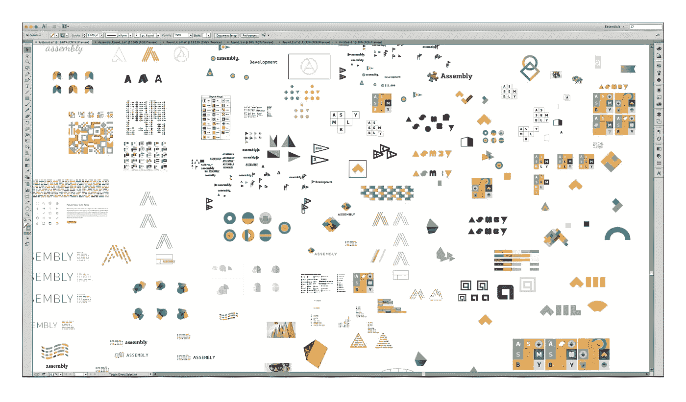
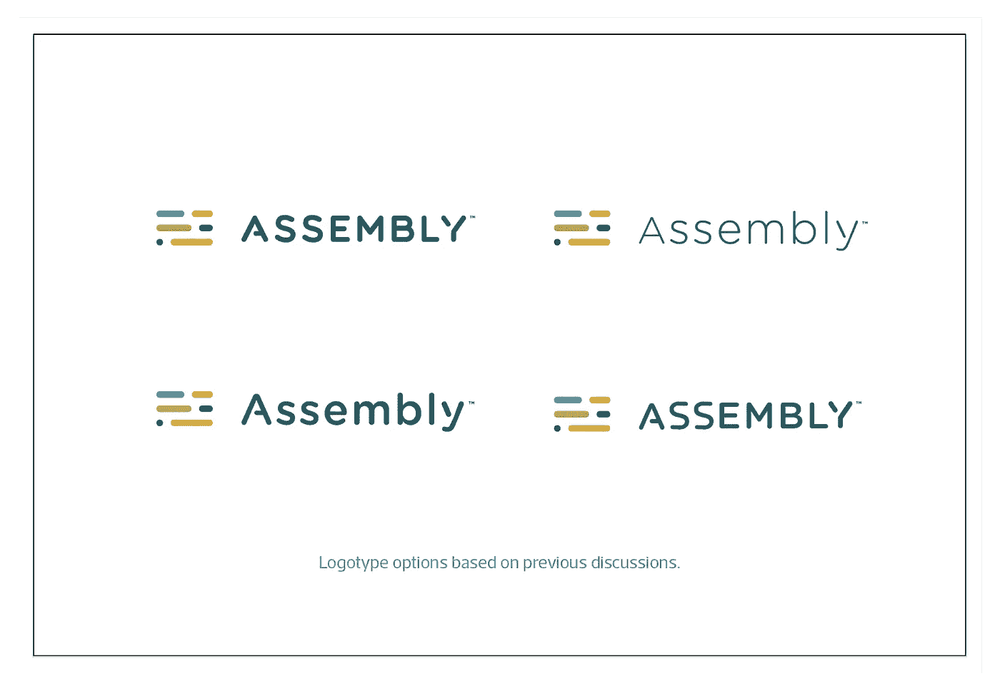

# 精心制作一个伟大的品牌交付

> 原文：<https://medium.com/swlh/crafting-a-great-branding-delivery-7992990d2548>

一个好的设计方案只是项目过程的一部分；发表一篇有思想的演讲也同样重要。在 Focus Lab，我们很早就发现，一次出色的交付会对客户和整个概念进展产生重大影响。让我先说明一下，这篇文章是针对视觉品牌实践的，而不是品牌实践的所有组成部分(如声音、信息等)。

# 定义“交付”

我们将“交付”定义为在每个生产周期结束时发送给客户的工作，将“可交付”定义为文档格式的工作。在 Focus Lab，我们每周交付一批工作，因此至少连续六周，从概念化阶段(第 1 周)开始，到最终系统(第 6 周以上)结束，每周五交付一份品牌交付物。有时会在周中交付概念，但是这个讨论更多的是关于更大、更完整的交付。周中交付的任何东西通常只是简单的截图或草图，以便获得快速的反馈，这也是有价值的。我们将在以后的文章中讨论这个话题。

# 一场精彩演讲的重要性

那么，为什么良好的交付如此重要呢？我们已经认识到，一个好的概念，如果没有恰当的视觉呈现和故事讲述，只能到此为止。你必须超越一个单一的 JPG 显示标志，因为这将不会让你或你的客户得到一个特定的设计真正的把握。相反，花额外的时间来构建一个有深度和故事驱动的演示文稿。会有很大回报的。你的客户会对你的整体愿景、品牌故事以及系统如何共同运作有更深的理解。

# 最初几轮

你的每周制作不需要发生在实际的演示风格布局中。我们每周都在一块画板上工作。这更像是我们的创作沙箱，在这里我们可以零乱地充实想法、迭代和完善我们的解决方案。然后，我们将最佳视觉效果和最佳谈话要点转移到[演示文档](https://madebysidecar.com/products/branding-delivery-template)中，该文档将被发送并与客户讨论。

重要的是要认识到，您的可交付成果将根据您的项目需求和目标每周发生变化。也就是说，第一轮品牌交付的目标与第四轮大不相同。因此，布局和方法也将改变。

A small portion of a messy art board. This is where the magic happens.

What the actual deliverable looks like after you distill down your art board madness.

这就是你如何把这些乱七八糟的东西提取出来，然后呈现一个完整的第一回合。你会注意到，只有少数观点进入了演示文稿，而且没有深入阐述。这可以作为一个起点，开始讨论并集中在几个选定的方向上。

在最初的几个可交付成果中，我们较少关注完美的设计或完整的系统，而更多关注松散的探索和迭代。一些经常被忽视的事情是分享设计背后的思考过程，视觉效果，等等。具体来说，这应该在最初几轮受到欢迎。这项工作的例子可以是文字地图，草图，艺术板截图等。一些设计师可能认为这只是向其他设计师展示你的作品的一种好方式，但我们发现这对客户对话也很有帮助。要明确的是，我不是要你每周展示你做的所有事情；不要害怕在你的早期报告中加入各种想法和探索。没有什么是完美的。在最初几轮展示更多的一个很大的好处是，你可以避免在错误的方向上走得太远，或者避免迅速放弃客户可能喜欢并希望进一步推进的东西。

> *“选择展示什么和不展示什么是一门艺术，随着时间的推移，你会越来越适应。”*

从那时起，每一轮都将继续变得更加集中和完善。你应该不断缩小噪音范围(那些不起作用的选项),并在那些更有效的选项上花费更多的精力。你和你的客户需要在这一点上达成一致。如果项目开始有了一种紧张感或紧迫感，放弃一些外观，追求其他外观，这是没问题的。这种每周一次的压力将确保这个过程继续向前推进，你和客户都不会掉进兔子洞。灵活性是好的，在一些项目中会比其他项目更多地被利用，但是坚持到底，除非真正的设计斗争出现。第三轮将严重依赖一个单一的解决方案，并建立一个更大的系统来支持它。毕竟，你已经怀孕 3-4 周了；你应该有足够的支持性的视觉效果来支持这一点。第三轮应该开始感觉像是最后冲刺，重点是什么可能是最终的解决方案。

到第 5 或第 6 周的最后一轮，你将有一个客户觉得投资和舒适的单一系统。这是他们一周又一周构建出来的设计解决方案。

This is how you take the mess, distill it, and present a solid round. You will notice that only a few of the concepts made it into the presentation and they are not deeply elaborated on. This serves as a jumping-off point to start discussing and then focusing on a select few directions.

正如你在第三轮中看到的，我们的目标是单一外观。尝试呈现另一种外观几乎没费什么力气。我们相信这是最好的方向，我们会花额外的时间建立一个更深入、更明确的系统来捕捉品牌故事。

# 注意流动

当设计一个 15-40 页的文档时，遵循一些关键的视觉流程规则是非常重要的。确保用复杂和简单的视觉效果来平衡大和小的视觉效果。也就是说，错开你的页面布局，这样浏览者就不会重复地从一个复杂的页面跳到另一个复杂的页面。用一些非常简单的视觉效果，伴随着大量的空白和不同的尺寸来打破这种局面。这不需要在每隔一页的基础上进行，但是要在文档流中考虑到这一点。在创建文档时，我通常会滚动文档 30 次以上，以便在需要视觉中断时有所感觉。这种平衡将带来更好的观看体验，从而带来更好的展示效果。

# 讲故事是关键

除了视觉上展示作品的效果之外，考虑展示的顺序也很重要。请记住，你正在构思一个循序渐进的创意故事。它应该是可以理解的，这样你的客户就能了解你的创作历程，以及你认为什么样的设计最适合他们和他们的目标。

> 简而言之，你要从最亮的视觉效果开始，并为你最好的视觉效果增加动力

用简单但诱人的封面搭建舞台。我们通常会选择这一轮中视觉效果最强的一个，但不会透露太多。接下来是几个基于复制的页面，定义了交付的目标，项目的创意简介以供参考，以及我们需要解释接下来工作的任何其他内容。这给了你的客户一个在你进入视觉之前的意图基础。你演讲的节奏或流程可以被描述为开始时平静，结束时激动人心。

接下来是艺术品。再说一遍，这都是关于建设。你应该展示让你得到一个特定外观的迭代和进化的例子。这将显示你为一个特定的概念所付出的努力和思考，同时也强调了你的设计实验的深度和广度。(这对于“你试过这个吗？”对话。)

This is a small snippet from the full presentation but it shows how you can lead up to an early solution within the presentation, taking the time to show a small portion of the exploration and thought.

当你在布局中前进，添加你的作品时，不要害怕展示一些你知道行不通的想法。我喜欢谈论它对客户不起作用的原因。这有助于展示你的探索和精选想法。虽然，这样做的时候要慎重；你的艺术板上会有很多客户不需要看到的作品。

当你进一步深入文档时，这就是你开始揭示好东西的地方:你觉得最有潜力的一两个概念。这些是我们称之为“迷你系统”的外观:色彩处理、背景照片、印刷材料等。

An example of a few pages establishing a mini system to help showcase a look and sell an idea. Showing your work in context is a must. Save it for your best solutions and when you hit your “AH HA!” MOMENT. “AH HA” = PUT IT IN CONTEXT.

当你接近文档的结尾时，重新引入带有揭示感的封面外观。让客户觉得这是设计工作一周内最好的。这将是最受关注和最大的外观。这在第一轮中基本上是不可能的，因为缺乏完善和成功的解决方案来展示。但是在后面的几轮中，这是很容易实现的，并且应该是结束一个想法的主要焦点。

最后，当进入每一个新的一周的交付时，将过去一周的交付拉到你的前几页是一个很好的接触。这有助于客户和你的团队理解你上周的进度。使用的例子:创意简报，前一周最完整的版本，以及帮助保持对预期方向理解的 moodboard。你不应该假设任何人都会像你一样意识到过去的设计和方向。一个简单的视觉提醒开始新的一轮是一个很好的接触。

# 进行最后一轮比赛

最后一轮和第一轮一样重要。两者有不同的目标，但对项目的整体成功有着巨大的重要性。不要把最后一轮和最后一次交货混为一谈。“最终交付”仍然在过程的后面，由风格指南和资产集合组成。

我们以不同于其他轮次的方式进入最后一轮，以产生更大的影响。这一轮是关于单一系统内的一致性，并展示您提出的设计解决方案的威力。

我们首先将格式改为[单个高的“滚动”式艺术板](https://madebysidecar.com/products/vertical-style-guide-template)。通过将整个设计流程包含在一个文档中，它创建了一个单一的最终解决方案的本质。不允许奇怪的分页符。我们以和上面一样的视觉故事的方式工作，但是在决策上变得更加完美和有意图。最后一轮的很大一部分是把设计放在背景中。越多越好。

> “在与 Focus Lab 的组装品牌重塑过程中，我们整个星期都在满怀期待地等待着大揭露。每个交付物都得到了解释，就像他们的思维过程和方法一样。每周都建立在上周的基础上，包括我们的反馈。在项目结束时，我们被鼓舞了，对我们一起制作的东西以及[焦点实验室](http://focuslabllc.com)带我们去那里的方式完全满意。”—马修·史密斯/[@鲸鱼](https://twitter.com/whale)

# 支持副本

现在你已经有了你的视觉流程，让我们来谈谈书面文字。在您的交付物中，有两种类型的支持文本需要考虑。确保两者都经过了很好的编辑，去除了影响你演讲的错别字。我们建议在编辑过程中至少有两组不同的眼睛。

第一套支持副本放在文档本身中。你不能把漂亮的设计到处乱放，然后期望每个人都能理解你想展示给他们的东西。一些简单的标题或不引人注目的小句子会大有帮助。

> 交付的混乱越少越好

第二套副本用于您随交付件一起发送的客户消息。这是帮助构建整体交付的关键部分。如果你的工作做得很好，你应该为你与他们分享的工作感到兴奋。让它闪耀吧。然后概述你做了什么，为什么这么做，以及你对他们的期望。它可以这样读……

*“亲爱的客户，*

*本周我们取得了惊人的进展，我们对工作的进展非常满意。本周我们关注三个主要需求:颜色、排版和最新的标识修订。*

自从我们上周讨论了标识的重要性，我们就把它作为我们的首要任务。我们在修改上花了很多时间，你将会看到一系列关于我们如何以及为什么重新制作它的图片。

*这一轮的目标是获得对修订标识的最终批准，然后了解您对调色板和新排版的直觉反应。我们还有两周的时间，所以不要太在意我们放在第 8 页的社交媒体图标和整个演示过程中的一些图像。这些只是简单的话题，我们可以在明天的会议上详细讨论。*

*希望一切顺利，我们期待尽快与您讨论这一切。*

*谢谢！”*

# 最终产品

这是我们制作的一个视频来概括这个项目。这不是交付:)

# 那现在怎么办？

我们希望这个头脑风暴能在你的下一个项目中帮助你。让我们在 Twitter [@madebysidecar](https://twitter.com/madebysidecar) 上知道什么引起了共鸣，或者其他我们可能忽略的交易技巧。

查看我们创建的[垂直风格指南模板](https://madebysidecar.com/products/vertical-style-guide-template)、[品牌画板模板](https://madebysidecar.com/products/branding-delivery-template)和[品牌展示模板](https://madebysidecar.com/products/branding-showcase-template)，让您的工作变得更加轻松；)

这将允许你从上面获取知识，并立即开始在日常生活中实施。

感谢阅读👍

*原载于*[*madebysidecar.com*](https://madebysidecar.com/journal/crafting-a-great-branding-delivery)*。*