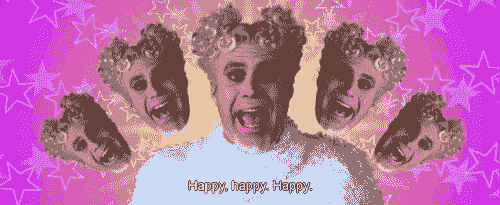
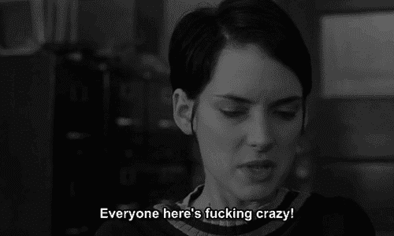
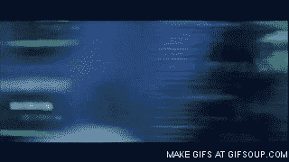

# 疯狂. io

> 原文：<https://medium.com/swlh/crazies-io-c18717b29673>

## 硅谷追求荣耀的精神创伤

睡眼惺忪，慌乱之中，我找到了办公室里可能唯一隐藏的角落，把我的笔记本电脑拉近。在通过我的保险公司网页进行捕鼠器式的搜索后，我终于找到了我的保单的精神健康服务。

为了获得任何形式的保险，我必须拨打热线，解释我为什么寻求治疗。如果他们同意我的“条件”，我的治疗将得到补贴。否则，\_(ツ)_/

我已经对我不得不寻求帮助的事实感到不安，但我长期酝酿的焦虑倦怠正在身体上表现出来。我几乎不吃东西，但我越来越胖。我全身都起了疹子，压力越大情况越严重。几个月来，我经历了胃病、感冒和流感，其中大部分足以让我卧床不起。

尽管如此，我还是觉得自己在追鬼。我日渐消瘦，被某种疾病所困扰，这种疾病与硅谷凉爽的工作和宜人的天气格格不入。其他人似乎都在独自应对自己的压力，带着巨大的尊严和毅力修补自己的裂缝。

两年前，我的脚摔断了一根小骨头，几个月来一直在医生办公室进进出出。我的专家给他们传真了一份表格，我收到了一封信，说我的治疗被批准了。我一次也没给我的保险公司打电话。坐在薄薄的电话间里，电话号码潦草地写在一张便利贴上，我为自己感到尴尬。我不敢相信事情会发展到这一步，乞求保险代理人让我去接受治疗。我无法忍受一个匿名的陌生人最终告诉我，我的“状况”是不合法的。

谢天谢地，我最终接受了治疗。我自掏腰包，这是一笔不小的财富，但我很高兴我能负担得起。我几乎没有告诉任何人，因为我害怕谣言会四处传播，说“Ash 终于发疯了”，我会被解雇。

疯子不会在山谷里工作。

# 或者他们有吗？

当我向我的一个密友透露我正在接受治疗时，她看着我严肃的脸，差点笑出来。

“姑娘。所有人都在接受治疗。我已经去了好几年了。”

当我向其他朋友敞开心扉时，我震惊地得知还有谁在接受治疗。我认为他们是情感的磐石，无畏的领袖——每个人都有自己的一面。即使是对自己的开销非常在意的朋友，也会在他们的日历上把这个可疑的地方标上“忙”的字样。

为什么我们这么多年都没谈过这个？为什么我在变成人类松果之前没有去治疗？在网络电视上播放男性阳痿广告的文化中，为什么我们如此害怕修复我们的思想？

# 饱受折磨的皇室成员

传统上，职业倦怠是教师、护士、士兵和其他高压力工作人员的专利，但它已经悄悄潜入了我们享有特权的黑客巢穴。尽管有免费的食物和啤酒，大多数开放的办公环境类似于血汗工厂。有一种分散注意力的期望，一种混乱的潜流，我们选择将其解释为悠闲的自由。挤在狭小的空间里，普通的硅谷员工会在感官超负荷的游行中不断受到干扰。

每周工作 80 小时是一种荣誉。有了所有的食物、淋浴和可以小睡的沙发，人们就不愿意寻求外界的刺激。

然后，是对失败的强烈恐惧。如果你足够幸运地为一家拥有数百万用户的公司工作，那么每一个行为都是对表现焦虑的锻炼。犯一个错误，无数的眼睛会看到。甚至坦率地说，鸡毛蒜皮的错误都被吹捧为生死攸关的事情，就好像一千个人犯一个 500 分的错误就会毁了公司，摧毁一个帝国。

这种对失败的恐惧意味着我们对寻求帮助犹豫不决。这意味着我们担心破裂的接缝是性格弱点的表现。我们进入了这样一个循环:感觉不安全，对不安全感到愤怒，对我们对不安全感到愤怒感到难过，对其他人似乎都在应对时感到难过感到不安全。

再加上一点点每天都在变化的期望和对受过良好教育的辩论俱乐部式欺凌的崇敬。这是导致精神崩溃的原因。

# 倦怠如何影响身体

> …最近的研究发现，倦怠以及相关的“生命衰竭”概念增加了心血管疾病的风险，其程度不亚于体重指数、吸烟和血脂水平等众所周知的风险因素。具体来说，倦怠增加了人们患心肌梗死、缺血性心脏病、中风和心源性猝死的可能性。研究还指出，身体、精神和情感极度疲劳的人患二型糖尿病、男性不育症、睡眠障碍和肌肉骨骼疾病的可能性增加。
> 
> …倦怠和健康问题之间的其他潜在途径可能包括不良健康行为、睡眠障碍、代谢综合征以及分解凝血蛋白质的困难。
> 
> — D .史密斯·贝利，美国心理学协会

博士，极度的压力就像吸烟或肥胖一样对你有害。更不用说它对你的人际关系或精力水平的影响了。当你只想暴跳如雷，趴在沙发上吃爆米花的时候，你不会赢得任何理想人类标本的奖项。

# 我们如何解决这个问题？

硅谷的招聘人员喜欢出售他们的额外津贴。班车服务距离我们的房子两个街区。女按摩师扮演恩雅，为我们解决背部的问题。美丽的免费食物，有盘子和装饰物，有过敏意识，在拿铁咖啡上涂抹泡沫艺术的内部酒吧服务员。健身房会员资格，防止免费食物让我们变胖。如果你幸运的话，还有免费的卫生棉条。

我欣赏这些高贵礼物背后的情感。员工应该努力工作，这并不是没有后果的。身体变得矮胖，脖子变得紧绷。但是，尽管在津贴方面处于领先地位，并对立式办公桌和无麸质选择保持关注，硅谷和美国其他地区一样，并没有对心理健康给予太多关注。

关于公司如何提供帮助的一些想法:

将健身房会员资格与精神健康津贴相匹配。给人们一年的治疗和教练津贴。如果压力像吸烟和高身体质量指数一样危险，那么有理由认为与专业人士交谈就像在跑步机上挥汗如雨一样有效。专业人士帮助人们规划他们的职业生涯，让他们有所期待，并给予他们以富有成效的方式应对压力的技能。可以说，这比足够强壮去爬山更有意义。

**停止美化工时殉难。感谢那些努力工作的人，但不要把时间看得太重。看，我们都必须偶尔为团队做一件事，但是持续和被迫的长时间工作根植于恐惧(如果我不这样做，他们会解雇我；如果我不这样做，我的公司将会消亡)或一些管理不善(糟糕的项目安排/资源，史诗般的系统故障和效率低下)。几个小时聪明、专注的工作表明你的公司明白自己的使命，并且会长期坚持下去。我们将硅谷短暂的任期归咎于千禧年的反复无常，但我强烈反对倦怠。**

**在需要休假之前就强制休假。**啊，倦怠的假期，辞职的前兆，团队的破坏者。与快乐的积极度假不同，疲惫的假期经常提醒我们，工作已经成为一种逃避的事情。甚至在离开旧金山之前，坐在飞机上，我们就已经对返回感到焦虑和恐惧，并决定再也不用回到办公室了。为什么不制定一个最短假期和最长假期的政策呢？为什么不与标准或 Ace 这样的时尚连锁店一起提供一些折扣酒店交易，以鼓励人们探索呢？

硅谷在福利、创新和开放方面领先全国。这也是人们逃离金融和学术界前往北加州金山的部分原因。这是人们指责我们有权的部分原因。通过将精神健康列为海湾地区的优先事项，有机会改善整个国家的精神健康。想象一个宇宙，在那里我们公开谈论我们的大脑，把获得帮助视为健康的重要部分，而不是性格缺陷。如果媒体谈论的是我们对精神健康的过度关注，而不是免费的苏打水，那不是很好吗？作为过度分享的创造者，我们是引领这一改变的最佳人选。

你希望看到什么样的心理健康益处？你的公司做什么值得注意的事情吗？分享！

*感谢阅读。如果你喜欢这个，我写一个* [*小周刊*](http://tinyletter.com/ashsmash) *和我的其他东西，书籍推荐和报价。*

发表于*[**【SWLH】**](https://medium.com/swlh)**(***创业、流浪、生活黑客)**

******