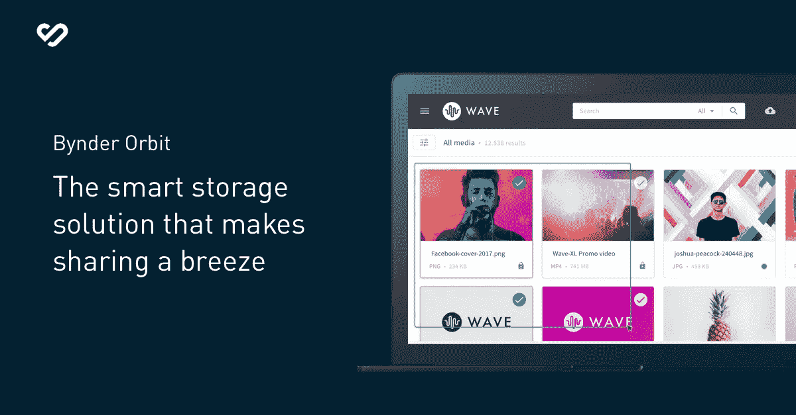
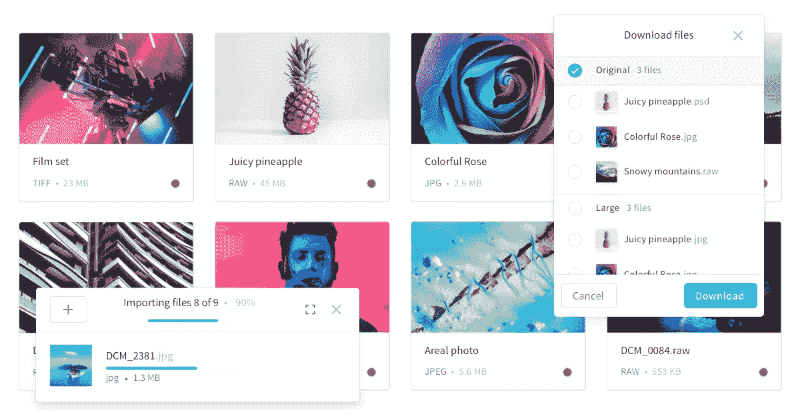

# 在需要时创建、查找和使用您的内容

> 原文：<https://medium.com/swlh/create-find-and-use-your-content-when-you-need-it-9400d0eb314b>

[**Bynder**](https://www.bynder.com/en/) 是专业管理创意文件的最快方式。团队可以在同一个页面上进行实时协作编辑和审批，轻松共享和存储文件，自动格式化频道和文件类型-它为所有公司材料和消息提供了一个中心。

[**凯文·威廉·大卫**](https://twitter.com/kwdinc) 采访了 [**刘烨·吕丁**](https://twitter.com/LidiaLuettin) 、CMO[**比德尔**](https://siftery.com/bynder) 了解更多。

## 嗨，刘烨，让我们开始吧！

## 给我们讲讲 Bynder 吧？

Bynder 是一个 100%基于云的平台，用于管理数字文件或数字资产管理(DAM)，允许用户随时查找、组织和共享数以千计的照片、视频、文档和 PDF。营销人员和品牌专业人士正在创建比以往任何时候都多的数字内容，并将 Bynder 用作所有公司材料和消息的中心枢纽，用于数字文件的实时协作编辑和批准，以及方便的文件共享和存储。我们的使命是为公司提供一种面向未来的方式来组织和共享他们的数字文件，并保护投入其中的金融投资。

## 告诉我更多关于你为什么要建立这个的信息？

自公司成立之日起，我们就一直受到客户需求的启发。Bynder 最初是作为克里斯·霍尔网络开发机构 Label A .的客户端解决方案而诞生的。克里斯·霍尔(Bynder 的首席执行官和创始人)看到了客户不断变化的需求，他们需要一种快速易用的方式来组织和共享快速增长的数字文件。

这是一个简单的想法，但是缺少这样的工具给整个部门带来了问题，因为他们无法及时、安全地找到巨大的文件并与正确的人共享。这是拜恩德出生的地方。从那里，Chris 发现了 DAM 领域，并知道 Bynder 可以帮助无数需要简单、直观和集中的中心来随时随地轻松组织、创建、存储和共享数字内容的营销和品牌专业人员。

## Bynder 与市场上已有的产品有何不同？

Bynder 提供了像 Google Drive、DropBox 和 Box 等其他存储平台一样的易用性，但具有额外的文件管理功能，营销人员和创意人员需要从他们的工作中获得更多的使用。在我们的 SaaS 模型中，这一切都是可能的，它由 AWS 提供的安全性、可伸缩性和可靠性来支持。

我们与 [**AWS**](https://siftery.com/company/amazon) 有着密切的关系——事实上，我们是欧洲最大的 AWS 用户——这使我们能够在我们的平台中加入一些独特的功能。我们的平台使用人工智能在照片上传到 Bynder 时自动识别和标记照片中的对象。例如，如果用户上传一张海滩的照片，像“海滩”或“海洋”这样的关键词将自动附加到照片上，使个人在未来可以很容易地搜索到公司的所有“海滩”照片。

我们认识到需要这样的解决方案来与其他软件集成，例如 CMS 平台、社交媒体管理工具、聊天工具、Adobe 套件等。—并努力不断更新我们的平台，以便与我们用户日常使用的其他有价值的工具携手合作。用户还可以开发自己的定制应用程序、插件，以及与 Bynder 的集成。

## 谁用 Bynder？

Bynder 在全球品牌的大型营销团队中最受欢迎，他们处理大量数字图像，如[**【Spotify】**](https://siftery.com/company/spotify)[**Puma**](https://siftery.com/company/puma)和 [**Lacoste**](https://siftery.com/company/lacoste) 。这些公司每天都要处理成千上万的文件，需要一个中心位置，让公司的每个人都可以方便地访问和找到他们需要的内容，无论是案例研究还是最新的徽标。

随着我们的免费产品 Bynder Orbit 最近的推出，我们正在将 Bynder 的触角延伸到新的受众——希望立即组织他们的文件而无需漫长销售过程的营销人员。它与我们的企业产品不同，因为它更加精简，并且对 Orbit 用户可以存储的文件数量有限制——总存储容量为 100GB，每月流量为 10GB，但它的用途与可扩展的中心枢纽相同。

## 您的客户如何使用 Bynder？你能分享一些不同的使用案例吗？

我们的一些顶级客户包括 [**冰岛航空**](https://siftery.com/company/icelandair) ，彪马和 Spotify，仅举几例。例如，通过冰岛航空公司，Bynder 的 DAM 模块允许该公司在一个用户友好的门户网站内存储、共享和管理所有有价值的资产。在使用其他门户系统时，冰岛航空公司发现他们在控制内部和外部传播的图像的到期日期方面存在问题，这意味着即使他们已经失去了这些资料的使用权，仍在使用过期的图像。由于 Bynder 的详细搜索，所有用户现在都能够轻松找到正确、最新的资产，然后可以直接与第三方共享，如外部旅行社或媒体。使用权也不再是问题。有了 Bynder，正确的图像总是可以获得，因此没有第二次猜测。

Puma 是另一个在使用 Bynder 之前面临诸多挑战的客户。这家运动服装公司面临着各种问题，包括上传/下载速度慢、外部合作伙伴访问数字资产的权限有限，以及在办公室之外更新资产的困难。Bynder 的元数据标记和智能过滤现在允许团队立即访问图像、照片和徽标，促进跨团队更快地交付资产、加强协作和提高效率。

## Bynder 有没有你没有想到或预料到的独特用例？

我们开发了 Bynder Express，这是一种传输大型文件的安全方式，是根据特定客户的请求创建的。在它发布后，我们的许多客户立即开始使用它，因为直接从门户安全传输大文件的需求比预期的要高得多。这不是我们预见的用例。这种传输功能现在更像是一种 USP，能够安全地分发不一定需要在 DAM 中可用的文件。简而言之，倾听你的用户！

## 有什么早期的“成长秘诀”或策略促成了你现在的成功吗？

不确定我们是否会将这归类为技术*增长黑客*，但对我们来说，保持对我们的客户如何每天接触不同媒体类型以及整个劳动力的需求如何快速发展的脉搏是极其重要的。想想一个组织每天要处理多少不同类型的文件。组织正在创建比以往更多的图像、视频和其他类型的文件。这项工作也可能随时随地发生，因此了解和预测这些不断变化的需求有助于我们为当今的劳动力需求提供技术解决方案，同时关注组织未来可能的需求。

## 在早期构建产品时，最大的挑战是什么？你是如何解决的？

在避免基于我们的第一批客户开发我们的 SaaS 解决方案过于具体和狭隘的陷阱方面存在挑战，因为我们希望提供通用的用例，以真正成为开箱即用的解决方案。我们确保 Bynder 变得高度可配置，无需开发，因此 onboarding 仍然很快，Bynder 仍然可以适应不同的工作方式，但都在相同的代码库和 SaaS 产品中

## 你加入的最有趣的整合是什么？

[Adobe Creative Cloud](https://siftery.com/adobe-creative-cloud) ，[sales force Commerce Cloud](https://siftery.com/salesforce-commerce-cloud)([Demandware](https://siftery.com/demandware))， [Slack](https://siftery.com/slack) ， [Hootsuite](https://siftery.com/hootsuite) ， [Drupal 8](https://siftery.com/drupal) ， [Adobe 体验经理](https://siftery.com/adobe-experience-manager)， [inRiver PIM](https://siftery.com/inriver) ， [Templafy](https://siftery.com/templafy) ， [Workfront](https://siftery.com/workfront) 和 [Shutterstock](https://siftery.com/shutterstock) 。

## 最后，你运营公司所依赖的顶级产品是什么&你如何使用它们？

除了 [Bynder，](https://medium.com/u/e04c85bd23ff?source=post_page-----9400d0eb314b--------------------------------)

- [松弛](https://medium.com/u/26d90a99f605?source=post_page-----9400d0eb314b--------------------------------) —内部消息传递。

- [Salesforce](https://medium.com/u/f4fb2a348280?source=post_page-----9400d0eb314b--------------------------------) —销售自动化。

- [**HubSpot**](https://medium.com/u/8732e73183e5?source=post_page-----9400d0eb314b--------------------------------) —营销自动化。

- [**G-Suite**](https://siftery.com/g-suite-formerly-google-apps-for-work) —协作。

- [Asana](https://medium.com/u/4fecc4c082c?source=post_page-----9400d0eb314b--------------------------------) —任务管理。

*最初发表于*[T5【siftery.com】](https://siftery.com/stories/create-find-and-use-your-content-when-you-need-it)*。*

## 这篇文章发表在 [The Startup](https://medium.com/swlh) 上，这是 Medium 最大的创业刊物，拥有 297，332+人关注。

## 在此订阅接收[我们的头条新闻](http://growthsupply.com/the-startup-newsletter/)。

