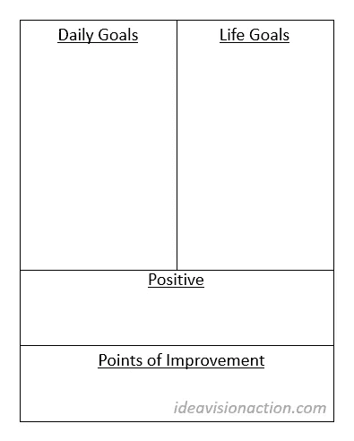

# 创造你梦想中的生活，每天 15 分钟

> 原文：<https://medium.com/swlh/create-your-dream-life-15-minutes-a-day-e7ad40f5e3d>

即使你没有为自己做任何事情，也要每天做 15 分钟的锻炼。

[rawpixel/pixabay](https://pixabay.com/en/book-bread-bright-bun-cafe-casual-1986286/)

两周前，我开始了一个新的日志练习，到目前为止，这个练习对我来说效果不错。我在练习中使用了一个 A4 的记事本。这个尺寸接近美国的字母尺寸。

去年，我曾经用 Evernote 做每日日志练习，但那对我来说效果并不好。我不喜欢在漫长的工作日结束时在笔记本电脑或智能手机上打字。

写日记是回顾一天并为第二天做准备的好方法。不会花太多时间，因为我会保持简短和甜蜜。我不反对每天写几页日记。这可能对某些人有价值。那不是我现在做的事情。

**我的每日页面由什么组成？**

我把这一页分成四部分。

*   明天的每日目标
*   人生目标
*   今天发生的积极的事情
*   明天的改进点

Journal Page Template

**正向**

我通过回顾一天开始写日记。今天进展顺利吗？我把它们写在积极的部分。这是一个承认我的成就并对所有发生的好事心怀感激的好机会。

大多数时候，我们过于关注那些不起作用的东西。我们认为有用的东西是理所当然的。

> ***你的血统经历了 45 亿年的进化才产生了你。***

想一想。这一链条 45 亿年来从未中断过。你血统中的每一个祖先都设法生存到了繁衍的地步，而你就是那次进化的最终结果。是不是很神奇？这难道不是值得感激的事情吗？

如果我必须写下我感激的每一件事，我会写上几个星期，无法完成这份清单。然而，这里的想法是专注于这一天，让它短暂而甜蜜。

**改进点**

第二步，写下明天的改进点。注意这里的措辞。我不用“今天发生的消极的事情”这样的词。在最坏的情况下，我称之为挑战。当我称之为挑战时，我能找到克服它们的方法。

将这一部分称为改进点意味着我要对我生活中发生的任何事情负全责，不是我的老板，不是我的父母，也不是总统。这阻止了我去责备其他人、事件和情况。

> ***今天有哪些挑战或不足？更重要的是，明天我能做些什么来克服这些挑战和缺点呢？***

我知道我不能在某一天改变一切。我无法克服所有的挑战和缺点。但是，我可以向我的目标迈进一步。我可以在一天内向我的目标前进 1%。这 1%的每日改进在一年内会带来 38 倍的改进。那就是**没有** 38%的提升；这是 3800%的改进。

> ***那些每日 1%的改进会在一年内产生 38 倍的改进。***

我尽量保持两者，积极的和改进的点，简短而甜蜜，最多几行。然而，在某些日子里，我被那天的奇迹惊呆了，我的乐观情绪溢于言表。当那发生时，我允许它发生。我不限制自己。

**每日目标**

第三步，翻过这一页，为明天做好准备。我写下明天的每日目标。这是 10 到 12 行，给我一个明天的概述，让我为这一天做好心理准备。

每天的目标是我想在我的私人和职业生活中完成的几行。每日目标的好处在于它们简单易行。我知道我有能力完成它们。

> 如果我坚持完成这些简单易行的日常目标，日复一日，随着时间的推移，我将朝着我的生活目标取得重大进展。

**人生目标**

每天，我在明天的每日目标旁边写下我的人生目标。当你把自己的人生目标背下来，每天都写下来，而不看上一页时，影响会大得多。我从 Brian Tracy 那里学到了这个技巧，自从我开始使用这个技巧以来，我已经朝着这些目标取得了一些进展。

**动机**

你可能会质疑我每天做这个练习的动机。为什么不看一会儿电视，喝一瓶啤酒，然后上床睡觉，而不是每天晚上做这项运动呢？

**持续改进**

首先，我知道只要每天提高自己和生活的 1%,我就能取得显著的进步，实现惊人的目标。这对每个人都是真的。做到这一点的最好方法是记录某一天发生了什么，我如何改进它，我明天想做什么，我想在我的生活中完成什么。就这么简单。

如果你有更好的方法，请在评论里告诉我。

**知名度提高**

持续改进并不是我开始每天写日记的唯一动机。

2018 年的第一周，我在反思 2017 年的生活。我很清楚我在 2017 年的前六个月在做什么。我也知道 2017 年最后三个月我在做什么。但不知何故，中间有几个月或几个星期，我不知道我当时在做什么。

当然，我去了我的工作，去了健身房和其他地方，但仅此而已吗？在那几天、几周和几个月里，我取得了哪些进步？我生命中的那几个月一去不复返了，我甚至不记得那时我做了什么？这让我震惊。我不想再次处于那种境地。这就是为什么我现在想记录我的日子。

**周、月、季总结**

每周之后，我都会对积极的方面和需要改进的地方做一个每周总结。这给了我一个很好的概述，我在上周做了什么，在下周我需要改进什么。

我还计划做月度和季度总结。这样，我可以在年底回顾我的月度和季度总结，并看到我在过去一年中取得的进展。

在年底，我可以花一点时间来感谢我在过去一年中取得的所有进步，我可以提出改进点和明年的年度目标，并提供一些真实的数据作为我决策的基础。

**总结**

每天花 15 分钟写下当天发生的积极的事情，改进点，第二天的每日目标，以及你的生活目标，从长远来看，这些会给你的生活带来巨大的变化。

*阅读下一篇:* [*如何在一年内将自己的生活提升 38X*](https://ideavisionaction.com/personal-development/how-to-improve-your-life-38x-in-a-year/)

## 这篇文章发表在 [The Startup](https://medium.com/swlh) 上，这是 Medium 最大的创业刊物，拥有 291，182+人关注。

## 在此订阅接收[我们的头条新闻](http://growthsupply.com/the-startup-newsletter/)。

