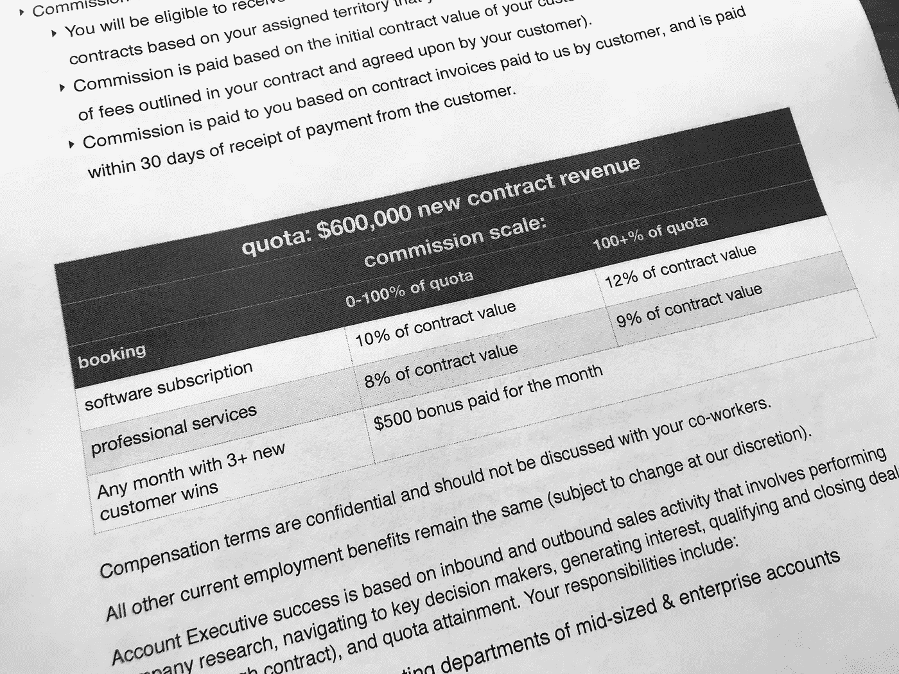

# 创建有竞争力的创业销售薪酬计划

> 原文：<https://medium.com/swlh/creating-a-competitive-startup-sales-compensation-plan-aa060cda20b4>

当我还是一名新的销售经理时，薪酬规划是我知识中最大的空白之一。我自己不是销售代表，只是一个销售的创始人，我个人从来没有过薪酬计划。然而，我很快认识到，在销售和市场营销上投入时间和资源是发展我的企业的最重要的方面之一。

或许并不令人意外的是，2016 年 Pacific Crest [对 SaaS 公司的一项调查](https://www.forentrepreneurs.com/2016-saas-survey-part-1/)发现，“在销售和营销上花费更多(占收入的百分比)的公司通常比那些花费较少的公司增长更快。”

当我制定我的第一个 SaaS 销售薪酬计划时，我不仅不知道如何开始，而且也没有可用的基准或行业“经验法则”,所以我真的只是在黑暗中摸索，并在进行中完善我们的计划。幸运的是，现在我们可以使用许多基准和报告点来了解 SaaS 销售薪酬的行业规范。以下是我希望在制定我们的第一个薪酬计划时就知道的该做和不该做的事情。

# **做:首先，确定你的团队的目标收益**

目标收入(OTE)(也称为总目标薪酬，TTC)是指某人完成定额后将获得的收入。因此，您的首要任务是为所有销售团队成员确定您的 OTE，包括您的 AEs、SDR、销售工程师和各种支持/运营角色。请考虑以下事项:

*   使用像 salary.com[这样的资源进行地区比较，用基准数据研究市场规范。](https://www.salary.com/)
*   确定基本工资和佣金的划分。作为一个经验法则，当你开始的时候，设计你的薪酬计划是 50%的基础和 50%的佣金。最近 Bridge Group [对 SaaS 342 家 B2B 公司的调查](https://www.forentrepreneurs.com/bridge-group-2015/)发现，平均基本工资为 60k，平均 OTE 为 118k，这表明男女比例大约为 50:50。
*   OTE 通常大致基于新预订的总百分比。例如，如果销售代表的配额是 1，000，000 美元，如果他们达到配额，他们将获得 200，000 美元，那么他们将获得总预订量的 20%左右。就规范而言，我认为这取决于市场、公司融资水平、其他利益等，存在很多差异。但是它通常占总预订量的 10-25%。我知道这是一个很大的差异，但它取决于许多特定公司特有的因素。例如，20-25%的预订更有可能发生在资金充足、非常热的地方。这对于一个试图精益运营并盈利的公司，和/或没有大量现金储备但如果有强大的客户保留、积极的收入流失和高客户 LTV(终身价值)就可以工作的公司来说是一个挑战。通常，一个资本效率高、精益或自举的企业会获得 15%的订单。
*   从那里向后计划，看看实际的佣金率是多少。一般来说，佣金百分比的范围是合同价值的 5-15 %,尽管 Bridge Group serve 发现平均比例为 10%。佣金率取决于许多因素，包括利润率、公司可能试图达到的目标利润率、融资水平、总体客户获取成本等。

# 记得为竞争和成就做计划

销售代表在竞争和成就中茁壮成长。除了基本工资和佣金之外，作为部门计划的一部分，您还需要根据个人和团队的目标实现情况设置激励和奖金。

我总是喜欢内置加速器，以便达到配额的销售代表有机会获得更高的收入，并在 OTE 的基础上获得激励。但同样重要的是，要建立激励机制，提供快速、小额的奖励，并伴随着大量的宣传，如果不是大量的奖励的话。例如，Overview 的合伙人德文·麦克唐纳(Devon McDonald)每年只花[5200 美元](https://labs.openviewpartners.com/sales-incentives-5200-to-keep-your-inside-sales-team-extra-motivated-in-2012/#.WwYZjdMvyRs)，每周给她的销售团队 100 美元奖励，奖励他们与决策者进行最多的对话或一周最佳的整体统计数据。在一周内建立友好的竞争会创造一种兴奋感和友情，这可以在士气和长期数字方面产生很大的影响。

# **不要忘记细节。**

当然，计划佣金率、OTE 和总成本是你最重要的任务，但也不要忘记这些关键细节。

*   相同职位的所有人是否都有相同的薪酬计划，还是根据经验水平或任期提供不同的基本薪酬或佣金率？
*   整体计划——你不只是用佣金来补偿 AE。对于销售运营、销售工程师、特别提款权等职位，你需要某种程度的激励、奖金或佣金。查看整个团队的成本，确保你达到了你(或你的老板)设定的销售目标的正确成本。
*   考虑你的薪酬计划时要有战略眼光，因为你会得到你所奖励的。想要更长或不可取消的合同？给他们更高的佣金。想销售更多附带服务的项目吗？支付更高的服务费。想要关注新客户的绝对数量，而不是合同价值？奖励那些在一个月/一个季度/一年中成交最多的客户。毫无疑问，无论你奖励什么，你都会得到什么，所以要仔细考虑。
*   如果销售人员没有参与重复销售，就不要给他们佣金。佣金代表个人带来的一切。如果他们签了一份价值 10，000 美元的 1 年合同，就给他们报酬。如果他们签了一份价值 3 万美元的 3 年合同，就给他们奖金。
*   每年审查一次。销售补偿计划绝不是“制定好就忘了”。薪酬计划通常在财年结束时进行审核和更新。您将创建概述每个人的年度薪酬计划的文档，与他们一起审核并签字确认。

# 做:保持简单！

正如 Hubspot 的首席收入官马克·罗伯格(Mark Roberge)，[在*哈佛商业评论*中写道](https://hbr.org/2015/04/the-right-way-to-use-compensation-2)，“销售人员不应该需要电子表格来计算他们的收入。”如果你的薪酬计划难以理解或过于复杂，这将成为你和你的团队的负担。尽可能保持简单明了。

记住，你的首要任务是制定一个激励和留住你的团队并奖励成就的薪酬策略。你会得到你奖励的东西。

## 这篇文章发表在 [The Startup](https://medium.com/swlh) 上，这是 Medium 最大的创业刊物，有 328，729 人关注。

## 订阅接收[我们的头条新闻](http://growthsupply.com/the-startup-newsletter/)。

