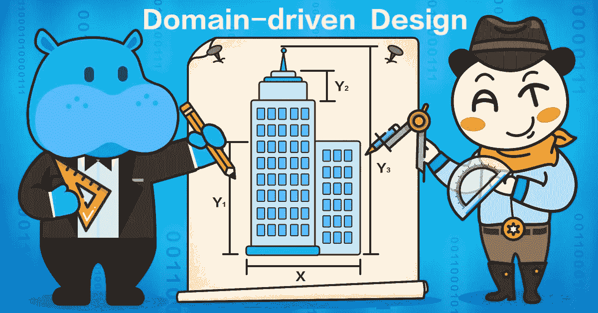
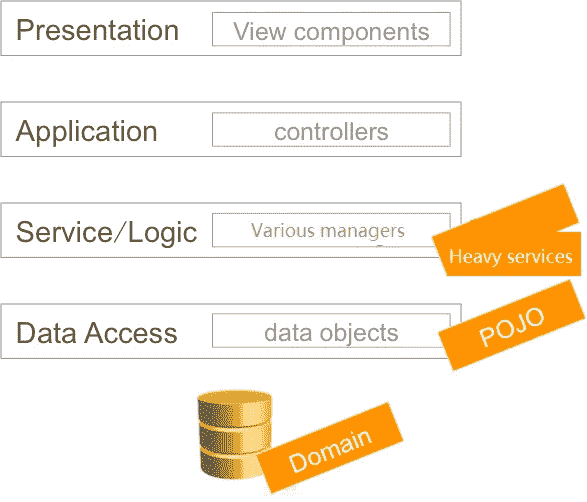
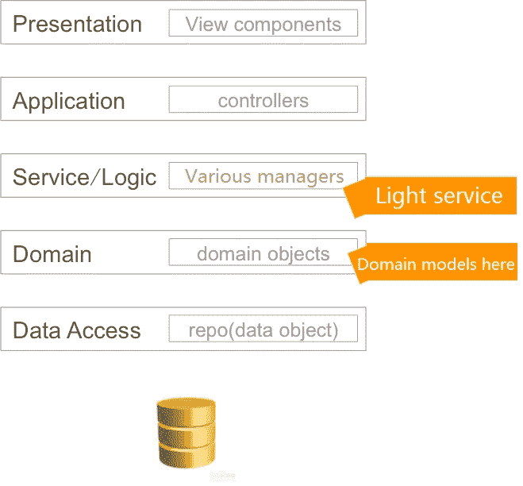
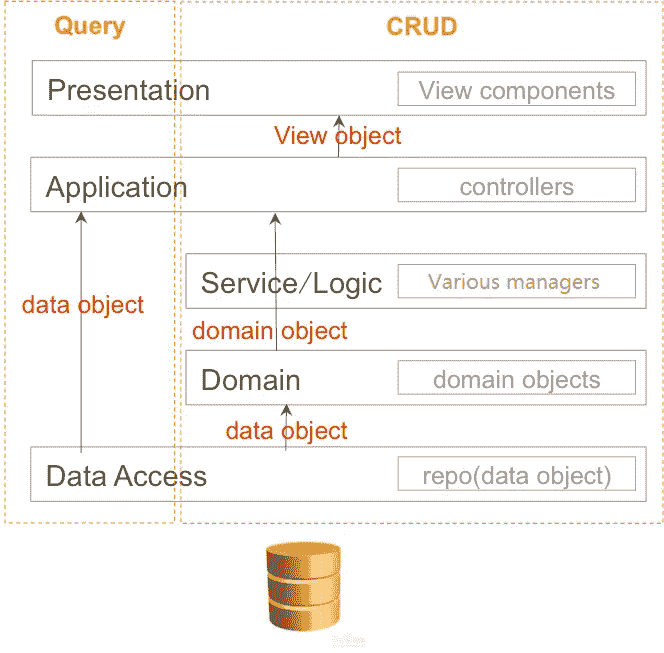
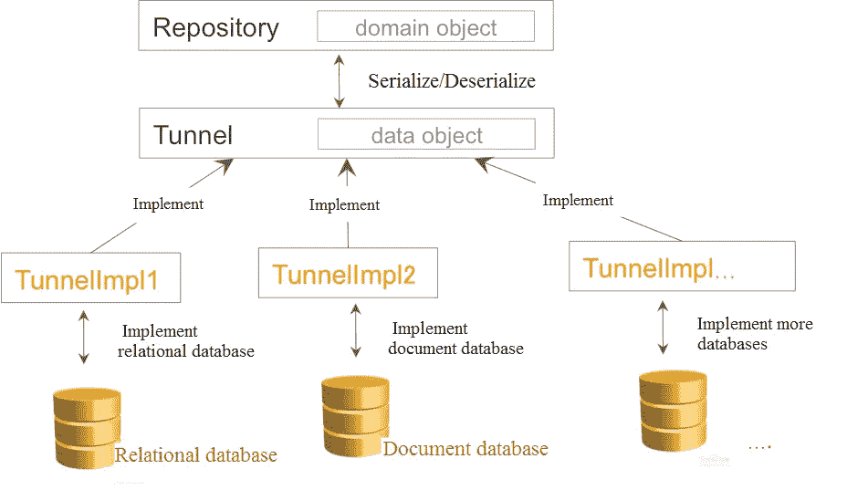
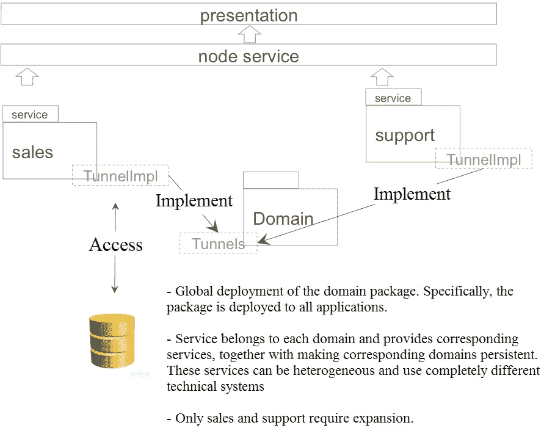

# 用领域驱动的设计创造卓越的编码

> 原文：<https://medium.com/swlh/creating-coding-excellence-with-domain-driven-design-88f73d2232c3>

*阿里巴巴的 Hema 团队如何利用领域驱动设计(DDD)来创建高效、灵活、支持进化的编码架构，以满足新型超市的密集业务需求。*



Allow me to introduce myself. My name is Qunhui, a Senior Staff Engineer at Hema (盒马, Alibaba’s digitally-connected offline supermarket.). My career as a programmer has spanned many years, and during that time, I have both seen and written many lines of code. Creating coding structures that deliver the best quality software products is a constant topic of conversation between myself and other programmers. Recently, during these conversations I always find myself bringing up the topic of domain-driven design (DDD) sooner or later.

关于 DDD，Ace 程序员有各种不同的观点。DDD 是许多编程方法中的一种，这些方法远非完美，或者与其他方法相比具有压倒性的优势。至于我个人的看法，我更愿意评论设计本身是否引起了应有的关注。在我看来，一个好的设计就是一个好的设计，不管用什么方法。

我遇到的大部分代码都不是基于 DDD 的。即使具有较少限制的标准的方法，其基于生成最终设计的代码是否与不同的方法兼容来度量最终设计，也不会显著地扩大可用代码的总体池。大多数看起来是“意大利面条代码”，通过从终端直接进入数据库来完成操作。大多数设计集中在数据库上，有时甚至不使用数据库设计，留下一堆字段，让你想知道它们为什么在那里。

编码不应该是简单地写一堆代码；代码应该简单而优雅。强大的测试能力确保了我们的软件产品在外观上是优秀的(向 Hema 团队的压力测试人员致敬！).然而，所述产品的内在质量一直被忽视。所有的资源都被投入到完成项目的紧迫期限中，使得内部质量越来越落后于应有的水平。

赫马作为一家全品类超市的服务更偏向于商业。从供应到分销的整个链条是复杂且高度耦合的。如果不理清不同的关系，就不可能把所有的事情都组织好。在这个领域，设计是非常重要的。不适当的设计最终会成为一个巨大的挑战，那些负责后续步骤的人会发现很难解决。

对于我的模块，我们已经实现了一个完整的 DDD 循环来构建整个系统。我们自己的想法和调整是这个实现的一部分。我想在这里与大家分享。希望你会发现我们的经验很有用。

# 领域模型:面向对象与数据库

在 DDD，re 是两种常用的设计方法:

1.**数据库设计**:对数据进行抽象，将其关系定义为数据库(也称数据建模)。

2.**面向对象设计**:数据被抽象，其关系被定义为对象(也称对象建模)。

在设计软件系统的早期阶段，大多数编码架构师更喜欢数据库设计，而不是面向对象设计。虽然这两种方法同等重要并且不冲突，但是系统的最终状态可能会有很大的不同，这取决于使用哪种方法。

## 数据库设计

这种设计模式的领域模型(数据模型)以前被称为“数据字典”，通常由有经验的编码架构师使用。领域模型的清晰性决定了软件产品的内在质量。用适当构造的领域模型构建的产品具有清晰的结构，允许容易的修改和将来演进的可负担的实现。架构师通过定义软件结构在开发团队中扮演着重要的角色，软件结构最终决定了软件未来的可读性、可伸缩性和进化能力。通常，架构师设计领域模型，开发人员使用领域模型作为编写代码的结构。领域模型本质上是数据库设计的基础。

架构师基于需求讨论不断地发展领域模型。一些设计师将领域模型写成 SQL 语句，其开发过程类似于玫瑰丛:

1.生成一个表(种下一粒种子)

2.生成多个表(种子生根发芽)

3.出现设计错误(植物长出过多的枝条)

4.修改设计(园丁修剪多余的枝条)

5.最终发布(玫瑰绽放)

在传统的编程中，编码架构师通常生成由密集的单词和领域定义的数据库表设计组合而成的架构设计页面。所有后续的迭代都是从领域模型发展而来，以创建类似下图的架构:



为了在抽象的意义上解释这种模式，我们将创建一个编码架构，使用一个假设的主题，即一个父亲的良心激励他去责骂他淘气的儿子。

在服务层，设置一个首选管理器来管理大部分相应的逻辑。

POJO 或失血域模型(在随后的部分中解释)作为数据，并由经理(父亲的良心)不断修改和组合。

沉重的服务层充当一个巨大的数据处理工厂，完成基于数据库的操作逻辑。

使用“父”和“子”表，生成的 POJO 是:

```
public class Father{…}
public class Son{
	private String fatherId;//The fatherId in the table serves as the external key of the Father Table id
	public String getFatherId(){
		return fatherId;
	}
	……
}
```

现在，让我们假设我们的“儿子”做了一些淘气的事情，他的“父亲”不得不责骂他，让“儿子”和“父亲”都处于情感痛苦中。经理充当“父亲”的良心，引导他用以下过程责骂“儿子”:

```
public class SomeManager{
	public void fatherSlapSon(Father father, Son son){
		//Please be understanding if the logic does not make sense
		father.setPainOnHand();
		son.setPainOnFace();//Assume that emotionalpain is a database field
	}
}
```

## 面向对象的设计

当与 DDD 一起工作时，最好在这样的假设下操作:如果你的机器始终支持无限内存，那么就不需要数据持久性，因此也就不需要数据库。当面对这种情况时，阿里巴巴的 Hema 专家建议按照他们称为“持续无知”的哲学来设计软件

如果没有数据库，领域模型必须在程序本身的基础上设计，这给专业的编码架构师提供了一个展示他们全部技能的绝佳机会。

在阿里巴巴 Hema 专家看来，与面向流程和面向功能的建模相比，面向对象的建模是最理想的建模方法。类和表的作用有些类似，再加上行和对象，有专家觉得它们有对应关系。

然而，像 Hema 的汇金这样的专家强烈反对这种对应，因为他们觉得这使得软件设计毫无意义。这是因为集群和表有几个主要的区别，导致领域建模表达式有很大的差异。密封、继承和多态允许更生动的领域模型表达式，并保持更严格地遵守坚实的原则。

以下是对域表达式重要方面的解释:

**参考:**

关系数据库使用第三表表示多对多关系。这个领域模型指的是非可视化。负责业务系统的人员不了解这种模式。

**封口:**

类可以设计方法。数据并没有给出领域模型的全貌。例如，数据表可以编译一个人的 3D 数据，但无法分辨他们是在跑步还是在走路。

**继承/多态性:**

类可以是多态的。例如，除非使用 3D 数据，否则数据无法区分人和猪的行为。一个数据表不知道人和猪的运动方式不同。

让我们回到愤怒的父亲责骂儿子的例子:

```
public class Father{
	//The father scolds his son on his own, regardless of whether his conscience (the manager) offers help
	public void slapSon(Son son){
		this.setPainOnHand();
		son.setPainOnFace();
	}
}
```

遵循这种方法，我们逐渐在面向对象的环境中设计生动的领域模型。服务层是基于这些模型的精确操作的集合(它变得更薄，并将许多操作留给域对象来处理)。领域模型不完成操作。每个域对象执行其预期的目的(单一责任)。

让我们考虑另一个假设的人跑步的例子。“Person.run”是与操作无关的动作，但是经理或服务可以通过调用 person.run 来完成 100 米比赛，或者交付外卖食品订单，以及其他操作。最终的架构将类似于下图:



现在，让我们去掉你的机器一直保持无限内存的假设。实际上，这样的机器并不存在。如果没有这个假设，我们需要一个数据库，它的职责不再是承载领域模型的沉重负担。相反，数据库通过以下方式发挥其最初的持久性作用:

[存储]将对象数据存储在寿命存储介质中。

【获取】高效地将数据查询结果返回内存。

当摆脱了进行领域建模的负担，数据库设计可以向开发人员想去的任何方向发展。还可以添加加速存储和搜索的措施。我们还可以在数据库中添加栏目，使用文档数据库，或者设计精美的分期表来完成大数据查询。简而言之，数据库设计关注的是高效访问，而不是领域模型的完美表达。

现在，让我们再来看看架构:



应强调以下概念:

领域模型用于领域操作。它们可以用来阅读，但不是没有代价的。在此前提下，一个聚合可能包含一些支持类似 getById 的操作的数据，但不适用于查询。服务查询不是 DDD 的最初目的。

查询是基于数据库的。复杂的查询应该避开领域层，直接与数据库交互。

**修剪更多:域操作>对象>数据查询>表行。**

# 失血、贫血和富域模型

失血、贫血、丰富和膨胀的领域模型最初是由 Martin Fowler 提出的，用于根据它们的丰富性来定义领域模型。我们将跳过讨论臃肿的域名，因为他们过大。

## 失血域模型

面向数据库的 DDD 是失血模型的典型例子。对于 Java，POJO 只提供简单的、基于字段的 setter 和 getter 方法。POJO 间的关系隐藏在某些对象 id 中，它们由外部管理器解释。使用我们前面的例子 son.fatherId，当“儿子”不知道他与“父亲”的关系时，经理通过 son.fatherId 访问“父亲”

## 贫血域模型

为了解释贫血域模型，让我们回到我们的父子例子。如果儿子不知道自己的父亲是谁，是否通过 DNA 验证找到他(儿子。FatherId)每次都用中介(经理)？不，这是不可能的。通过调整“Son”类，可以使域模型更加丰富，如下所示:

```
public class Son{
	private Father father;
	public Father getFather(){return this.father;}
}
```

“儿子”阶层现在更加多样化。然而，另一个不便之处是，没有办法通过“父亲”来了解“儿子”为什么父亲不知道他的儿子是谁？为了解决这个问题，我们向“父亲”添加以下属性:

```
public class Father{
	private Son son;
	private Son getSon(){return this.son;}
}
```

现在，这两个类更加健壮，并且已经发展成为我们所说的贫血域模型。这种模式现在已经建立了一个体面的“家庭”，其中“父亲”和“儿子”相互认识。但是，仔细研究一下这两个类，就会发现一些问题:对象通常是使用存储库(数据库查询)或工厂(新内存)获得的，如下图所示:

```
Son someSon = sonRepo.getById(12345);
```

这个方法从数据库中提取一个“子”对象。要构建一个完整的“儿子”对象，sonRepo 需要一个 fatherRepo 构建一个“父亲”赋给 son.father，同样，要构建一个完整的“父亲”，fatherRepo 需要 sonRepo 构建一个儿子赋给 father.son，结果就形成了一个无向循环。这个递归调用问题就可以解决了。然而，这是以领域模型成为临时模型为代价的，这对于追求纯领域模型的开发人员来说是无法忍受的。

对于阿里巴巴的 Hema 团队来说，我们的目标恰恰相反:有方向，无回路。问题变成了为了防止这种递归调用，我们能在“父”类和“子”类中省略一个引用吗？父类修改如下:

```
public class Father{
	//private Son son; Delete this reference
	private SonRepository sonRepo;//Add a repo to the Son
	private getSon(){return sonRepo.getByFatherId(this.id);}
}
```

这样，建立一个“父亲”并不会建立另一个不想要的“儿子”。然而，我们在这里付出的代价是在“父亲”类中引入了一个 SonRepository。换句话说，一个持久化操作在一个域对象中被引用。我们称之为富域模型，这将在下一节中介绍。

## 丰富域模型

丰富的领域模型的存在导致领域模型失去了它们的纯粹性。这些模型不再是纯粹的内存对象，而是隐藏数据库操作的对象，这对测试来说不是好兆头。在连接数据库之前，会执行一个快速的单元测试(稍后会详细解释)。有时需要丰富的领域模型来确保模型的完整性。

让我们使用另一个假设的场景:一个 Hema 商店的货架上有数千个商品，每个商品都有数百个属性。如果在建造商店时必须展示所有这些物品，效率会很低:

```
public class Shop{
	//private List<Product> products; This list of items being built is too large
	private ProductRepository productRepo;
	public List<Product> getProducts(){
		//return this.products;
		return productRepo.getShopProducts(this.id);
	}
}
```

在这一点上，提供依赖注入的简短描述也是谨慎的:

依赖注入是运行时的单例对象。只有 spring 扫描范围内的对象(@Component)才能通过注释(@Autowired)使用依赖注入。新对象不能通过注释获得依赖注入。

阿里巴巴 Hema 专家，惠子，推荐构造函数依赖注入，这是测试友好的，构建完美完整的对象，并明确告诉程序员他们必须模仿/存根的对象。

现在，让我们回到富域模型，重温我们的父子示例:

```
public class Father{
	private SonRepository sonRepo;
	private Son getSon(){return sonRepo.getByFatherId(this.id);}
	public Father(SonRepository sonRepo){this.sonRepo = sonRepo;}
}
```

在这个场景中，创建一个新的“父亲”需要分配一个 SonRepository，这使得编写代码很麻烦。问题变成了，通过依赖注入来注入 SonRepository 是一个有吸引力的选择吗？这里,“父亲”不是可以在 New 和 Query 场景中重新创建的单例对象。在构建“父亲”时，不可能进行 SonRepository 注入有些人认为工厂模式毫无用处，但这种情况证明了它的价值:

```
@Component
public class FatherFactory{
	private SonRepository sonRepo;
	@Autowired
	public FatherFactory(SonRepository sonRepo){}
	public Father createFather(){
		return new Father(sonRepo);
	}
}
```

由于 FatherFactory 是系统生成的单例对象，所以 SonRepository 可以自然地注入到 Factory 中。newFather 方法隐藏了这次注入的 sonRepo，因此一个新的父亲变得干净。

## 测试友好的领域模型

失血和贫血模型是纯内存对象，本质上是测试友好的。但是在实践中，丰富的领域模型确实存在。为了移除丰富的领域模型，领域对象必须被分解，因此变得有些混乱。坦率地说，贫血和丰富的领域模型之间的斗争从未停止。在富域模型中，对象具有持久性，因此变得依赖于数据库。基本要求是模仿/存根这些依赖关系。让我们再看看我们的“父亲”的例子:

```
public class Father{
	private SonRepository sonRepo;//=new SonRepository() Construction is not possible here
	private getSon(){return sonRepo.getByFatherId(this.id);}
	// Place in the constructor function
	public Father(SonRepository sonRepo){this.sonRepo = sonRepo;}
}
```

将 SonRepository 放在构造函数中可以确认它是否是测试友好的。单元测试可以通过模仿/存根存储库来顺利执行。

## Hema 如何实现存储库

当使用面向对象的方法时，域模型存在于最终在数据库中结束的内存对象中。消除对领域模型的限制允许灵活多变的数据库设计。让我们看看域对象是如何进入 Hema 数据库的:



在 Hema 中，我们设计了 Tunnel，这是一个独特的接口，允许访问不同类型数据库中的域对象。存储库不直接执行持久性，而是将域对象转换为 POJO 隧道以实现持久性。隧道可以在任何包中实现。这样，域对象(域对象+存储库)和持久性(隧道)就可以完全分离，域包就变成了一组纯粹的内存对象。

## 领域模型中的部署架构

赫马行动密切相关。从向供应商采购到向客户交付产品，对象之间的关系是清晰的。原则上，可以使用一个大的、完全包含的领域模型。另一种选择是使用 boundedContext 将域划分为子域，如 DDD 专家 Martin Fowler 的下图所示:


对于像蕙子这样的 Hema 专家来说，理想的部署结构是:



# 摘要

总之，通过 DDD，赫马正在探索编码架构设计的巨大可能性。赫马全新的 2B+互联网商业模式，提供了很多值得深入研究的细节。DDD 在业务可扩展性和系统可靠性方面经受住了现实世界的挑战，为 Hema 展示了坚实的初步表现。在 DDD 的帮助下，Hema 团队正在精心构建基于互联网的分布式工作流引擎(Noble)和完全基于互联网的图形绘制引擎(Ivy)。未来，Hema 工程师将会推出更多独特的设计。

(Original article by Zhang Qunhui 张群辉)

# 阿里巴巴科技

关于阿里巴巴最新技术的第一手深度资料→脸书: [**“阿里巴巴科技”**](http://www.facebook.com/AlibabaTechnology) 。推特: [**【阿里巴巴技术】**](https://twitter.com/AliTech2017) 。

[](https://medium.com/swlh)

## 这篇文章发表在 [The Startup](https://medium.com/swlh) 上，这是 Medium 最大的创业刊物，拥有+ 380，756 名读者。

## 在这里订阅接收[我们的头条新闻](http://growthsupply.com/the-startup-newsletter/)。

[](https://medium.com/swlh)