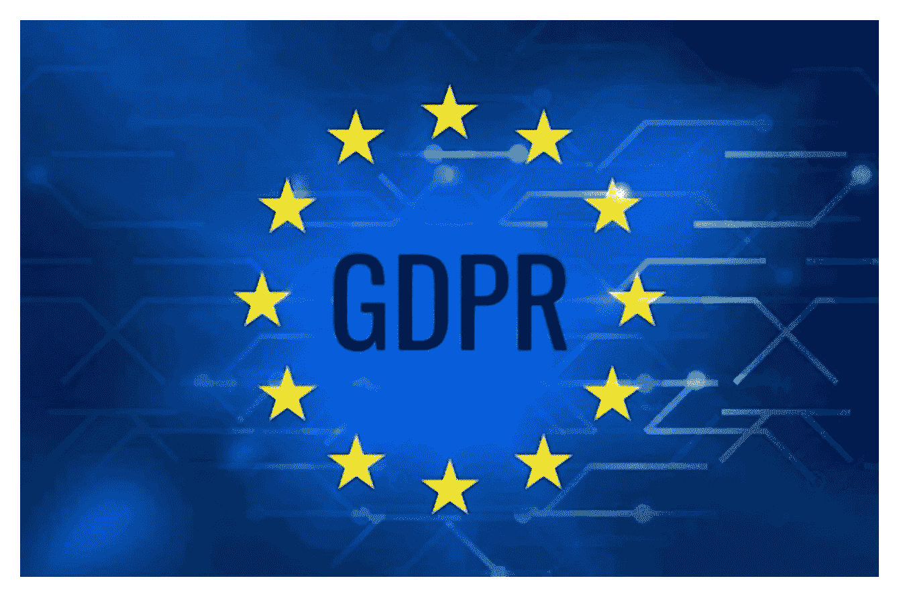
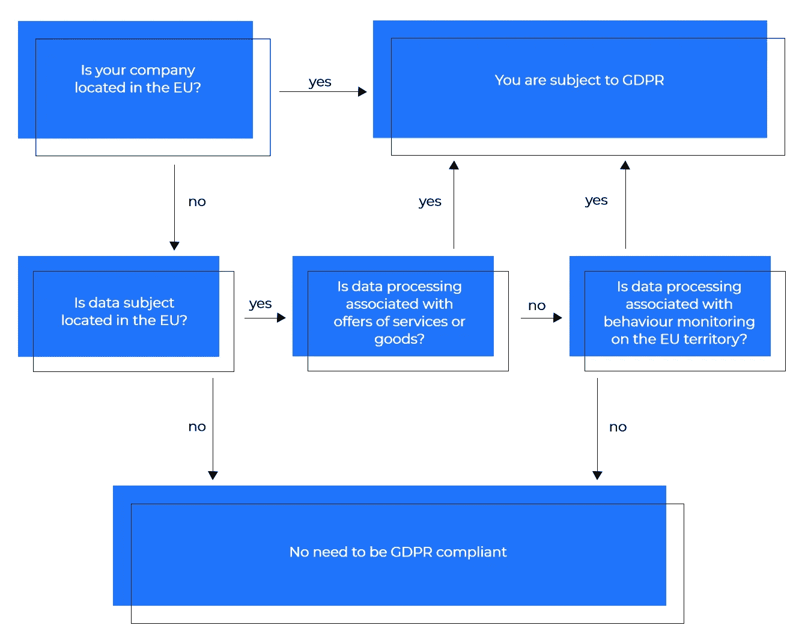
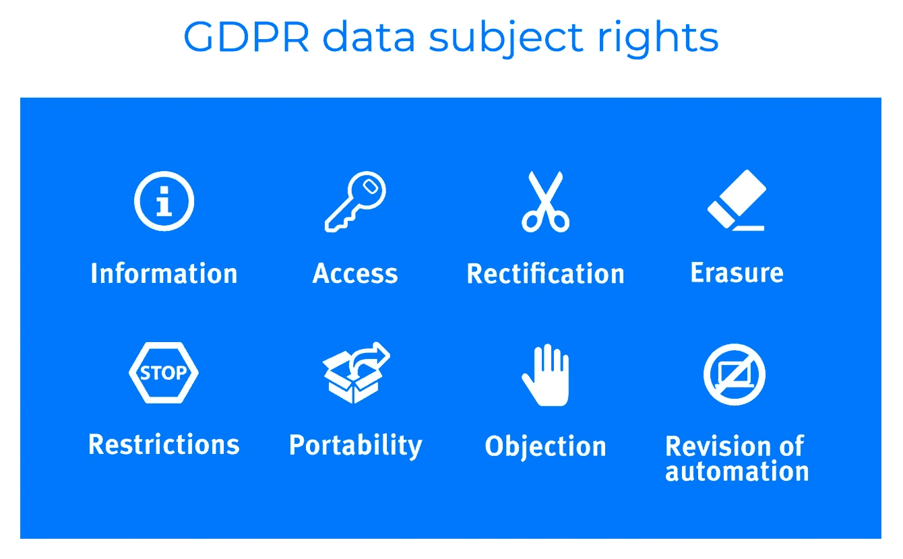
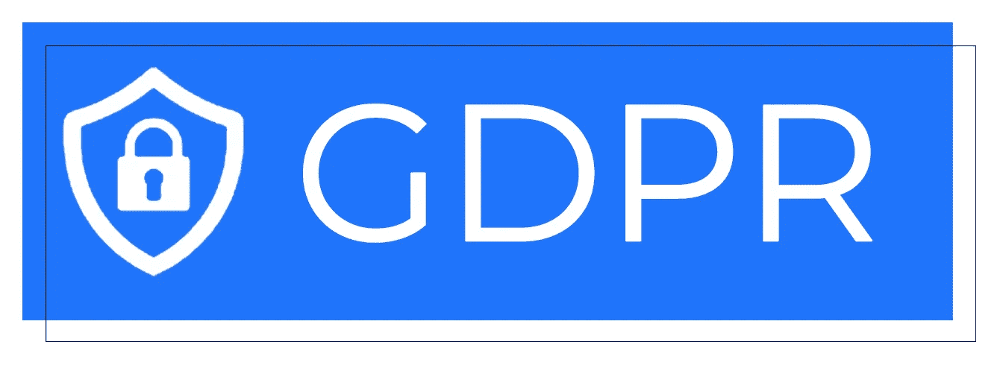

# 创建符合 GDPR 标准的软件

> 原文：<https://medium.com/swlh/creating-gdpr-compliant-software-2866db9d08f6>

现在，技术已经深深地融入了人们的生活，政府希望监管在线企业如何使用和处理他们从用户那里获得的数据。特别是，美国和欧洲政府正在努力保护企业和组织向个人索取的个人数据。

如果你想创业或者已经拥有一家企业，你需要确保你的在线平台符合 GDPR(一般数据保护法规)。《一般数据保护条例》非常严格，要求您必须获得欧盟居民的同意，才能收集他们访问您的在线商店、新闻门户或小型个人博客的任何信息。

# 什么是欧盟 GDPR？

欧盟通用数据保护条例于 2018 年 5 月 25 日取代了数据保护指令 95/46/EC。新法规协调了欧盟的隐私法，旨在保护欧盟居民的个人信息。该法规重塑了组织处理数据隐私的方式，并指导他们构建符合 GDPR 的软件。GDPR 扩展了先前的欧盟数据法。

个人数据的定义在欧盟已经相当宽泛了，在 GDPR 的领导下变得更加宽泛。任何与已识别或可识别的自然人相关的信息都被视为个人信息。受 GDPR 控制的数据不仅包括姓名和身份号码，还包括电子邮件、位置数据、在线标识符、照片、视频、物理地址、IP 地址、MAC 地址和 cookies。

# GDPR 对你和你的在线业务到底意味着什么？

你需要小心从你的用户那里收集哪些信息，并且首先清楚你为什么需要它。

## GDPR 合规清单:

*   我真正需要的信息是什么？
*   我为什么要保存它？
*   为什么我要存档这些信息，而不是直接删除它们？
*   我收集所有这些个人信息的目的是什么？

# 个人权利

根据一般数据保护条例，个人拥有[一系列权利](https://gdpr-info.eu/chapter-3/)，您必须牢记在心。

**同意权。**在收集任何个人信息之前，您必须通知他们。消费者需要确认你可以收集他们的数据。同意必须是自由给予的，而且必须既容易给予又容易收回。

**访问权。**用户可以请求访问他们的个人信息，并询问您他们的数据是如何被使用的。您必须根据要求免费向用户提供其个人信息的副本。

**数据便携性的权利。个人可以将他们的数据从一个服务提供商转移到另一个服务提供商。这必须以机器可读的格式进行。**

**擦除权。**如果消费者不再是您的客户，或者如果他们选择撤回使用其个人信息的同意，您必须删除他们的数据。

**获得正确信息的权利。**如果个人数据过时、不完整或不正确，个人可以要求您更新。

**限制加工的权利。**个人有权要求您不要处理他们的数据。在这种情况下，他们的记录可以保留，但你不能使用它们。

**反对的权利。**个人可以停止处理他们的数据，用于直接营销。一旦用户提出请求，您就必须停止任何数据处理。您必须在沟通的一开始就告知用户这一权利。

**被告知违规行为的权利。如果数据泄露危及某人的个人数据，您必须在 72 小时内通知他们。**

# 违规罚款和处罚

如果你不符合法规中规定的要求，当局可以停止你的所有个人数据处理活动，并对你处以高额罚款。

行政罚款是自由裁量的。制裁必须在个案基础上实施，并且必须是“有效的、适度的和具有警戒性的”。

行政罚款分为两级，金额从 1，000 万到 2，000 万欧元不等，相当于公司全球年营业额的 2%到 4%。罚款取决于组织违反的具体条例条款。涉及组织义务的侵权行为，包括数据安全违规，将被处以较低的罚款，而侵犯个人隐私权将被处以较高的罚款。

个人也有权就任何物质或非物质损害获得赔偿。在某些情况下，非营利机构可以代表个人提起代表诉讼。这为大规模侵权案件中的大规模索赔打开了大门。

# 安全措施

处理数据时需要采取特定的安全措施。该条例要求企业和组织采取以下措施:

*   防火墙；
*   文件和数字通信的加密；
*   假名化使数据不可约；
*   数据备份和测试；
*   访问安全性；
*   设计隐私。

# 您的企业是否需要任命一名数据保护官？

如果您是公共机构、从事大规模系统监控的组织或从事大规模敏感个人信息处理的组织，您必须任命一名数据保护官(DPO)。如果您的组织不属于这些类别之一，那么您不需要任命 DPO。DPO 可能是您所在组织的员工，也可能是外部签约人员。DPO 可以是个人也可以是组织。

# 对用户参与度的影响

GDPR 试图在企业和组织中倡导的原则与信任和透明度有关。如果你致力于开发符合 GDPR 标准的软件，并根据这种隐私变化调整你的业务，从长远来看，你将比那些不这样做的公司获得竞争优势。接受法规遵从性将改变用户与您的业务互动的方式。他们将知道他们的个人信息是安全的，并且他们在控制之中。您的全面合规计划将表明您非常重视如何处理数据，并将帮助您培养忠实的用户群。

# 实现 GDPR 的成功

GDPR 旨在保护欧盟居民的个人信息，无论这些信息在哪里以何种方式被处理。企业需要小心谨慎，开发符合 GDPR 标准的移动应用。如果您的企业未能制造出符合 GDPR 标准的产品，巨额罚款将不可避免地接踵而至。该法规赋予居住在欧盟的个人、潜在客户、客户、承包商和员工对其数据的控制权，并在构建软件时为您提供指导。

SteelKiwi 保持高隐私标准，并开发符合 GDPR 标准的软件。我们关心我们的客户如何出现在市场上，并遵循所有关于符合 GDPR 的软件开发的最佳实践。

查看[我们的投资组合](https://steelkiwi.com/projects/)以更好地了解我们的专业知识，并访问[我们在 Clutch.co 的页面](https://clutch.co/profile/steelkiwi)以了解客户对 SteelKiwi 的评价。我们可以确保符合 GDPR 标准的移动开发和符合 GDPR 标准的网络开发。如果您希望与一家能够为您的用户构建一个出色而安全的环境的公司合作，请联系我们，我们的销售代表将很快回复您。

## 这篇文章发表在《T4》杂志《创业》(The Startup)上，这是 Medium 最大的创业刊物，拥有 338，320 多名读者。

## 在这里订阅接收[我们的头条新闻](http://growthsupply.com/the-startup-newsletter/)。

