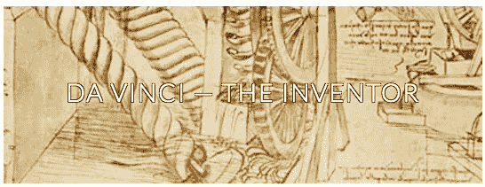

# 创造新的达芬奇？有可能，但是…

> 原文：<https://medium.com/swlh/creating-new-da-vincis-it-s-possible-but-cc64a5dba483>

[https://www.mos.org/leonardo/node/1](https://www.mos.org/leonardo/node/1)

达芬奇在人类历史上是独一无二的。

思想家、画家、建筑师、作家、工程师、地图绘制者、发明家、地质学家……所有这些都一丝不苟地保存在他的令人难忘的著作中，供我们今天使用。沃尔特·伊萨克森在他的传记中总结了达芬奇的特点，同时也指出了我们可以从他身上吸取的教训，以增强我们自己的能力。